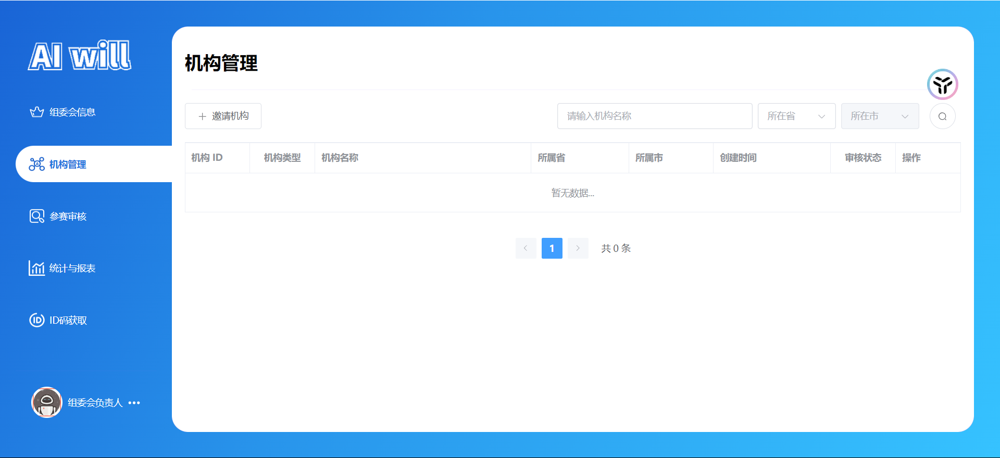
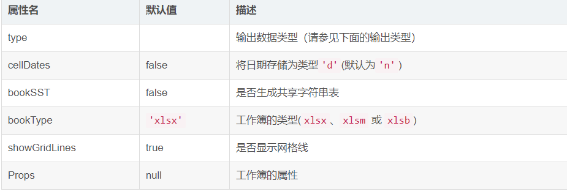
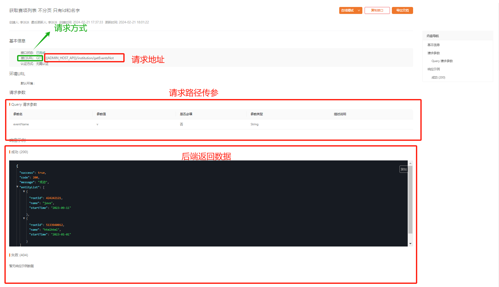
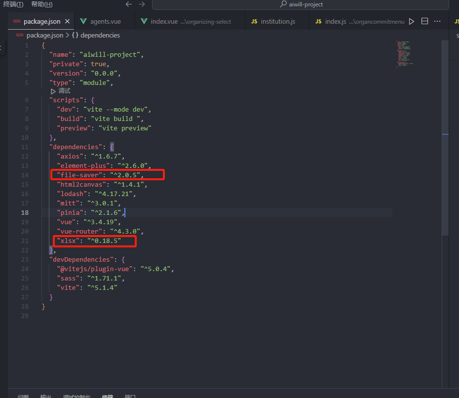
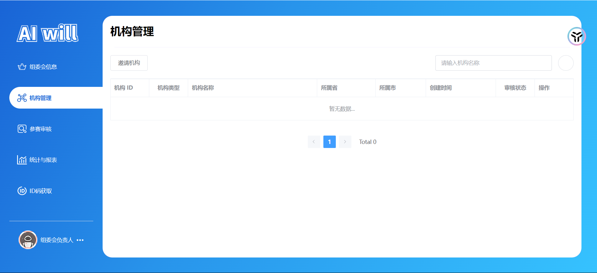
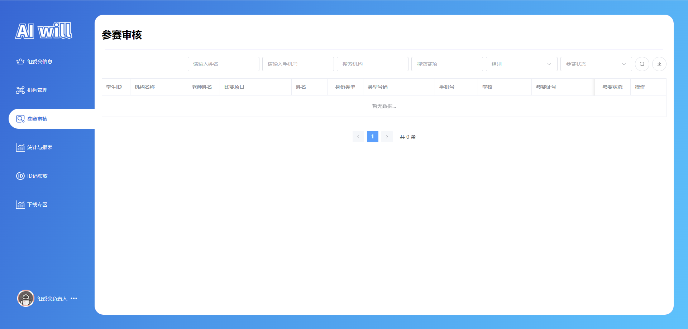

# 任务十、参赛审核模块开发

## 任务描述

​	本任务的目标是实现一个参赛审核模块，该模块将作为机构管理功能的一部分，用于优化和简化参赛者的审核流程。通过这个模块，管理员能够高效地管理参赛者的资料，审核参赛资格，并执行相关操作，如激活、撤销报名等。此外，模块还将支持数据的导出功能，以便将参赛信息整理成Excel文件，方便进一步的数据分析和存档。

## 任务效果

### 机构管理模块



## 学习目标

### 知识目标

- [ ] 理解并应用Vue Router的路由功能，包括定义路由、设置导航守卫、处理路由参数和查询等，以实现页面的导航和组织
- [ ] 理解并使用axios库进行HTTP请求，处理响应和错误，实现与后端API的数据交互
- [ ] 理解学习并使用前端 xlsx 插件，实现导出功能
- [ ] 掌握Element Plus组件库的使用，以便在前端项目中创建和管理用户界面组件

### 能力目标

- [ ] 能够使用Element Plus组件库完成用户界面的设计和实现
- [ ] 能够使用 xlsx 插件 ，导出excel文件
- [ ] 能够使用axios库与后端API进行数据交互，完成数据的异步加载和更新
- [ ] 能够使用Vue 3的Composition API高效地管理组件状态，提高代码的可维护性和可读性

## 知识储备

###  xlsx插件用法

#### 1.表格导出为excel文件

需求：导出element ui的表格，或者一些其它组件的表格

```js
<table id="table"></table>

<script setup>
	import { writeFile, write, read, utils } from "xlsx";
	//注意，当前的xlsx似乎已经变为按需导入内容，并不能直接导入xlsx
	//xlsx用法
	const exportExcel = () => {
		//这个是最简单的导出方式，都是固定写法,writeFile第二个参数为导出的文件名，正常开发都是以时间戳进行命名
		const wb = utils.table_to_book(document.querySelector("#table"));
		writeFile(wb, "SheetJSVueHTML.xlsx");
	};
</script>
```

**表格导出excel的实现(vue文件代码)：**

```vue
<template>
	<div>
		<el-table :data="list" class="tableList">
			<el-table-column prop="name" label="计划跟进人">
			</el-table-column>
			<el-table-column prop="age" label="年龄"> </el-table-column>
		</el-table>
		<button @click="daocu">导出</button>
	</div>
</template>
<script setup>
	import { writeFile, write, read, utils } from "xlsx";
	let list = [
		{ name: "tjq", age: 18 },
		{ name: "wyz", age: 18 },
	];
	const daocu = () => {
	 const wb = utils.table_to_book(document.querySelector(".list"));
    writeFile(wb, "SheetJSVueHTML.xlsx");
	};
</script>

<style scoped >
	.list {
		width: 200px;
		height: 200px;
	}
</style>

```

#### 2.固定列导出问题解决方法

##### 解决思路:

```js
<script setup>
	import FileSaver from "file-saver";
	import { writeFile, write, read, utils } from "xlsx";
	const daocu = () => {
			//el-table__fixed这里仅仅是el-table的固定列类名
			let fixflg = document.querySelector(".el-table__fixed"); 
        	// 判断要导出的节点中是否有fixed的表格，如果有，转换excel时先将该dom移除，然后append回去，严谨一点的话，应该是document.querySelector(".tableList").querySelector(".el-table__fixed")，确保是在我们导出的表格中出现的固定列
			let wb;
			if (fixflg) {
				wb = utils.table_to_book(
					document.querySelector(".tableList").removeChild(fixflg )
				);
				document.querySelector(".tableList").appendChild(fixflg );
			} else {
				wb = utils.table_to_book(document.querySelector(".tableList"));
			}
			//下列附加wirte方法的属性说明
			let wbout = write(wb, { bookType: "xlsx", bookSST: true, type: "array" });
			try {
			//FileSaver插件，详细的我也没具体看,FileSaver.saveAs我猜测，大概是把blob文件流转为对应类型的文件，并且触发下载功能
				FileSaver.saveAs(
					new Blob([wbout], { type: "application/octet-stream" }),
					"文件命名.xlsx"
				);
			} catch (e) {
				if (typeof console !== "undefined") console.log(e, wbout);
			}
			return wbout;

	};
</script>
```

##### write配置项属性



##### type：

| 值         | 描述                              |
| ---------- | --------------------------------- |
| `"base64"` | Base64编码                        |
| `"binary"` | 二进制字符串                      |
| `"buffer"` | `nodejs` 缓冲区                   |
| `"file"`   | 直接创建文件（`node` 环境下有效） |
| `"string"` | UTF8编码的字符串                  |
| `"array"`  | Uint8Array，8位无符号数组         |

## 任务实施

### 子任务10-1 实现路由配置

#### 步骤一 编写路由

> 文件路径：/src/router/index.js

代码如下：

```js
import { createRouter, createWebHashHistory, createWebHistory } from "vue-router";
// routes
const routes = [
    {
        redirect: "/home",
        path: "/"
    },
    // 首页
    {
        path: '/home',
        name: "home",
        component: () => import("@/view/home/index.vue")
    },
    // 管理页
    {
        path: '/manage',
        name: "manage",
        component: () => import("@/view/manage/index.vue"),
        children: [

            // ---------- 机构负责人 ----------
            // 以上代码省略...
           

            // ---------- 组委会负责人 ----------
           	// 以上代码省略...
        
        
            /**
             * 参赛审核
             */
            {
                path: 'organization',
                name: "manage-organization",
                component: () => import('@/view/manage/agentmenu/organization.vue'),
                meta: {
                    index: "manage-organization",
                }
            },
        ]
    },
    // auth
    {
        path: '/auth',
        redirect: "/auth/login",
        component: () => import("@/view/auth/index.vue"),
        children: [
            // 登录
            {
                path: 'login',
                component: () => import("@/view/auth/login.vue")
            },
            // 注册
            {
                path: 'reg',
                component: () => import("@/view/auth/reg.vue")
            },
            // 忘记密码
            {
                path: 'forgetpassword',
                name: 'forgetpassword',
                component: () => import("@/view/auth/forgetpassword.vue")
            },
        ]
    },
    // 对于所有未定义的路径,自动匹配404页面
    {
        path: '/:pathMatch(.*)*', component: () => import("@/view/404.vue")
    },
]

// router
const router = createRouter({
    history: import.meta.env.VITE_MODE == 'dev' ? createWebHashHistory() : createWebHistory(),
    routes
});
// 无需登录的页面
const LOGIN_ROUTERS = "manage"
router.beforeEach((to, from, next) => {
    if (to.fullPath.indexOf(LOGIN_ROUTERS) != -1) {
        let token = localStorage.getItem("token")
        if (!token) {
            return next("/auth/login");
        }
    }
    return next(true)
})
export default router;
```

### 子任务10-2 实现接口编写

#### 步骤一 查看接口



#### 步骤二 编写接口

获取参赛审核列表：`/agent/getCompetitionListPage`

激活：` /agent/activatePlayer`

撤销报名：` /agent/withdrawalRegistration`

修改参赛审核状态：`/agent/auditCompetitionStudent`

转移 | 获取组委会列表：`/organizing/getAgents`


> 文件路径：/src/api/manage/organcommitmenu/index.js

代码如下：

```js
import { request } from "@/utils/axios"

/**
 * 其余代码省略...
 */

/**
 * 转移 1.先获取组委会列表
 */
export function getAgents(params = {}) {
    return request(
        {
            url: `/organizing/getAgents`,
            method: "GET",
            params: params
        }
    );
}

/**
 * 获取参赛审核列表
 */
export function getCompetitionListPage(params) {
    return request(
        {
            url: `/agent/getCompetitionListPage`,
            method: "GET",
            data: {},
            params
        }
    );
}

/**
 * 激活
 */

export function ActivatePlayerApi(params) {
    return request(
        {
            url: "/agent/activatePlayer",
            method: "PUT",
            params: params,
        }
    );
}

/**
 * 撤销报名
 */
export function withdrawalRegistration(params) {
    return request(
        {
            url: `/agent/withdrawalRegistration`,
            method: "PUT",
            data: {},
            params
        }
    );
}

/**
 * 修改参赛审核状态
 */
export function auditCompetitionStudent(params) {
    return request(
        {
            url: `/agent/auditCompetitionStudent`,
            method: "PUT",
            data: {},
            params
        }
    );
}
```

> 文件路径：/src/api/manage/institution.js

获取基本信息:`institution/getEventsNot`

获取机构列表:`information/getInstitutions`

```js
import { request } from "@/utils/axios"; // 引入自定义的axios请求封装函数


/**
 * 获取赛项列表
 * @param {*} params 
 * @returns 
 */
export function GetEventsNotApi(params) {
    return request(
        {
            url: "institution/getEventsNot",
            method: "GET",
            params: params,
        }
    );
}

/**
 * 获取机构列表
 * @param {*} params 
 * @returns 
 */
export function GetInstitutionsApi(params) {
    return request(
        {
            url: "information/getInstitutions",
            method: "GET",
            params: params,
        }
    );
}
```

> 文件路径：/src/api/common.js

获取基本信息:`/information/getInformation`

```js
import { request } from "@/utils/axios"


/**
 * 获取基本信息
 */
export function GetInformationApi() {
    return request(
        {
            url: "/information/getInformation",
            method: "GET",
        }
    );
}
```

> 文件路径：/src/api/manage/competition

获取基本信息:`/institution/getGroupsDown`

```js
import { request } from "@/utils/axios"


/**
 * 获取赛项分组 部分关联的
 */
export function GetGroupsDownApi() {
    return request(
        {
            url: "/institution/getGroupsDown",
            method: "GET",
        }
    );
}
```

### 子任务10-3 实现组件编写

​	实现编写项目组件的目的在于提高前端开发效率和代码复用性，通过创建可复用的UI组件来加速开发流程，确保一致的用户体验，并降低维护成本。这样做的好处包括减少重复代码、简化项目结构、提高代码的可读性和可维护性，同时组件化的开发模式还能够促进团队协作，使得项目更加模块化，便于扩展和更新。在前端开发中，良好的组件设计可以发挥快速构建复杂应用界面的作用，同时也能够适应不同设备和平台的需求，提升应用的性能和灵活性。

#### 步骤一 组件依赖安装

​	此项目引入`xlsx`和`file-saver`这两个依赖的目的是为了在前端项目中实现对Excel文件的读取、处理和导出功能。`xlsx`库使得开发者能够轻松地操作Excel文件，包括读取、修改和生成Excel工作簿，而`file-saver`库则提供了一种简便的方式来让用户将文件保存到本地。这样的组合可以在前端实现复杂的表格数据处理和报表生成，同时提供用户友好的文件下载体验，极大地增强了Web应用的交互性和功能性。

##### 1.安装xlsx

​	`	xlsx`插件是一个流行的JavaScript库，专门用于处理Excel文件。它提供了丰富的API，允许开发者在浏览器端读取、修改和生成Excel文件，而无需依赖后端服务器。

安装指令:` npm i xlsx -S `

##### 2.安装file-saver

`“任务六”已安装，此处省略...`

##### 3.查看安装依赖



`dependencies` 是用于生产环境的依赖项，它们是我们在部署应用程序时所必需的。

`devDependencies` 是用于开发环境的依赖项，它们主要用于辅助我们进行开发、测试和构建应用程序。

#### 步骤二 编写组件

##### 1.参赛状态选择器组件

​	此任务中的参赛状态选择器组件旨在提供一个用户界面元素，允许用户从预定义的选项中选择参赛者的当前状态。这个组件使用了Element UI库中的`el-select`和`el-option`组件来构建下拉选择菜单，其中包括了“待审核”、“待绑定”和“已绑定”三种状态选项。其目的是简化用户操作流程，使用户能够快速且直观地选择和更新参赛状态，从而提高用户交互体验和数据处理的效率。在前端开发中，这样的组件化设计有助于代码复用，确保一致的界面风格，并便于后续的维护和扩展。

> 文件路径：/src/components/entrystatus-select/index.vue

代码如下：

```vue
<template>
  <el-select
    class="input-default-width w-container"
    size="large"
    placeholder="参赛状态"
    clearable
  >
    <el-option
      v-for="item in data"
      :key="item"
      :label="item.label"
      :value="item.value"
    ></el-option>
  </el-select>
</template>

<script  setup>
const data = [
  {
    value: "2",
    label: "待审核",
  },
  {
    value: "3",
    label: "待绑定",
  },
  {
    value: "4",
    label: "已绑定",
  },
];
</script>

<style lang="scss" scoped>
.w-container {
  --el-input-width: 132px !important;
  :deep(.el-input) {
    --el-input-width: 132px !important;
  }
}
</style>
```

##### 3.封装参赛选择组件

​	封装`参赛选择组件 `的目的是为了提供一种高效且可复用的方式来实现用户输入驱动的数据检索和选项动态加载，带来的好处包括简化开发流程、提高组件复用性、优化用户体验和便于维护。简而言之，这种封装使得实现动态数据加载和用户交互的复杂逻辑变得更加简洁和高效。

> 文件路径：/src/components/event-select/index.vue

代码如下：

```js
<template>
  <!-- 使用Element UI的Select组件创建一个下拉选择框 -->
  <el-select
    class="input-default-width w-container"
    size="large"
    placeholder="搜索赛项"
    clearable
    filterable
    remote
    :remote-method="handleRemoteMethod"
    :loading="loading"
    @change="handleChange"
  >
    <!-- 使用v-for渲染选项列表 -->
    <el-option
      v-for="item in data"
      :key="item"
      :label="item.label"
      :value="item.value"
    ></el-option>
  </el-select>
</template>

<script  setup>
// 导入后端API接口
import { GetEventsNotApi } from "@/api/manage/institution";
//导入Vue的响应式引用和生命周期钩子
import { ref } from "vue";

// 定义一个响应式变量data，用于存储选项数据
const data = ref([]);
// 定义一个响应式变量loading，用于表示加载状态
const loading = ref(false);
// 使用defineEmits定义一个事件'title-change'
const emit = defineEmits("title-change");
// 定义handleChange方法，当选项变化时触发
const handleChange = (value) => {
  const find = data.value.find((item) => item.value == value);
  if (find) {
    emit("title-change", find.label);
  } else {
    emit("title-change", "全部赛项");
  }
};
/**
 * 远程搜索
 */
const handleRemoteMethod = async (query) => {
  if (!query) {
    return;
  }
  loading.value = true;
  let res = await GetEventsNotApi({
    eventName: query,
  });
  if (res.success) {
    // 如果接口调用成功，更新data为新的选项列表
    data.value = res.entityList.map((item) => {
      return {
        label: item.name + `(${item.playingTime})`, // 选项标签为赛项名称和比赛时间
        value: item.rootId, // 选项值为赛项的唯一标识
      };
    });
  } else {
    // 如果接口调用失败，清空选项列表
    data.value = [];
  }
  // 完成数据加载，设置loading状态为false
  loading.value = false;
};
</script>

<style lang="scss" scoped>
.w-container {
  --el-input-width: 156px !important;
  :deep(.el-input) {
    --el-input-width: 156px !important;
  }
}
</style>
```

##### 4.封装导出组件

​	封装`导出功能组件`的目的是为了简化和统一数据导出流程，提高开发效率并降低维护成本，同时确保跨组件的一致性和可复用性。

> 文件路径：/src/components/export-button/index.vue

代码如下：

```js
<template>
  <!-- 一个按钮，点击后会打开导出数据的对话框 -->
  <el-button
    size="large"
    :icon="Download"
    circle
    @click="handleOpenExportModal"
  >
  </el-button>
  <!-- 一个对话框，用于导出数据 -->
  <el-dialog
    v-model="export_modal_data.dialog_visible"
    title="导出"
    width="512px"
  >
    <!-- 一个表单，用于收集导出设置 -->
    <el-form
      :model="export_modal_data.model_data"
      label-width="96px"
      size="large"
    >
      <!-- 表单项：导出文件名 -->
      <el-form-item label="导出文件名">
        <el-input v-model="export_modal_data.model_data.name" />
      </el-form-item>
      <!-- 表单项：导出列 -->
      <el-form-item label="导出列">
        <!-- 全选复选框 -->
        <el-checkbox
          v-model="export_modal_data.is_all"
          :indeterminate="export_modal_data.indeterminate"
          @change="handleCheckAllChange"
          label="全选"
        />
        <!-- 复选框组，用于选择导出的列 -->
        <el-checkbox-group
          v-model="export_modal_data.model_data.column"
          @change="handleColumnChange"
        >
          <el-checkbox
            :label="item.value"
            v-for="item in export_modal_data.columns"
            :key="item.key"
            >{{ item.label }}</el-checkbox
          >
        </el-checkbox-group>
      </el-form-item>
      <!-- 表单项：筛选条件设置 -->
      <el-form-item label="筛选条件设置">
        <!-- 选择框，绑定到筛选条件 -->
        <el-select v-model="export_modal_data.model_data.condition">
          <el-option label="无条件" value="null"></el-option>
          <el-option label="使用当前条件" value="current"></el-option>
        </el-select>
      </el-form-item>
      <!-- 表单项：导出类型 -->
      <el-form-item label="导出类型">
        <el-select v-model="export_modal_data.model_data.type">
          <el-option label="当前页" value="page"></el-option>
          <el-option label="全部" value="all"></el-option>
        </el-select>
      </el-form-item>
      <!-- 表单项：操作按钮 -->
      <el-form-item>
        <el-button
          @click="export_modal_data.dialog_visible = false"
          :loading="export_modal_data.loading"
          size="large"
          >取消</el-button
        >
        <el-button
          type="primary"
          @click="handleExport"
          :loading="export_modal_data.loading"
          size="large"
        >
          导出
        </el-button>
      </el-form-item>
    </el-form>
  </el-dialog>
</template>

<script setup>
// 导入下载图标
import { Download } from "@element-plus/icons-vue";
// 导入Vue的响应式引用
import { ref } from "vue";
// 导入xlsx库的写入和工具方法
import { writeFile, utils } from "xlsx";
// 导入文件保存器
import { saveAs } from "file-saver";
// 导入Element Plus的消息提示组件
import { ElMessage } from "element-plus";

const props = defineProps({
  filename: {
    default: "",
    type: String,
  },
  // 字段数据
  columns: {
    default: () => [],
    type: Array,
  },
  /**
   * 数据获取处理
   */
  handle: {
    default: null,
    type: Function,
  },
});
/**
 * 导出按钮
 *
 * 可选择字段
 * 可选择导出部分
 * 可选择导出全部
 */
const export_modal_data = ref({
  dialog_visible: false,
  loading: false,
  columns: [],
  is_all: true,
  indeterminate: false,
  model_data: {
    column: [],
    type: "page",
    name: "",
    condition: "null",
  },
});
/**
 * 打开导出选择弹窗
 */
const handleOpenExportModal = () => {
  export_modal_data.value.model_data = {
    column: props.columns.map((item) => item.value),
    type: "page",
    name: props.filename,
    condition: "null",
  };
  console.log(props.columns);
  export_modal_data.value.columns = props.columns;
  export_modal_data.value.dialog_visible = true;
  console.log(export_modal_data.value);
};

/**
 * 开始导出
 */
const handleExport = async () => {
  export_modal_data.value.loading = true;
  let [success, list] = await props.handle({
    ...export_modal_data.value.model_data,
  });

  if (success) {
    // ElMessage.success("开始导出");
    try {
      handleCreateExportFile(list);
    } catch (error) {}
  } else {
    ElMessage.error("数据获取失败");
  }
  export_modal_data.value.loading = false;
};

/**
 * 导出文件
 */
const handleCreateExportFile = (data_data) => {
  console.log(data_data);
  const filename = export_modal_data.value.model_data.name;
  let data = data_data.map((row) => {
    let obj = {};
    props.columns.forEach((value) => {
      if (export_modal_data.value.model_data.column.includes(value.value)) {
        obj[value.label] = value.handle
          ? value.handle(row[value.value], row)
          : row[value.value];
      }
    });
    return obj;
  });
  // 新建空workbook，然后加入worksheet
  const ws = utils.json_to_sheet(data);
  // 新建book
  const wb = utils.book_new();
  // 生成xlsx文件(book,sheet数据,sheet命名)
  utils.book_append_sheet(wb, ws, "工作蒲1");
  // 写文件(book,xlsx文件名称)
  let blob = writeFile(wb, `${filename}.xlsx`);
  ElMessage.success("正在导出");
  saveAs(blob, `${filename}.xlsx`);
};

/**
 * 全选操作
 */
const handleCheckAllChange = (val) => {
  export_modal_data.value.model_data.column = val
    ? props.columns.map((item) => {
        return item.value;
      })
    : [];
  export_modal_data.value.indeterminate = false;
};
/**
 * 字段选择
 */
const handleColumnChange = (val) => {
  const checkedCount = val.length;
  export_modal_data.value.is_all = checkedCount === props.columns.length;
  export_modal_data.value.indeterminate =
    checkedCount > 0 && checkedCount < props.columns.length;
};
</script>

<style lang="scss" scoped></style>
```

##### 5.封装机构选择器组件

​	封装`机构选择器`的目的是为了提供一个可复用的用户界面组件，用于实现基于远程搜索的机构选择功能。这样的封装使得在不同的上下文中快速集成机构选择逻辑变得简单，同时保持了代码的模块化和可维护性。通过这种方式，开发者可以避免重复编写远程搜索和数据展示的代码，从而提高开发效率，并确保用户体验的一致性。

> 文件路径：/src/components/institution-select/index.vue

代码如下：

```vue
<template>
  <!-- 使用Element UI的Select组件创建一个下拉选择框 -->
  <el-select
    class="input-default-width w-container"
    size="large"
    placeholder="搜索机构"
    clearable
    filterable
    remote
    :remote-method="handleRemoteMethod"
    :loading="loading"
  >
    <!-- 使用v-for渲染选项列表 -->
    <el-option
      v-for="item in data"
      :key="item"
      :label="item.label"
      :value="item.value"
    ></el-option>
  </el-select>
</template>

<script  setup>
// 导入后端API接口
import { GetInstitutionsApi } from "@/api/manage/institution";
//  导入Vue的响应式引用和生命周期钩子
import { ref, onMounted } from "vue";

// 定义props，用于接收父组件传递的agentId
const props = defineProps({
  agentId: String | Number, // agentId可以是字符串或数字类型
});
// 定义一个响应式变量data，用于存储选项数据
const data = ref([]);
// 定义一个响应式变量loading，用于表示加载状态
const loading = ref(false);
/**
 * 远程搜索
 */
const handleRemoteMethod = async (query) => {
  if (!query) {
    return;
  }
  loading.value = true;
  let res = await GetInstitutionsApi({
    agentId: props.agentId,
    institutionName: query,
  });
  if (res.success) {
    data.value = res.entityList.map((item) => {
      return {
        label: item.name,
        value: item.userId,
      };
    });
  } else {
    data.value = [];
  }
  loading.value = false; // 完成数据加载，设置loading状态为false
};
</script>

<style lang="scss" scoped>
.w-container {
  --el-input-width: 132px !important;
  :deep(.el-input) {
    --el-input-width: 132px !important;
  }
}
</style>
```

##### 6.封装组委会选择器组件

> 文件路径：/src/components/organizing-select/index.vue

代码如下：

```vue
<template>
  <el-select
    class="input-default-width w-container"
    size="large"
    placeholder="搜索组委会"
    clearable
    filterable
    remote
    :remote-method="handleRemoteMethod"
    :loading="loading"
  >
    <el-option
      v-for="item in data"
      :key="item"
      :label="item.label"
      :value="item.value"
    ></el-option>
  </el-select>
</template>

<script  setup>
import { getAgents } from "@/api/manage/organcommitmenu";
import { ref, onMounted } from "vue";
const data = ref([]);
const loading = ref(false);

/**
 * 远程搜索
 */
const handleRemoteMethod = async (query) => {
  if (!query) {
    return;
  }
  loading.value = true;
  let res = await getAgents({
    // query
    agentName: query,
  });
  if (res.success) {
    data.value = res.entityList.map((item) => {
      return {
        label: item.name,
        value: item.userId,
      };
    });
  } else {
    data.value = [];
  }
  loading.value = false;
};
</script>

<style lang="scss" scoped>
.w-container {
  --el-input-width: 132px !important;
  :deep(.el-input) {
    --el-input-width: 132px !important;
  }
}
</style>
```

##### 7.封装组别组件

> 文件路径：/src/components/groups-select/index.vue

代码如下：

```vue
<template>
  <!-- 使用Element UI的Select组件创建一个下拉选择框 -->
  <el-select
    class="input-default-width w-container"
    clearable
    size="large"
    placeholder="组别"
  >
    <!-- 使用v-for渲染选项列表 -->
    <el-option
      v-for="item in data"
      :key="item"
      :label="item.groupDescribe"
      :value="item.groupId"
    ></el-option>
  </el-select>
</template>

<script  setup>
// 导入Vue的响应式引用和生命周期钩子
import { ref, onMounted } from "vue";
// 导入后端API接口
import { GetGroupsDownApi } from "@/api/manage/competition";

// 定义一个响应式变量data，用于存储选项数据
const data = ref([]);
// 定义一个初始化数据的方法
const handleInit = async () => {
  let res = await GetGroupsDownApi();
  if (res.success) {
    data.value = res.entityList;
  }
};
// 在组件挂载后执行初始化数据的方法
onMounted(() => {
  handleInit();
});
</script>

<style lang="scss" scoped>
.w-container {
  --el-input-width: 132px !important;
  :deep(.el-input) {
    --el-input-width: 132px !important;
  }
  :deep .el-select__selection {
    width: 132px !important;
  }
}
</style>
```

##### 8.编写自定义钩子

> 文件路径：/src/hooks/usePage.js

代码如下：

```js
/**
* 代码“任务五”已书写，此处省略...
*/
```

### 子任务10-4 实现编写机构管理模块

#### 步骤二 页面功能的分析

- **页面容器** (`<div class="header_information page-container">`): 作为整个页面的布局基础，使用`el-row`和`el-col`来进行响应式布局。
- **头部区域** (`<el-row class="header_name">`): 包含页面标题和水平分隔线，用于展示页面主题。
- **按钮区域** (`<el-row class="el_row_btn">`): 包含搜索和导出按钮，以及一系列的筛选输入框和选择组件。
- **表格内容区域** (`<el-table>`): 用于展示参赛者信息，包括学生ID、组委会名称、机构名称等。
- **分页组件** (`<el-pagination>`): 用于控制数据的分页显示。

#### 步骤三 页面搭建

​	在上文中，我们对机构管理模块界面的搭建进行了详细分析。通过明确的页面容器、头部区域、按钮区域和表格内容区域的设计，我们确保了界面既直观又易于操作。这些设计决策不仅提高了界面的功能性，还确保了用户友好性，从而为用户提供了高效、便捷的机构管理体验。

> 文件路径：/src/view/manage/agentmenu/organization.vue

代码如下：

```vue
<template>
  <!-- 页面容器 -->
  <div class="header_information page-container">
    <!-- 头部 -->
    <el-row class="header_name">
      <!-- 标题 -->
      <el-col :span="24" class="header_text">
        <h1>参赛审核</h1>
      </el-col>
      <!-- 分隔线 -->
      <el-col :span="24">
        <div class="header_line"></div>
      </el-col>
    </el-row>
    <!-- 按钮区域 -->
    <el-row class="el_row_btn">
      <el-col :span="24" class="content">
        <div class="content_top_btn">
          <el-space wrap>
            <el-input
              class="input-default-width"
              size="large"
              clearable
              placeholder="请输入姓名"
              v-model="query_data.studentName"
            ></el-input>
            <el-input
              class="input-default-width"
              size="large"
              clearable
              placeholder="请输入手机号"
              v-model="query_data.phone"
            ></el-input>
            <!-- 组委会选择组件 -->
            <OrganizingSelect
              v-model="query_data.agentId"
              v-if="is_show_organizing"
            />
            <!-- 机构选择组件 -->
            <InstitutionSelect
              :disabled="!query_data.agentId"
              :agentId="query_data.agentId"
              v-model="query_data.institutionId"
            />
            <!-- 参赛选择组件 -->
            <EventSelect v-model="query_data.rootId" />
            <!-- 分组选择组件 -->
            <GroupsSelect v-model="query_data.groupId" />
            <!-- 状态选择组件 -->
            <EntrystatusSelect v-model="query_data.payStatus" />
            <!-- 搜索按钮 -->
            <el-button
              size="large"
              :icon="Search"
              circle
              :loading="loading"
              @click="handleSearch"
            />
            <!-- 导出组件 -->
            <ExportButton
              :handle="handleGetCustomList"
              filename="审核人员"
              :columns="export_competition_columns"
            />
          </el-space>
        </div>
      </el-col>
    </el-row>
    <!-- 表格内容区域 -->
    <el-row>
      <el-col :span="24">
        <el-table
          empty-text="暂无数据..."
          :data="data"
          border
          style="width: 100%"
          fixed
          v-loading="loading"
        >
          <el-table-column prop="studentId" label="学生ID" width="80" />
          <el-table-column
            prop="agentName"
            label="组委会名称"
            v-if="is_show_organizing"
            width="150"
          />
          <el-table-column
            prop="informationName"
            label="机构名称"
            width="150"
          />
          <el-table-column label="老师姓名" width="100" align="center">
            <template #default="scope">
              <span v-if="scope.row.teacherName">{{
                scope.row.teacherName
              }}</span>
              <span v-else>---</span>
            </template>
          </el-table-column>
          <el-table-column label="比赛项目" prop="eventName" width="200">
            <template #default="scope">
              {{ scope.row.eventName }}({{ scope.row.playingTime }})
            </template>
          </el-table-column>
          <el-table-column prop="studentName" label="姓名" width="100" />
          <el-table-column
            prop="documentType"
            label="身份类型"
            width="100"
            align="center"
          >
            <template v-slot="{ row }">
              <el-tag class="ml-2" v-if="row.documentType == 'idcard'"
                >身份证</el-tag
              >
              <el-tag
                class="ml-2"
                type="success"
                v-if="row.documentType == 'passport'"
                >护照</el-tag
              >
              <el-tag
                class="ml-2"
                type="success"
                v-if="row.documentType == 'hcpassport'"
                >港澳通行证</el-tag
              >
              <el-tag
                class="ml-2"
                type="success"
                v-if="row.documentType == 'taiwanesesyndrome'"
                >台胞证</el-tag
              >
            </template>
          </el-table-column>
          <el-table-column prop="documentNumber" label="类型号码" width="200">
            <template v-slot="{ row }">
              {{ row.documentNumber }}
            </template>
          </el-table-column>

          <el-table-column prop="phone" label="手机号" width="120" />
          <el-table-column prop="schoolName" label="学校" width="150" />
          <!-- <el-table-column prop="awards" label="奖项" width="150" /> -->
          <el-table-column prop="entryNumber" label="参赛证号" width="220">
            <template v-slot="{ row }">
              {{ row.entryNumber ?? "-" }}
            </template>
          </el-table-column>
          <el-table-column prop="gender" label="性别" width="60">
            <template v-slot="{ row }">
              <el-tag type="error" v-if="row.gender == 0"> 女 </el-tag>
              <el-tag type="primary" v-else-if="row.gender == 1"> 男 </el-tag>
              <el-tag type="info" v-else> 保密 </el-tag>
            </template>
          </el-table-column>
          <el-table-column
            fixed="right"
            prop="state"
            label="参赛状态"
            align="center"
            width="100"
          >
            <template v-slot="{ row }">
              <el-tag type="danger" v-if="row.entryStatus == 0">
                未通过
              </el-tag>
              <el-tag type="info" v-if="row.entryStatus == 1"> 未报名 </el-tag>
              <el-tag type="warning" v-if="row.entryStatus == 2">
                待审核
              </el-tag>
              <el-tag type="primary" v-if="row.entryStatus == 3">
                待绑定
              </el-tag>
              <el-tag type="success" v-if="row.entryStatus == 4">
                已绑定
              </el-tag>
            </template>
          </el-table-column>

          <el-table-column fixed="right" prop="zip" label="操作" width="100">
            <template v-slot="{ row }">
              <el-dropdown
                trigger="click"
                @command="
                  (value) => {
                    handleCommand(value, row);
                  }
                "
                v-if="
                  is_show_organizing ||
                  row.entryStatus == 2 ||
                  row.entryStatus == 3
                "
              >
                <span class="el-dropdown-link">
                  操作<el-icon class="el-icon--right"><arrow-down /></el-icon>
                </span>
                <template #dropdown>
                  <el-dropdown-menu>
                    <!-- 激活在学员未绑定时出现 -->
                    <el-dropdown-item
                      command="update-entryStatus-to-4"
                      v-if="row.entryStatus == 3"
                      :disabled="!is_show_organizing"
                    >
                      激活绑定
                    </el-dropdown-item>
                    <!-- 撤销报名 -->
                    <!-- 1级可以随时撤销报名 2级在审核通过后无法撤销报名 -->
                    <el-dropdown-item
                      command="cancellation-of-registration"
                      v-if="is_show_organizing || row.entryStatus == 2"
                    >
                      撤销报名
                    </el-dropdown-item>
                    <!--这个只能1级用 -->
                    <!-- 通过审核 -->
                    <el-dropdown-item
                      v-if="row.entryStatus == 2 || is_show_organizing"
                      command="update-entryStatus-to-3"
                    >
                      通过审核
                    </el-dropdown-item>
                    <!-- 拒绝审核 -->
                    <el-dropdown-item
                      v-if="is_show_organizing"
                      command="update-entryStatus-to-1"
                    >
                      拒绝审核
                    </el-dropdown-item>
                  </el-dropdown-menu>
                </template>
              </el-dropdown>
              <el-text v-else>-</el-text>
            </template>
          </el-table-column>
        </el-table>
      </el-col>
    </el-row>
    <!-- 分页 -->
    <div class="pagination">
      <el-pagination
        background
        layout="prev, pager, next, total"
        :total="total"
        @current-change="handlePage"
      />
    </div>
  </div>
</template>

<script  setup>
// 导入Vue.js和Element Plus的组件和方法
import { Search } from "@element-plus/icons-vue"; // 导入搜索图标
import { usePage } from "@/hooks/usePage";

// 导入自定义的组件
import EntrystatusSelect from "@/components/entrystatus-select/index.vue";
// 参赛状态选择组件
import EventSelect from "@/components/event-select/index.vue";
// 赛事选择组件
import GroupsSelect from "@/components/groups-select/index.vue";
// 分组选择组件
import InstitutionSelect from "@/components/institution-select/index.vue";
// 机构选择组件
import OrganizingSelect from "@/components/organizing-select/index.vue";
// 组委会选择组件
import ExportButton from "@/components/export-button/index.vue";

// 导入用户存储和API调用
import { useUserStore } from "@/store/user";
import {
  getCompetitionListPage,
} from "@/api/manage/organcommitmenu/index.js"; // 导入赛事管理相关的API接口

// 使用用户存储
const userStore = useUserStore();
// 使用Vue.js的响应式数据和方法
const {
  total,
  data,
  loading,
  query_data,
  handleLoad,
  handlePage,
  handleGetCustomList,
} = usePage({
  api_fn: getCompetitionListPage,
  q_data: {
    payStatus: "",
    agentId: "",
    institutionId: "",
    rootId: "",
    groupId: "",
    studentName: "",
    phone: "",
  },
});
    
</script>
<style lang="scss" scoped>
.header_information {
  padding: 20px;
  .header_name {
    margin-left: 10px;
    margin-right: 10px;
    .header_text {
      margin-left: -10px;
      margin-right: -10px;
    }
    h1 {
      font-size: 28px;
    }
    // 线
    .header_line {
      display: block;
      height: 1px;
      width: 100%;
      margin: 24px 0 20px 0;
      background-color: #8473f717;
    }
  }
  //   内容
  .el_row_btn {
    margin-bottom: 20px;
    .content {
      .content_top_btn {
        display: flex;

        justify-content: flex-end;
        .top_search_inp {
          width: 300px;
          height: 40px;
          margin-right: 5px;
        }
        .top_search_btn {
          width: 110px;
          margin-right: 5px;
        }
      }
    }
  }
  .el-radio {
    margin: 0 0 0 5px;
  }
  :deep(.el-table__cell) {
    padding: 12px 0 !important;
  }
  // 分页
  .pagination {
    margin-top: 30px;
    margin-bottom: 20px;
    display: flex;
    justify-content: center;
    align-items: center;
    width: 100%;
    height: 50px;
  }
}
</style>
```

页面效果：



#### 步骤四 页面接口对接

​	上文中，已经完成了页面的分析和搭建，接下来的重点工作是实现前端页面与后端服务之间的接口对接。这一过程涉及编写和测试一系列调用后端API的函数，确保数据能够在前端页面与后端数据库之间准确无误地传输。主要任务包括根据API文档配置请求参数、处理响应数据、以及错误捕获和异常处理，以保障机构管理模块的数据操作既高效又稳定。

> 文件路径：/src/view/manage/agentmenu/organization.vue

代码如下：


```vue
<template>
  <!-- 页面容器 -->
  <div class="header_information page-container">
    <!-- 头部 -->
    <el-row class="header_name">
      <!-- 标题 -->
      <el-col :span="24" class="header_text">
        <h1>参赛审核</h1>
      </el-col>
      <!-- 分隔线 -->
      <el-col :span="24">
        <div class="header_line"></div>
      </el-col>
    </el-row>
    <!-- 按钮区域 -->
    <el-row class="el_row_btn">
      <el-col :span="24" class="content">
        <div class="content_top_btn">
          <el-space wrap>
            <el-input
              class="input-default-width"
              size="large"
              clearable
              placeholder="请输入姓名"
              v-model="query_data.studentName"
            ></el-input>
            <el-input
              class="input-default-width"
              size="large"
              clearable
              placeholder="请输入手机号"
              v-model="query_data.phone"
            ></el-input>
            <!-- 组委会选择组件 -->
            <OrganizingSelect
              v-model="query_data.agentId"
              v-if="is_show_organizing"
            />
            <!-- 机构选择组件 -->
            <InstitutionSelect
              :disabled="!query_data.agentId"
              :agentId="query_data.agentId"
              v-model="query_data.institutionId"
            />
            <!-- 参赛选择组件 -->
            <EventSelect v-model="query_data.rootId" />
            <!-- 分组选择组件 -->
            <GroupsSelect v-model="query_data.groupId" />
            <!-- 状态选择组件 -->
            <EntrystatusSelect v-model="query_data.payStatus" />
            <!-- 搜索按钮 -->
            <el-button
              size="large"
              :icon="Search"
              circle
              :loading="loading"
              @click="handleSearch"
            />
            <!-- 导出组件 -->
            <ExportButton
              :handle="handleGetCustomList"
              filename="审核人员"
              :columns="export_competition_columns"
            />
          </el-space>
        </div>
      </el-col>
    </el-row>
    <!-- 表格内容区域 -->
    <el-row>
      <el-col :span="24">
        <el-table
          empty-text="暂无数据..."
          :data="data"
          border
          style="width: 100%"
          fixed
          v-loading="loading"
        >
          <el-table-column prop="studentId" label="学生ID" width="80" />
          <el-table-column
            prop="agentName"
            label="组委会名称"
            v-if="is_show_organizing"
            width="150"
          />
          <el-table-column
            prop="informationName"
            label="机构名称"
            width="150"
          />
          <el-table-column label="老师姓名" width="100" align="center">
            <template #default="scope">
              <span v-if="scope.row.teacherName">{{
                scope.row.teacherName
              }}</span>
              <span v-else>---</span>
            </template>
          </el-table-column>
          <el-table-column label="比赛项目" prop="eventName" width="200">
            <template #default="scope">
              {{ scope.row.eventName }}({{ scope.row.playingTime }})
            </template>
          </el-table-column>
          <el-table-column prop="studentName" label="姓名" width="100" />
          <el-table-column
            prop="documentType"
            label="身份类型"
            width="100"
            align="center"
          >
            <template v-slot="{ row }">
              <el-tag class="ml-2" v-if="row.documentType == 'idcard'"
                >身份证</el-tag
              >
              <el-tag
                class="ml-2"
                type="success"
                v-if="row.documentType == 'passport'"
                >护照</el-tag
              >
              <el-tag
                class="ml-2"
                type="success"
                v-if="row.documentType == 'hcpassport'"
                >港澳通行证</el-tag
              >
              <el-tag
                class="ml-2"
                type="success"
                v-if="row.documentType == 'taiwanesesyndrome'"
                >台胞证</el-tag
              >
            </template>
          </el-table-column>
          <el-table-column prop="documentNumber" label="类型号码" width="200">
            <template v-slot="{ row }">
              {{ row.documentNumber }}
            </template>
          </el-table-column>

          <el-table-column prop="phone" label="手机号" width="120" />
          <el-table-column prop="schoolName" label="学校" width="150" />
          <!-- <el-table-column prop="awards" label="奖项" width="150" /> -->
          <el-table-column prop="entryNumber" label="参赛证号" width="220">
            <template v-slot="{ row }">
              {{ row.entryNumber ?? "-" }}
            </template>
          </el-table-column>
          <el-table-column prop="gender" label="性别" width="60">
            <template v-slot="{ row }">
              <el-tag type="error" v-if="row.gender == 0"> 女 </el-tag>
              <el-tag type="primary" v-else-if="row.gender == 1"> 男 </el-tag>
              <el-tag type="info" v-else> 保密 </el-tag>
            </template>
          </el-table-column>
          <el-table-column
            fixed="right"
            prop="state"
            label="参赛状态"
            align="center"
            width="100"
          >
            <template v-slot="{ row }">
              <el-tag type="danger" v-if="row.entryStatus == 0">
                未通过
              </el-tag>
              <el-tag type="info" v-if="row.entryStatus == 1"> 未报名 </el-tag>
              <el-tag type="warning" v-if="row.entryStatus == 2">
                待审核
              </el-tag>
              <el-tag type="primary" v-if="row.entryStatus == 3">
                待绑定
              </el-tag>
              <el-tag type="success" v-if="row.entryStatus == 4">
                已绑定
              </el-tag>
            </template>
          </el-table-column>

          <el-table-column fixed="right" prop="zip" label="操作" width="100">
            <template v-slot="{ row }">
              <el-dropdown
                trigger="click"
                @command="
                  (value) => {
                    handleCommand(value, row);
                  }
                "
                v-if="
                  is_show_organizing ||
                  row.entryStatus == 2 ||
                  row.entryStatus == 3
                "
              >
                <span class="el-dropdown-link">
                  操作<el-icon class="el-icon--right"><arrow-down /></el-icon>
                </span>
                <template #dropdown>
                  <el-dropdown-menu>
                    <!-- 激活在学员未绑定时出现 -->
                    <el-dropdown-item
                      command="update-entryStatus-to-4"
                      v-if="row.entryStatus == 3"
                      :disabled="!is_show_organizing"
                    >
                      激活绑定
                    </el-dropdown-item>
                    <!-- 撤销报名 -->
                    <!-- 1级可以随时撤销报名 2级在审核通过后无法撤销报名 -->
                    <el-dropdown-item
                      command="cancellation-of-registration"
                      v-if="is_show_organizing || row.entryStatus == 2"
                    >
                      撤销报名
                    </el-dropdown-item>
                    <!--这个只能1级用 -->
                    <!-- 通过审核 -->
                    <el-dropdown-item
                      v-if="row.entryStatus == 2 || is_show_organizing"
                      command="update-entryStatus-to-3"
                    >
                      通过审核
                    </el-dropdown-item>
                    <!-- 拒绝审核 -->
                    <el-dropdown-item
                      v-if="is_show_organizing"
                      command="update-entryStatus-to-1"
                    >
                      拒绝审核
                    </el-dropdown-item>
                  </el-dropdown-menu>
                </template>
              </el-dropdown>
              <el-text v-else>-</el-text>
            </template>
          </el-table-column>
        </el-table>
      </el-col>
    </el-row>
    <!-- 分页 -->
    <div class="pagination">
      <el-pagination
        background
        layout="prev, pager, next, total"
        :total="total"
        @current-change="handlePage"
      />
    </div>
  </div>
</template>

<script  setup>
// 导入Vue.js和Element Plus的组件和方法
import { Search } from "@element-plus/icons-vue"; // 导入搜索图标
import { computed, onMounted } from "vue"; // 导入Vue的响应式方法
import { ElMessage, ElMessageBox } from "element-plus"; // 导入Element Plus的消息提示和对话框组件
import { usePage } from "@/hooks/usePage";

// 导入自定义的组件
import EntrystatusSelect from "@/components/entrystatus-select/index.vue";
// 参赛状态选择组件
import EventSelect from "@/components/event-select/index.vue";
// 赛事选择组件
import GroupsSelect from "@/components/groups-select/index.vue";
// 分组选择组件
import InstitutionSelect from "@/components/institution-select/index.vue";
// 机构选择组件
import OrganizingSelect from "@/components/organizing-select/index.vue";
// 组委会选择组件
import ExportButton from "@/components/export-button/index.vue";

// 导入用户存储和API调用
import { useUserStore } from "@/store/user";
import {
  ActivatePlayerApi,
  getCompetitionListPage,
  withdrawalRegistration,
  auditCompetitionStudent,
} from "@/api/manage/organcommitmenu/index.js"; // 导入赛事管理相关的API接口
import { export_competition_columns } from "@/data/competition"; // 导入比赛导出列配置

// 使用用户存储
const userStore = useUserStore();
// 使用Vue.js的响应式数据和方法
const {
  total,
  data,
  loading,
  query_data,
  handleLoad,
  handlePage,
  handleGetCustomList,
} = usePage({
  api_fn: getCompetitionListPage,
  q_data: {
    payStatus: "",
    agentId: "",
    institutionId: "",
    rootId: "",
    groupId: "",
    studentName: "",
    phone: "",
  },
});

/**
 * 操作命令处理函数
 */
const handleCommand = (command, row) => {
  // 撤销报名
  if (command == "cancellation-of-registration") {
    handleRegistration(row.studentId, row.eventId);
  } else if (command == "update-entryStatus-to-4") {
    // 激活绑定
    ElMessageBox.confirm("是否确定激活绑定此选手？", "激活绑定", {
      type: "success",
    }).then(async () => {
      // rootId
      let res = await ActivatePlayerApi({
        studentId: row.studentId,
        rootId: row.rootId,
        eventId: row.eventId,
      });
      if (!res.success) {
        ElMessage.error(res.message);
      } else {
        handleLoad(true);
        ElMessage.success(res.message);
      }
    });
  } else if (command == "update-entryStatus-to-3") {
    // 激活绑定
    ElMessageBox.confirm("确定是否修改该选手参赛状态为通过？", "通过", {
      type: "success",
    }).then(async () => {
      // rootId
      let res = await auditCompetitionStudent({
        studentId: row.studentId,
        status: 3,
        eventId: row.eventId,
      });
      if (!res.success) {
        ElMessage.error(res.message);
      } else {
        handleLoad(true);
        ElMessage.success(res.message);
      }
    });
  } else if (command == "update-entryStatus-to-1") {
    // 激活绑定
    ElMessageBox.confirm("确定是否修改该选手参赛状态为拒绝通过？", "拒绝通过", {
      type: "error",
    }).then(async () => {
      let res = await auditCompetitionStudent({
        studentId: row.studentId,
        status: 0,
        eventId: row.eventId,
      });
      if (!res.success) {
        ElMessage.error(res.message);
      } else {
        handleLoad(true);
        ElMessage.success(res.message);
      }
    });
  }
};

/**
 * 撤销报名处理函数
 */
const handleRegistration = (studentId, eventId) => {
  ElMessageBox.confirm("是否确定撤销报名", "撤销报名", {
    type: "error",
  }).then(async () => {
    let res = await withdrawalRegistration({ studentId, eventId });
    if (res.success) {
      ElMessage({
        title: "成功",
        message: res.message,
        type: "success",
      });
      handleLoad(true);
    } else {
      ElMessage.error(res.message);
    }
  });
};

/**
 * 搜索接口
 */
const handleSearch = () => {
  handleLoad(true);
};

/**
 * 权限判断处理函数
 */
const handleRoleInit = () => {
  if (userStore.info_data.role == "agent") {
    query_data.value.agentId = userStore.info_data.userId;
  } else if (userStore.info_data.role == "organizing") {
    query_data.value.agentId = "";
  }
};

// 计算属性，判断是否显示组委会选择
const is_show_organizing = computed(() => {
  return userStore.info_data.role == "organizing";
});

// 页面挂载后执行的初始化函数
onMounted(() => {
  handleRoleInit();
  handleLoad(true);
});
</script>

<style lang="scss" scoped>
.header_information {
  padding: 20px;
  .header_name {
    margin-left: 10px;
    margin-right: 10px;
    .header_text {
      margin-left: -10px;
      margin-right: -10px;
    }
    h1 {
      font-size: 28px;
    }
    // 线
    .header_line {
      display: block;
      height: 1px;
      width: 100%;
      margin: 24px 0 20px 0;
      background-color: #8473f717;
    }
  }
  //   内容
  .el_row_btn {
    margin-bottom: 20px;
    .content {
      .content_top_btn {
        display: flex;

        justify-content: flex-end;
        .top_search_inp {
          width: 300px;
          height: 40px;
          margin-right: 5px;
        }
        .top_search_btn {
          width: 110px;
          margin-right: 5px;
        }
      }
    }
  }
  .el-radio {
    margin: 0 0 0 5px;
  }
  :deep(.el-table__cell) {
    padding: 12px 0 !important;
  }
  // 分页
  .pagination {
    margin-top: 30px;
    margin-bottom: 20px;
    display: flex;
    justify-content: center;
    align-items: center;
    width: 100%;
    height: 50px;
  }
}
</style>
```

整体效果：



