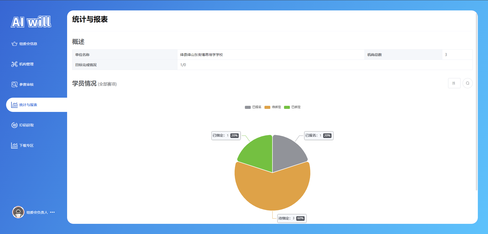
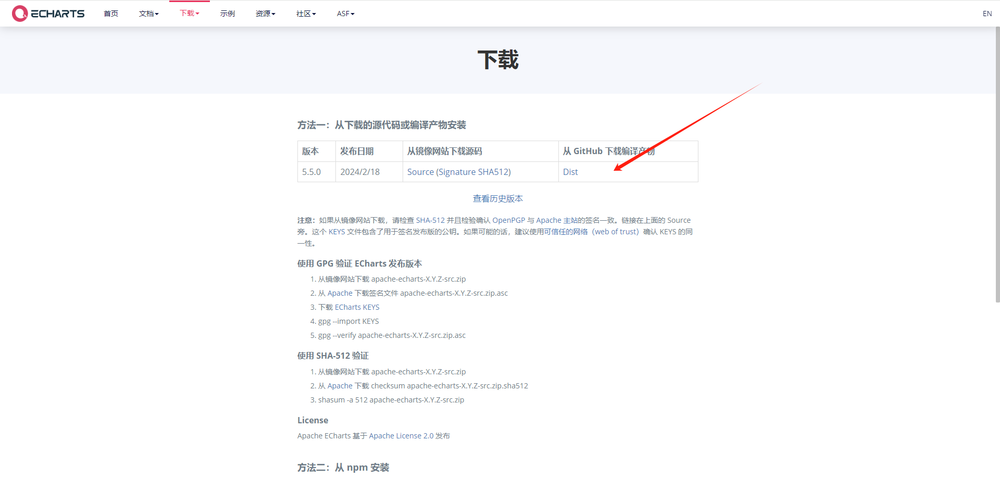
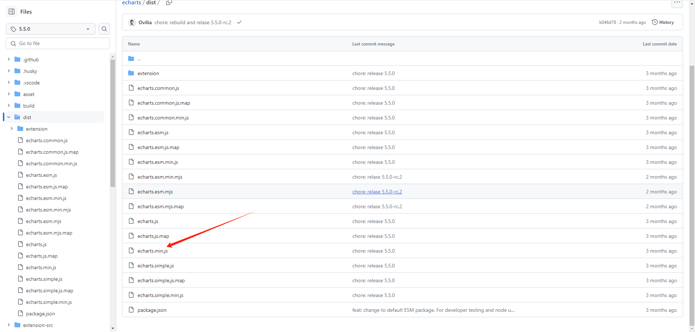
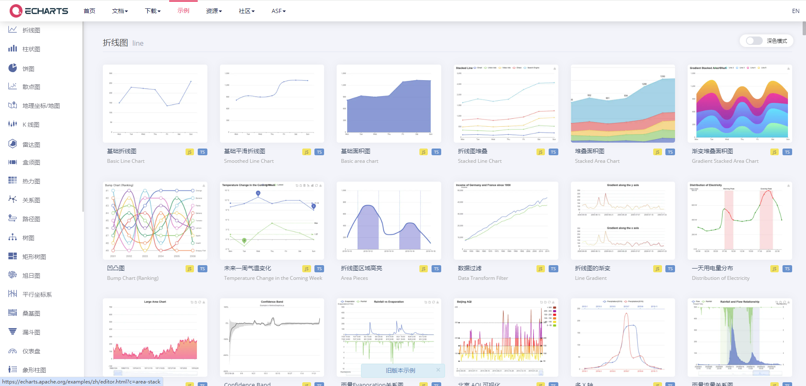
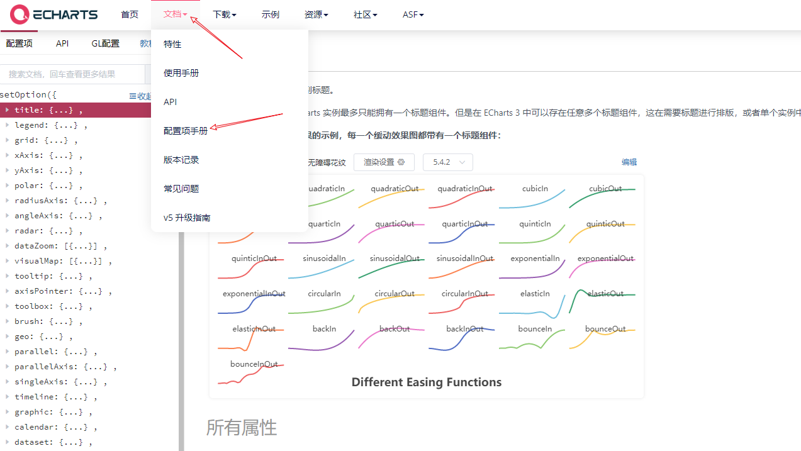
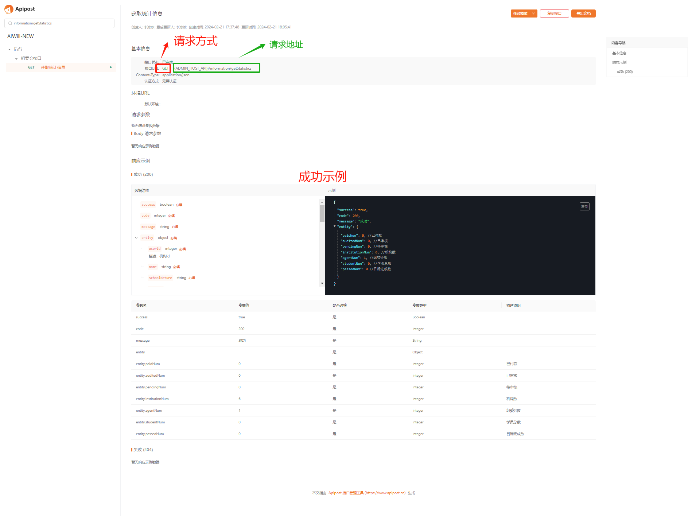
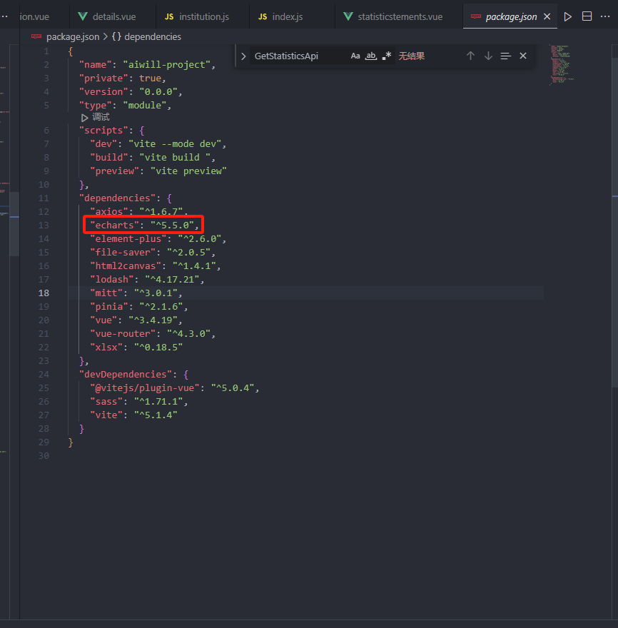
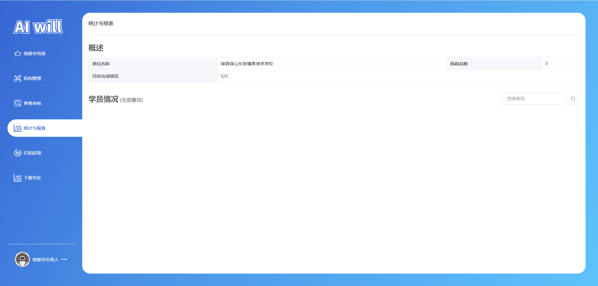
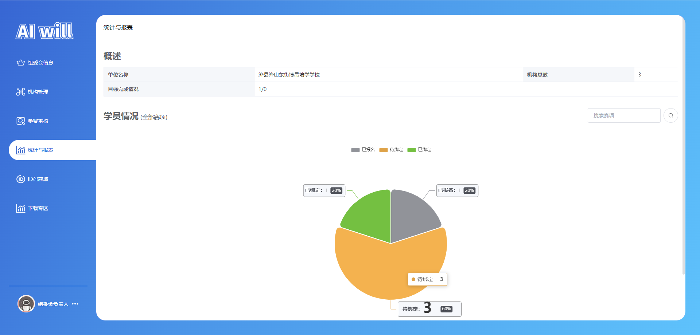

# 任务十一、实现统计与报表模块开发

## 任务描述

​	本任务的目标是实现一个统计与报表模块，该模块将为用户提供一个集成化的数据分析和可视化平台。通过使用Element Plus UI库构建的用户界面，用户可以轻松查看单位名称、组委会及机构的总数，以及目标完成情况等关键统计信息。此外，模块还包括一个动态Echarts图表，展示学员情况的分布，如已绑定、未绑定和待审核学员的数量。用户可以通过筛选组件针对特定赛事进行数据查看，而模块后端则通过API接口与数据库交互，确保展示的数据是实时且准确的。整体而言，该模块旨在提高用户对组织运行状况的洞察力，辅助决策制定。

## 任务效果

### 统计与报表模块



## 学习目标

### 知识目标

- [ ]  理解并应用Vue 3的Composition API，包括`ref`、`computed`和`onMounted`等函数，以管理组件状态和生命周期。
- [ ]  掌握Echarts图表库的使用，了解如何配置和自定义图表选项，实现数据的动态可视化。
- [ ]  学习并应用Element Plus UI库中的`el-descriptions`组件，以展示关键的统计信息和描述列表。
- [ ]  理解并实现响应式数据绑定和事件处理，使用Vue.js的模 板语法`v-model`、`v-if`和`v-bind`等。

### 能力目标

- [ ]  能够使用Echarts图表库创建和展示复杂的数据图表，包括柱状图和扇形图，以及图表的样式定制和交互设计。
- [ ]  能够利用Element Plus组件库高效地构建和布局页面，实现响应式的用户界面。
- [ ]  能够通过axios与后端API进行数据交互，处理API请求和响应，包括错误处理和数据更新。
- [ ]  能够设计和实现一个完整的前端模块，从页面布局到数据处理，以及与后端服务的接口对接，确保模块功能的完整性和稳定性。

## 知识储备

### ECharts基本使用

#### 1.使用五步曲

- 步骤1：官网下载并引入echarts.js文件：图表依赖这个js库
- 步骤2：准备一个具备大小的DOM容器：生成的图表会放入这个容器内
- 步骤3：初始化echarts实例对象：实例化echarts对象
- 步骤4：指定配置项和数据(option)：根据具体需求修改配置选项
- 步骤5：将配置项设置给echarts实例对象：让echarts对象根据修改好的配置生效

#### 2.如何下载

- 官网下载地址：https://echarts.apache.org/zh/download.html



- 找到对应版本的代码库，对应的js文件即可，我们这里取压缩的版本



#### 3.选择不同图表

- 要展示不同类型的图表，只要更换第四步代码即可，其他部分都是一样的
- 官网示例代码地址：https://echarts.apache.org/examples/zh/index.html
- 找到你需要的，点进去，直接拷贝代码



#### 4.相关配置项

- 官网配置项地址：https://echarts.apache.org/zh/option.html
- 先了解以下几个主要配置的作用，其余配置还有具体细节我们可以查阅文档：菜单—配置项手册，学echarts关键在于学会查阅文档，根据需求修改配置



| 属性/组件名                    | 描述                                                         |
| ------------------------------ | ------------------------------------------------------------ |
| title（标题组件）              | 定义图表的标题。                                             |
| tooltip（提示框组件）          | 控制提示框组件的显示。                                       |
| legend（图例组件）             | 展示不同系列的名称，可以通过点击图例来开关对应的系列。       |
| toolbox（工具栏）              | 提供了一系列的图表操作工具，如数据视图、下载等。             |
| grid（直角坐标系内绘图网格）   | 控制图表的网格，用于定义坐标系的边界。                       |
| xAxis（直角坐标系grid中的x轴） | 定义x轴的属性，如类型、标签等。                              |
| yAxis（直角坐标系grid中的y轴） | 定义y轴的属性，如类型、标签等。                              |
| color（调色盘颜色列表）        | 定义图表中使用的颜色列表。                                   |
| series（系列列表）             | 定义图表的数据系列，每个系列通过type决定自己的图表类型。     |
| type（类型）                   | 指定图表的类型，如折线图（line）、柱形图（bar）等。          |
| name（系列名称）               | 定义系列的名称，用于tooltip和legend的显示。                  |
| stack                          | 如果设置相同值，则会数据堆叠。如果指定不同值或者去掉这个属性则不会数据堆叠。数据堆叠就是在页面上的数值是下面的数值叠加上去的，不是直接取数组中的值。 |

## 任务实施

### 子任务11-1 实现路由配置

#### 步骤一 编写路由

> 文件路径：/src/router/index.js

代码如下：

```js
import { createRouter, createWebHashHistory, createWebHistory } from "vue-router";
// routes
const routes = [
     // 以上代码省略...
    
    // 管理页
    {
        path: '/manage',
        name: "manage",
        component: () => import("@/view/manage/index.vue"),
        children: [

            // ---------- 机构负责人 ----------
            // 以上代码省略...

            // ---------- 组委会负责人 ----------
           	// 以上代码省略...
        
        
            // 统计与报表路由
            {
                path: 'statisticstements',
                name: "manage-statisticstements",
                component: () => import('@/view/manage/agentmenu/statisticstements.vue'),
                meta: {
                    index: "manage-statisticstements",
                }
            },
        ]
    },
        
    // ---------- auth ----------
    // 以上代码省略...
        
    // 对于所有未定义的路径,自动匹配404页面
    {
        path: '/:pathMatch(.*)*', component: () => import("@/view/404.vue")
    },
]

// router
const router = createRouter({
    history: import.meta.env.VITE_MODE == 'dev' ? createWebHashHistory() : createWebHistory(),
    routes
});
// 无需登录的页面
const LOGIN_ROUTERS = "manage"
router.beforeEach((to, from, next) => {
    if (to.fullPath.indexOf(LOGIN_ROUTERS) != -1) {
        let token = localStorage.getItem("token")
        if (!token) {
            return next("/auth/login");
        }
    }
    return next(true)
})
export default router;
```

### 子任务11-2 实现接口编写

#### 步骤一 查看接口

​	文档详细记录在`任务一`部分的`六、接口文档介绍`小节中。通过仔细研读这些文档，可以确保对API的请求方式、参数、响应格式和行为有准确的认识，从而为后续的接口调用和功能实现打下坚实的基础。



#### 步骤二 编写接口

​	在仔细研究和理解了接口文档之后，接下来的步骤是根据文档规范编写具体的API接口实现。这包括定义请求的端点、设置正确的HTTP方法、处理参数校验和构建响应格式，确保接口的功能性与文档描述保持一致，以便于后续的前端集成和测试工作。

获取统计：`/information/getStatistics`


> 文件路径：/src/api/manage/index.js

代码如下：

```js
import { request } from "@/utils/axios"

/**
 * 以上代码省略...
 */

/**
 * 获取统计
 */

export function GetStatisticsApi(params) {
    return request(
        {
            url: "/information/getStatistics",
            method: "GET",
            params: params,
        }
    );
}

```

### 子任务11-3 实现组件编写

​	实现编写项目组件的目的在于提高前端开发效率和代码复用性，通过创建可复用的UI组件来加速开发流程，确保一致的用户体验，并降低维护成本。这样做的好处包括减少重复代码、简化项目结构、提高代码的可读性和可维护性，同时组件化的开发模式还能够促进团队协作，使得项目更加模块化，便于扩展和更新。在前端开发中，良好的组件设计可以发挥快速构建复杂应用界面的作用，同时也能够适应不同设备和平台的需求，提升应用的性能和灵活性。

#### 步骤一 组件依赖安装

​	此项目引入Echarts的目的是为了在统计与报表页面上直观地展示数据图表，使用户能够轻松理解统计信息和趋势。通过Echarts，一个强大的图表库，我们可以创建丰富的图表类型，如柱状图和饼图，来展示学员情况和目标完成情况等关键指标。这样的配置允许用户通过视觉化的数据展示来快速抓住关键信息，从而做出更有信息支持的决策。

##### 1.安装Echarts

​	ECharts是一个使用 JavaScript 实现的开源可视化库，可以流畅的运行在 PC 和移动设备上，兼容当前绝大部分浏览器（IE8/9/10/11，Chrome，Firefox，Safari等），底层依赖矢量图形库 ZRender，提供直观，交互丰富，可高度个性化定制的数据可视化图表。

安装指令:` npm i echarts -S `

##### 3.查看安装依赖



`dependencies` 是用于生产环境的依赖项，它们是我们在部署应用程序时所必需的。

`devDependencies` 是用于开发环境的依赖项，它们主要用于辅助我们进行开发、测试和构建应用程序。

#### 步骤二 编写组件

##### 1.封装参赛选择组件

> 文件路径：/src/components/event-select/index.vue

代码如下：

```js
/**
* 代码“任务十”已书写，此处省略...
*/
```

##### 2.用户状态管理

> 文件路径：/src/store/user

代码如下：

```js
/**
* 代码“任务三”已书写，此处省略...
*/
```

### 子任务11-4 实现编写统计与报表模块

#### 步骤二 页面功能的分析

- **页面容器** (`<div class="statisticstements-container">`): 构成了页面的主要结构，用于包含所有统计与报表的相关内容。它通过应用`padding`样式确保了内容与页面边缘之间有适当的间距。
- **概述信息展示** (`<div class="descriptions-container">`): 通过Element Plus的`<el-descriptions>`组件，该区域列出了关键的统计数据，如单位名称、组委会和机构总数等，为用户提供了一目了然的概览信息。
- **筛选与搜索功能** (`<div class="header-container">`): 提供了一个筛选事件的下拉选择组件`<EventSelect>`和搜索按钮`<el-button>`，允许用户根据特定条件筛选和搜索学员情况，增强了数据的可操作性和用户的交互体验。
- **Echarts图表容器** (`<div class="echarts-container">`): 虽然在当前代码中Echarts相关功能被注释掉，但该区域预留用于展示通过Echarts库生成的图表，用于可视化地呈现统计数据，帮助用户更直观地理解数据内容。

#### 步骤三 页面搭建

​	在上文中，我们对统计与报表模块界面的搭建进行了详细分析。确定了页面的结构和功能需求。基于这些分析，我们搭建了页面，包括页面容器、标题、分隔线、内容展示区域、筛选和搜索功能区域以及图表展示区域。我们还预留了Echarts图表容器，以便未来可以集成图表库来提供数据的可视化展示。

> 文件路径：/src/view/manage/agentmenu/statisticstements.vue

代码如下：

```vue
<template>
  <!-- 页面的主要内容容器 -->
  <div class="statisticstements-container">
    <!-- 页面标题 -->
    <p class="page-title">统计与报表</p>
    <el-divider></el-divider>
    <!-- 内容容器，包含概述和学员情况 -->
    <div class="content-container">
      <el-text tag="b" size="large" class="sub-title"> 概述</el-text>
      <!-- 概述信息的展示区域，使用Element Plus的描述列表组件 -->
      <div class="descriptions-container">
        <el-descriptions border :column="2">
          <el-descriptions-item label="单位名称">{{
            userStore.info_data.name
          }}</el-descriptions-item>
          <el-descriptions-item label="组委会总数" v-if="is_show_organizing">{{
            statistics_data.agentNum ?? 0
          }}</el-descriptions-item>
          <el-descriptions-item label="机构总数">
            <el-text title="已通过审核机构总数">{{
              statistics_data.institutionNum ?? 0
            }}</el-text>
          </el-descriptions-item>

          <el-descriptions-item label="目标完成情况" v-if="is_show_organizing">
            <el-text title="已绑定学员总数/目标总数">
              {{ statistics_data.paidNum ?? 0 }}/{{
                statistics_data.totalNumber ?? 0
              }}
            </el-text>
          </el-descriptions-item>
          <el-descriptions-item label="目标完成情况" v-else>
            <el-text title="已绑定学员总数/目标总数">
              {{ statistics_data.paidNum ?? 0 }}/{{
                userStore.info_data.targetNumber ?? 0
              }}
            </el-text>
          </el-descriptions-item>
        </el-descriptions>
      </div>
      <!-- 学员情况部分的标题和筛选组件 -->
      <div class="header-container">
        <span>
          <el-text tag="b" size="large" class="sub-title"> 学员情况</el-text>
          <el-text size="large"> ({{ findTitle }})</el-text>
        </span>
        <!-- 筛选事件下拉选择组件和搜索按钮 -->
        <el-space>
          <EventSelect
            v-model="query_data.rootId"
            @title-change="
              (value) => {
                findTitle = value;
              }
            "
          />
          <el-button
            size="large"
            :icon="Search"
            circle
            :loading="loading"
            @click="handleSearch"
          />
        </el-space>
      </div>
      <!-- Echarts图表容器 -->
      <div class="echarts-container">
        <div id="echarts-container"></div>
      </div>
    </div>
  </div>
</template>

<script  setup>
import { computed, onMounted, ref } from "vue";
import EventSelect from "@/components/event-select/index.vue";
import { useUserStore } from "@/store/user";
import { Search } from "@element-plus/icons-vue";
// import * as echarts from "echarts";
import { GetStatisticsApi } from "@/api";
import { ElMessage } from "element-plus";
// 使用Vue的useUserStore来获取用户信息
const userStore = useUserStore();
// 计算属性，判断是否显示组委会总数
const is_show_organizing = computed(() => {
  return userStore.info_data.role == "organizing";
});
// 查询标题的响应式引用
const findTitle = ref("全部赛项");
// 查询数据的响应式引用
const loading = ref(false);
const query_data = ref({
  agentId: "",
  institutionId: "",
  rootId: "",
});
// 统计数据的响应式引用
const statistics_data = ref({
  auditedNum: 0,
  paidNum: 0,
  pendingNum: 0,
});
// Echarts实例
let myChart = null;
// 获取报表数据的异步函数
const handleSearch = async () => {
  loading.value = true;
  let res = await GetStatisticsApi(query_data.value);
  if (res.success) {
    //     // ElMessage.error(res.message);
    //   } else {
    statistics_data.value = res.entity;
    handleEchartsSetOption();
  }
  loading.value = false;
};

/**
 * 组件挂载后执行的操作
 *  */
onMounted(() => {

});
</script>
<style lang="scss" scoped>
.statisticstements-container {
  padding: 20px;
  .content-container {
    .descriptions-container {
      padding-bottom: 32px;
      padding-top: 16px;
    }
    .header-container {
      display: flex;
      justify-content: space-between;
      align-items: center;
    }
  }
  .echarts-container {
    padding: 32px;
    box-sizing: border-box;
    width: 100%;
    #echarts-container {
      width: 100%;
      height: 600px;
    }
  }
}
.sub-title {
  font-size: 24px;
}
</style>
```

页面效果：



#### 步骤四 页面接口对接

​	上文中，已经完成了页面的分析和搭建，现在我们需要进行页面接口对接。这一步骤是将前端页面与后端服务进行连接，确保数据能够正确地从服务器获取并展示在页面上。我们通过定义API调用函数，如`GetStatisticsApi`，来处理与后端的数据交互。这些函数负责发送请求，并处理响应，无论是成功还是失败。成功响应将被用来更新前端的状态，如`statistics_data`，以反映最新的统计信息。此外，我们将在`onMounted`生命周期钩子中调用此函数，以确保在组件加载时立即加载必要的数据。通过这些步骤，我们确保了页面不仅在结构上完整，而且在功能上也能够正常运行，并为用户提供所需的数据和功能。

> 文件路径：/src/view/manage/agentmenu/statisticstements.vue

代码如下：


```vue
<template>
  <!-- 页面的主要内容容器 -->
  <div class="statisticstements-container">
    <!-- 页面标题 -->
    <p class="page-title">统计与报表</p>
    <el-divider></el-divider>
    <!-- 内容容器，包含概述和学员情况 -->
    <div class="content-container">
      <el-text tag="b" size="large" class="sub-title"> 概述</el-text>
      <!-- 概述信息的展示区域，使用Element Plus的描述列表组件 -->
      <div class="descriptions-container">
        <el-descriptions border :column="2">
          <el-descriptions-item label="单位名称">{{
            userStore.info_data.name
          }}</el-descriptions-item>
          <el-descriptions-item label="组委会总数" v-if="is_show_organizing">{{
            statistics_data.agentNum ?? 0
          }}</el-descriptions-item>
          <el-descriptions-item label="机构总数">
            <el-text title="已通过审核机构总数">{{
              statistics_data.institutionNum ?? 0
            }}</el-text>
          </el-descriptions-item>

          <el-descriptions-item label="目标完成情况" v-if="is_show_organizing">
            <el-text title="已绑定学员总数/目标总数">
              {{ statistics_data.paidNum ?? 0 }}/{{
                statistics_data.totalNumber ?? 0
              }}
            </el-text>
          </el-descriptions-item>
          <el-descriptions-item label="目标完成情况" v-else>
            <el-text title="已绑定学员总数/目标总数">
              {{ statistics_data.paidNum ?? 0 }}/{{
                userStore.info_data.targetNumber ?? 0
              }}
            </el-text>
          </el-descriptions-item>
        </el-descriptions>
      </div>
      <!-- 学员情况部分的标题和筛选组件 -->
      <div class="header-container">
        <span>
          <el-text tag="b" size="large" class="sub-title"> 学员情况</el-text>
          <el-text size="large"> ({{ findTitle }})</el-text>
        </span>
        <!-- 筛选事件下拉选择组件和搜索按钮 -->
        <el-space>
          <EventSelect
            v-model="query_data.rootId"
            @title-change="
              (value) => {
                findTitle = value;
              }
            "
          />
          <el-button
            size="large"
            :icon="Search"
            circle
            :loading="loading"
            @click="handleSearch"
          />
        </el-space>
      </div>
      <!-- Echarts图表容器 -->
      <div class="echarts-container">
        <div id="echarts-container"></div>
      </div>
    </div>
  </div>
</template>

<script  setup>
import { computed, onMounted, ref } from "vue";
import EventSelect from "@/components/event-select/index.vue";
import { useUserStore } from "@/store/user";
import { Search } from "@element-plus/icons-vue";
import * as echarts from "echarts"; // 引入Echarts图表库
import { GetStatisticsApi } from "@/api"; // 引入获取统计数据的API接口
import { ElMessage } from "element-plus"; // 引入Element Plus的消息提示组件
// 使用Vue的useUserStore来获取用户信息
const userStore = useUserStore();
// 计算属性，判断是否显示组委会总数
const is_show_organizing = computed(() => {
  return userStore.info_data.role == "organizing";
});
// 查询标题的响应式引用
const findTitle = ref("全部赛项");
// 查询数据的响应式引用
const loading = ref(false);
const query_data = ref({
  agentId: "",
  institutionId: "",
  rootId: "",
});
// 统计数据的响应式引用
const statistics_data = ref({
  auditedNum: 0,
  paidNum: 0,
  pendingNum: 0,
});
// Echarts实例
let myChart = null;
// 获取报表数据的异步函数
const handleSearch = async () => {
  loading.value = true;
  let res = await GetStatisticsApi(query_data.value);
  if (res.success) {
    statistics_data.value = res.entity; // 获取数据成功后，设置Echarts图表选项
    handleEchartsSetOption();
  }
  loading.value = false;
};

/**
 * 设置图标数据
 */
const handleEchartsSetOption = () => {
  // 定义图表颜色数组
  const color = ["#909399", "#E6A23C", "#67C23A"];
  // 定义图表数据值数组
  const value = [
    statistics_data.value.paidNum,
    statistics_data.value.auditedNum + 1000, // 假设未绑定学员数增加1000
    statistics_data.value.pendingNum,
  ];
  // 柱状图配置
  myChart.setOption({
    tooltip: {},
    xAxis: {
      type: "value",
    },
    yAxis: {
      type: "category",
      data: ["已绑定", "未绑定", "待审核"],
    },
    series: [
      {
        name: "人数", // 系列名称
        type: "bar", // 系列类型为柱状图
        data: value, // 数据数组，此处应替换为实际数据
        label: {
          show: true, // 是否显示标签
          position: "inside", // 标签位置在柱子内部
        },
        itemStyle: {
          normal: {
            // 普通状态的柱状图样式配置
            color: function (params) {
              return color[params.dataIndex]; // 设置柱状图颜色
            },
          },
        },
      },
    ],
  });
  myChart.clear();
  // 扇形图配置
  myChart.setOption({
    tooltip: {
      trigger: "item", // 提示框触发类型为数据项
    },
    legend: {
      top: "5%", // 图例位置
      left: "center", // 图例位置
    },
    color, // 使用定义的颜色数组
    series: [
      {
        type: "pie", // 系列类型为饼图
        radius: [0, "50%"], // 饼图半径范围
        avoidLabelOverlap: false, // 防止标签重叠
        itemStyle: {
          borderRadius: 10, // 图形样式配置，圆角大小
          borderColor: "#fff", // 图形边框颜色
          borderWidth: 2, // 图形边框宽度
        },
        label: {
          formatter: " {b|{b}：}{c}  {per|{d}%}  ", // 标签内容格式
          backgroundColor: "#F6F8FC", // 标签背景颜色
          borderColor: "#8C8D8E", // 标签边框颜色
          borderWidth: 1, // 标签边框宽度
          borderRadius: 4, // 标签圆角大小
          // 富文本标签样式配置
          rich: {
            a: {
              color: "#6E7079",
              lineHeight: 22,
              align: "center",
            },
            hr: {
              borderColor: "#8C8D8E",
              width: "100%",
              borderWidth: 1,
              height: 0,
            },
            b: {
              color: "#4C5058",
              fontSize: 14,
              fontWeight: "bold",
              lineHeight: 33,
            },
            per: {
              color: "#fff",
              backgroundColor: "#4C5058",
              padding: [3, 4],
              borderRadius: 4,
            },
          },
        },
        emphasis: {
          label: {
            show: true, // 是否显示标签
            fontSize: 40, // 标签字体大小
            fontWeight: "bold", // 标签字体粗细
          },
        },
        labelLine: {
          length: 30, // 标签引导线长度
        },
        // 数据项
        data: [
          { value: statistics_data.value.pendingNum, name: "已报名" },
          { value: statistics_data.value.auditedNum, name: "待绑定" },
          { value: statistics_data.value.paidNum, name: "已绑定" },
        ],
      },
    ],
  });
};

/**
 * 组件挂载后执行的操作
 * 初始化Echarts图表实例，获取报表数据，获取用户信息并设置图表选项
 */
onMounted(() => {
  myChart = echarts.init(document.getElementById("echarts-container"));
  handleSearch();
  userStore.handleGetInformation();
  handleEchartsSetOption();
});
</script>

<style lang="scss" scoped>
.statisticstements-container {
  padding: 20px;
  .content-container {
    .descriptions-container {
      padding-bottom: 32px;
      padding-top: 16px;
    }
    .header-container {
      display: flex;
      justify-content: space-between;
      align-items: center;
    }
  }
  .echarts-container {
    padding: 32px;
    box-sizing: border-box;
    width: 100%;
    #echarts-container {
      width: 100%;
      height: 600px;
    }
  }
}
.sub-title {
  font-size: 24px;
}
</style>
```

整体效果：



