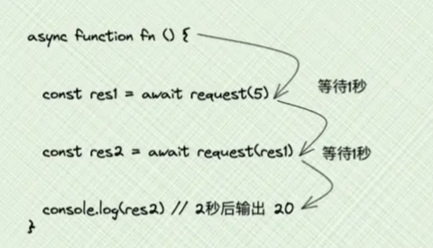
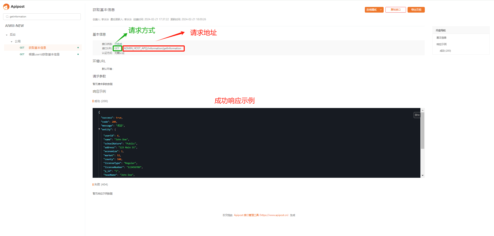
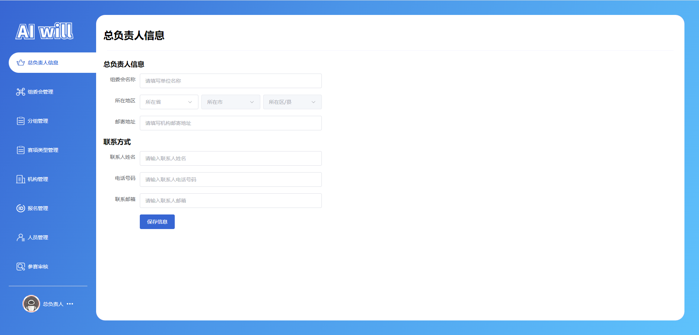

# 任务十二 实现总负责人信息模块开发

## 任务描述

​	本任务的目标是实现一个总负责人信息模块，该模块旨在提供一个简洁而直观的界面，用于管理和更新组织中总负责人的详细信息。通过这个模块，用户能够方便地录入和修改负责人的单位名称、联系地址、联系方式等关键数据。我们利用Element Plus UI框架构建了表单界面，并集成了表单验证功能，确保输入数据的准确性和完整性。此外，通过与后端API的对接，实现了信息的实时保存和更新，以便总负责人信息能够及时反映组织的最新状态。此模块的开发注重用户体验和数据的实用性，旨在提高组织管理效率，确保信息流通的顺畅和可靠。

## 任务效果

### 总负责人信息模块


## 学习目标

### 知识目标

- [ ]  理解并应用Vue 3的Composition API，包括`ref`、`onMounted`等函数，以管理组件状态和生命周期
- [ ]  理解并实现事件处理和数据绑定，使用Vue.js的模板语法`v-model`、`@click`等来处理用户交互
- [ ]  掌握Element Plus UI库的使用及表单验证功能来确保用户输入数据的有效性

### 能力目标

- [ ] 能够使用Element Plus组件库构建复杂的表单界面，并实现数据的收集和验证。
- [ ]  能够通过axios与后端API进行数据交互，完成数据的异步加载、提交和更新。
- [ ]  能够实现表单数据的实时验证和用户反馈，提高表单的可用性和用户体验。
- [ ]  能够设计和实现一个与后端服务对接的前端模块，确保数据的准确性和操作的响应性。

## 知识储备

### async/await原理

#### 1.async/await用法

其实你要实现一个东西之前，最好是先搞清楚这两样东西

- 这个东西有什么用？
- 这个东西是怎么用的？

#### 2.有什么用？

`async/await`的用处就是：**用同步方式，执行异步操作**，怎么说呢？举个例子

比如我现在有一个需求：先请求完`接口1`，再去请求`接口2`，我们通常会这么做

```js
function request(num) { // 模拟接口请求
  return new Promise(resolve => {
    setTimeout(() => {
      resolve(num * 2)
    }, 1000)
  })
}

request(1).then(res1 => {
  console.log(res1) // 1秒后 输出 2

  request(2).then(res2 => {
    console.log(res2) // 2秒后 输出 4
  })
})
```

或者我现在又有一个需求：先请求完`接口1`，再拿`接口1`返回的数据，去当做`接口2`的请求参数，那我们也可以这么做

```js
request(5).then(res1 => {
  console.log(res1) // 1秒后 输出 10

  request(res1).then(res2 => {
    console.log(res2) // 2秒后 输出 20
  })
})
```

其实这么做是没问题的，但是如果嵌套的多了，不免有点不雅观，这个时候就可以用`async/await`来解决了

```js
async function fn () {
  const res1 = await request(5)
  const res2 = await request(res1)
  console.log(res2) // 2秒后输出 20
}
fn()
```

#### 3.是怎么用？

还是用刚刚的例子

需求一：

```js
async function fn () {
  await request(1)
  await request(2)
  // 2秒后执行完
}
fn()
```

需求二：

```js
async function fn () {
  const res1 = await request(5)
  const res2 = await request(res1)
  console.log(res2) // 2秒后输出 20
}
fn()
```



其实就类似于生活中的`排队`，咱们生活中排队买东西，肯定是要上一个人买完，才轮到下一个人。而上面也一样，在`async`函数中，`await`规定了异步操作只能一个一个排队执行，从而达到**用同步方式，执行异步操作**的效果，这里注意了：**await只能在async函数中使用，不然会报错哦**

刚刚上面的例子`await`后面都是跟着异步操作`Promise`，那如果不接`Promise`会怎么样呢？

```js
function request(num) { // 去掉Promise
  setTimeout(() => {
    console.log(num * 2)
  }, 1000)
}

async function fn() {
  await request(1) // 2
  await request(2) // 4
  // 1秒后执行完  同时输出
}
fn()
```

可以看出，如果`await`后面接的不是`Promise`的话，有可能其实是达不到`排队`的效果的

说完`await`，咱们聊聊`async`吧，`async`是一个位于function之前的前缀，只有`async函数`中，才能使用`await`。那`async`执行完是返回一个什么东西呢？

```js
async function fn () {}
console.log(fn) // [AsyncFunction: fn]
console.log(fn()) // Promise {<fulfilled>: undefined}
```

可以看出，此时就有值了，并且还能使用`then方法`进行输出

#### 4.总结

总结一下`async/await`的知识点

- await只能在async函数中使用，不然会报错
- async函数返回的是一个Promise对象，有无值看有无return值
- await后面最好是接Promise，虽然接其他值也能达到排队效果
- async/await作用是**用同步方式，执行异步操作**

## 任务实施

### 子任务12-1 实现路由配置

#### 步骤一 编写路由

> 文件路径：/src/router/index.js

代码如下：

```js
import { createRouter, createWebHashHistory, createWebHistory } from "vue-router";
// routes
const routes = [
     // 以上代码省略...
    
    // 管理页
    {
        path: '/manage',
        name: "manage",
        component: () => import("@/view/manage/index.vue"),
        children: [

            // ---------- 机构负责人 ----------
            // 以上代码省略...

            // ---------- 组委会负责人 ----------
           	// 以上代码省略...
        
        
            // ---------- 总负责人 ----------
            // 组委会信息
            {
                path: 'organizingmation',
                name: "manage-organizingmation",
                component: () => import('@/view/manage/organcommitmenu/organizingmation.vue'),
                meta: {
                    index: "manage-organizingmation",
                }

            },
        ]
    },
        
    // ---------- auth ----------
    // 以上代码省略...
        
    // 对于所有未定义的路径,自动匹配404页面
    {
        path: '/:pathMatch(.*)*', component: () => import("@/view/404.vue")
    },
]

// router
const router = createRouter({
    history: import.meta.env.VITE_MODE == 'dev' ? createWebHashHistory() : createWebHistory(),
    routes
});
// 无需登录的页面
const LOGIN_ROUTERS = "manage"
router.beforeEach((to, from, next) => {
    if (to.fullPath.indexOf(LOGIN_ROUTERS) != -1) {
        let token = localStorage.getItem("token")
        if (!token) {
            return next("/auth/login");
        }
    }
    return next(true)
})
export default router;
```

### 子任务12-2 实现接口编写

#### 步骤一 查看接口

​	接口详细记录在`任务一`部分的`六、接口文档介绍`小节中。通过仔细研读这些文档，可以确保对API的请求方式、参数、响应格式和行为有准确的认识，从而为后续的接口调用和功能实现打下坚实的基础。



#### 步骤二 编写接口

​	在仔细研究和理解了接口文档之后，接下来的步骤是根据文档规范编写具体的API接口实现。这包括定义请求的端点、设置正确的HTTP方法、处理参数校验和构建响应格式，确保接口的功能性与文档描述保持一致，以便于后续的前端集成和测试工作。

获取总负责人基本信息：`/information/getInformation`

保存总负责人信息：`information/saveInformation`


> 文件路径：/src/api/manage/organcommitmenu/index.js

代码如下：

```js
import { request } from "@/utils/axios"

/**
 * 以上代码省略...
 */

/**
 * 获取总负责人基本信息
 */
export function getInformation() {
    return request(
        {
            url: "/information/getInformation",
            method: "GET",
            data: {}
        }
    );
}

/**
 * 保存总负责人信息
 */
export function saveInformation(data) {
    return request(
        {
            url: `information/saveInformation`,
            method: "POST",
            data
        }
    );
}
```

### 子任务12-3 实现组件编写

​	实现编写项目组件的目的在于提高前端开发效率和代码复用性，通过创建可复用的UI组件来加速开发流程，确保一致的用户体验，并降低维护成本。这样做的好处包括减少重复代码、简化项目结构、提高代码的可读性和可维护性，同时组件化的开发模式还能够促进团队协作，使得项目更加模块化，便于扩展和更新。在前端开发中，良好的组件设计可以发挥快速构建复杂应用界面的作用，同时也能够适应不同设备和平台的需求，提升应用的性能和灵活性。

#### 步骤一 编写组件

##### 1.编写省份选择组件

> 文件路径：/src/components/province-select/index.vue

代码如下：

```js
/**
* 代码“任务四”已书写，此处省略...
*/
```

### 子任务12-4 实现编写总负责人信息模块

#### 步骤二 页面功能的分析

- **页面容器** (`<div class="header_information page-container">`): 作为页面的基础架构，包裹了所有内容，确保了页面的布局和响应式设计。通过CSS样式`padding`的应用，提供了内容与页面边缘之间的空间，增强了阅读的舒适度。
- **头部区域** (`<el-row class="header_name">`): 包含页面的标题和分隔线，清晰地标识了当前页面的主题。标题使用了`<h1>`标签来强调重要性，而分隔线则通过一个空的`<div>`元素实现，增加了页面的层次感。
- **表格内容区域** (`<el-table>`): 用于展示详细的统计数据，如学员信息、参赛状态等。通过定义`el-table-column`，每一列都针对展示的数据进行了特别的设计，包括标签、宽度和对齐方式，确保了信息的清晰展示和易于理解。
- **事件选择和搜索功能**: 通过`<EventSelect>`组件，用户可以选择特定的赛事进行数据筛选。搜索按钮则允许用户根据输入的关键词快速查找相关数据，这两个功能共同提升了用户体验和数据处理的灵活性。

#### 步骤三 页面搭建

​	在上文中，我们已经对总负责人信息模块的界面布局、功能组件以及样式设计进行了详尽的分析。接下来，我们将利用Element Plus UI库中的组件，如`<el-form>`、`<el-input>`和`<el-button>`等，来构建表单和输入字段。同时，我们将通过Vue的响应式数据绑定和事件处理机制，确保用户交互的流畅性和数据的准确性。最终，我们将通过这些步骤，将设计转化为实际可用的界面，为用户提供一个直观、易用且美观的总负责人平台。

> 文件路径：/src/view/manage/organcommitmenu/organizingmation.vue

代码如下：

```vue
<template>
  <div class="header_information page-container">
    <!-- 头部区域，包含页面标题和分隔线 -->
    <el-row class="header_name">
      <el-col :span="24" class="header_text"
        ><!-- 页面标题 -->
        <h1>总负责人信息</h1>
      </el-col>
      <el-col :span="24">
        <div class="header_line"></div>
      </el-col>
    </el-row>
    <!-- 表格内容区域，包含表单和输入字段 -->
    <el-row>
      <!-- 组委会信息 -->
      <el-col :span="24">
        <h3 class="contnet_text">总负责人信息</h3>
        <!-- 表单组件，包含模型数据、验证规则和字段标签宽度 -->
        <el-form
          :model="form"
          ref="i_data_ref"
          :rules="i_data_rules"
          label-width="100px"
        >
          <el-form-item label="组委会名称" prop="name">
            <el-input
              placeholder="请填写单位名称"
              v-model="form.name"
              class="content_input"
              v-model.trim="inputValueTrim"
            />
          </el-form-item>
          <!-- 所在地区选择组件 -->
          <el-form-item label="所在地区" prop="county">
            <div class="select_region">
              <ProvinceSelect
                v-model:economize="form.economize"
                v-model:market="form.market"
                v-model:county="form.county"
                :showCounty="true"
              />
            </div>
          </el-form-item>

          <div class="select_region">
            <!-- 邮寄地址输入框 -->
            <el-form-item label="邮寄地址" prop="address">
              <el-input
                v-model="form.address"
                placeholder="请填写机构邮寄地址"
                class="content_input"
                v-model.trim="inputValueTrim"
              />
            </el-form-item>
          </div>
          <!-- 联系方式区域的标题 -->
          <el-col :span="24">
            <h3 class="contnet_text">联系方式</h3>
            <el-form-item label="联系人姓名" prop="headName">
              <el-input
                placeholder="请输入联系人姓名"
                v-model="form.headName"
                class="content_input"
                v-model.trim="inputValueTrim"
              />
            </el-form-item>
            <!-- 电话号码输入框 -->
            <el-form-item label="电话号码" prop="headPhone">
              <el-input
                placeholder="请输入联系人电话号码"
                v-model="form.headPhone"
                class="content_input"
                v-model.trim="inputValueTrim"
              />
            </el-form-item>
            <!-- 联系邮箱输入框 -->
            <el-form-item label="联系邮箱" prop="headEmail">
              <el-input
                placeholder="请输入联系人邮箱"
                v-model="form.headEmail"
                class="content_input"
                v-model.trim="inputValueTrim"
              />
            </el-form-item>
          </el-col>
        </el-form>
      </el-col>
      <!-- 保存信息按钮 -->
      <el-button
        class="save_btn"
        size="large"
        color="#1964d6"
        @click="handleSaveInformation"
        >保存信息</el-button
      >
    </el-row>
  </div>
</template>

<script  setup>
// 导入Vue的响应式引用和生命周期钩子
import { onMounted, ref } from "vue";

// 导入省份选择组件
import ProvinceSelect from "@/components/province-select/index.vue";

// 表单数据模型
const form = ref({});

// 挂载时获取总负责人信息
onMounted(() => {});
</script>

<style lang="scss" scoped>
:deep(.el-space__item) {
  &:nth-child(3) {
    margin: 0 !important;
  }
}
.header_information {
  padding: 20px;
  .header_name {
    margin-left: 10px;
    margin-right: 10px;
    .header_text {
      margin-left: -10px;
      margin-right: -10px;
    }
    h1 {
      font-size: 28px;
    }
  }

  .header_line {
    display: block;
    height: 1px;
    width: 100%;
    margin: 24px 0;
    background-color: #8473f717;
  }
  .contnet_text {
    margin-bottom: 14px;
  }
  .content_input {
    width: 500px;
  }
  :deep(.el-input__wrapper) {
    padding: 0 15px;
  }
  :deep(.el-input.is-disabled) .el-input__inner {
    background-color: #f5f5f5;
  }
  .select_region {
    width: 500px;
    display: flex;
    justify-content: space-between;
    .el_form_content_text {
      width: 500px;
      height: 120px;
      display: flex;
      flex-direction: column;
      justify-content: flex-start;
      .content_text_relation {
        font-size: 14px;
      }
      .content_text_contacts {
        color: #000;
        font-weight: bold;
      }
      span {
        color: #202020;
        font-size: 14px;
      }
    }
  }
  :deep(.el-input) {
    height: 40px;
  }
  :deep(.el-space__item) {
    flex: 1;
  }
  .content_select {
    width: 160px;
  }
  // 保存信息按钮
  .save_btn {
    margin-left: 100px;
  }
}
</style>
```

页面效果：



#### 步骤四 页面接口对接

​	在上文中，我们已经成功完成了总负责人信息管理页面的详细分析和前端搭建工作，确保了用户界面的直观性和易用性。现在，我们将重点实现前端页面与后端服务的无缝连接，通过编写相应的HTTP请求代码来调用后端API，如获取和保存总负责人信息。我们将确保数据的正确传输和处理，包括数据的验证、错误捕获和用户反馈，以提供流畅且稳定的用户体验。完成接口对接后，我们将进行全面的测试，验证所有功能是否按预期工作，并确保数据的准确性和安全性。这将为总负责人信息管理页面的最终部署和使用打下坚实的基础。

> 文件路径：/src/view/manage/organcommitmenu/organizingmation.vue

代码如下：


```vue
<template>
  <div class="header_information page-container">
    <!-- 头部区域，包含页面标题和分隔线 -->
    <el-row class="header_name">
      <el-col :span="24" class="header_text"
        ><!-- 页面标题 -->
        <h1>总负责人信息</h1>
      </el-col>
      <el-col :span="24">
        <div class="header_line"></div>
      </el-col>
    </el-row>
    <!-- 表格内容区域，包含表单和输入字段 -->
    <el-row>
      <!-- 组委会信息 -->
      <el-col :span="24">
        <h3 class="contnet_text">总负责人信息</h3>
        <!-- 表单组件，包含模型数据、验证规则和字段标签宽度 -->
        <el-form
          :model="form"
          ref="i_data_ref"
          :rules="i_data_rules"
          label-width="100px"
        >
          <el-form-item label="组委会名称" prop="name">
            <el-input
              placeholder="请填写单位名称"
              v-model="form.name"
              class="content_input"
              v-model.trim="inputValueTrim"
            />
          </el-form-item>
          <!-- 所在地区选择组件 -->
          <el-form-item label="所在地区" prop="county">
            <div class="select_region">
              <ProvinceSelect
                v-model:economize="form.economize"
                v-model:market="form.market"
                v-model:county="form.county"
                :showCounty="true"
              />
            </div>
          </el-form-item>

          <div class="select_region">
            <!-- 邮寄地址输入框 -->
            <el-form-item label="邮寄地址" prop="address">
              <el-input
                v-model="form.address"
                placeholder="请填写机构邮寄地址"
                class="content_input"
                v-model.trim="inputValueTrim"
              />
            </el-form-item>
          </div>
          <!-- 联系方式区域的标题 -->
          <el-col :span="24">
            <h3 class="contnet_text">联系方式</h3>
            <el-form-item label="联系人姓名" prop="headName">
              <el-input
                placeholder="请输入联系人姓名"
                v-model="form.headName"
                class="content_input"
                v-model.trim="inputValueTrim"
              />
            </el-form-item>
            <!-- 电话号码输入框 -->
            <el-form-item label="电话号码" prop="headPhone">
              <el-input
                placeholder="请输入联系人电话号码"
                v-model="form.headPhone"
                class="content_input"
                v-model.trim="inputValueTrim"
              />
            </el-form-item>
            <!-- 联系邮箱输入框 -->
            <el-form-item label="联系邮箱" prop="headEmail">
              <el-input
                placeholder="请输入联系人邮箱"
                v-model="form.headEmail"
                class="content_input"
                v-model.trim="inputValueTrim"
              />
            </el-form-item>
          </el-col>
        </el-form>
      </el-col>
      <!-- 保存信息按钮 -->
      <el-button
        class="save_btn"
        size="large"
        color="#1964d6"
        @click="handleSaveInformation"
        >保存信息</el-button
      >
    </el-row>
  </div>
</template>

<script  setup>
// 导入Vue的响应式引用和生命周期钩子
import { onMounted, ref } from "vue";
// 导入Element Plus的消息提示组件
import { ElMessage } from "element-plus";
// 导入API接口函数
import {
  getInformation,
  saveInformation,
} from "@/api/manage/organcommitmenu/index.js";
// 导入省份选择组件
import ProvinceSelect from "@/components/province-select/index.vue";

// 表单数据模型
const form = ref({});
// 获取总负责人信息的函数
const handleGetInformation = async () => {
  let res = await getInformation();
  form.value = res.entity;
};

// 保存总负责人信息的函数
const handleSaveInformation = async () => {
  // 验证表单数据
  i_data_ref.value.validate(async (v) => {
    if (!v) {
      return;
    }
    // 保存信息到后端
    let res = await saveInformation(form.value);
    if (res.success) {
      ElMessage({
        message: "保存信息成功",
        type: "success",
      });
      handleGetInformation(); // 重新获取信息以更新视图
    }
  });
};

const i_data_ref = ref();
const inputValueTrim = ref("");
// 手机号
const checkPhone = (rule, value, callback) => {
  const phoneReg = /^1[3|4|5|6|7|8|9][0-9]{9}$/;
  if (!value) {
    callback(new Error("手机号码不能为空"));
  }
  if (phoneReg.test(value)) {
    callback();
  } else {
    callback(new Error("手机号码格式错误"));
  }
};

const checkName = (rule, value, callback) => {
  const chineseCharactersRegex = /^[\u4e00-\u9fa5]+$/;

  if (!chineseCharactersRegex.test(value)) {
    callback(new Error("请输入中文"));
  } else {
    // Validation passed
    callback();
  }
};
// 表单验证规则
const i_data_rules = ref({
  name: [
    {
      type: "string",
      required: true,
      message: "请输入单位名称",
      trigger: "blur",
    },
    {
      min: 2,
      max: 10,
      message: "单位名称请输入 2-10 个字符",
      trigger: "blur",
    },
  ],
  county: [
    {
      required: true,
      message: "请选择所在地区",
      trigger: "blur",
    },
  ],
  address: [
    {
      type: "string",
      required: true,
      message: "请输入地址",
      trigger: "blur",
    },
    {
      min: 2,
      max: 120,
      message: "地址请输入 2-120 个字符",
      trigger: "blur",
    },
  ],
  headName: [
    {
      required: true,
      validator: checkName,
      trigger: "blur",
    },
    {
      min: 2,
      max: 8,
      message: "联系人姓名请输入 2-8 个字符",
      trigger: "blur",
    },
  ],
  headPhone: [
    {
      required: true,
      validator: checkPhone,
      trigger: "blur",
    },
  ],
  headEmail: [
    {
      type: "string",
      required: true,
      message: "请输入联系邮箱",
      trigger: "blur",
    },
    {
      validator: (rule, value, callback) => {
        // 使用正则表达式验证邮箱格式
        const emailPattern = /^[a-zA-Z0-9._-]+@[a-zA-Z0-9.-]+\.[a-zA-Z]{2,4}$/;
        if (emailPattern.test(value)) {
          // 邮箱格式合法，通过校验
          callback();
        } else {
          // 邮箱格式不合法，校验失败，显示提示信息
          callback(new Error("联系邮箱格式不正确"));
        }
      },
      trigger: "blur",
    },
  ],
});
// 挂载时获取总负责人信息
onMounted(() => {
  handleGetInformation();
});
</script>

<style lang="scss" scoped>
:deep(.el-space__item) {
  &:nth-child(3) {
    margin: 0 !important;
  }
}
.header_information {
  padding: 20px;
  .header_name {
    margin-left: 10px;
    margin-right: 10px;
    .header_text {
      margin-left: -10px;
      margin-right: -10px;
    }
    h1 {
      font-size: 28px;
    }
  }

  .header_line {
    display: block;
    height: 1px;
    width: 100%;
    margin: 24px 0;
    background-color: #8473f717;
  }
  .contnet_text {
    margin-bottom: 14px;
  }
  .content_input {
    width: 500px;
  }
  :deep(.el-input__wrapper) {
    padding: 0 15px;
  }
  :deep(.el-input.is-disabled) .el-input__inner {
    background-color: #f5f5f5;
  }
  .select_region {
    width: 500px;
    display: flex;
    justify-content: space-between;
    .el_form_content_text {
      width: 500px;
      height: 120px;
      display: flex;
      flex-direction: column;
      justify-content: flex-start;
      .content_text_relation {
        font-size: 14px;
      }
      .content_text_contacts {
        color: #000;
        font-weight: bold;
      }
      span {
        color: #202020;
        font-size: 14px;
      }
    }
  }
  :deep(.el-input) {
    height: 40px;
  }
  :deep(.el-space__item) {
    flex: 1;
  }
  .content_select {
    width: 160px;
  }
  // 保存信息按钮
  .save_btn {
    margin-left: 100px;
  }
}
</style>
```

整体效果：


