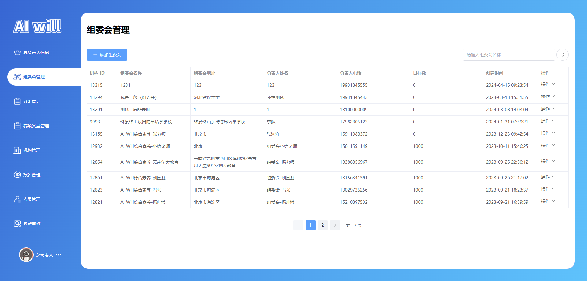
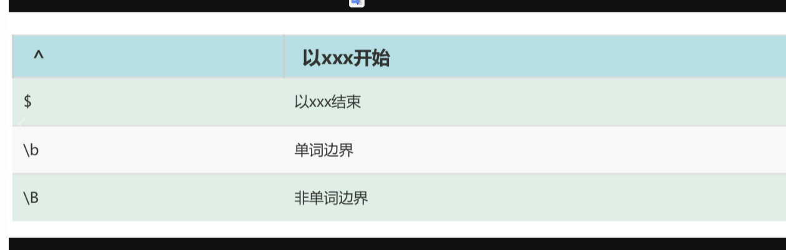
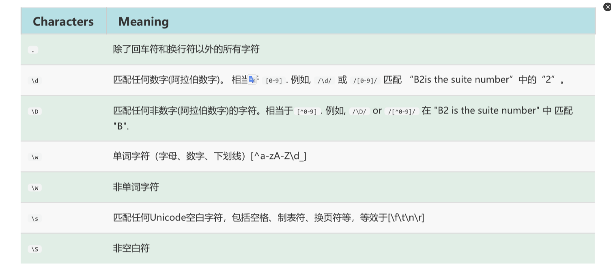
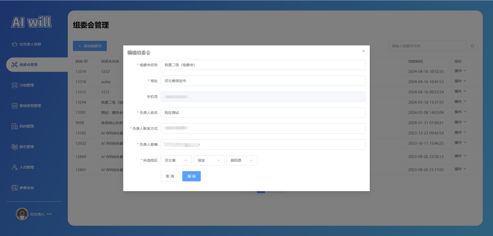
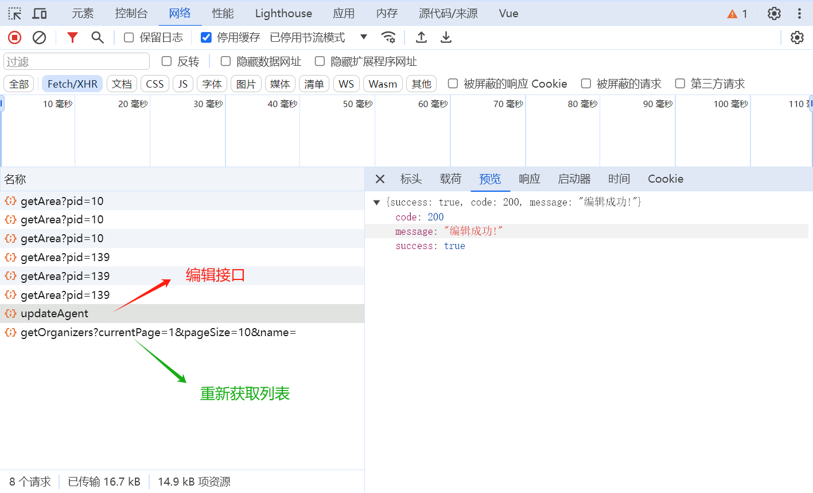

# 任务十三、实现组委会管理模块开发

## 任务描述

​	本任务的目标是实现一个组委会管理模块，该模块将提供全面的组委会信息管理功能，包括添加新的组委会、编辑现有组委会信息、删除组委会记录、重置密码、设置目标人数以及上传ID码等。通过精心设计的Vue组件和Element Plus UI库，我们将构建一个用户友好的界面，使用户能够轻松地进行组委会信息的增删改查操作。此外，任务还包括与后端API的对接，确保所有前端操作能够准确无误地与后端服务交互，实现数据的实时同步。最终，我们将提供一个高效、直观且响应式的组委会管理解决方案，以满足用户在组织和管理活动中的需求。

## 任务效果

### 组委会管理模块



## 学习目标

### 知识目标

- [ ]  理解并应用Vue 3的Composition API，包括`ref`、`onMounted`等函数，以管理组件状态和生命周期。
- [ ]  理解并实现事件处理和数据绑定，使用Vue.js的模板语法`v-model`、`@click`等来处理用户交互。
- [ ]  掌握Element Plus UI库的使用及表单验证功能来确保用户输入数据的有效性。
- [ ]  理解并应用Element Plus的对话框、消息提示和通知组件，以实现用户操作的反馈。
- [ ]  掌握如何使用Vue的响应式数据和组合式API进行有效的状态管理。

### 能力目标

- [ ]  能够使用Element Plus组件库构建复杂的表单界面，并实现数据的收集和验证。
- [ ]  能够通过axios与后端API进行数据交互，完成数据的异步加载、提交和更新。
- [ ]  能够实现表单数据的实时验证和用户反馈，提高表单的可用性和用户体验。
- [ ]  能够设计和实现一个与后端服务对接的前端模块，确保数据的准确性和操作的响应性。
- [ ]  能够创建和管理一个完整的组委会管理模块，包括添加、编辑、删除组委会信息，以及设置目标人数和ID码上传等功能。
- [ ]  能够通过正则表达式实现表单字段的格式验证，确保用户输入符合预期的格式要求。

## 知识储备

### 正则表达式

#### 概念

**正则表达式**是用于匹配字符串中字符组合的模式。在 JavaScript中，正则表达式也是对象。这些模式被用于 RegExp 的 exec 和 test 方法, 以及 String 的 match、matchAll、replace、search 和 split 方法。

#### 创建正则表达式

两种方法：[字面量](https://so.csdn.net/so/search?q=字面量&spm=1001.2101.3001.7020)方式、构造函数方式

```js
//字面量方式，其由包含在斜杠之间的模式组成，如下所示：
var re = /ab+c/;
//构造函数方式，调用RegExp对象的构造函数，如下所示：
var re = new RegExp("ab+c");
```

### 正则表达式常用方法

- 校验数据
- 提取数据
- 替换数据

#### 校验数据

##### test(字符串)

测试字符是否满足正则表达式规则，如果测试到有，则返回true；没有则返回flase
语法：正则表达式.test(字符串） 正则表达式提供的方法

```js
var reg=/[123]/
var str='1'
var result=reg.test(str)
console.log(result)//flase
```

##### search(正则表达式）

search() 方法执行正则表达式和 String 对象之间的一个搜索匹配。
语法：字符串.search(正则表达式） 字符串提供的方法

```js
var reg=/\d/   //匹配阿拉伯数字
var str="abcdefg3sgbh"
var res=str.search(reg) 
console.log(res) //7
//验证方法 找到返回下标 找不到返回-1
//在字符串中找到满足正则表达式的那一部分
```

##### 区别：

.test()方法是正则表达式提供的，.search()是字符串提高的，
.test()方法返回布尔值，search()返回下标

#### 提取数据

##### 正则表达式.exec(字符串）

exec() 方法在一个指定字符串中执行一个搜索匹配。返回一个结果数组或 null。 正则表达式提供的方法

```js
var reg=/\d/  
var str="abcd456efg"
var res=reg.exec(str)
console.log(res)//返回一个数组，内容是4
//字符串中满足正则表达式的部分提取出来
//遇到满足条件的就返回，所以只返回4
```

##### 字符串.match(正则表达式)

match() 方法检索返回一个字符串匹配正则表达式的结果。 字符串提供的方法

```js
var reg=/\d/
var str="abcd456efg"
var res=str.match(reg) //字符串中满足表达式的部分提取出来
console.log(res) 
```

##### 区别：

正则表达式.exec(字符串)，正则表达式提供的方法
字符串.match(正则表达式) 字符串的方法

##### 相同：

都返回一个数组，只要匹配到符合规则的数据就返回

#### 替换数据

字符串.replace(正则表达式，新的内容）
replace() 方法返回一个由替换值（replacement）替换部分或所有的模式（pattern）匹配项后的新字符串。模式可以是一个字符串或者一个正则表达式，替换值可以是一个字符串或者一个每次匹配都要调用的回调函数。如果pattern是字符串，则仅替换第一个匹配项。字符串提供的方法

```js
var reg=/\d/
var str="11123bcd"
var res=str.replace(reg,"a") //将数字换为a
console.log(res)//a1123bcd 只要匹配到符合规则的就返回
```

#### 断言



#### 范围类

在[]组成的类内部是可以连写的

```js
let text = 'a1B2d3X4Z5'
let reg=/[a-zA-Z]/
text.replace(reg,'Q')//Q1Q3Q4Q5
```

#### 字符类



#### 字符类取反

很多时候碰到这么一种情况，即不想匹配某些字符，其他都匹配。此时，可以使用字符类取反——使用元字符^，创建反向类，即不属于某类的内容。

```js
[^abc]表示不是字符a或b或c的内容


let reg=/[^abc]/g
let text='a1b2c3d4e5'
console.log(text.replace(reg,'X')) //输出aXbXcXdXeX
```

## 任务实施

### 子任务12-1 实现路由配置

#### 步骤一 编写路由

> 文件路径：/src/router/index.js

代码如下：

```js
import { createRouter, createWebHashHistory, createWebHistory } from "vue-router";
// routes
const routes = [
     // 以上代码省略...
    
    // 管理页
    {
        path: '/manage',
        name: "manage",
        component: () => import("@/view/manage/index.vue"),
        children: [

            // ---------- 机构负责人 ----------
            // 以上代码省略...

            // ---------- 组委会负责人 ----------
           	// 以上代码省略...
        
        
            // ---------- 总负责人 ----------
             // 组委会管理
            {
                path: 'agentmanagement',
                name: "manage-agentmanagement",
                component: () => import('@/view/manage/organcommitmenu/agentmanagement.vue'),
                meta: {
                    index: "manage-agentmanagement",
                }
            },
        ]
    },
        
    // ---------- auth ----------
    // 以上代码省略...
        
    // 对于所有未定义的路径,自动匹配404页面
    {
        path: '/:pathMatch(.*)*', component: () => import("@/view/404.vue")
    },
]

// router
const router = createRouter({
    history: import.meta.env.VITE_MODE == 'dev' ? createWebHashHistory() : createWebHistory(),
    routes
});
// 无需登录的页面
const LOGIN_ROUTERS = "manage"
router.beforeEach((to, from, next) => {
    if (to.fullPath.indexOf(LOGIN_ROUTERS) != -1) {
        let token = localStorage.getItem("token")
        if (!token) {
            return next("/auth/login");
        }
    }
    return next(true)
})
export default router;
```

### 子任务12-2 实现接口编写

#### 步骤一 查看接口

​	接口详细记录在`任务一`部分的`六、接口文档介绍`小节中。通过仔细研读这些文档，可以确保对API的请求方式、参数、响应格式和行为有准确的认识，从而为后续的接口调用和功能实现打下坚实的基础。


#### 步骤二 编写接口

​	在仔细研究和理解了接口文档之后，接下来的步骤是根据文档规范编写具体的API接口实现。这包括定义请求的端点、设置正确的HTTP方法、处理参数校验和构建响应格式，确保接口的功能性与文档描述保持一致，以便于后续的前端集成和测试工作。

获取组委会管理列表：`/organizing/getOrganizers`

编辑组委会：`/organizing/updateAgent`

重置密码：`/organizing/resetPassword`

删除组委会：`/organizing/deleteAgentOrOrganizer`

邀请组委会：`/organizing/enterAgent`

设置目标人数：`/organizing/setAgentTarget`


> 文件路径：/src/api/manage/organcommitmenu/index.js

代码如下：

```js
import { request } from "@/utils/axios"

/**
 * 以上代码省略...
 */

/**
 * 获取组委会管理列表
 * 组委会管理
 */
export function getOrganizers(params) {
    return request(
        {
            url: "/organizing/getOrganizers",
            method: "GET",
            data: {},
            params
        }
    );
}

/**
 * 编辑组委会
 */
export function updateAgent(data) {
    return request(
        {
            url: "/organizing/updateAgent",
            method: "PUT",
            data
        }
    );
}

/**
 * 重置密码
 */
export function resetPassword(userId) {
    return request(
        {
            url: `/organizing/resetPassword?userId=${userId}`,
            method: "PUT",
            data: {}
        }
    );
}

/**
 * 删除组委会
 */
export function deleteAgentOrOrganizer(userIds) {
    return request(
        {
            url: `/organizing/deleteAgentOrOrganizer?userIds=${userIds}`,
            method: "DELETE",
            data: {}
        }
    );
}
/**
 * 邀请组委会
 */
export function enterAgent(data) {
    return request(
        {
            url: "/organizing/enterAgent",
            method: "POST",
            data
        }
    );
}

/**
 * 设置目标人数
 */
export function setAgentTarget(params) {
    return request(
        {
            url: `/organizing/setAgentTarget`,
            method: "PUT",
            data: {},
            params
        }
    );
}
```

上传图片接口确认：`/agent/updateIdImage`


> 文件路径：/src/api/manage/agentmenu/index.js

代码如下：

```js
import { request } from "@/utils/axios"

/**
 * 上传图片接口确认
 */
export function updateIdImage(data) {
    return request(
        {
            url: `/agent/updateIdImage`,
            method: "PUT",
            data: data
        }
    );
}
```

### 子任务12-3 实现组件编写

​	实现编写项目组件的目的在于提高前端开发效率和代码复用性，通过创建可复用的UI组件来加速开发流程，确保一致的用户体验，并降低维护成本。这样做的好处包括减少重复代码、简化项目结构、提高代码的可读性和可维护性，同时组件化的开发模式还能够促进团队协作，使得项目更加模块化，便于扩展和更新。在前端开发中，良好的组件设计可以发挥快速构建复杂应用界面的作用，同时也能够适应不同设备和平台的需求，提升应用的性能和灵活性。

#### 步骤一 编写组件

##### 1.编写省份选择组件

> 文件路径：/src/components/province-select/index.vue

代码如下：

```js
/**
* 代码“任务四”已书写，此处省略...
*/
```

##### 2.图片上传组件

> 文件路径：/src/components/upload-image/index.vue

代码如下：

```js
/**
* 代码“任务三”已书写，此处省略...
*/
```

##### 3.验证图片自定义钩子

> 文件路径：/src/hooks/useValidateImage.js

代码如下：

```js
/**
* 代码“任务三”已书写，此处省略...
*/
```

##### 4.编写自定义钩子

> 文件路径：/src/hooks/usePage.js

代码如下：

```js
/**
* 代码“任务五”已书写，此处省略...
*/
```

### 子任务12-4 实现编写组委会管理模块

#### 步骤二 页面功能的分析

- **页面容器** (`<div class="header_information page-container">`): 作为整个页面的结构基础，这个容器负责包裹所有的页面元素。通过应用CSS类`header_information`和`page-container`，它为页面内容提供了布局框架和响应式设计的特性。这些样式类可能包含了边距、填充、宽高比等属性，确保内容在不同设备和屏幕尺寸上的适配性和良好的视觉呈现。
- **头部区域** (`<el-row class="header_name">`): 这个区域通过使用Element Plus的栅格系统`<el-row>`和`<el-col>`组件构建，确保了标题和分割线在页面中的水平排列。`<h1>`标签用于显示页面的主要标题“组委会管理”，而`<div class="header_line">`则创建了一个视觉分隔线，增强了页面的视觉效果和阅读层次感。
- **表格内容区域** (`<el-table>`): 这个区域是页面的核心，用于展示组委会的详细信息。通过定义多个`<el-table-column>`，每一列都针对特定的数据属性进行了展示，如组委会名称、地址、负责人信息等。表格还包含了操作列，提供了编辑、删除、重置密码等功能的入口，使得用户可以直接在表格内对数据进行管理。
- **分页组件** (`<el-pagination>`): 位于页面底部的分页组件允许用户在不同的数据页之间进行切换。通过背景设置、布局配置和当前页变更事件，分页组件提供了一个简洁且直观的方式来浏览大量的组委会数据。

#### 步骤三 页面搭建

​	在上文中，我们已经对组委会管理模块的界面布局进行了详尽的分析。接下来，我们将依据这些分析来搭建页面的结构。这意味着我们将从HTML标记开始，创建页面的骨架，包括头部、内容区和底部等主要部分。我们将使用Vue.js框架中的组件，来构建页面的各个功能模块。每个组件都将根据预先设计的布局和样式进行配置，确保它们在页面中正确地显示和工作。通过这样的方式，我们将逐步将设计稿转化为实际的网页，为后续的功能实现和接口对接打下坚实的基础。

> 文件路径：/src/view/manage/organcommitmenu/organizingmation.vue

代码如下：

```vue
<template>
  <!-- 页面容器 -->
  <div class="header_information page-container">
    <!-- 头部 -->
    <el-row class="header_name">
      <el-col :span="24" class="header_text">
        <h1>组委会管理</h1>
      </el-col>
      <el-col :span="24">
        <div class="header_line"></div>
      </el-col>
    </el-row>
    <!-- 按钮区，包含添加组委会按钮和搜索输入框 -->
    <el-row class="el_row_btn">
      <el-col :span="24" class="content">
        <div class="content_top_btn">
          <div>
            <el-button
              size="large"
              :icon="Plus"
              @click="handleShare"
              type="primary"
              >添加组委会</el-button
            >
          </div>
          <div>
            <el-input
              class="top_search_inp"
              v-model="query_data.name"
              placeholder="请输入组委会名称"
              clearable
            />
            <el-button
              size="large"
              :icon="Search"
              circle
              :loading="loading"
              @click="
                () => {
                  handleLoad(true);
                }
              "
            />
          </div>
        </div>
      </el-col>
    </el-row>
    <!-- 内容区，包含组委会信息的表格 -->
    <el-row>
      <el-col :span="24">
        <el-table
          empty-text="暂无数据..."
          :data="data"
          border
          style="width: 100%"
          v-loading="loading"
          @selection-change="handleSelectionChange"
        >
          <el-table-column label="机构 ID" prop="userId" width="100" />

          <el-table-column label="组委会名称" prop="name" />
          <el-table-column label="组委会地址" prop="address" />
          <el-table-column label="负责人姓名" prop="headName" />

          <el-table-column label="负责人电话" prop="headPhone" />
          <el-table-column label="目标数" prop="targetNumber" />
          <el-table-column label="创建时间" prop="createTime" width="180" />
          <!-- 操作列，包含编辑、删除等操作 -->
          <el-table-column label="操作" prop="Address" width="100">
            <template v-slot="{ row }">
              <!-- 下拉菜单项 -->
              <el-dropdown trigger="click">
                <span class="el_dropdown_link">
                  操作<el-icon class="el-icon--right"><arrow-down /></el-icon>
                </span>
                <template #dropdown>
                  <el-dropdown-menu>
                    <el-dropdown-item @click="handleredact(row)">
                      编辑
                    </el-dropdown-item>
                    <el-dropdown-item @click="handleDel(row)">
                      删除
                    </el-dropdown-item>
                    <el-dropdown-item @click="handleResetPasswords(row)">
                      重置密码
                    </el-dropdown-item>
                    <el-dropdown-item @click="handleSetTargetNumber(row)">
                      设置目标人数
                    </el-dropdown-item>
                    <el-dropdown-item @click="handleIdCode(row)">
                      ID码获取
                    </el-dropdown-item>
                  </el-dropdown-menu>
                </template>
              </el-dropdown>
            </template>
          </el-table-column>
        </el-table>
      </el-col>
    </el-row>
    <!-- 弹窗 -- 添加组委会 -->
    <el-dialog
      v-model="centerShareDialogVisible"
      width="50%"
      title="添加组委会"
    >
      <el-form
        :label-width="formLabelWidth"
        size="large"
        :model="reg_data"
        ref="reg_data_ref"
        :rules="reg_data_rules"
      >
        <div class="block-container">
          <div class="form-container">
            <el-form-item label="组委会名称" prop="name">
              <el-input
                v-model="reg_data.name"
                placeholder="请输入组委会名称"
              />
            </el-form-item>
            <el-form-item label="地址" prop="address">
              <el-input v-model="reg_data.address" placeholder="请输入地址" />
            </el-form-item>
            <el-form-item label="手机号" prop="phone">
              <el-input v-model="reg_data.phone" placeholder="请输入手机号" />
            </el-form-item>
            <el-form-item label="密码" prop="password">
              <el-input
                v-model="reg_data.password"
                type="password"
                placeholder="请输入密码"
                show-password
              />
            </el-form-item>
            <el-form-item label="负责人姓名" prop="headName">
              <el-input
                v-model="reg_data.headName"
                placeholder="请输入负责人姓名"
              />
            </el-form-item>
            <el-form-item label="负责人联系方式" prop="headPhone">
              <el-input
                v-model="reg_data.headPhone"
                placeholder="负责人联系方式"
              />
            </el-form-item>

            <el-form-item label="负责人邮箱" prop="headEmail">
              <el-input v-model="reg_data.headEmail" placeholder="负责人邮箱" />
            </el-form-item>
            <el-form-item label="所选地区" prop="county">
              <ProvinceSelect
                :isW="true"
                v-model:economize="reg_data.economize"
                v-model:market="reg_data.market"
                v-model:county="reg_data.county"
                :showCounty="true"
              />
            </el-form-item>
            <el-form-item>
              <el-button
                @click="
                  (centerShareDialogVisible = false), (reg_data.value = {})
                "
                >取消</el-button
              >
              <el-button
                type="primary"
                :loading="reg_loading"
                @click="handleReg"
                >保存</el-button
              >
            </el-form-item>
          </div>
        </div>
      </el-form>
    </el-dialog>
    <!-- 弹窗———— 编辑 -->
    <el-dialog
      v-model="centerDialogVisible"
      title="编辑组委会"
      width="50%"
      align-center
    >
      <el-form
        :label-width="formLabelWidth"
        size="large"
        :model="reg_data"
        ref="reg_data_edit_ref"
        :rules="reg_data_rules"
      >
        <div class="block-container">
          <div class="form-container">
            <el-form-item label="组委会名称" prop="name">
              <el-input
                v-model.trim="reg_data.name"
                placeholder="请输入组委会名称"
              />
            </el-form-item>
            <el-form-item label="地址" prop="address">
              <el-input
                v-model.trim="reg_data.address"
                placeholder="请输入地址"
              />
            </el-form-item>
            <el-form-item label="手机号">
              <el-input
                v-model.trim="reg_data.phone"
                placeholder="请输入手机号"
                disabled
              />
            </el-form-item>

            <el-form-item label="负责人姓名" prop="headName">
              <el-input
                v-model.trim="reg_data.headName"
                placeholder="请输入负责人姓名"
              />
            </el-form-item>
            <el-form-item label="负责人联系方式" prop="headPhone">
              <el-input
                v-model.trim="reg_data.headPhone"
                placeholder="负责人联系方式"
              />
            </el-form-item>

            <el-form-item label="负责人邮箱" prop="headEmail">
              <el-input
                v-model.trim="reg_data.headEmail"
                placeholder="负责人邮箱"
              />
            </el-form-item>
            <el-form-item label="所选地区" prop="county">
              <ProvinceSelect
                :isW="true"
                v-model:economize="reg_data.economize"
                v-model:market="reg_data.market"
                v-model:county="reg_data.county"
                :showCounty="true"
              />
            </el-form-item>
            <el-form-item>
              <el-button @click="centerDialogVisible = false">取消</el-button>
              <el-button
                type="primary"
                :loading="reg_loading"
                @click="handleEnter"
                >保存</el-button
              >
            </el-form-item>
          </div>
        </div>
      </el-form>
    </el-dialog>
    <!-- 弹窗--设置目标人数 -->
    <el-dialog
      v-model="NumberDialogVisible"
      title="设置目标人数"
      width="40%"
      align-center
    >
      <el-form label-width="95px" size="large">
        <div class="form-container">
          <el-form-item label="目标人数" prop="name">
            <el-input v-model="targetNumber" placeholder="设置目标人数" />
          </el-form-item>

          <el-form-item>
            <el-button @click="NumberDialogVisible = false">取消</el-button>
            <el-button
              type="primary"
              :loading="reg_loading"
              @click="handleEnterNumber"
              >保存</el-button
            >
          </el-form-item>
        </div>
      </el-form>
    </el-dialog>
    <!-- 弹窗--ID码上传 -->
    <el-dialog
      v-model="IdCodeDialogVisible"
      title="ID码上传"
      width="40%"
      align-center
    >
      <el-form label-width="95px" size="large">
        <div class="form-container">
          <el-form-item label="ID码上传" prop="idImage">
            <UploadImage v-model="idImage" />
          </el-form-item>

          <el-form-item>
            <el-button @click="IdCodeDialogVisible = false">取消</el-button>
            <el-button
              type="primary"
              :loading="reg_loading"
              @click="handleVisibleIdCode"
              >保存</el-button
            >
          </el-form-item>
        </div>
      </el-form>
    </el-dialog>
    <div class="pagination">
      <el-pagination
        background
        layout="prev, pager, next, total"
        :total="total"
        @current-change="handlePage"
      />
    </div>
  </div>
</template>

<script  setup>
// 导入省、市、县选择组件
import ProvinceSelect from "@/components/province-select/index.vue";
// 导入图片上传组件
import UploadImage from "@/components/upload-image/index.vue";
// 导入 Vue 的 onMounted 钩子函数
import { onMounted } from "vue";
// 导入自定义的图片验证钩子函数
import { useValidateImage } from "@/hooks/useValidateImage";
// 导入自定义的页面状态管理钩子函数
import { usePage } from "@/hooks/usePage";
const { validate_image_url, update_validate_image } = useValidateImage();
// 导入 Element Plus 图标库
import { Plus, WarningFilled, Search } from "@element-plus/icons-vue";
// 导入 Element Plus 消息对话框、消息提示和通知组件
import { ElMessageBox, ElMessage, ElNotification } from "element-plus";
// 接口
import { getOrganizers } from "@/api/manage/organcommitmenu/index.js";
// 导入 updateIdImage API 函数用于更新 ID 码图片
import { updateIdImage } from "@/api/manage/agentmenu/index.js";
import { ref, markRaw } from "vue";
// 定义响应式引用变量
const { total, data, loading, query_data, handleLoad, handlePage } = usePage({
  api_fn: getOrganizers,
  q_data: {
    name: "",
  },
});
/**
 * 定义添加组委会的表单数据和验证规则
 */
const reg_data = ref({
  name: "", //名称
  address: "", //地址
  phone: "", // 账号
  password: "", //密码
  // "licenseImg": '', //证件执照
  licenseType: null, //执照类型
  licenseNumber: null, //执照号码
  headName: "", //负责人姓名
  headPhone: "", //负责人联系方式
  headEmail: "", //负责人邮箱
  economize: null, //省id
  market: null, //市id
  county: null, //县id
  userId: "", //县id
});
// 定义添加组委会的弹窗和表单数据
const formLabelWidth = "130px";

// 添加弹窗
const centerShareDialogVisible = ref(false);
// 编辑弹窗
const centerDialogVisible = ref(false);
const handleShare = () => {
  centerShareDialogVisible.value = true;
};
const handleredact = (row) => {
  let find = data.value.find((item) => item.userId == row.userId);
  if (find) {
    reg_data.value = { ...find };
  }
  centerDialogVisible.value = true;
  centerDialogVisible.value = true;
};

/**
 * 定义删除组委会的函数
 */
const handleDel = (row) => {
  ElMessageBox.confirm("是否确定删除当前组委会？", "删除组委会", {
    type: "error",
  }).then(async () => {
    if (row.userId) {
      console.log("成功");
    } else if (userIds.value) {
      console.log("成功");
    }
    handleLoad(true);
  });
};

// 定义重置密码的函数
const handleResetPasswords = (row) => {
  const messageText = `您确认重置 ${row.name} (ID : ${row.userId}) 的密码?\n密码将重置为 <span style="color: red;">123456</span>`;
  ElMessageBox.confirm(messageText, "密码重置", {
    dangerouslyUseHTMLString: true, // 允许使用HTML
    confirmButtonText: "确认",
    cancelButtonText: "取消",
    type: "warning",
    icon: markRaw(WarningFilled),
  })
    .then(async () => {
      console.log("成功");
    })
    .catch(() => {
      // 用户点击了取消按钮或者关闭了对话框
    });
};
// 定义设置目标人数的函数
const NumberDialogVisible = ref(false);
const handleSetTargetNumber = (row) => {
  NumberDialogVisible.value = true;
};

//定义 ID 码上传的弹窗和表单数据
const IdCodeDialogVisible = ref(false);
const handleIdCode = (row) => {
  IdCodeDialogVisible.value = true;
};

// 组件挂载时加载数据
onMounted(() => {
  handleLoad(true);
});
</script>

<style lang="scss" scoped>
.header_information {
  padding: 20px;

  .header_name {
    margin-left: 10px;
    margin-right: 10px;

    .header_text {
      margin-left: -10px;
      margin-right: -10px;
    }

    h1 {
      font-size: 28px;
    }

    // 线
    .header_line {
      display: block;
      height: 1px;
      width: 100%;
      margin: 24px 0 20px 0;
      background-color: #8473f717;
    }
  }

  //   内容
  :deep(.table_btn_success) {
    padding: 0 5px !important;
    border: none;
  }

  .Form_upload {
    display: flex;
    flex-direction: column;
  }

  :deep(.el-table) .cell {
    padding: 0 10px;
  }

  .el_row_btn {
    margin-bottom: 20px;

    .content {
      .content_top_btn {
        display: flex;
        justify-content: space-between;

        .top_search_inp {
          width: 300px;
          height: 40px;
          margin-right: 5px;
        }

        .top_search_btn {
          width: 110px;
          margin-right: 5px;
        }
      }
    }
  }

  .el_dropdown_link {
    font-size: 14px;
  }

  :deep(.el-table)__cell {
    padding: 12px 0 !important;
  }

  .dialog_text {
    display: block;
    margin-top: 20px;
  }

  // 分页
  .pagination {
    margin-top: 30px;
    margin-bottom: 20px;
    display: flex;
    justify-content: center;
    align-items: center;
    width: 100%;
    height: 50px;
  }
}

// 头部主体
.header_content {
  width: 100%;
  height: 100px;
  font-size: 18px;
  display: flex;
  align-items: center;
  flex-direction: column;
  justify-content: center;
  background: #312366;
  color: #333;
  line-height: 60px;

  .container {
    width: 1200px;
    margin: 0 auto;

    .container_left {
      display: flex;
      justify-content: space-between;
      align-items: center;
      width: 1180px;
      min-height: 1px;
      margin-right: 10px;
      margin-left: 10px;

      .left_img {
        height: 50px;

        img {
          height: 100%;
        }
      }
    }
  }
}

// 内容主体
.content {
  .content_bgc {
    width: 100%;
    height: 100%;
    //   background-image: -webkit-linear-gradient(0deg, #5d5df9 0, #312366 100%);
    background-repeat: no-repeat;
    background-size: 100%;
    //   margin-bottom: 350px;

    .content_reg {
      display: flex;
      flex-direction: column;
      width: 740px;
      border-radius: 16px;
      background: #fff;
      margin: 0 auto;
      box-shadow: 0px 2px 4px 0px rgba(0, 0, 0, 0.05);
      padding: 20px;
      position: absolute;
      left: 50%;
      transform: translateX(-50%);
      margin-top: 100px;

      .header {
      }

      .block-container {
        margin-top: 32px;

        .form-container {
          width: 512px;
          padding-top: 16px;
        }
      }
    }
  }
}

:deep(.el-input-group__append) {
  padding: 0;
  cursor: pointer;
  box-sizing: border-box;
}

.code-image {
  height: 100% !important;
  cursor: pointer;
  text-align: center;
}
</style>

```

#### 步骤四 实现添加组委会

##### 1.定义表单数据和验证规则

​	通过正则表达式实现的表单验证规则，这些规则能够在用户输入时即时检查数据的有效性，并通过清晰友好的错误提示引导用户进行正确的填写，从而在提升用户体验的同时确保了数据的准确性和完整性。

```js
// 步骤三中已经定义reg_data，在后面书写以下内容

const reg_data = ref({
  name: "", //名称
  address: "", //地址
  phone: "", // 账号
  password: "", //密码
  // "licenseImg": '', //证件执照
  licenseType: null, //执照类型
  licenseNumber: null, //执照号码
  headName: "", //负责人姓名
  headPhone: "", //负责人联系方式
  headEmail: "", //负责人邮箱
  economize: null, //省id
  market: null, //市id
  county: null, //县id
  userId: "", //县id
});
const reg_data_ref = ref();
const reg_data_edit_ref = ref();
const checkPhone = (rule, value, callback) => {
  const phoneReg = /^1[3|4|5|6|7|8|9][0-9]{9}$/;
  if (!value) {
    callback(new Error("手机号码不能为空"));
  }
  if (phoneReg.test(value)) {
    callback();
  } else {
    callback(new Error("手机号码格式错误"));
  }
};
const checkEmail = (rule, value, callback) => {
  const emailReg =
    /^[A-Za-z0-9\u4e00-\u9fa5]+@[a-zA-Z0-9_-]+(\.[a-zA-Z0-9_-]+)+$/;
  if (!value) {
    callback(new Error("邮箱不能为空"));
  }
  if (emailReg.test(value)) {
    callback();
  } else {
    callback(new Error("邮箱格式错误"));
  }
};
// 表单验证规则
const reg_data_rules = ref({
  name: [
    {
      type: "string",
      required: true,
      message: "请输入名称",
      trigger: "blur",
    },
  ],
  address: [
    {
      type: "string",
      required: true,
      message: "请输入地址",
      trigger: "blur",
    },
  ],
  phone: [
    {
      required: true,
      validator: checkPhone,
      trigger: "blur",
    },
  ],
  password: [
    {
      type: "string",
      required: true,
      message: "请输入密码",
      trigger: "blur",
    },
  ],
  headName: [
    {
      type: "string",
      required: true,
      message: "请输入负责人姓名",
      trigger: "blur",
    },
  ],
  headPhone: [
    {
      required: true,
      validator: checkPhone,
      trigger: "blur",
    },
  ],
  headEmail: [
    {
      required: true,
      validator: checkEmail,
      trigger: "blur",
    },
  ],
  county: [
    {
      required: true,
      message: "请选择地区",
    },
  ],
});
```

##### 2.定义添加组委会的弹窗和表单数据

```js
// 步骤三中已经定义handleShare，在后面书写以下内容

// 定义添加组委会的弹窗和表单数据
const reg_loading = ref(false);
const formLabelWidth = "130px";
const centerShareDialogVisible = ref(false);
// 添加组委会按钮
const handleShare = () => {
  reg_data.value = {
    name: "", //名称
    address: "", //地址
    phone: "", // 账号
    password: "", //密码
    // "licenseImg": '', //证件执照
    licenseType: null, //执照类型
    licenseNumber: null, //执照号码
    headName: "", //负责人姓名
    headPhone: "", //负责人联系方式
    headEmail: "", //负责人邮箱
    economize: "", //省id
    market: "", //市id
    county: "", //县id
    userId: "", //县id
  };
  centerShareDialogVisible.value = true;
};
```

##### 3.对接添加组委会

​	在这段代码中，我们成功引入了 `enterAgent` API 接口，该接口负责处理添加组委会的操作。通过对接这个新增接口，我们为用户提供了一个流畅的添加流程：用户在表单中输入组委会的相关信息，点击添加按钮后，前端将触发 `handleReg` 方法。该方法首先对表单数据进行验证，确保所有必填字段都已正确填写。验证通过后，前端将调用 `enterAgent` API 接口，发送请求到后端服务以添加新的组委会记录。

```js
<template>
  <!-- 页面容器 -->
  <div class="header_information page-container">
     // “步骤三”已书写，此处省略...
  </div>
</template>

<script  setup>
import { ref } from "vue";
// 导入省、市、县选择组件
import ProvinceSelect from "@/components/province-select/index.vue";
// 导入图片上传组件
import UploadImage from "@/components/upload-image/index.vue";
// 导入 Vue 的 onMounted 钩子函数
import { onMounted } from "vue";
// 导入自定义的图片验证钩子函数
import { useValidateImage } from "@/hooks/useValidateImage";
// 导入自定义的页面状态管理钩子函数
import { usePage } from "@/hooks/usePage";
const { validate_image_url, update_validate_image } = useValidateImage();
// 导入 Element Plus 图标库
import { Plus, WarningFilled, Search } from "@element-plus/icons-vue";
// 导入 Element Plus 消息对话框、消息提示和通知组件
import { ElMessage } from "element-plus";
// 接口
import {
  getOrganizers,
  enterAgent,
} from "@/api/manage/organcommitmenu/index.js";

// 定义响应式引用变量
const { total, data, loading, query_data, handleLoad, handlePage } = usePage({
  api_fn: getOrganizers,
  q_data: {
    name: "",
  },
});
const reg_data = ref({
  name: "", //名称
  address: "", //地址
  phone: "", // 账号
  password: "", //密码
  // "licenseImg": '', //证件执照
  licenseType: null, //执照类型
  licenseNumber: null, //执照号码
  headName: "", //负责人姓名
  headPhone: "", //负责人联系方式
  headEmail: "", //负责人邮箱
  economize: null, //省id
  market: null, //市id
  county: null, //县id
  userId: "", //县id
});
const reg_data_ref = ref();
const reg_data_edit_ref = ref();
const checkPhone = (rule, value, callback) => {
  const phoneReg = /^1[3|4|5|6|7|8|9][0-9]{9}$/;
  if (!value) {
    callback(new Error("手机号码不能为空"));
  }
  if (phoneReg.test(value)) {
    callback();
  } else {
    callback(new Error("手机号码格式错误"));
  }
};
const checkEmail = (rule, value, callback) => {
  const emailReg =
    /^[A-Za-z0-9\u4e00-\u9fa5]+@[a-zA-Z0-9_-]+(\.[a-zA-Z0-9_-]+)+$/;
  if (!value) {
    callback(new Error("邮箱不能为空"));
  }
  if (emailReg.test(value)) {
    callback();
  } else {
    callback(new Error("邮箱格式错误"));
  }
};
// 表单验证规则
const reg_data_rules = ref({
  name: [
    {
      type: "string",
      required: true,
      message: "请输入名称",
      trigger: "blur",
    },
  ],
  address: [
    {
      type: "string",
      required: true,
      message: "请输入地址",
      trigger: "blur",
    },
  ],
  phone: [
    {
      required: true,
      validator: checkPhone,
      trigger: "blur",
    },
  ],
  password: [
    {
      type: "string",
      required: true,
      message: "请输入密码",
      trigger: "blur",
    },
  ],
  headName: [
    {
      type: "string",
      required: true,
      message: "请输入负责人姓名",
      trigger: "blur",
    },
  ],
  headPhone: [
    {
      required: true,
      validator: checkPhone,
      trigger: "blur",
    },
  ],
  headEmail: [
    {
      required: true,
      validator: checkEmail,
      trigger: "blur",
    },
  ],
  county: [
    {
      required: true,
      message: "请选择地区",
    },
  ],
});
// 定义添加组委会的弹窗和表单数据
const reg_loading = ref(false);
const formLabelWidth = "130px";
const centerShareDialogVisible = ref(false);
// 添加组委会按钮
const handleShare = () => {
  reg_data.value = {
    name: "", //名称
    address: "", //地址
    phone: "", // 账号
    password: "", //密码
    // "licenseImg": '', //证件执照
    licenseType: null, //执照类型
    licenseNumber: null, //执照号码
    headName: "", //负责人姓名
    headPhone: "", //负责人联系方式
    headEmail: "", //负责人邮箱
    economize: "", //省id
    market: "", //市id
    county: "", //县id
    userId: "", //县id
  };
  centerShareDialogVisible.value = true;
};
const handleReg = async () => {
  // 验证表单数据并调用 API 函数执行添加组委会操作
  reg_data_ref.value.validate(async (v, rule) => {
    if (!v) {
      return;
    }
    reg_loading.value = true;
    let res = await enterAgent(reg_data.value);
    if (!res.success) {
      ElMessage.error(res.message);
    } else {
      ElMessage.success(res.message);
      centerShareDialogVisible.value = false;
      handleLoad(true);
    }
    reg_loading.value = false;
  });
};
// 组件挂载时加载数据
onMounted(() => {
  handleLoad(true);
});
</script>
```

#### 步骤五 实现编辑组委会

##### 1.定义编辑组委会的弹窗和表单数据

```js
// 编辑弹框
const centerDialogVisible = ref(false);

// 表单数据
const handleredact = (row) => {
  let find = data.value.find((item) => item.userId == row.userId);
  if (find) {
    reg_data.value = { ...find };
  }
  centerDialogVisible.value = true;
};
```

##### 2.对接编辑组委会

​	在这段代码中，我们通过引入 `updateAgent` API 接口，成功对接了编辑组委会的功能。这个接口允许我们对已有的组委会信息进行更新。在编辑组委会的弹窗中，我们首先通过查找当前组委会的数据并填充到表单中，然后定义了一个 `handleEnter` 方法，当用户确认编辑信息后，该方法将验证表单数据并调用 `updateAgent` API 接口来更新组委会信息。如果更新成功，系统将显示成功消息并重新加载数据；如果更新失败，则显示错误消息。这样，我们为用户提供了一个完整的编辑流程，使得数据管理变得更加高效和便捷。

```vue
<template>
  <!-- 页面容器 -->
  <div class="header_information page-container">
     // “步骤三”已书写，此处省略...
  </div>
</template>

<script  setup>
import { ref } from "vue";
// 导入省、市、县选择组件
import ProvinceSelect from "@/components/province-select/index.vue";
// 导入图片上传组件
import UploadImage from "@/components/upload-image/index.vue";
// 导入 Vue 的 onMounted 钩子函数
import { onMounted } from "vue";
// 导入自定义的图片验证钩子函数
import { useValidateImage } from "@/hooks/useValidateImage";
// 导入自定义的页面状态管理钩子函数
import { usePage } from "@/hooks/usePage";
const { validate_image_url, update_validate_image } = useValidateImage();
// 导入 Element Plus 图标库
import { Plus, WarningFilled, Search } from "@element-plus/icons-vue";
// 导入 Element Plus 消息对话框、消息提示和通知组件
import { ElMessage } from "element-plus";
// 接口
import {
  getOrganizers,
  enterAgent,
  updateAgent, // 此模块引入
} from "@/api/manage/organcommitmenu/index.js";

// 定义响应式引用变量
const { total, data, loading, query_data, handleLoad, handlePage } = usePage({
  api_fn: getOrganizers,
  q_data: {
    name: "",
  },
});
const reg_data = ref({
  name: "", //名称
  address: "", //地址
  phone: "", // 账号
  password: "", //密码
  // "licenseImg": '', //证件执照
  licenseType: null, //执照类型
  licenseNumber: null, //执照号码
  headName: "", //负责人姓名
  headPhone: "", //负责人联系方式
  headEmail: "", //负责人邮箱
  economize: null, //省id
  market: null, //市id
  county: null, //县id
  userId: "", //县id
});
const reg_data_ref = ref();
const reg_data_edit_ref = ref();
const checkPhone = (rule, value, callback) => {
  const phoneReg = /^1[3|4|5|6|7|8|9][0-9]{9}$/;
  if (!value) {
    callback(new Error("手机号码不能为空"));
  }
  if (phoneReg.test(value)) {
    callback();
  } else {
    callback(new Error("手机号码格式错误"));
  }
};
const checkEmail = (rule, value, callback) => {
  const emailReg =
    /^[A-Za-z0-9\u4e00-\u9fa5]+@[a-zA-Z0-9_-]+(\.[a-zA-Z0-9_-]+)+$/;
  if (!value) {
    callback(new Error("邮箱不能为空"));
  }
  if (emailReg.test(value)) {
    callback();
  } else {
    callback(new Error("邮箱格式错误"));
  }
};
// 表单验证规则
const reg_data_rules = ref({
  name: [
    {
      type: "string",
      required: true,
      message: "请输入名称",
      trigger: "blur",
    },
  ],
  address: [
    {
      type: "string",
      required: true,
      message: "请输入地址",
      trigger: "blur",
    },
  ],
  phone: [
    {
      required: true,
      validator: checkPhone,
      trigger: "blur",
    },
  ],
  password: [
    {
      type: "string",
      required: true,
      message: "请输入密码",
      trigger: "blur",
    },
  ],
  headName: [
    {
      type: "string",
      required: true,
      message: "请输入负责人姓名",
      trigger: "blur",
    },
  ],
  headPhone: [
    {
      required: true,
      validator: checkPhone,
      trigger: "blur",
    },
  ],
  headEmail: [
    {
      required: true,
      validator: checkEmail,
      trigger: "blur",
    },
  ],
  county: [
    {
      required: true,
      message: "请选择地区",
    },
  ],
});
// 定义添加组委会的弹窗和表单数据
const reg_loading = ref(false);
const formLabelWidth = "130px";
const centerShareDialogVisible = ref(false);
// 添加组委会按钮
const handleShare = () => {
  reg_data.value = {
    name: "", //名称
    address: "", //地址
    phone: "", // 账号
    password: "", //密码
    // "licenseImg": '', //证件执照
    licenseType: null, //执照类型
    licenseNumber: null, //执照号码
    headName: "", //负责人姓名
    headPhone: "", //负责人联系方式
    headEmail: "", //负责人邮箱
    economize: "", //省id
    market: "", //市id
    county: "", //县id
    userId: "", //县id
  };
  centerShareDialogVisible.value = true;
};
const handleReg = async () => {
  // 验证表单数据并调用 API 函数执行添加组委会操作
  reg_data_ref.value.validate(async (v, rule) => {
    if (!v) {
      return;
    }
    reg_loading.value = true;
    let res = await enterAgent(reg_data.value);
    if (!res.success) {
      ElMessage.error(res.message);
    } else {
      ElMessage.success(res.message);
      centerShareDialogVisible.value = false;
      handleLoad(true);
    }
    reg_loading.value = false;
  });
};
 // 此模块书写   
    // 定义编辑组委会的弹窗和表单数据
const centerDialogVisible = ref(false);

const handleredact = (row) => {
  let find = data.value.find((item) => item.userId == row.userId);
  if (find) {
    reg_data.value = { ...find };
  }
  centerDialogVisible.value = true;
};
// 弹窗--编辑 确定
const handleEnter = async () => {
  reg_data_edit_ref.value.validate(async (v, rule) => {
    if (!v) {
      return;
    }
    centerDialogVisible.value = false;
    let res = await updateAgent(reg_data.value);

    if (res.success) {
      ElMessage({
        message: res.message,
        type: "success",
      });
      handleLoad(true);
    } else {
      ElMessage.error(res.message);
    }
  });
};
// 组件挂载时加载数据
onMounted(() => {
  handleLoad(true);
});
</script>
```

成功示例：





#### 步骤五 页面接口对接

​	在上文中，我们已经成功完成了组委会管理页面的详细分析和新增及编辑组委会的对接工作。现在，我们将对整个页面涉及的所有API接口进行集成，包括获取组委会列表、删除组委会、重置密码和设置目标人数等功能。这一步骤是确保页面与后端服务完全同步，实现数据的准确传递和处理。通过这些接口的精确对接，用户将能够在前端高效地管理组委会信息，实现数据的实时更新和操作反馈。这不仅优化了用户体验，也提高了系统的数据处理能力。

> 文件路径：/src/view/manage/organcommitmenu/organizingmation.vue

代码如下：


```vue
<template>
  <!-- 页面容器 -->
  <div class="header_information page-container">
    <!-- 头部 -->
    <el-row class="header_name">
      <el-col :span="24" class="header_text">
        <h1>组委会管理</h1>
      </el-col>
      <el-col :span="24">
        <div class="header_line"></div>
      </el-col>
    </el-row>
    <!-- 按钮区，包含添加组委会按钮和搜索输入框 -->
    <el-row class="el_row_btn">
      <el-col :span="24" class="content">
        <div class="content_top_btn">
          <div>
            <el-button
              size="large"
              :icon="Plus"
              @click="handleShare"
              type="primary"
              >添加组委会</el-button
            >
          </div>
          <div>
            <el-input
              class="top_search_inp"
              v-model="query_data.name"
              placeholder="请输入组委会名称"
              clearable
            />
            <el-button
              size="large"
              :icon="Search"
              circle
              :loading="loading"
              @click="
                () => {
                  handleLoad(true);
                }
              "
            />
          </div>
        </div>
      </el-col>
    </el-row>
    <!-- 内容区，包含组委会信息的表格 -->
    <el-row>
      <el-col :span="24">
        <el-table
          empty-text="暂无数据..."
          :data="data"
          border
          style="width: 100%"
          v-loading="loading"
          @selection-change="handleSelectionChange"
        >
          <el-table-column label="机构 ID" prop="userId" width="100" />

          <el-table-column label="组委会名称" prop="name" />
          <el-table-column label="组委会地址" prop="address" />
          <el-table-column label="负责人姓名" prop="headName" />

          <el-table-column label="负责人电话" prop="headPhone" />
          <el-table-column label="目标数" prop="targetNumber" />
          <el-table-column label="创建时间" prop="createTime" width="180" />
          <!-- 操作列，包含编辑、删除等操作 -->
          <el-table-column label="操作" prop="Address" width="100">
            <template v-slot="{ row }">
              <!-- 下拉菜单项 -->
              <el-dropdown trigger="click">
                <span class="el_dropdown_link">
                  操作<el-icon class="el-icon--right"><arrow-down /></el-icon>
                </span>
                <template #dropdown>
                  <el-dropdown-menu>
                    <el-dropdown-item @click="handleredact(row)">
                      编辑
                    </el-dropdown-item>
                    <el-dropdown-item @click="handleDel(row)">
                      删除
                    </el-dropdown-item>
                    <el-dropdown-item @click="handleResetPasswords(row)">
                      重置密码
                    </el-dropdown-item>
                    <el-dropdown-item @click="handleSetTargetNumber(row)">
                      设置目标人数
                    </el-dropdown-item>
                    <el-dropdown-item @click="handleIdCode(row)">
                      ID码获取
                    </el-dropdown-item>
                  </el-dropdown-menu>
                </template>
              </el-dropdown>
            </template>
          </el-table-column>
        </el-table>
      </el-col>
    </el-row>
    <!-- 弹窗 -- 添加组委会 -->
    <el-dialog
      v-model="centerShareDialogVisible"
      width="50%"
      title="添加组委会"
    >
      <el-form
        :label-width="formLabelWidth"
        size="large"
        :model="reg_data"
        ref="reg_data_ref"
        :rules="reg_data_rules"
      >
        <div class="block-container">
          <div class="form-container">
            <el-form-item label="组委会名称" prop="name">
              <el-input
                v-model="reg_data.name"
                placeholder="请输入组委会名称"
              />
            </el-form-item>
            <el-form-item label="地址" prop="address">
              <el-input v-model="reg_data.address" placeholder="请输入地址" />
            </el-form-item>
            <el-form-item label="手机号" prop="phone">
              <el-input v-model="reg_data.phone" placeholder="请输入手机号" />
            </el-form-item>
            <el-form-item label="密码" prop="password">
              <el-input
                v-model="reg_data.password"
                type="password"
                placeholder="请输入密码"
                show-password
              />
            </el-form-item>
            <el-form-item label="负责人姓名" prop="headName">
              <el-input
                v-model="reg_data.headName"
                placeholder="请输入负责人姓名"
              />
            </el-form-item>
            <el-form-item label="负责人联系方式" prop="headPhone">
              <el-input
                v-model="reg_data.headPhone"
                placeholder="负责人联系方式"
              />
            </el-form-item>

            <el-form-item label="负责人邮箱" prop="headEmail">
              <el-input v-model="reg_data.headEmail" placeholder="负责人邮箱" />
            </el-form-item>
            <el-form-item label="所选地区" prop="county">
              <ProvinceSelect
                :isW="true"
                v-model:economize="reg_data.economize"
                v-model:market="reg_data.market"
                v-model:county="reg_data.county"
                :showCounty="true"
              />
            </el-form-item>
            <el-form-item>
              <el-button
                @click="
                  (centerShareDialogVisible = false), (reg_data.value = {})
                "
                >取消</el-button
              >
              <el-button
                type="primary"
                :loading="reg_loading"
                @click="handleReg"
                >保存</el-button
              >
            </el-form-item>
          </div>
        </div>
      </el-form>
    </el-dialog>
    <!-- 弹窗———— 编辑 -->
    <el-dialog
      v-model="centerDialogVisible"
      title="编辑组委会"
      width="50%"
      align-center
    >
      <el-form
        :label-width="formLabelWidth"
        size="large"
        :model="reg_data"
        ref="reg_data_edit_ref"
        :rules="reg_data_rules"
      >
        <div class="block-container">
          <div class="form-container">
            <el-form-item label="组委会名称" prop="name">
              <el-input
                v-model.trim="reg_data.name"
                placeholder="请输入组委会名称"
              />
            </el-form-item>
            <el-form-item label="地址" prop="address">
              <el-input
                v-model.trim="reg_data.address"
                placeholder="请输入地址"
              />
            </el-form-item>
            <el-form-item label="手机号">
              <el-input
                v-model.trim="reg_data.phone"
                placeholder="请输入手机号"
                disabled
              />
            </el-form-item>

            <el-form-item label="负责人姓名" prop="headName">
              <el-input
                v-model.trim="reg_data.headName"
                placeholder="请输入负责人姓名"
              />
            </el-form-item>
            <el-form-item label="负责人联系方式" prop="headPhone">
              <el-input
                v-model.trim="reg_data.headPhone"
                placeholder="负责人联系方式"
              />
            </el-form-item>

            <el-form-item label="负责人邮箱" prop="headEmail">
              <el-input
                v-model.trim="reg_data.headEmail"
                placeholder="负责人邮箱"
              />
            </el-form-item>
            <el-form-item label="所选地区" prop="county">
              <ProvinceSelect
                :isW="true"
                v-model:economize="reg_data.economize"
                v-model:market="reg_data.market"
                v-model:county="reg_data.county"
                :showCounty="true"
              />
            </el-form-item>
            <el-form-item>
              <el-button @click="centerDialogVisible = false">取消</el-button>
              <el-button
                type="primary"
                :loading="reg_loading"
                @click="handleEnter"
                >保存</el-button
              >
            </el-form-item>
          </div>
        </div>
      </el-form>
    </el-dialog>
    <!-- 弹窗--设置目标人数 -->
    <el-dialog
      v-model="NumberDialogVisible"
      title="设置目标人数"
      width="40%"
      align-center
    >
      <el-form label-width="95px" size="large">
        <div class="form-container">
          <el-form-item label="目标人数" prop="name">
            <el-input v-model="targetNumber" placeholder="设置目标人数" />
          </el-form-item>

          <el-form-item>
            <el-button @click="NumberDialogVisible = false">取消</el-button>
            <el-button
              type="primary"
              :loading="reg_loading"
              @click="handleEnterNumber"
              >保存</el-button
            >
          </el-form-item>
        </div>
      </el-form>
    </el-dialog>
    <!-- 弹窗--ID码上传 -->
    <el-dialog
      v-model="IdCodeDialogVisible"
      title="ID码上传"
      width="40%"
      align-center
    >
      <el-form label-width="95px" size="large">
        <div class="form-container">
          <el-form-item label="ID码上传" prop="idImage">
            <UploadImage v-model="idImage" />
          </el-form-item>

          <el-form-item>
            <el-button @click="IdCodeDialogVisible = false">取消</el-button>
            <el-button
              type="primary"
              :loading="reg_loading"
              @click="handleVisibleIdCode"
              >保存</el-button
            >
          </el-form-item>
        </div>
      </el-form>
    </el-dialog>
    <div class="pagination">
      <el-pagination
        background
        layout="prev, pager, next, total"
        :total="total"
        @current-change="handlePage"
      />
    </div>
  </div>
</template>

<script  setup>
// 以上内容省略...
import { ref,onMounted, markRaw } from "vue";
// 导入 Element Plus 消息对话框、消息提示和通知组件
import { ElMessageBox, ElMessage, ElNotification } from "element-plus";
// 接口
import {
  getOrganizers,
  updateAgent,
  resetPassword,
  deleteAgentOrOrganizer,
  enterAgent,
  setAgentTarget,
} from "@/api/manage/organcommitmenu/index.js";
// 导入 updateIdImage API 函数用于更新 ID 码图片
import { updateIdImage } from "@/api/manage/agentmenu/index.js";
// 定义响应式引用变量
const { total, data, loading, query_data, handleLoad, handlePage } = usePage({
  api_fn: getOrganizers,
  q_data: {
    name: "",
  },
});
// 定义重置密码的函数
const handleResetPasswords = (row) => {
  const messageText = `您确认重置 ${row.name} (ID : ${row.userId}) 的密码?\n密码将重置为 <span style="color: red;">123456</span>`;
  ElMessageBox.confirm(messageText, "密码重置", {
    dangerouslyUseHTMLString: true, // 允许使用HTML
    confirmButtonText: "确认",
    cancelButtonText: "取消",
    type: "warning",
    icon: markRaw(WarningFilled),
  })
    .then(async () => {
      let res = await resetPassword(row.userId);
      if (res.success) {
        ElMessage({
          message: res.message,
          type: "success",
        });
      }
    })
    .catch(() => {
      // 用户点击了取消按钮或者关闭了对话框
    });
};

// 全选
const multipleSelection = ref([]);
const userIds = ref([]);
const handleSelectionChange = (val) => {
  multipleSelection.value = val;
  userIds.value = multipleSelection.value.map((item) => item.userId).join(",");
};

/**
 * 定义删除组委会的函数
 */
const handleDel = (row) => {
  ElMessageBox.confirm("是否确定删除当前组委会？", "删除组委会", {
    type: "error",
  }).then(async () => {
    if (row.userId) {
      let res = await deleteAgentOrOrganizer(row.userId);

      if (res.success) {
        ElNotification({
          title: "成功",
          message: `删除${res.message}`,
          type: "success",
        });
      } else {
        ElMessage.error(res.message);
      }
    } else if (userIds.value) {
      let res = await deleteAgentOrOrganizer(userIds.value);

      if (res.success) {
        ElNotification({
          title: "成功",
          message: `删除${res.message}`,
          type: "success",
        });
      } else {
        ElMessage.error(res.message);
      }
    }
    handleLoad(true);
  });
};

// 定义设置目标人数的函数
const unit = ref({});
const targetNumber = ref(null);
const NumberDialogVisible = ref(false);
const handleSetTargetNumber = (row) => {
  if (row.targetNumber) {
    targetNumber.value = row.targetNumber;
  } else {
    targetNumber.value = "";
  }
  unit.value = {
    userId: row.userId,
    targetNumber,
  };
  NumberDialogVisible.value = true;
};
// 确定目标人数
const handleEnterNumber = async () => {
  let res = await setAgentTarget(unit.value);
  if (res.success) {
    ElMessage({
      message: res.message,
      type: "success",
    });
    handleLoad(true);
    NumberDialogVisible.value = false;
  } else {
    ElMessage.error(res.message);
  }
};

// 定义添加组委会的弹窗和表单数据
const centerShareDialogVisible = ref(false);
// 添加组委会按钮
const handleShare = () => {
// 此处省略..
  centerShareDialogVisible.value = true;
};

/**
 * 定义添加组委会的表单数据和验证规则
 */
const reg_data = ref({
 // 此处省略..
});
const reg_data_ref = ref();
const reg_data_edit_ref = ref();
const checkPhone = (rule, value, callback) => {
 // 此处省略..
};
const checkEmail = (rule, value, callback) => {
// 此处省略..
};
// 表单验证规则
const reg_data_rules = ref({
// 此处省略..
});
const reg_loading = ref(false);
const handleReg = async () => {
  // 验证表单数据并调用 API 函数执行添加组委会操作
  reg_data_ref.value.validate(async (v, rule) => {
    if (!v) {
      return;
    }
    reg_loading.value = true;
    let res = await enterAgent(reg_data.value);
    if (!res.success) {
      ElMessage.error(res.message);
    } else {
      ElMessage.success(res.message);
      centerShareDialogVisible.value = false;
      handleLoad(true);
    }
    reg_loading.value = false;
  });
};

// 定义编辑组委会的弹窗和表单数据
const formLabelWidth = "130px";
const centerDialogVisible = ref(false);

const handleredact = (row) => {
  let find = data.value.find((item) => item.userId == row.userId);
  if (find) {
    reg_data.value = { ...find };
  }
  centerDialogVisible.value = true;
};
// 弹窗--编辑 确定
const handleEnter = async () => {
  console.log(1111);
  reg_data_edit_ref.value.validate(async (v, rule) => {
    if (!v) {
      return;
    }
    centerDialogVisible.value = false;
    let res = await updateAgent(reg_data.value);

    if (res.success) {
      ElMessage({
        message: res.message,
        type: "success",
      });
      handleLoad(true);
    } else {
      ElMessage.error(res.message);
    }
  });
};

//定义 ID 码上传的弹窗和表单数据
const IdCodeDialogVisible = ref(false);
const IdCodeuserId = ref("");
const handleIdCode = (row) => {
  console.log(row.idImage);
  IdCodeDialogVisible.value = true;
  IdCodeuserId.value = row.userId;
  if (row.idImage != null) {
    idImage.value = row.idImage;
  } else {
    idImage.value = "";
  }
};

// 定义 ID 码上传的表单数据和操作
const idImage = ref("");
const handleVisibleIdCode = async () => {
  if (!idImage.value) {
    ElMessage.error("ID码不能为空");
    return;
  }
  IdCodeDialogVisible.value = false;
  let res = await updateIdImage({
    userId: IdCodeuserId.value,
    idImage: idImage.value,
  });
  if (res.success) {
    ElMessage({
      message: res.message,
      type: "success",
    });
    handleLoad(true);
  } else {
    ElMessage.error(res.message);
  }
};
// 组件挂载时加载数据
onMounted(() => {
  handleLoad(true);
});
</script>

<style lang="scss" scoped>
// 此处省略..
</style>

```
