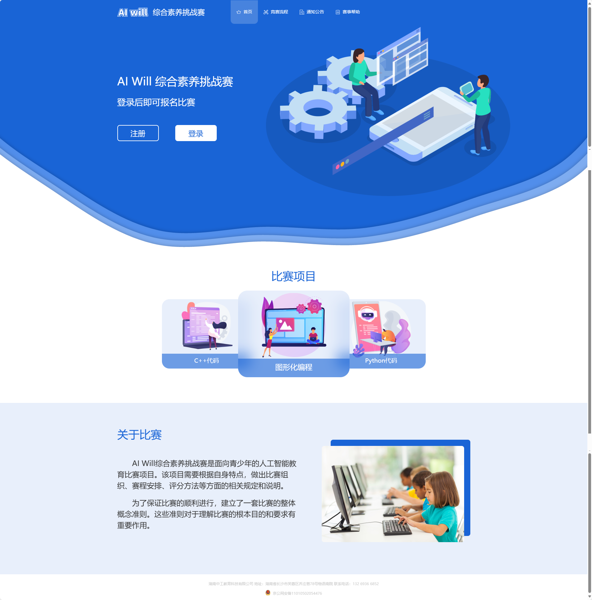
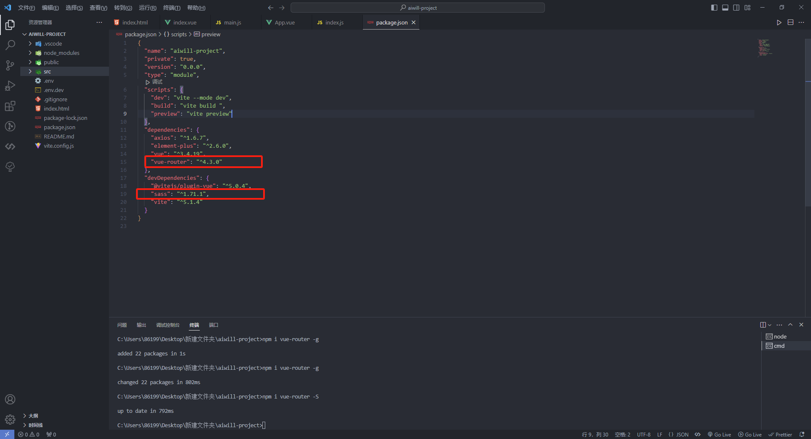
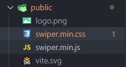
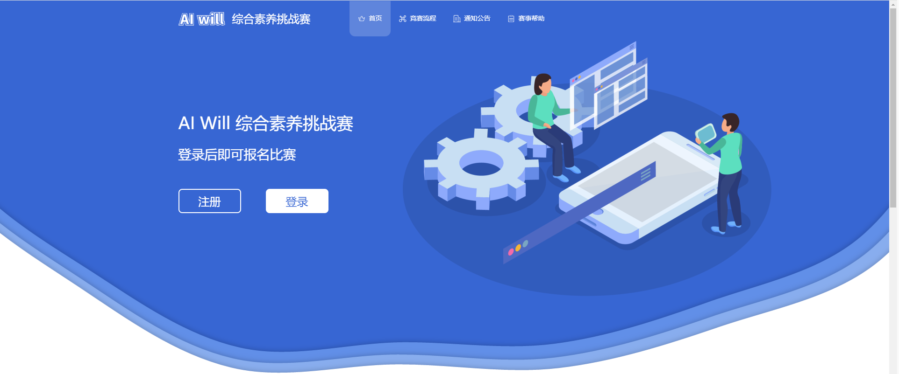
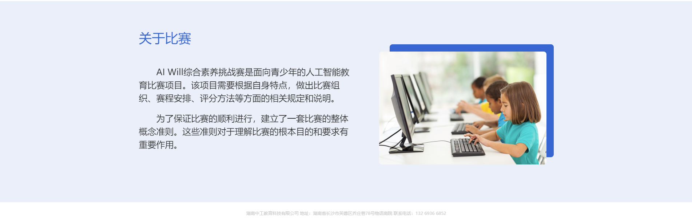
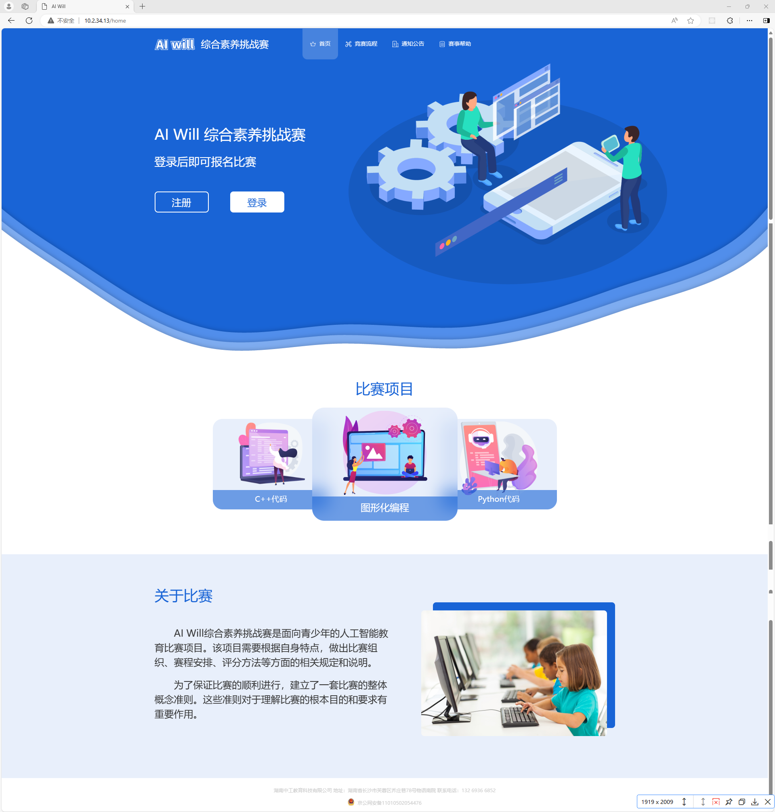

# 任务二、实现首页登录功能

## 任务描述

​	本任务的目标是开发“AI Will综合素养挑战赛”的官方网站首页，该页面将作为比赛的主要宣传和信息门户。首页不仅用于展示比赛的相关信息，吸引潜在的参赛者，还提供了用户注册和登录的功能，以便参赛者能够顺利报名参加比赛。此外，首页还将通过精心设计的用户界面和交互流程，提升用户体验，确保信息的清晰传达和用户操作的便捷性。

## 任务效果



## 学习目标

### 知识目标

- [ ] 掌握sass预处理器的使用
- [ ] 掌握Swiper的使用
- [ ] 掌握使用Element Plus组件库
- [ ] 掌握vue-router的使用

### 能力目标

- [ ] 能够使用Sass预处理器完成复杂的样式编写和维护。
- [ ] 能够使用Swiper插件实现定制化的轮播展示功能。
- [ ] 能够使用Element Plus组件库快速搭建和实现丰富的用户界面。
- [ ] 能够使用Vue Router实现前端应用的路由管理和页面跳转逻辑。

## 知识储备

### sass预处理器

#### 1.什么是Sass

​	Sass(Syntactically Awesome Stylesheets)是一个 CSS 预处理器，是 CSS 扩展语言，可以帮助我们减少 CSS 重复的代码，节省开发时间。

#### 2.Sass简介

​	Sass (英文全称：Syntactically Awesome Stylesheets) 是一个最初由 Hampton Catlin 设计并由 Natalie Weizenbaum 开发的层叠样式表语言。

- Sass 完全兼容所有版本的 CSS。

- Sass 扩展了 CSS3，增加了规则、变量、混入、选择器、继承、内置函数等等特性。、
- Sass 生成良好格式化的 CSS 代码，易于组织和维护。
- Sass 文件后缀为 .scss。

#### 3.为什么使用Sass

- 它能够帮我们更快更高效的编写更好维护的 css；
- Sass 引入合理的样式复用机制，可以节约很多时间来重复。
- Sass的好处当然不仅于此，当你使用之后便会发现其中的妙处。

#### 4.Sass语法

​	他有两种语法格式，首先是SCSS（Sassy CSS）——也是本文示例所使用的格式——这种格式仅在Css3语法的基础上进行拓展，所有Css语法在SCSS中都是通用的，同时加入Sass特色功能。.scss为拓展名

##### 4.1 变量

变量可以存储样式信息，以便后面使用。如一个样式在页面的多个地方使用，就可以先将该样式的值赋给一个变量，后面直接使用变量即可。

```js
语法： $变量名：样式值；

使用： $变量名；

注意点：

1. 以$符号开头，后跟变量名
2. 多个单词，变量名以-分割，如：$theme-color
3. 变量写在#{}中以镶嵌入字符串
```

**示例如下：**

```js
// .scss文件  Sass后缀名为scss
$dark: #000;
$side: left;
.box {
	color: $dark;
}
 
.box2 {
	background: $dark;
	border-#{$side}-radius: 5px;
}
 
--------------------------------------
 
// 生成的css代码
.box1 {
  color: #000;
}
 
.box2 {
  background: #000;
  border-left-radius: 5px;
}
```

##### 4.2 嵌套

**1. 选择器嵌套**

选择器相同放外边 选择器不同放里边

子元素在父元素样式的一对大括号{}内 如：ul { li { } }

```js
爷爷 {
	爸爸 {
		儿子 {
			孙子 {
			
			}
		}
	}
}
```

```js
body,
div,
ul,
li,
p {
    margin: 0;
    padding: 0;
}
 
.zt {
    width: 100%;
    margin: 0 auto;
 
    .one {
        img {
            width: 100%;
        }
    }
}
 
编译后
body,
div,
ul,
li,
p {
    margin: 0;
    padding: 0
}
 
.zt {
    width: 100%;
    margin: 0 auto
}
 
.zt .one img {
    width: 100%
}
```

#### 5.sass运算

```js
数学运算符：+ - * / %；

关系运算符：> < >= <=；

逻辑运算符：or and not 或与非

数据类型

数字型、字符型、布尔型、颜色型、空值、数组型、maps型

数学运算符

运算符 加+

width:1+2; == width:3;

width:10+20px == width:30px;

width:10+20% == width:30%;

content:"aa"+bb; "aabb"

content:bb + "aa"; bbaa

运算符 减-

width:20-10 == width:10;

width:20-10px == width:10px;

width:20-10% == width:10%;

先将单位统一再进行运算，两个单位不同不能进行运算

运算符 除/

border-radius:10px/20px //当两个由单位或两个数字或一个单位一个数字用 / 拼接时 / 代表分隔符不做运算
```

## 任务实施

### 子任务2-1 实现首页路由配置

​	“AI Will综合素养挑战赛”的首页路由配置的目的是为了确保用户能够通过一个清晰、直观的路径访问到比赛的主页，从而提供一个无缝的导航体验和快速入口。在前端开发中，这样的路由配置可以发挥导航的核心作用，不仅有助于组织和展示比赛相关的信息和资源，还能确保用户在浏览过程中的流畅性和便捷性，同时对于搜索引擎优化（SEO）也具有积极影响，

##### 步骤一 安装项目依赖

​	`vue-router` 是一个专为 Vue.js 应用程序设计的官方路由管理器，它与 Vue.js 核心集成，使得在单页面应用中构建复杂的页面路由和导航变得简单而高效。此外，`vue-router` 还支持路由守卫、路由元信息等高级配置，使得权限控制和路由策略管理成为可能，是构建现代 Vue.js 应用不可或缺的工具之一。

- 路由

  安装指令：`npm i vue-router -S `

- Sass预处理器

  安装指令：` npm i sass -D`

##### 步骤二 查看依赖

> 文件路径：/package.json

如下图：



`dependencies` 是用于生产环境的依赖项，它们是我们在部署应用程序时所必需的。就像我们在烹饪中需要的原料一样，这些依赖项提供了我们应用程序运行所需的核心功能。

`devDependencies` 是用于开发环境的依赖项，它们主要用于辅助我们进行开发、测试和构建应用程序。它们就像是我们在烹饪过程中使用的工具和设备。

##### 步骤三 注册路由

​	在上步骤中，已经安装了`vue-router`，我们需要对路由进行注册；前端项目中注册路由是为了定义应用中不同页面组件与URL之间的映射关系，这样用户就可以通过浏览器的URL地址来访问特定的页面视图。

> 文件路径：/src/router/index.js

代码如下：

```js
import { createRouter, createWebHashHistory } from "vue-router"; // 导入 Vue Router 中的创建路由实例和哈希历史模式的函数

// routes
const routes = [
    {
        redirect: "/home", // 当访问根路径时重定向到 "/home"
        path: "/"
    },
    // 首页路由
    {
        path: '/home', // 路径为 "/home"
        name: "home", // 路由名称
        component: () => import("@/view/home/index.vue") // 懒加载首页组件
    },
]

// 创建路由实例
const router = createRouter({
    history: createWebHashHistory(), // 使用哈希模式的浏览历史
    routes // 路由配置
});

export default router; // 导出路由实例

```

#####  步骤四 路由引入

​	引入路由是为了在Vue应用中实现页面的动态导航和组织，确保用户能够通过URL与应用的不同视图和功能模块交互。如果不引入路由，应用将无法根据URL的变化加载对应的视图，导致无法实现单页面应用中的导航功能，从而限制了应用的可用性和用户体验。

> 文件路径：/src/main.js

代码如下:

```js
import { createApp } from 'vue'
import './style.css' // 导入全局样式文件
import App from './App.vue' // 导入根组件
// 路由
import router from "@/router" // 导入路由配置
// 组件库
import ElementPlus from 'element-plus' // 导入 Element Plus 组件库
import 'element-plus/dist/index.css' // 导入 Element Plus 的 CSS 样式文件

// 创建 Vue 应用实例
const app = createApp(App)
app.use(router); // 使用路由
app.use(ElementPlus); // 使用 Element Plus 组件库

app.mount('#app') // 将应用挂载到 HTML 页面上的 #app 元素
	
```

##### 步骤五 使用路由

​	在上文中，我们已经完成了`vue-router`的配置工作，接下来我们需要在页面中实际使用这些路由。使用路由的目的是为了根据用户的导航行为动态展示相应的组件内容，从而实现一个具有多个视图和导航功能的单页面应用。通过这种方式，用户在浏览器中进行页面跳转时，无需重新加载整个页面，只需加载和展示对应的组件，这大大提升了应用的性能和用户体验。

> 文件路径：/src/App.vue

```vue
<script setup>
import { onMounted } from "vue";

onMounted(() => {});
</script>

<template>
  <router-view> </router-view> // 路由出口
</template>


<style scoped>
</style>
```

### 子任务2-2 实现插件引入

#### 步骤一 引入swiper插件

- 官网下载swiper插件  [swiper中文官网](https://www.swiper.com.cn/)

- 找到文件中的swiper.min.css文件和swiper.min.css文件 引入到项目的public目录下

  

- 在index.html中引入swiper.css和swiper.js（代码如下）

  ```html
  <!doctype html>
  <html lang="en">
    <head>
      <meta charset="UTF-8" />
      <link rel="icon" type="image/svg+xml" href="/vite.svg" />
      <meta name="viewport" content="width=device-width, initial-scale=1.0" />
      <link rel="stylesheet" href="/swiper.min.css"> // 引入swiper.min.css文件
      <title>Vite + Vue</title>
    </head>
    <body>
      <div id="app"></div>
        <script src="/swiper.min.js"></script>	// 引入swiper.min.js文件
      <script type="module" src="/src/main.js"></script>  
    </body>
  </html>
  ```

### 子任务2-3 实现页面搭建

​	“AI Will综合素养挑战赛”首页布局清晰，包含导航栏、比赛项目、比赛详情和备案信息，便于学生快速获取信息并参与比赛。导航栏提供比赛流程、通知和帮助，确保学生准备充分。页面设计既实用又易用，为学生参赛和学习提供良好起点。

#### 步骤一 编写首页路由出口

​	这段代码通过`<router-view>`元素定义了首页路由的出口，用于动态展示与当前路由匹配的组件内容，从而作为首页的展示区域。

> 文件路径：/src/view/auth/index.vue

代码如下：

```vue
<template>
    <router-view></router-view>
</template>

<script  setup>
</script>

<style lang="scss" scoped></style>
```

#### 步骤二 编写导航栏模块

​	此页面通过采用静态网页布局结构，结合Vue.js框架和Element UI库，以及利用数组遍历和相对定位技术，这个导航栏模块不仅能够动态生成导航链接，还能够以视觉上吸引人的方式展示重要信息和呼吁行动的按钮，从而提升用户体验，增强网站的整体功能性和吸引力。这个模块可以作为网站的基础导航系统，为用户提供直观的操作路径，同时也为网站管理员提供了易于维护和更新的界面结构。



> 文件路径：/src/view/home/index.vue

代码如下：

```vue
<template>
  <div class="Header">
    <div class="header_bgc">
      <!-- 导航栏 -->
      <div class="Header_bottom_bar">
        <div class="Header_bottom_container">
          <div class="Header_bottom_nav">
            <div class="Header_bottom_collapse">
              <div class="icon_img">
                
                <span class="header_text">综合素养挑战赛</span>
              </div>
              <ul>
 				<!-- 进行数组的遍历 -->
                <li
                  v-for="item in headeer_bar"
                  :key="item.id"
                >
                  <el-tooltip
                    content="请联系管理员"
                    placement="bottom"
                    effect="light"
                  >
                    <div class="imgOrname">
                      
                      <a href="javascript:;">{{ item.name }}</a>
                    </div>
                  </el-tooltip>
                </li>
              </ul>
            </div>
          </div>
        </div>
      </div>
      <div class="main">
        
        <div class="container main_content">
          <!-- 左侧登录 -->
          <div class="main_left">
            <span class="main_left_text">AI Will 综合素养挑战赛</span>
            <p>登录后即可报名比赛</p>
            <div class="main_btn">
              <span class="main_left_bt" @click="handleRegister">注册</span>
              <span class="main_left_bt" @click="handleLogin">登录</span>
            </div>
          </div>
          <!-- 右侧图片 -->
          <div class="main_right">
            
          </div>
        </div>
      </div>
    </div>
  </div>
</template>

<script  setup>
import { onMounted, ref } from "vue";
import { useRouter } from "vue-router";
// 导航栏icon
import d1 from "@/assets/images/Home/organ1.png";
import d2 from "@/assets/images/Home/organ2.png";
import d3 from "@/assets/images/Home/organ3.png";
import d4 from "@/assets/images/Home/organ4.png";

// 为了进行数组的遍历
const headeer_bar = [
  {
    id: 1,
    name: "首页",
    icon: d1,
  },
  {
    id: 2,
    name: "竞赛流程",
    icon: d2,
  },
  {
    id: 3,
    name: "通知公告",
    icon: d3,
  },
  {
    id: 4,
    name: "赛事帮助",
    icon: d4,
  },
];
</script>
<!-- End of Navigation Bar -->
<style lang="scss" scoped>
.container {
  max-width: 1170px;
  width: 100%;
  padding-right: 15px;
  padding-left: 15px;
  margin-right: auto;
  margin-left: auto;
}
.Header {
  .header_bgc {
    width: 100%;
    height: 801px;
    position: relative;

    // 导航栏
    .Header_bottom_bar {
      width: 100%;
      z-index: 99;
      position: absolute;
      top: 0;
      -webkit-transition: all ease 1s;
      transition: all ease 1s;

      .Header_bottom_container {
        max-width: 1170px;
        width: 100%;
        padding-right: 15px;
        padding-left: 15px;
        margin-right: auto;
        margin-left: auto;

        //   导航栏
        .Header_bottom_nav {
          display: flex;
          align-items: center;
          flex-flow: row;
          justify-content: flex-start;
          // padding: 0 20px !important;
          // background-image: -webkit-linear-gradient(
          //   0deg,
          //   #5d5df9 0,
          //   #312366 100%
          // );
          z-index: 10;

          .Header_bottom_collapse {
            width: 100%;
            display: flex !important;
            flex-direction: row;
            flex-basis: auto;
            flex-grow: 1;
            flex: 1;
            align-items: center;

            .icon_img {
              display: flex;
              align-items: center;

              img {
                width: 100px;
              }
            }

            .header_text {
              font-size: 24px;
              font-weight: 500;
              line-height: 78px;
              margin-left: 15px;
              margin-right: 83px;
              color: #ffffff;
            }
            .imgOrname {
              display: flex;
              align-items: center;
              justify-content: center;
            }

            ul {
              display: flex;

              li {
                cursor: pointer;
                display: flex;
                margin: 0;
                color: #fff;
                line-height: 1.7;
                font-size: 16px;
                padding: 25px 18px;
                transition: all 0.5s;
                align-items: center;

                img {
                  width: 16px;
                  height: 16px;
                  margin-right: 8px;
                }

                a {
                  color: #fff;
                  font-weight: 400;
                  align-items: center;
                  font-size: 14px;
                  text-transform: capitalize;
                  border-bottom: 2px solid transparent;
                  font-family: var(--heading-font);
                }
              }

              .active {
                background: rgba(255, 255, 255, 0.2);
                border-radius: 0px 0px 12px 12px;
              }
            }
          }
        }
      }
    }

    .main {
      width: 100%;

      position: relative;
      top: 0;
      .bgc_over {
        width: 100%;
        height: 801px;
        margin-bottom: 68px;
        cursor: pointer;
      }

      .main_content {
        display: flex;
      }

      .main_left {
        position: absolute;
        top: 28%;
        margin-right: 95px;

        .main_left_text {
          font-size: 36px;
          font-weight: normal;
          line-height: 36px;
          letter-spacing: 0px;
          color: #ffffff;
        }

        .main_btn {
          display: flex;

          .main_left_bt {
            cursor: pointer;
            width: 134px;
            height: 52px;
            border-radius: 8px;
            font-size: 24px;
            display: flex;
            flex-direction: column;
            justify-content: center;
            align-items: center;
            color: #fff;
            box-sizing: border-box;
            border: 2px solid #ffffff;

            &:nth-child(2) {
              margin-left: 53px;
              background-color: #fff;
              color: #1964d6;
            }
          }
        }

        p {
          margin: 31px 0 57px 0;
          font-size: 28px;
          font-weight: normal;
          line-height: 36px;
          letter-spacing: 0px;
          color: #ffffff;
        }
      }

      .main_right {
        position: absolute;
        margin-left: 480px;
        top: 10%;
        width: 789px;
        height: 547px;

        img {
          width: 100%;
          height: 100%;
        }
      }
    }
  }
}
</style>


```

#### 步骤三 编写比赛项目模块

​	该页面是使用Vue.js框架和Swiper.js插件编写的，采用容器布局，包含导航栏和比赛项目轮播展示。通过参考Swiper官网提供的格式和布局，通过配置实现了自定义的轮播样式和循环模式，进一步优化了页面展示效果。


​	Swiper是一款`轻量级`的轮播图插件，开源、免费、稳定、使用简单且功能强大，由纯javascript打造的滑动特效插件，面向手机、平板电脑等移动终端，能实现触屏焦点图、触屏Tab切换、触屏轮播图切换等常用效果，是架构移动终端网站的重要选择！

​	Swiper官网：https://www.swiper.com.cn/

> 文件路径：/src/view/home/index.vue

代码如下：

```vue
<template>
  <div class="Header">
    <div class="header_bgc">
   	<!-- 省略上方导航栏代码 -->
        
      <!-- 比赛项目 -->
      <div class="competition">
        <div class="container competition_content">
          <h3 class="content_h3">比赛项目</h3>
          <div class="content_list">
            <div class="swiper-container">
              <div class="swiper-wrapper">
                <div class="swiper-slide">
                  <div class="list_row">
                    <div class="row_list">
                      
                    </div>
                    <div class="row_bgc">
                      <span>图形化编程</span>
                    </div>
                  </div>
                </div>
                <div class="swiper-slide">
                  <div class="list_row">
                    <div class="row_list">
                      
                    </div>
                    <div class="row_bgc">
                      <span>Python代码</span>
                    </div>
                  </div>
                </div>
                <div class="swiper-slide">
                  <div class="list_row">
                    <div class="row_list">
                      
                    </div>
                    <div class="row_bgc">
                      <span>C++代码</span>
                    </div>
                  </div>
                </div>
              </div>
              <!-- Add Pagination -->
              <div class="swiper-pagination"></div>
            </div>
          </div>
        </div>
      </div>
    </div>
  </div>
</template>
<script  setup>
import { onMounted, ref } from "vue";

onMounted(() => {
  // Swiper配置
  new Swiper(".swiper-container", {
    slidesPerView: 3,  //每次同时显示的幻灯片数量为 3 个。
    spaceBetween: 30,  //每个幻灯片之间的间距为 30 个像素。
    centeredSlides: true, //轮播中的幻灯片将会居中显示。
    loop: true, //启用循环模式，即在到达最后一张幻灯片后继续滑动到第一张幻灯片，实现无限循环轮播的效果。
  });
});
      
</script>
<style lang="scss" scoped>
.container {
  max-width: 1170px;
  width: 100%;
  padding-right: 15px;
  padding-left: 15px;
  margin-right: auto;
  margin-left: auto;
}
.Header {
  .header_bgc {
    width: 100%;
    height: 801px;
    position: relative;
      
	// 省略上方代码
      
    // 比赛项目
    .competition {
      width: 100%;
      margin-bottom: 83px;

      .competition_content {
        display: flex;
        flex-direction: column;

        .content_h3 {
          text-align: center;
          font-size: 36px;
          font-weight: normal;
          line-height: 36px;
          letter-spacing: 0px;

          color: #1964d6;
          margin-bottom: 30px;
        }

        .content_list {
          // width: 960px;
          // margin: 0 auto;
          display: flex;
          justify-content: center;

          /* 外层容器 */
          .swiper {
            width: 1024px;
            height: 300px;
          }

          .swiper-slide {
            text-align: center;
            /* Center slide text vertically */
            display: -webkit-box;
            display: -ms-flexbox;
            display: -webkit-flex;

            transition: 300ms;
            transform: scale(0.8);
            z-index: 1;
          }

          .swiper-slide-active,
          .swiper-slide-duplicate-active {
            transform: scale(1) translateX(0%);
            z-index: 9;
          }

          .swiper-slide-prev {
            transform: translateX(30%) scale(0.8);
          }

          .swiper-slide-next {
            transform: translateX(-30%) scale(0.8);
          }

          .list_row {
            position: relative;
            width: 100%;
            // width: 100%;
            height: 280px;
            border-radius: 30px;
            padding-top: 8px;
            background: rgba(25, 100, 214, 0.1);
            box-sizing: border-box;
            border-image: linear-gradient(
                129deg,
                rgba(255, 255, 255, 0.3) 2%,
                rgba(0, 0, 0, 0.3) 101%
              )
              1;

            backdrop-filter: blur(20px);

            .row_list {
              display: flex;
              justify-content: center;
              align-items: center;
            }

            .row_bgc {
              position: absolute;
              bottom: 0;
              width: 100%;
              text-align: center;
              background: rgba(25, 100, 214, 0.6);
              // width: 380px;
              height: 60px;
              line-height: 60px;
              border-radius: 0px 0px 30px 30px;
              box-sizing: border-box;
              z-index: 2;
              border-image: linear-gradient(
                  105deg,
                  rgba(255, 255, 255, 0.3) 6%,
                  rgba(0, 0, 0, 0.3) 97%
                )
                1;

              span {
                font-size: 24px;
                font-weight: normal;
                line-height: 31.2px;
                letter-spacing: 0px;

                color: #ffffff;
              }
            }
          }

          .carousel_list {
            // display: flex;
            // justify-content: center;
            width: 100%;

            .carousel_item_list {
              width: 100%;
              height: 100%;
              display: flex;
              justify-content: center;
            }
          }
        }
      }

      .el-carousel__item--card {
        width: auto;
      }
    }
  }
}
</style>

```

#### 步骤四 编写关于比赛模块

​	该页面为了向访问者提供关于“AI Will综合素养挑战赛”的详细信息，包括比赛的宗旨、组织方式、赛程安排和评分准则等，以确保参赛者和公众对比赛有充分的了解；这个关于比赛的模块不仅能够清晰地传达比赛的核心信息，还能够增强页面的吸引力和教育意义。



> 文件路径：/src/view/home/index.vue

代码如下：

```vue
<template>
  <div class="Header">
	<!-- 省略上方代码 -->
      
        <!-- 关于比赛 -->
      <div class="aboutcompetition">
        <div class="container aboutcompetition_content">
          <h3 class="content_h3">关于比赛</h3>
          <div class="textOrimg">
            <div class="content_text">
              <p>
                AI
                Will综合素养挑战赛是面向青少年的人工智能教育比赛项目。该项目需要根据自身特点，做出比赛组织、赛程安排、评分方法等方面的相关规定和说明。
              </p>
              <p>
                为了保证比赛的顺利进行，建立了一套比赛的整体概念准则。这些准则对于理解比赛的根本目的和要求有重要作用。
              </p>
            </div>

            <!-- 图片 -->
            <div class="footer_img"></div>
          </div>
        </div>
      </div>
      <!-- 备案号 -->
      <div class="internet_content_provider">
        <div class="container provider_content">
          <p class="provider_text">
            湖南中工教育科技有限公司 地址：湖南省长沙市芙蓉区乔庄巷78号物语南院
            联系电话：132 6936 6852
          </p>
          <p class="provider_text"></p>
        </div>
      </div>
    </div>
  </div>
</template>

<style lang="scss" scoped>
.container {
  max-width: 1170px;
  width: 100%;
  padding-right: 15px;
  padding-left: 15px;
  margin-right: auto;
  margin-left: auto;
}
.Header {
  .header_bgc {
    width: 100%;
    height: 801px;
    position: relative;
      
 	// 省略上方导航栏代码
      
    // 关于比赛
    .aboutcompetition {
      width: 100%;
      height: 554px;
      opacity: 1;
      margin-bottom: 20px;
      background: rgba(25, 100, 214, 0.1);

      .aboutcompetition_content {
        width: 100%;
        height: 100%;

        .content_h3 {
          padding-top: 83px;
          font-size: 36px;
          font-weight: normal;
          line-height: 36px;
          letter-spacing: 0px;

          color: #1964d6;
        }

        .textOrimg {
          display: flex;

          .content_text {
            width: 601px;
            height: 294px;
            margin-top: 58px;
            margin-right: 101px;

            p {
              font-size: 24px;
              font-weight: normal;
              line-height: 36px;
              text-indent: 2em;
              letter-spacing: 0px;
              color: #333333;

              &:nth-child(1) {
                margin-bottom: 20px;
              }
            }
          }

          .footer_img {
            position: relative;
            width: 460px;
            height: 311px;
            border-radius: 8px;
            background: #1964d6;
            backdrop-filter: blur(10px);

            border-radius: 8px;

            &::before {
              content: "";
              position: absolute;
              top: 20px;
              right: 20px;
              width: 460px;
              height: 311px;
              background: url("@/assets/images/Home/footer_school.png");
            }
          }
        }
      }
    }

    // 备案号
    .internet_content_provider {
      width: 100%;

      .provider_content {
        width: 100%;
        display: flex;
        flex-direction: column;
        align-items: center;
        padding-bottom: 10px;

        .provider_text {
          font-size: 12px;
          font-weight: normal;
          line-height: 20px;
          text-align: center;
          letter-spacing: 0px;
          color: #cccccc;
        }
      }
    }
  }
}
</style>
```

#### 步骤五 编写路由跳转登录页面

##### 1.创建步骤：

1. 在VSCode中打开您的Vue项目。
2. 在侧边栏的文件资源管理器中，右键单击 `src` 文件夹。
3. 选择 "New Folder" （新建文件夹），然后命名为 `auth`。
4. 在 `auth` 文件夹上右键单击，选择 "New File" （新建文件），然后命名为 `login.vue`或`reg.vue`。

##### 2.登录组件

> 文件路径：/src/view/auth/login.vue

```vue
<template>
  <div id="Header">
    <h2>登录</h2>
  </div>
</template>

<script  setup>
</script>

<style lang="scss" scoped>
</style>
```

##### 3.注册组件

> 文件路径：/src/view/auth/reg.vue

```vue
<template>
  <div id="Header">
    <h2>注册</h2>
  </div>
</template>

<script  setup>
</script>

<style lang="scss" scoped>
</style>
```

##### 4.配置登录/注册路由

> 文件路径：/src/router/index.js

代码如下:

```js
import { createRouter, createWebHashHistory, createWebHistory } from "vue-router";
// routes
const routes = [
    {
        redirect: "/home",
        path: "/"
    },
    // 首页
    {
        path: '/home',
        name: "home",
        component: () => import("@/view/home/index.vue")
    },
    // auth
    {
        path: '/auth',
        redirect: "/auth/login",
        component: () => import("@/view/auth/index.vue"),
        children: [
            {
                path: 'login',
                component: () => import("@/view/auth/login.vue")
            },

            {
                path: 'reg',
                component: () => import("@/view/auth/reg.vue")
            },
        ]
    },
]

// router
const router = createRouter({
    history: createWebHashHistory(),
    routes
});

export default router;
```

##### 5.通过路由转到相应页面进行操作

> 文件路径：/src/view/home/index.vue

代码如下:


```vue
<template>
  <div class="Header">
    <div class="header_bgc">
      <div class="main">
        
        <div class="container main_content">
          <!-- 左侧登录 -->
          <div class="main_left">
            <span class="main_left_text">AI Will 综合素养挑战赛</span>
            <p>登录后即可报名比赛</p>
            <div class="main_btn">
              <span class="main_left_bt" @click="handleRegister">注册</span>
              <span class="main_left_bt" @click="handleLogin">登录</span>
            </div>
          </div>
          <!-- 右侧图片 -->
          <div class="main_right">
            
          </div>
        </div>
      </div>
    </div>
  </div>
</template>
<script  setup>
import { useRouter } from "vue-router";

const router = useRouter();
 // 注册
const handleRegister = () => {
  	// 路由跳转
  router.push("/auth/reg");
};
 // 登录
const handleLogin = () => {
  	// 路由跳转
  router.push("/auth/login");
};

</script>
```

#### 步骤六 编写首页模块整体实现代码

​	该页面向用户展示“AI Will综合素养挑战赛”的概览、导航功能、比赛项目介绍以及组织方的联系信息。通过整合导航栏、轮播图、文本描述等多个模块，页面不仅提供了直观的导航体验和视觉吸引力，还有助于提升用户体验。

> 文件路径：/src/view/home/index.vue

代码如下：

```vue
<template>
  <div class="Header">
    <div class="header_bgc">
      <!-- 导航栏 -->
      <div class="Header_bottom_bar">
        <div class="Header_bottom_container">
          <div class="Header_bottom_nav">
            <div class="Header_bottom_collapse">
              <div class="icon_img">
                
                <span class="header_text">综合素养挑战赛</span>
              </div>
              <ul>
                <li
                  v-for="item in headeer_bar"
                  :key="item.id"
                  @click="handleActive(item.id)"
                  :class="{ active: active === item.id }"
                >
                  <el-tooltip
                    content="请联系管理员"
                    placement="bottom"
                    effect="light"
                  >
                    <div class="imgOrname">
                      
                      <a href="javascript:;">{{ item.name }}</a>
                    </div>
                  </el-tooltip>
                </li>
              </ul>
            </div>
          </div>
        </div>
      </div>
      <div class="main">
        
        <div class="container main_content">
          <!-- 左侧登录 -->
          <div class="main_left">
            <span class="main_left_text">AI Will 综合素养挑战赛</span>
            <p>登录后即可报名比赛</p>
            <div class="main_btn">
              <span class="main_left_bt" @click="handleRegister">注册</span>
              <span class="main_left_bt" @click="handleLogin">登录</span>
            </div>
          </div>
          <!-- 右侧图片 -->
          <div class="main_right">
            
          </div>
        </div>
      </div>
      <!-- 比赛项目 -->
      <div class="competition">
        <div class="container competition_content">
          <h3 class="content_h3">比赛项目</h3>
          <div class="content_list">
            <div class="swiper-container">
              <div class="swiper-wrapper">
                <div class="swiper-slide">
                  <div class="list_row">
                    <div class="row_list">
                      
                    </div>
                    <div class="row_bgc">
                      <span>图形化编程</span>
                    </div>
                  </div>
                </div>
                <div class="swiper-slide">
                  <div class="list_row">
                    <div class="row_list">
                      
                    </div>
                    <div class="row_bgc">
                      <span>Python代码</span>
                    </div>
                  </div>
                </div>
                <div class="swiper-slide">
                  <div class="list_row">
                    <div class="row_list">
                      
                    </div>
                    <div class="row_bgc">
                      <span>C++代码</span>
                    </div>
                  </div>
                </div>
              </div>
              <!-- Add Pagination -->
              <div class="swiper-pagination"></div>
            </div>
          </div>
        </div>
      </div>
      <!-- 关于比赛 -->
      <div class="aboutcompetition">
        <div class="container aboutcompetition_content">
          <h3 class="content_h3">关于比赛</h3>
          <div class="textOrimg">
            <div class="content_text">
              <p>
                AI
                Will综合素养挑战赛是面向青少年的人工智能教育比赛项目。该项目需要根据自身特点，做出比赛组织、赛程安排、评分方法等方面的相关规定和说明。
              </p>
              <p>
                为了保证比赛的顺利进行，建立了一套比赛的整体概念准则。这些准则对于理解比赛的根本目的和要求有重要作用。
              </p>
            </div>

            <!-- 图片 -->
            <div class="footer_img"></div>
          </div>
        </div>
      </div>
      <!-- 备案号 -->
      <div class="internet_content_provider">
        <div class="container provider_content">
          <p class="provider_text">
            湖南中工教育科技有限公司 地址：湖南省长沙市芙蓉区乔庄巷78号物语南院
            联系电话：132 6936 6852
          </p>
          <p class="provider_text"></p>
        </div>
      </div>
    </div>
  </div>
</template>


<script  setup>
import { onMounted, ref } from "vue";
import { useRouter } from "vue-router";
import d1 from "@/assets/images/Home/organ1.png";
import d2 from "@/assets/images/Home/organ2.png";
import d3 from "@/assets/images/Home/organ3.png";
import d4 from "@/assets/images/Home/organ4.png";

const headeer_bar = [
  {
    id: 1,
    name: "首页",
    icon: d1,
  },
  {
    id: 2,
    name: "竞赛流程",
    icon: d2,
  },
  {
    id: 3,
    name: "通知公告",
    icon: d3,
  },
  {
    id: 4,
    name: "赛事帮助",
    icon: d4,
  },
];
const active = ref(1);
const handleActive = (activeId) => {
  active.value = activeId;
};
const router = useRouter();
const handleRegister = () => {
  router.push("/auth/reg");
};
const handleLogin = () => {
  router.push("/auth/login");
};
onMounted(() => {
  // Swiper配置
  new Swiper(".swiper-container", {
    slidesPerView: 3,
    spaceBetween: 30,
    centeredSlides: true,
    loop: true,
  });
});
</script>

<style lang="scss" scoped>
.container {
  max-width: 1170px;
  width: 100%;
  padding-right: 15px;
  padding-left: 15px;
  margin-right: auto;
  margin-left: auto;
}
.Header {
  .header_bgc {
    width: 100%;
    height: 801px;
    position: relative;

    // 导航栏
    .Header_bottom_bar {
      width: 100%;
      z-index: 99;
      position: absolute;
      top: 0;
      -webkit-transition: all ease 1s;
      transition: all ease 1s;

      .Header_bottom_container {
        max-width: 1170px;
        width: 100%;
        padding-right: 15px;
        padding-left: 15px;
        margin-right: auto;
        margin-left: auto;

        //   导航栏
        .Header_bottom_nav {
          display: flex;
          align-items: center;
          flex-flow: row;
          justify-content: flex-start;
          // padding: 0 20px !important;
          // background-image: -webkit-linear-gradient(
          //   0deg,
          //   #5d5df9 0,
          //   #312366 100%
          // );
          z-index: 10;

          .Header_bottom_collapse {
            width: 100%;
            display: flex !important;
            flex-direction: row;
            flex-basis: auto;
            flex-grow: 1;
            flex: 1;
            align-items: center;

            .icon_img {
              display: flex;
              align-items: center;

              img {
                width: 100px;
              }
            }

            .header_text {
              font-size: 24px;
              font-weight: 500;
              line-height: 78px;
              margin-left: 15px;
              margin-right: 83px;
              color: #ffffff;
            }
            .imgOrname {
              display: flex;
              align-items: center;
              justify-content: center;
            }

            ul {
              display: flex;

              li {
                cursor: pointer;
                display: flex;
                margin: 0;
                color: #fff;
                line-height: 1.7;
                font-size: 16px;
                padding: 25px 18px;
                transition: all 0.5s;
                align-items: center;

                img {
                  width: 16px;
                  height: 16px;
                  margin-right: 8px;
                }

                a {
                  color: #fff;
                  font-weight: 400;
                  align-items: center;
                  font-size: 14px;
                  text-transform: capitalize;
                  border-bottom: 2px solid transparent;
                  font-family: var(--heading-font);
                }
              }

              .active {
                background: rgba(255, 255, 255, 0.2);
                border-radius: 0px 0px 12px 12px;
              }
            }
          }
        }
      }
    }

    .main {
      width: 100%;

      position: relative;
      top: 0;
      .bgc_over {
        width: 100%;
        height: 801px;
        margin-bottom: 68px;
        cursor: pointer;
      }

      .main_content {
        display: flex;
      }

      .main_left {
        position: absolute;
        top: 28%;
        margin-right: 95px;

        .main_left_text {
          font-size: 36px;
          font-weight: normal;
          line-height: 36px;
          letter-spacing: 0px;
          color: #ffffff;
        }

        .main_btn {
          display: flex;

          .main_left_bt {
            cursor: pointer;
            width: 134px;
            height: 52px;
            border-radius: 8px;
            font-size: 24px;
            display: flex;
            flex-direction: column;
            justify-content: center;
            align-items: center;
            color: #fff;
            box-sizing: border-box;
            border: 2px solid #ffffff;

            &:nth-child(2) {
              margin-left: 53px;
              background-color: #fff;
              color: #1964d6;
            }
          }
        }

        p {
          margin: 31px 0 57px 0;
          font-size: 28px;
          font-weight: normal;
          line-height: 36px;
          letter-spacing: 0px;
          color: #ffffff;
        }
      }

      .main_right {
        position: absolute;
        margin-left: 480px;
        top: 10%;
        width: 789px;
        height: 547px;

        img {
          width: 100%;
          height: 100%;
        }
      }
    }

    // 比赛项目
    .competition {
      width: 100%;
      margin-bottom: 83px;

      .competition_content {
        display: flex;
        flex-direction: column;

        .content_h3 {
          text-align: center;
          font-size: 36px;
          font-weight: normal;
          line-height: 36px;
          letter-spacing: 0px;

          color: #1964d6;
          margin-bottom: 30px;
        }

        .content_list {
          // width: 960px;
          // margin: 0 auto;
          display: flex;
          justify-content: center;

          /* 外层容器 */
          .swiper {
            width: 1024px;
            height: 300px;
          }

          .swiper-slide {
            text-align: center;
            /* Center slide text vertically */
            display: -webkit-box;
            display: -ms-flexbox;
            display: -webkit-flex;

            transition: 300ms;
            transform: scale(0.8);
            z-index: 1;
          }

          .swiper-slide-active,
          .swiper-slide-duplicate-active {
            transform: scale(1) translateX(0%);
            z-index: 9;
          }

          .swiper-slide-prev {
            transform: translateX(30%) scale(0.8);
          }

          .swiper-slide-next {
            transform: translateX(-30%) scale(0.8);
          }

          .list_row {
            position: relative;
            width: 100%;
            // width: 100%;
            height: 280px;
            border-radius: 30px;
            padding-top: 8px;
            background: rgba(25, 100, 214, 0.1);
            box-sizing: border-box;
            border-image: linear-gradient(
                129deg,
                rgba(255, 255, 255, 0.3) 2%,
                rgba(0, 0, 0, 0.3) 101%
              )
              1;

            backdrop-filter: blur(20px);

            .row_list {
              display: flex;
              justify-content: center;
              align-items: center;
            }

            .row_bgc {
              position: absolute;
              bottom: 0;
              width: 100%;
              text-align: center;
              background: rgba(25, 100, 214, 0.6);
              // width: 380px;
              height: 60px;
              line-height: 60px;
              border-radius: 0px 0px 30px 30px;
              box-sizing: border-box;
              z-index: 2;
              border-image: linear-gradient(
                  105deg,
                  rgba(255, 255, 255, 0.3) 6%,
                  rgba(0, 0, 0, 0.3) 97%
                )
                1;

              span {
                font-size: 24px;
                font-weight: normal;
                line-height: 31.2px;
                letter-spacing: 0px;

                color: #ffffff;
              }
            }
          }

          .carousel_list {
            // display: flex;
            // justify-content: center;
            width: 100%;

            .carousel_item_list {
              width: 100%;
              height: 100%;
              display: flex;
              justify-content: center;
            }
          }
        }
      }

      .el-carousel__item--card {
        width: auto;
      }
    }

    // 关于比赛
    .aboutcompetition {
      width: 100%;
      height: 554px;
      opacity: 1;
      margin-bottom: 20px;
      background: rgba(25, 100, 214, 0.1);

      .aboutcompetition_content {
        width: 100%;
        height: 100%;

        .content_h3 {
          padding-top: 83px;
          font-size: 36px;
          font-weight: normal;
          line-height: 36px;
          letter-spacing: 0px;

          color: #1964d6;
        }

        .textOrimg {
          display: flex;

          .content_text {
            width: 601px;
            height: 294px;
            margin-top: 58px;
            margin-right: 101px;

            p {
              font-size: 24px;
              font-weight: normal;
              line-height: 36px;
              text-indent: 2em;
              letter-spacing: 0px;
              color: #333333;

              &:nth-child(1) {
                margin-bottom: 20px;
              }
            }
          }

          .footer_img {
            position: relative;
            width: 460px;
            height: 311px;
            border-radius: 8px;
            background: #1964d6;
            backdrop-filter: blur(10px);

            border-radius: 8px;

            &::before {
              content: "";
              position: absolute;
              top: 20px;
              right: 20px;
              width: 460px;
              height: 311px;
              background: url("@/assets/images/Home/footer_school.png");
            }
          }
        }
      }
    }

    // 备案号
    .internet_content_provider {
      width: 100%;

      .provider_content {
        width: 100%;
        display: flex;
        flex-direction: column;
        align-items: center;
        padding-bottom: 10px;

        .provider_text {
          font-size: 12px;
          font-weight: normal;
          line-height: 20px;
          text-align: center;
          letter-spacing: 0px;
          color: #cccccc;
        }
      }
    }
  }
}
</style>
```

页面展示：


