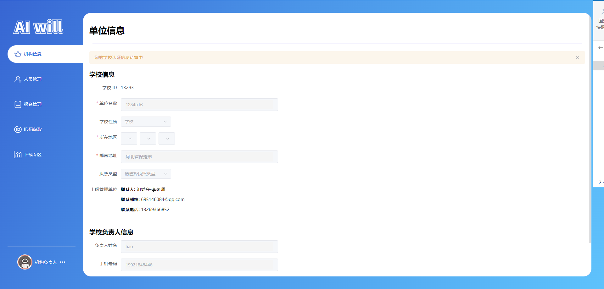
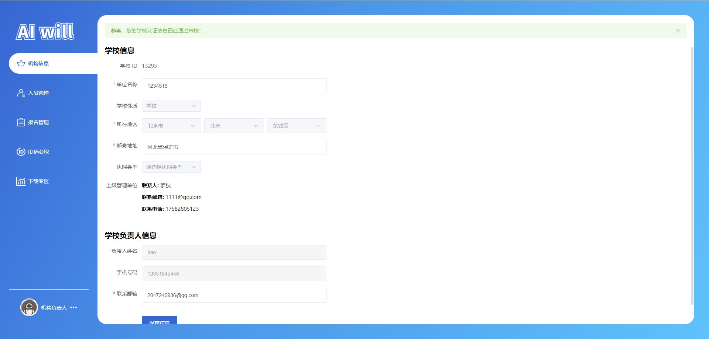
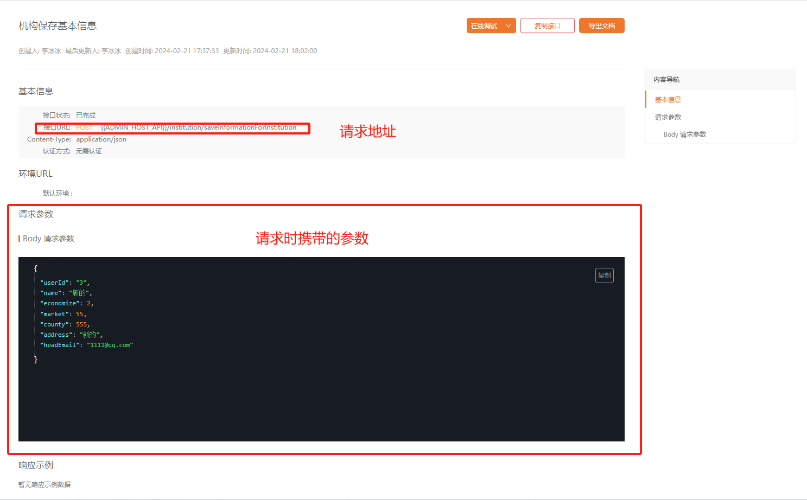
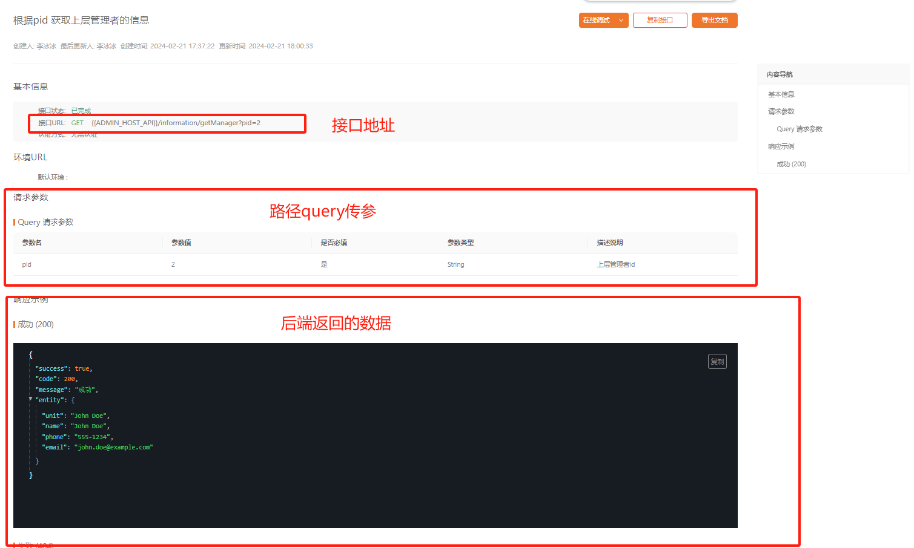
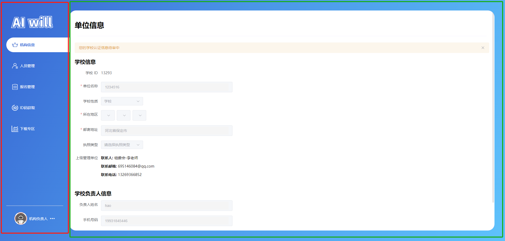
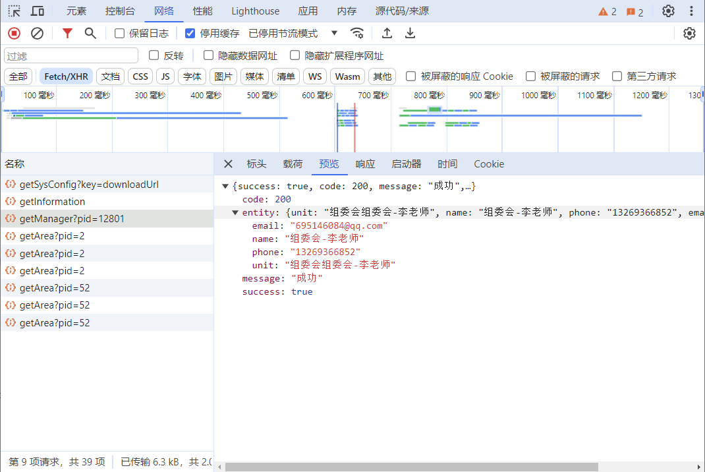
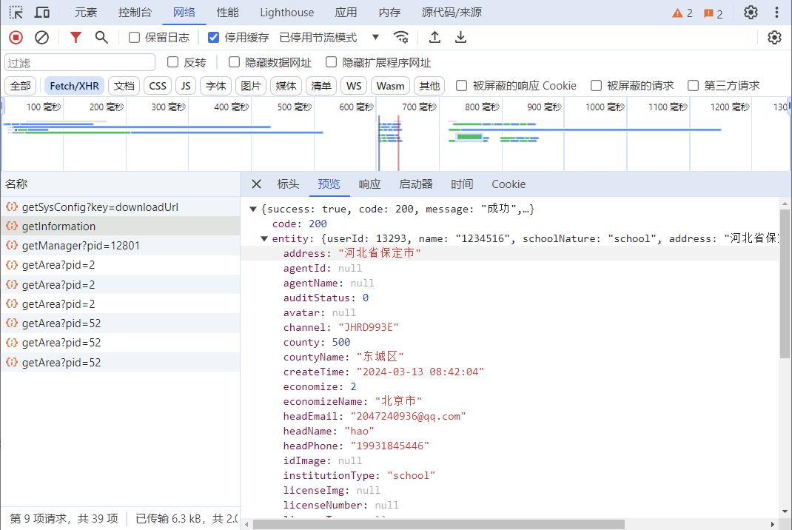
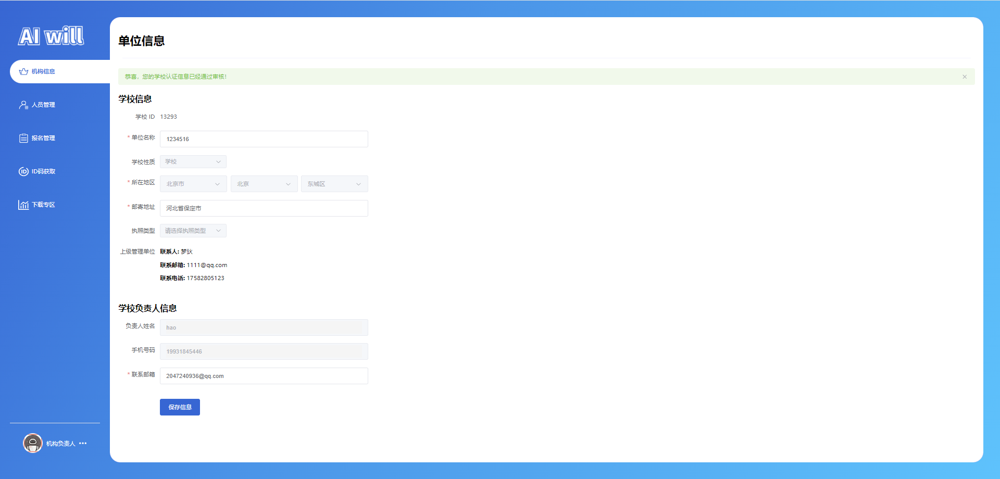

# 任务四、机构信息模块开发

## 任务描述

​	当前任务是开发一个机构信息模块，用于展示和管理组委会的基本信息。该模块将包括组委会的名称、所在地区、邮寄地址以及联系方式等。用户应能够通过这个模块查看和编辑这些信息。

## 任务效果

### 机构信息模块模块

​	注册成功以后你登录会是  **审核中** 状态，有些页面是无法进行操作的,需要你联系上级进行  **审核通过**

#### 审核状态说明

​	**审核中**：在此状态下，用户的账户信息等信息将被锁定，无法进行任何编辑。这意味着在组委会对用户的资料进行审核期间，用户不能更改或更新其个人资料、联系方式或其他相关信息。审核过程是为了保证所有参赛者的信息准确无误，并符合比赛的相关规定和要求。直到审核完成，用户的状态从“审核中”变为“审核成功”或其他最终状态，用户才能获得编辑权限。因此，在“审核中”期间，用户应等待组委会的审核结果，以确保其账户能够顺利过渡到下一个状态。



​	**审核成功**：用户的账户状态将由“审核中”转变为“审核成功”。这一状态变更是由上级管理机构，即组委会，负责执行的。用户在提交注册信息后，必须等待组委会对其账户进行审核。审核过程包括对用户提交的信息进行验证和确认，确保其符合参赛和使用平台的标准。一旦审核通过，此时用户将获得编辑个人资料和其他相关操作的权限。简而言之，审核成功是在组委会确认用户资格并批准其账户之后发生的。

## 学习目标

### 知识目标

- [ ] 熟悉pinia状态管理库，用于跨组件共享和管理状态。
- [ ] 理解并实现基于Vue Router的路由配置和页面导航。
- [ ] 掌握Vue.js框架的基本概念和使用方法，包括组件化、响应式数据绑定和指令。
- [ ] 掌握Element Plus UI库，以构建交互式的用户界面元素，如表单、输入框、选择框等。
- [ ] 掌握使用SCSS编写CSS样式，以定制组件的外观和布局。


### 能力目标

- [ ] 能够独立搭建和配置Vue.js项目的基础路由结构。
- [ ] 能够使用Element Plus组件库设计和实现用户友好的表单界面。
- [ ] 能够通过pinia管理组件状态，并实现数据的响应式更新。
- [ ] 能够编写和应用SCSS样式，以实现页面的视觉效果和响应式布局。
- [ ] 能够通过API与后端服务器进行数据交互，实现数据的获取和提交。

## 知识储备

### VUE3基本指令

#### 1.Mustache双大括号语法

- Mustache中不仅仅可以是data中的属性，也可以是一个JavaScript的表达式。

#### 2.v-once指令

- v-once用于指定元素或者组件只渲染一次：

- 当数据发生变化时，元素或者组件以及其所有的子元素将视为静态内容并且跳过；

#### 3.v-text指令

- 用于更新元素的 textContent（等价于{{}}）

#### 4.v-html指令

- 默认情况下，如果展示的内容本身是 html 的，那么vue并不会对其进行特殊的解析。

- 如果希望这个内容被Vue可以解析出来，那么可以使用 v-html 来展示；

#### 5. v-pre指令（不对{{}}内容进行解析）

- v-pre用于跳过元素和它的子元素的编译过程，显示原始的Mustache标签：

- 跳过不需要编译的节点，加快编译的速度；

#### 6.v-cloak指令

- 这个指令保持在元素上直到关联组件实例结束编译。

#### 7.v-bind指令

**绑定基本属性**

- v-bind用于绑定一个或多个属性值，或者向另一个组件传递props值

**绑定class对象语法**

- :class(v-bind:class的简写)一个对象，以动态地切换class。

**绑定class数组语法**

- 把一个数组传给:class，以应用一个class列表；

**动态绑定属性**

- 如果属性名称不是固定的，我们可以使用:[属性名]=“值”的格式来定义

**绑定一个对象**

- 如果我们希望将一个对象的所有属性，绑定到元素上的所有属性，我们可以直接使用v-bind绑定一个对象

#### 8.v-on指令：

参数传递：

在template中获取事件对象e，传递多个参数时，可以通过$event传入事件。

**v-on的修饰符**

| 修饰符      | 描述                                                      |
| ----------- | --------------------------------------------------------- |
| `.stop`     | 调用 `event.stopPropagation()` 阻止事件冒泡。             |
| `.prevent`  | 调用 `event.preventDefault()` 阻止默认事件行为。          |
| `.capture`  | 添加事件侦听器时使用捕获模式。                            |
| `.self`     | 只有当事件是从侦听器绑定的元素本身触发时才触发回调。      |
| `.keyAlias` | 仅当事件是从特定键触发时才触发回调。                      |
| `.once`     | 事件触发一次后自动移除侦听器。                            |
| `.left`     | 只有当点击鼠标左键时触发事件。                            |
| `.right`    | 只有当点击鼠标右键时触发事件。                            |
| `.middle`   | 只有当点击鼠标中键时触发事件。                            |
| `.passive`  | 以 `{ passive: true }` 模式添加侦听器，优化滚动事件处理。 |
| `.native`   | 监听组件根元素的原生事件。                                |


#### 9.条件渲染

- v-if、v-else、v-else-if用于根据条件来渲染某一块的内容
- v-show和v-if的区别：

- v-show时通过display属性来控制元素的显隐的

- v-if会直接销毁该元素


## 任务实施

### 子任务4-1 实现路由配置

​	实现路由配置模块主要是为了提高软件开发的效率、可维护性和灵活性。在现代的Web应用开发中，路由配置模块扮演着至关重要的角色。

#### 步骤一 机构信息路由配置

​	书写机构负责人路由配置的目的是为了确保Web应用程序能够根据机构负责人的特定需求和权限，高效、安全地管理和导航不同的路由路径，从而提高系统的可用性和管理效率：

> 代码如下：

```js
import { createRouter, createWebHashHistory, createWebHistory } from "vue-router";
// routes
const routes = [
    {
        redirect: "/home",
        path: "/"
    },
    // 首页
    {
        path: '/home',
        name: "home",
        component: () => import("@/view/home/index.vue")
    },
    // 管理页
    {
        path: '/manage',
        name: "manage",
        component: () => import("@/view/manage/index.vue"),
        children: [
            // ---------- 机构负责人 ----------
            // 机构菜单路由
            {
                path: 'organizationinfo',
                name: "manage-organizationinfo",
                component: () => import('@/view/manage/menusubassembly/organizationinfo.vue'),
                meta: {
                    index: "manage-organizationinfo",
                }
            },
        ]
    },
    // auth
    {
        path: '/auth',
        redirect: "/auth/login",
        component: () => import("@/view/auth/index.vue"),
        children: [
            // 登录
            {
                path: 'login',
                component: () => import("@/view/auth/login.vue")
            },
            // 注册
            {
                path: 'reg',
                component: () => import("@/view/auth/reg.vue")
            },
            // 忘记密码
            {
                path: 'forgetpassword',
                name: 'forgetpassword',
                component: () => import("@/view/auth/forgetpassword.vue")
            },
        ]
    },
]

// router
const router = createRouter({
    history: createWebHashHistory(),
    routes
});

export default router;
```

### 子任务4-2 实现接口编写

#### 步骤一 查看接口

​	接口通过接口文档来进行查看，查看地址在`任务一 -> 前言`；接口文档可以查看到接口的地址、接口的请求方式、请求需要携带的参数等等。





#### 步骤二 编写接口

> 文件路径：/src/manage/institution.js

`机构保存基本信息:  /institution/saveInformationForInstitution`

```js
import { request } from "@/utils/axios"

/**
 * 机构保存基本信息
 * saveInformationForInstitution
 */
export function SaveInformationForInstitutionApi(data) {
    return request(
        {
            url: "/institution/saveInformationForInstitution",
            method: "POST",
            data: data,
        }
    );
}
```

> 文件路径：/src/api/commin.js

`获取上级信息:  information/getManager`

`获取地区:  /information/getArea`

```js
import { request } from "@/utils/axios"

/**
 * 查询上级
 */

export function getManagerApi(pid = "") {
    return request(
        {
            url: 'information/getManager',
            method: "GET",
            data: {},
            params: {
                pid: pid
            },
        }
    );
}

/**
 * 获取地区 
 */
export function getAreaApi(pid = 1) {
  // 上任务已经引入，此处省略...
}
```

> 文件路径：/src/api/user.js

`修改密码:  /user/updatePassword`

```js
import { request } from "@/utils/axios"

/**
 * 修改密码
 */
export function UpdatePasswordApi(data) {
    return request(
        {
            url: "/user/updatePassword",
            method: "PUT",
            data: data
        }
    );
}
```

> 文件路径：/src/api/manage/index.js

`查询指定key的配置内容:  /user/updatePassword`

`修改指定配置:  organizing/updateSysConfig`

```js
import { request } from "@/utils/axios"

/**
 * 查询指定key的配置内容
 */
export function getSysConfig() {
    return request(
        {
            url: `information/getSysConfig?key=downloadUrl`,
            method: "GET",
            data: {}
        }
    );
}
/**
 * 修改指定配置
 */
export function updateSysConfig(data) {
    return request(
        {
            url: `organizing/updateSysConfig`,
            method: "PUT",
            data
        }
    );
}

```

### 子任务4-3 实现组件编写

#### 1.用户状态管理

> 文件路径：/src/store/user

代码如下：

```js
/**
* 代码上任务已书写，此处省略...
*/
```

#### 2.省份选择组件

​	编写这个省份选择组件的目的是为了提供一个用户友好的方式来选择和输入所在地区信息，包括省、市和区/县。通过使用Element UI的下拉选择框和空间分隔组件，结合Vue的响应式数据绑定和事件处理，这个组件允许用户通过简单的点击和选择来设置他们的位置信息。组件的设计支持三级联动，可以根据用户选择的省自动加载相应的市和区/县选项，从而简化了用户的操作流程，并提高了表单填写的效率和准确性。

> 文件路径：/src/components/province-select/index.vue

代码如下：

```vue
<template>
  <!-- 使用 Element Plus 的空间分隔组件（el-space）来排列选择框 -->
  <el-space style="width: 100%">
    <!-- 第一级下拉选择框：所在省 -->
    <el-select
      :class="{ 'w-input': isW }"
      clearable
      v-model="area_data.value[0]"
      placeholder="所在省"
      size="large"
      @change="
        (value) => {
          handleValueChange(value, 0);
        }
      "
      @clear="
        (value) => {
          handleValueClear(value, 0);
        }
      "
      :disabled="disabled"
    >
      <!-- 循环渲染第一级选项 -->
      <el-option
        v-for="item in list_1"
        :key="item.districtId"
        :label="item.district"
        :value="item.districtId"
      />
    </el-select>
    <!-- 第二级下拉选择框：所在市 -->
    <el-select
      :class="{ 'w-input': isW }"
      clearable
      v-model="area_data.value[1]"
      placeholder="所在市"
      size="large"
      v-if="props.showMarket"
      :disabled="!area_data.value[0] || disabled"
      @change="
        (value) => {
          handleValueChange(value, 1);
        }
      "
      @clear="
        (value) => {
          handleValueClear(value, 0);
        } // 清空时的事件处理
      "
    >
      <!-- 循环渲染第二级选项 -->
      <el-option
        v-for="item in area_data.data[1]"
        :key="item.districtId"
        :label="item.district"
        :value="item.districtId"
      />
    </el-select>
    <!-- 第三级下拉选择框：所在区/县 -->
    <el-select
      :class="{ 'w-input': isW }"
      clearable
      v-model="area_data.value[2]"
      placeholder="所在区/县"
      size="large"
      :disabled="!area_data.value[1] || disabled"
      @change="
        (value) => {
          handleValueChange(value, 2);
        }
      "
      @clear="
        (value) => {
          handleValueClear(value, 0);
        }
      "
      v-if="props.showCounty"
    >
      <!-- 循环渲染第三级选项 -->
      <el-option
        v-for="item in area_data.data[2]"
        :key="item.districtId"
        :label="item.district"
        :value="item.districtId"
      /> </el-select
  ></el-space>
</template>

<script setup>
import { computed, onMounted, ref, watch } from "vue";
import { getAreaApi } from "@/api/common"; //导入获取地区数据的API
//定义组件接收的props
const props = defineProps({
  economize: {
    default: "",
    type: String,
  },
  market: "",
  county: "",
  showMarket: {
    default: true,
    type: Boolean,
  },
  showCounty: {
    default: false,
    type: Boolean,
  },
  disabled: {
    default: false,
    type: Boolean,
  },
  isW: {
    default: false,
    type: Boolean,
  },
  addChina: {
    default: false,
    type: Boolean,
  },
});
const emit = defineEmits([
  "update:economize",
  "update:market",
  "update:county",
]);
const area_data = ref({
  value: ["", "", ""],
  data: [[], [], []],
  map: {},
});
/**
 * 获取lv1
 */
const handleGetArea = async (pid, index = 0) => {
  let entityList = [];
  const area_data_map = localStorage.getItem("area_data_map") ?? null;

  if (area_data.value.map[pid]) {
    entityList = area_data.value.map[pid];
  } else {
    let bool = false;
    if (area_data_map) {
      try {
        if (JSON.parse(area_data_map)[pid]) {
          entityList = JSON.parse(area_data_map)[pid];
          bool = true;
        }
      } catch (error) {
        bool = false;
      }
    }
    if (!bool) {
      let res = await getAreaApi(pid);
      if (res.success) {
        entityList = res.entityList;
      }
    }
  }
  area_data.value.data[index] = entityList;
  area_data.value.map[pid] = entityList;
  localStorage.setItem("area_data_map", JSON.stringify(area_data.value.map));
};

//初始化地区数据的函数
const handleInit = async () => {
  await handleGetArea(1, 0);
  if (props.economize && props.market && props.county) {
    await handleGetArea(props.economize, 1);
    await handleGetArea(props.market, 2);
    const economize = area_data.value.data[0].find(
      (item) => item.districtId == String(props.economize)
    )
      ? props.economize
      : "";
    const market = area_data.value.data[1].find(
      (item) => item.districtId == String(props.market)
    )
      ? props.market
      : "";
    const county = area_data.value.data[2].find(
      (item) => item.districtId == String(props.county)
    )
      ? props.county
      : "";
    area_data.value.value = [economize, market, county];
  } else if (props.economize && props.market) {
    await handleGetArea(props.economize, 1);
    area_data.value.value = [props.economize, props.market, ""];
  } else if (props.economize) {
    await handleGetArea(props.economize, 1);
    area_data.value.value = [props.economize, "", ""];
  } else if (!props.economize && !props.market && !props.county) {
    area_data.value.value = ["", "", ""];
  }
};
// 监听props变化，重新初始化地区数据
watch(
  () => props.economize,
  () => {
    handleInit();
  }
);
watch(
  () => props.market,
  () => {
    handleInit();
  }
);
watch(
  () => props.county,
  () => {
    handleInit();
  }
);

// 处理值变化的函数
const handleValueChange = (value, index) => {
  if (index == 0) {
    area_data.value.value[1] = "";
    area_data.value.value[2] = "";
    handleGetArea(value, 1);
  } else if (index == 1) {
    area_data.value.value[2] = "";
    handleGetArea(value, 2);
    if (!props.showCounty) {
      //   handleChange("economize", 0);
      //   handleChange("market", 1);
    }
  } else if (index == 2) {
    // handleChange("economize", 0);
    // handleChange("market", 1);
    // handleChange("county", 2);
  }
  handleChange("economize", 0);
  handleChange("market", 1);
  handleChange("county", 2);
};

// 处理值清空的函数
const handleValueClear = (value, index) => {
  if (index == 0) {
    area_data.value.value[0] = "";
    area_data.value.value[1] = "";
    area_data.value.value[2] = "";
    handleChange("economize", 0);
    handleChange("market", 1);
    handleChange("county", 2);
  } else if (index == 1) {
    area_data.value.value[1] = "";
    area_data.value.value[2] = "";
    handleChange("market", 1);
    handleChange("county", 2);
  } else if (index == 2) {
    area_data.value.value[2] = "";
    handleChange("county", 2);
  }
};

//处理值变化并触发emit的函数
const handleChange = (key = "economize", index = 0) => {
  let values = area_data.value.value;
  emit("update:" + key, values[index]);
};

// 计算属性，用于获取第一级选项列表
const list_1 = computed(() => {
  let arr = [];
  if (props.addChina) {
    arr.push({
      districtId: 1,
      district: "中国",
    });
  }
  arr.push(...area_data.value.data[0]);
  return arr;
});

// 组件挂载后执行的函数
onMounted(() => {
  handleInit();
});
</script>

<style lang="scss" scoped>
.w-input {
  width: 120px;

  :deep(.el-input) {
    width: 120px;
  }

  .el-input-number {
    width: 120px;
  }
}
</style>
```

### 子任务4-2 实现页面搭建

#### 步骤一 修改App.vue

​	此步骤，是为了设置和提供Vue应用中的全局配置以及语言环境，确保应用的用户界面和交互行为符合预期的配置和本地化需求。通过使用`<script setup>`语法糖和`reactive`函数创建响应式配置对象`config`，可以轻松地管理和更新应用的配置项，如自动插入空格的设置。此外，通过添加内边距样式到页面容器，确保页面内容的显示不会被浏览器的顶部遮挡，提升了页面的可用性和美观性。

> 文件路径：/src/App.vue

代码如下：

```vue
<script setup>
// 导入Vue的reactive函数，用于创建响应式对象
import { reactive } from "vue";
// 导入Element Plus的中文语言包，用于国际化
import zhCn from "element-plus/dist/locale/zh-cn.mjs";
// 使用reactive创建一个响应式配置对象config
const config = reactive({
  autoInsertSpace: true, // 配置项，自动插入空格
});
</script>

<template>
  <!-- 使用Element Plus的el-config-provider组件来提供全局配置和语言环境 -->
  <el-config-provider :button="config" :locale="zhCn">
    <!-- router-view组件用于展示当前路由匹配到的组件内容 -->
    <router-view> </router-view>
  </el-config-provider>
</template>

<style>
/* 为页面容器添加内边距，确保内容不会被顶部遮挡 */
.page-container {
  padding: 20px;
  box-sizing: border-box; 
  padding-top: 36px !important; 
}
</style>
```

#### 步骤二 机构负责人页面搭建

​	此步骤，是为了构建一个具有侧边导航栏和用户信息模块的管理系统界面，使用Element Plus组件库和Vue的响应式系统来实现一个动态且易于交互的布局。通过左侧的导航栏，用户可以方便地在不同的管理功能模块间切换，而用户信息模块则提供了快速访问个人设置和退出登录的功能。这样的布局设计旨在提高用户操作的便捷性和效率，同时保持界面的清晰和专业。

##### 1.页面效果



##### 2.侧边栏搭建

1. 在view中创建manage文件
2. 在manage文件中创建index.vue的文件
3. 在manage文件中创建components的文件夹
4. 在components的文件夹中创建 `menu.vue` 文件

> 文件路径：/src/view/manage/components/menu.vue

代码如下：

```vue
<template>
  <!-- 侧边栏容器 -->
  <div class="menu-contaienr">
    <!-- logo -->
    <div class="menu_logo">
      
    </div>
    <!-- 侧边栏滚动容器 -->
    <el-scrollbar class="menu-scrollbar-container">
      <div class="menu-container-box" v-if="default_active">
        <!-- 菜单列表 -->
        <el-menu :default-active="default_active" @select="handleMenuSelect">
          <el-menu-item
            v-for="item in menu_list"
            :index="item.index"
            :key="item.index"
          >
            <div class="mange">
              <div class="mange_icon">
                
              </div>
              <span>{{ item.label }}</span>
            </div>
          </el-menu-item>
        </el-menu>
      </div>
    </el-scrollbar>
    <!-- 用户信息部分 -->
    <div class="user-info-container">
      <el-divider></el-divider>
      <div class="user-info">
        <el-avatar src="/avatar.png" :size="48"></el-avatar>
        <el-text>{{ username }}</el-text>
        <!-- 用户操作下拉菜单 -->
        <el-dropdown trigger="click" @command="handleCommand" placement="top">
          <el-icon color="white" size="20">
            <MoreFilled />
          </el-icon>
          <template #dropdown>
            <el-dropdown-menu>
              <el-dropdown-item command="update-password"
                >修改密码</el-dropdown-item
              >
              <el-dropdown-item command="exit">退出登录</el-dropdown-item>
            </el-dropdown-menu>
          </template>
        </el-dropdown>
      </div>
    </div>
  </div>
  <!-- 修改密码模态框 -->
  <el-dialog
    v-model="update_password_modal.show"
    title="修改密码"
    width="524px"
  >
    <el-form
      label-width="132px"
      ref="update_password_modal_data_ref"
      :rules="update_password_modal.rules"
      :model="update_password_modal.form_data"
    >
      <el-form-item label="新密码" prop="password">
        <el-input
          v-model="update_password_modal.form_data.password"
          type="password"
          size="large"
          placeholder="请输入新密码"
        />
      </el-form-item>
      <el-form-item label="再次输入新密码" prop="password2">
        <el-input
          v-model="update_password_modal.form_data.password2"
          type="password"
          size="large"
          placeholder="再次输入新密码"
        />
      </el-form-item>
      <el-form-item>
        <el-button
          type="primary"
          size="large"
          style="width: 120px"
          @click="handleUpdatePasword"
          >修改密码</el-button
        >
        <el-button size="large" @click="update_password_modal.show = false"
          >取消</el-button
        >
      </el-form-item>
    </el-form>
  </el-dialog>

</template>

<script  setup>
import { useUserStore } from "@/store/user";
import { useRoute, useRouter } from "vue-router";
import { onMounted, ref, computed } from "vue";
import { UpdatePasswordApi } from "@/api/user";
import { ElMessage } from "element-plus";
// 图片资源导入
import o1 from "@/assets/images/Manage/organ1.png";
import o2 from "@/assets/images/Manage/organ2.png";
import o3 from "@/assets/images/Manage/organ3.png";
import o4 from "@/assets/images/Manage/organ4.png";
import o5 from "@/assets/images/Manage/organ5.png";
import o6 from "@/assets/images/Manage/organ6.png";
import o7 from "@/assets/images/Manage/organ7.png";
import o8 from "@/assets/images/Manage/organ8.png";
import o1_active1 from "@/assets/images/Manage/organ1_active.png";
import o1_active2 from "@/assets/images/Manage/organ2_active.png";
import o1_active3 from "@/assets/images/Manage/organ3_active.png";
import o1_active4 from "@/assets/images/Manage/organ4_active.png";
import o1_active5 from "@/assets/images/Manage/organ5_active.png";
import o1_active6 from "@/assets/images/Manage/organ6_active.png";
import o1_active7 from "@/assets/images/Manage/organ7_active.png";
import o1_active8 from "@/assets/images/Manage/organ8_active.png";
const route = useRoute();
const router = useRouter();
const userStore = useUserStore();
const default_active = ref("");

// 侧边栏菜单列表
// 1级
const organizing = ref([
  {
    src: o1,
    src_active: o1_active1,
    index: "manage-organizingmation",
    label: "总负责人信息",
  },
  {
    src: o2,
    src_active: o1_active2,
    index: "manage-agentmanagement",
    label: "组委会管理",
  },
  {
    src: o4,
    src_active: o1_active4,
    index: "manage-fenzugroupmanagement",
    label: "分组管理",
  },
  {
    src: o4,
    src_active: o1_active4,
    index: "manage-event_type",
    label: "赛项类型管理",
  },
  // event_type
  {
    src: o3,
    src_active: o1_active3,
    index: "manage-organtionmanagement",
    label: "机构管理",
  },
  {
    src: o8,
    src_active: o1_active8,
    index: "manage-registrationmanagement",
    label: "报名管理",
  },
  {
    src: o5,
    src_active: o1_active5,
    index: "manage-personnelmanagement",
    label: "人员管理",
  },
  {
    src: o6,
    src_active: o1_active6,
    index: "manage-cansaientryreview",
    label: "参赛审核",
  },
  {
    src: o7,
    src_active: o1_active7,
    index: "manage-tongjistatements",
    label: "统计与报表",
  },
  {
    src: o7,
    src_active: o1_active7,
    index: "download",
    label: "下载专区",
    type: "modal",
  },
]);
// 2级
const agent = ref([
  {
    src: o1,
    src_active: o1_active1,
    index: "manage-committee",
    label: "组委会信息",
  },
  {
    src: o2,
    src_active: o1_active2,
    index: "manage-agents",
    label: "机构管理",
  },
  {
    src: o6,
    src_active: o1_active6,
    index: "manage-organization",
    label: "参赛审核",
  },
  {
    src: o7,
    src_active: o1_active7,
    index: "manage-statisticstements",
    label: "统计与报表",
  },
  {
    src: o8,
    src_active: o1_active8,
    index: "manage-IDCodeAcquisition",
    label: "ID码获取",
  },
  {
    src: o7,
    src_active: o1_active7,
    index: "download",
    label: "下载专区",
    type: "modal",
  },
]);
// 3级
const institution = ref([
  {
    src: o1,
    src_active: o1_active1,
    index: "manage-organizationinfo",
    label: "机构信息",
  },
  {
    src: o5,
    src_active: o1_active5,
    index: "manage-personnel",
    label: "人员管理",
  },
  {
    src: o4,
    src_active: o1_active4,
    index: "manage-registration",
    label: "报名管理",
  },
  {
    src: o8,
    src_active: o1_active8,
    index: "manage-IDCodeAcquisition",
    label: "ID码获取",
  },
  {
    src: o7,
    src_active: o1_active7,
    index: "download",
    label: "下载专区",
    type: "modal",
  },

  // { src: o8, src_active: o1_active8, index: 'manage-idassistant', label: "ID码助手" },
]);
const tecRouter = ref([
  { src: o1, src_active: o1_active1, index: "tecinfo", label: "老师信息" },
  { src: o1, src_active: o1_active1, index: "wait_list", label: "待批阅列表" },
]);
// 权限计算属性
const menu_list = computed(() => {
  if (userStore.info_data.role == "organizing") {
    return organizing.value;
  } else if (userStore.info_data.role == "agent") {
    return agent.value;
  } else if (userStore.info_data.role == "institution") {
    return institution.value;
  } else if (userStore.info_data.role == "tec") {
    return tecRouter.value;
  }
});
// 修改密码模态框状态
const update_password_modal_data_ref = ref();
const checkPassword2 = (rule, value, callback) => {
  if (!value) {
    callback(new Error("请输入密码"));
  }

  if (value == update_password_modal.value.form_data.password) {
    callback();
  } else {
    callback(new Error("两次密码不一致"));
  }
};

const update_password_modal = ref({
  show: false,
  form_data: {
    password: "",
    password2: "",
  },
  rules: {
    password: [
      {
        type: "string",
        required: true,
        message: "请输入密码",
        trigger: "blur",
      },
    ],
    password2: [
      {
        type: "string",
        required: true,
        validator: checkPassword2,
        trigger: "blur",
      },
    ],
  },
});
const handleCommand = (command) => {
  if (command == "update-password") {
    update_password_modal.value.show = true;
  } else if (command == "exit") {
    userStore.handleExit();
    router.push({
      path: "/auth/login",
    });
  }
};
// 用户名计算属性
const username = computed(() => {
  if (userStore.info_data.role == "organizing") {
    return "总负责人";
  } else if (userStore.info_data.role == "agent") {
    return "组委会负责人";
  } else if (userStore.info_data.role == "institution") {
    return "机构负责人";
  } else if (userStore.info_data.role == "tec") {
    return "老师";
  }
});

// 修改密码
const handleUpdatePasword = () => {
  update_password_modal_data_ref.value.validate(async (r) => {
    if (!r) {
      return;
    }
    let res = await UpdatePasswordApi({
      password: update_password_modal.value.form_data.password,
    });
    if (res.success) {
      ElMessage.success(res.message);
      handleCommand("exit");
    } else {
      ElMessage.error(res.message);
    }
  });
};
/**
 * 菜单选择
 */
const handleMenuSelect = (index) => {
  let find = menu_list.value.find((item) => item.index == index);
  if (find) {
    default_active.value = index;
    router.push({
      name: index,
    });
  }
};
// 组件挂载后执行的逻辑
onMounted(() => {
  if (route.fullPath == "/manage") {
    // 默认三个级别的首次打开
    const map = {
      organizing: "manage-organizingmation",
      agent: "manage-committee",
      institution: "manage-organizationinfo",
      tec: "tecinfo",
    };
    router.push({
      name: map[userStore.info_data.role],
    });
    default_active.value = map[userStore.info_data.role];
  } else {
    default_active.value = route.meta.index;
  }
});
</script>

<style lang="scss" scoped>
.menu-contaienr {
  width: 100%;
  height: 100%;
  // background-image: -webkit-linear-gradient(0deg, #5d5cf8 0, #5754e4 100%);
  // padding-top: 20px;
  box-sizing: border-box;
  display: flex;
  flex-direction: column;

  .el-menu {
    background-color: #ffffff00;
    border-right: solid 0px #e6e6e6;
  }

  .el-menu-item.is-active {
    font-weight: bold;
    color: #05c3de;
    background: #8473f71f;
  }

  .el-menu-item {
    display: flex !important;
    align-items: center !important;
    color: #fff;
    border-radius: 30px 0 0 30px;

    &:hover {
      outline: 0;
      background-color: #0000000d;
      border-radius: 30px 0 0 30px;
    }

    .mange {
      display: flex;
      align-items: center;
      justify-content: center;

      .mange_icon {
        width: 32px;
        height: 32px;
        display: block;
        display: flex;
        align-items: center;

        .icon {
          width: 80%;
          height: 75%;
          color: red;
        }
      }
    }
  }

  .is-active {
    font-size: 22px !important;
    font-weight: 500;
    text-align: center;
    letter-spacing: 0px;
    color: #1e76de !important;
    background-color: #fff !important;
    border-radius: 30px 0 0 30px;
  }

  .menu_logo {
    box-sizing: border-box;
    display: flex;
    // justify-content: center;
    padding: 16px 0 0 18px;

    img {
      height: 55px;
      width: 160px;
    }
  }

  .menu-scrollbar-container {
    height: calc(100% - 64px - 120px);
  }

  .menu-container-box {
    padding-top: 32px;
  }

  .user-info-container {
    box-sizing: border-box;
    padding-right: 24px;
    height: 120px;
    display: flex;
    flex-direction: column;

    .user-info {
      display: flex;
      align-items: center;
      justify-content: center;

      .el-text {
        padding: 0 8px;
        color: white;
      }

      .el-icon {
        cursor: pointer;
      }
    }
  }

  .el-menu-item {
    margin-bottom: 24px;
  }

  .el-menu-item:last-child {
    margin-bottom: 0px;
  }

  .el-menu-item * {
    vertical-align: baseline;
  }
}

span {
  font-size: 14px;
}
</style>
```

##### 3.组委会信息页面搭建

​	在上文中，我们已经实现了侧边导航栏的搭建工作，本页面的目标是构建一个组委会信息管理页面，这个组件是一个用于管理和编辑机构信息的界面，它允许用户查看、输入和更新机构的详细信息。组件使用了Vue.js框架和Element Plus UI库来构建交互式表单，并利用pinia进行状态管理。通过调用后端API，组件实现了数据的获取和提交功能。这样的设计旨在提供一个用户友好且功能全面的管理界面，同时确保数据处理的准确性和效率。

- 使用Vue的响应式引用（`ref`）和pinia状态管理库来跟踪和管理组件状态，如机构信息和用户登录状态
- 使用`<el-form>`、`<el-input>`和`<el-select>`等Element Plus组件创建表单，查看用户信息

> 文件路径：/src/view/manage/organizationinfo.vue

代码如下：

```vue
<template>
  <!-- 单位信息页面的容器 -->
  <div class="header_information page-container">
    <!-- 头部 -->
    <el-row class="header_name">
      <el-col :span="24" class="header_text">
        <h1>单位信息</h1>
      </el-col>
      <el-col :span="24">
        <div class="header_line"></div>
      </el-col>
    </el-row>
    <!-- 根据审核状态显示不同的提示信息 -->
    <div class="el_alert">
      <el-alert
        title="恭喜，您的学校认证信息已经通过审核！"
        type="success"
        v-if="i_data.auditStatus == 1"
      />
      <el-alert
        title="您的学校认证信息待审中"
        type="warning"
        v-if="i_data.auditStatus == 0"
      />
      <el-alert
        title="您的学校认证信息审核拒绝，可修改信息后点击重新提交按钮，再次提交审核。"
        type="error"
        :closable="false"
        v-if="i_data.auditStatus == 2"
      />
    </div>
    <!-- 表格内容区域 -->
    <el-row>
      <!-- 组委会信息 -->
      <el-col :span="24">
        <h3 class="contnet_text">学校信息</h3>
        <!-- 学校信息表单 -->
        <el-form
          label-width="100px"
          v-if="i_data"
          ref="i_data_ref"
          :model="i_data"
          :rules="i_data_rules"
        >
          <el-form-item label="学校 ID">
            <span class="not_inp">{{ i_data.userId }}</span>
            <!-- 显示数据 -->
          </el-form-item>

          <el-form-item label="单位名称" prop="name">
            <el-input
              v-model="i_data.name"
              placeholder="请填写单位名称"
              class="content_input"
              :disabled="i_data.auditStatus == 0"
              v-model.trim="inputValueTrim"
            />
          </el-form-item>
          <el-form-item label="学校性质">
            <div class="select_region">
              <el-select
                placeholder="请选择单位性质"
                clearable
                class="content_select"
                disabled
                v-model="i_data.schoolNature"
              >
                <el-option
                  v-for="item in type_data"
                  :key="item.value"
                  :value="item.value"
                  :label="item.label"
                ></el-option>
              </el-select>
            </div>
          </el-form-item>

          <el-form-item label="所在地区" prop="county">
            <div class="select_region">
              <ProvinceSelect
                v-model:economize="i_data.economize"
                v-model:market="i_data.market"
                v-model:county="i_data.county"
                :showCounty="true"
                :disabled="i_data.auditStatus != 2"
              />
            </div>
          </el-form-item>

          <div class="select_region">
            <el-form-item label="邮寄地址" prop="address">
              <el-input
                v-model="i_data.address"
                placeholder="请填写机构邮寄地址"
                class="content_input"
                v-model.trim="inputValueTrim"
                :disabled="i_data.auditStatus == 0"
              />
            </el-form-item>
          </div>
          <!-- TODO 信息闭环 -->
          <el-form-item label="执照类型">
            <div class="select_region">
              <el-select
                :value="i_data.licenseType"
                placeholder="请选择执照类型"
                clearable
                class="content_select"
                disabled
                ><el-option
                  v-for="item in license_type_options"
                  :key="item.value"
                  :label="item.label"
                  :value="item.value"
                />
              </el-select>
            </div>
          </el-form-item>
          <div class="select_region" v-if="false">
            <el-form-item label="执照号码">
              <el-input
                placeholder="请输入单位执照号码"
                class="content_input"
                disabled
                :value="i_data.licenseNumber"
              />
            </el-form-item>
          </div>
          <div class="select_region">
            <!-- 查询上级 -->
            <el-form-item label="上级管理单位">
              <div class="el_form_content_text">
                <div class="content_text_relation">
                  <!-- <p>{{p_data.unit}}</p> -->
                </div>
                <div class="content_text_relation">
                  <span class="content_text_contacts">联系人: </span><i></i>
                  <span>{{ p_data.name }}</span>
                </div>
                <div class="content_text_relation">
                  <span class="content_text_contacts">联系邮箱: </span><i></i>
                  <span>{{ p_data.email }}</span>
                </div>
                <div class="content_text_relation">
                  <span class="content_text_contacts">联系电话: </span
                  ><span>{{ p_data.phone }}</span>
                </div>
              </div>
            </el-form-item>
          </div>
        </el-form>
      </el-col>
      <!-- 联系方式 -->
      <el-col :span="24">
        <h3 class="contnet_text">学校负责人信息</h3>
        <el-form
          label-width="100px"
          :model="i_data"
          :rules="head_data_rules"
          ref="head_data_ref"
        >
          <el-form-item label="负责人姓名">
            <el-input
              placeholder="请输入负责人姓名"
              class="content_input"
              disabled
              :value="i_data.headName"
            />
          </el-form-item>

          <el-form-item label="手机号码">
            <el-input
              placeholder="请输入单位负责人手机号码"
              class="content_input"
              disabled
              :value="i_data.headPhone"
            />
          </el-form-item>

          <el-form-item label="联系邮箱" prop="headEmail">
            <el-input
              placeholder="请输入单位负责人联系邮箱"
              class="content_input"
              :disabled="i_data.auditStatus == 0"
              v-model="i_data.headEmail"
            />
          </el-form-item>
          <el-form-item>
            <el-button
              type="primary"
              size="large"
              @click="handleSaveInformationForInstitution"
              v-if="i_data.auditStatus == 2"
              color="#1964d6"
              >重新提交</el-button
            >
          </el-form-item>
          <el-form-item>
            <el-button
              type="primary"
              size="large"
              @click="handleSaveInformationForInstitution"
              v-if="i_data.auditStatus == 1"
              color="#1964d6"
              >保存信息</el-button
            >
          </el-form-item>
        </el-form>
      </el-col>
    </el-row>
  </div>
</template>

<script  setup>
import { ref, onMounted } from "vue"; // 导入Vue的响应式引用和生命周期钩子
import { useUserStore } from "@/store/user"; // 导入用户状态管理
import ProvinceSelect from "@/components/province-select/index.vue"; // 导入省份选择组件
// 定义学校性质的选项
const type_data = [
  {
    label: "学校",
    value: "school",
  },
  {
    label: "机构",
    value: "institution",
  },
  {
    label: "团队",
    value: "team",
  },
  {
    label: "其他",
    value: "other",
  },
];
const license_type_options = [
  {
    label: "团队",
    value: "team",
  },
  {
    label: "其他",
    value: "other",
  },
];
// 定义存储上级管理单位信息的响应式引用
const p_data = ref({});
// 定义存储机构信息的响应式引用
const i_data = ref({});
// 组件挂载后执行的操作
onMounted(async () => {
  
});
</script>    
<style lang="scss" scoped>
.header_information {
  .header_name {
    margin-left: 10px;
    margin-right: 10px;

    .header_text {
      margin-left: -10px;
      margin-right: -10px;
    }

    h1 {
      font-size: 28px;
    }
  }

  .el_alert {
    margin-bottom: 20px;
  }

  .header_line {
    display: block;
    height: 1px;
    width: 100%;
    margin: 24px 0;
    background-color: #8473f717;
  }

  .contnet_text {
    margin-bottom: 14px;
    font-size: 20px;
    font-weight: 700;
  }

  .not_inp {
    color: #606266;
    font-size: 14px;
  }

  .content_input {
    width: 500px;
  }

  .input_border {
    display: none;
  }

  :deep(.el-input__wrapper) {
    padding: 0 15px;
  }

  :deep(.el-input.is-disabled) .el-input__inner {
    background-color: #f5f5f5;
  }

  .select_region {
    width: 500px;
    display: flex;
    justify-content: space-between;

    .el_form_content_text {
      width: 500px;
      height: 120px;
      display: flex;
      flex-direction: column;
      justify-content: flex-start;

      p {
        font-size: 14px;
        color: #202020;
      }

      .content_text_relation {
        font-size: 14px;

        .content_text_contacts {
          color: #000;
          font-weight: bold;
        }

        span {
          color: #202020;
          font-size: 14px;
        }
      }
    }
  }

  :deep(.el-input) {
    height: 40px;
  }

  .content_select {
    width: 160px;
  }
  :deep .el-space__item {
    flex: 1;
  }
}
</style>
    
```

##### 4.实现机构模块内容编写

> 文件路径：/src/view/manage/menusubassembly/organizationinfo.vue

代码如下：

```vue
<template>
  <!-- 机构信息页面的容器 -->
  <div class="header_information page-container">
    <!-- 头部 -->
    <el-row class="header_name">
      <el-col :span="24" class="header_text">
        <h1>单位信息</h1>
      </el-col>
      <el-col :span="24">
        <div class="header_line"></div>
      </el-col>
    </el-row>
    <!-- 根据审核状态显示不同的提示信息 -->
    <div class="el_alert">
      <el-alert
        title="恭喜，您的学校认证信息已经通过审核！"
        type="success"
        v-if="i_data.auditStatus == 1"
      />
      <el-alert
        title="您的学校认证信息待审中"
        type="warning"
        v-if="i_data.auditStatus == 0"
      />
      <el-alert
        title="您的学校认证信息审核拒绝，可修改信息后点击重新提交按钮，再次提交审核。"
        type="error"
        :closable="false"
        v-if="i_data.auditStatus == 2"
      />
    </div>
    <!-- 表格内容区域 -->
    <el-row>
      <!-- 组委会信息 -->
      <el-col :span="24">
        <h3 class="contnet_text">学校信息</h3>
        <!-- 学校信息表单 -->
        <el-form
          label-width="100px"
          v-if="i_data"
          ref="i_data_ref"
          :model="i_data"
          :rules="i_data_rules"
        >
          <el-form-item label="学校 ID">
            <span class="not_inp">{{ i_data.userId }}</span>
            <!-- 显示数据 -->
          </el-form-item>

          <el-form-item label="单位名称" prop="name">
            <el-input
              v-model="i_data.name"
              placeholder="请填写单位名称"
              class="content_input"
              :disabled="i_data.auditStatus == 0"
              v-model.trim="inputValueTrim"
            />
          </el-form-item>
          <el-form-item label="学校性质">
            <div class="select_region">
              <el-select
                placeholder="请选择单位性质"
                clearable
                class="content_select"
                disabled
                v-model="i_data.schoolNature"
              >
                <el-option
                  v-for="item in type_data"
                  :key="item.value"
                  :value="item.value"
                  :label="item.label"
                ></el-option>
              </el-select>
            </div>
          </el-form-item>

          <el-form-item label="所在地区" prop="county">
            <div class="select_region">
              <ProvinceSelect
                v-model:economize="i_data.economize"
                v-model:market="i_data.market"
                v-model:county="i_data.county"
                :showCounty="true"
                :disabled="i_data.auditStatus != 2"
              />
            </div>
          </el-form-item>

          <div class="select_region">
            <el-form-item label="邮寄地址" prop="address">
              <el-input
                v-model="i_data.address"
                placeholder="请填写机构邮寄地址"
                class="content_input"
                v-model.trim="inputValueTrim"
                :disabled="i_data.auditStatus == 0"
              />
            </el-form-item>
          </div>
          <!-- TODO 信息闭环 -->
          <el-form-item label="执照类型">
            <div class="select_region">
              <el-select
                :value="i_data.licenseType"
                placeholder="请选择执照类型"
                clearable
                class="content_select"
                disabled
                ><el-option
                  v-for="item in license_type_options"
                  :key="item.value"
                  :label="item.label"
                  :value="item.value"
                />
              </el-select>
            </div>
          </el-form-item>
          <div class="select_region" v-if="false">
            <el-form-item label="执照号码">
              <el-input
                placeholder="请输入单位执照号码"
                class="content_input"
                disabled
                :value="i_data.licenseNumber"
              />
            </el-form-item>
          </div>
          <div class="select_region">
            <!-- 查询上级 -->
            <el-form-item label="上级管理单位">
              <div class="el_form_content_text">
                <div class="content_text_relation">
                  <!-- <p>{{p_data.unit}}</p> -->
                </div>
                <div class="content_text_relation">
                  <span class="content_text_contacts">联系人: </span><i></i>
                  <span>{{ p_data.name }}</span>
                </div>
                <div class="content_text_relation">
                  <span class="content_text_contacts">联系邮箱: </span><i></i>
                  <span>{{ p_data.email }}</span>
                </div>
                <div class="content_text_relation">
                  <span class="content_text_contacts">联系电话: </span
                  ><span>{{ p_data.phone }}</span>
                </div>
              </div>
            </el-form-item>
          </div>
        </el-form>
      </el-col>
      <!-- 联系方式 -->
      <el-col :span="24">
        <h3 class="contnet_text">学校负责人信息</h3>
        <el-form
          label-width="100px"
          :model="i_data"
          :rules="head_data_rules"
          ref="head_data_ref"
        >
          <el-form-item label="负责人姓名">
            <el-input
              placeholder="请输入负责人姓名"
              class="content_input"
              disabled
              :value="i_data.headName"
            />
          </el-form-item>

          <el-form-item label="手机号码">
            <el-input
              placeholder="请输入单位负责人手机号码"
              class="content_input"
              disabled
              :value="i_data.headPhone"
            />
          </el-form-item>

          <el-form-item label="联系邮箱" prop="headEmail">
            <el-input
              placeholder="请输入单位负责人联系邮箱"
              class="content_input"
              :disabled="i_data.auditStatus == 0"
              v-model="i_data.headEmail"
            />
          </el-form-item>
          <el-form-item>
            <el-button
              type="primary"
              size="large"
              @click="handleSaveInformationForInstitution"
              v-if="i_data.auditStatus == 2"
              color="#1964d6"
              >重新提交</el-button
            >
          </el-form-item>
          <el-form-item>
            <el-button
              type="primary"
              size="large"
              @click="handleSaveInformationForInstitution"
              v-if="i_data.auditStatus == 1"
              color="#1964d6"
              >保存信息</el-button
            >
          </el-form-item>
        </el-form>
      </el-col>
    </el-row>
  </div>
</template>

<script  setup>
import { ref, onMounted } from "vue"; // 导入Vue的响应式引用和生命周期钩子
import { useUserStore } from "@/store/user"; // 导入用户状态管理
import { getManagerApi } from "@/api/common"; // 导入获取管理者信息的API函数
import ProvinceSelect from "@/components/province-select/index.vue"; // 导入省份选择组件
import { SaveInformationForInstitutionApi } from "@/api/manage/institution"; // 导入保存机构信息的API函数
import { ElMessage } from "element-plus"; // 导入Element Plus的消息提示组件

// 定义学校性质的选项
const type_data = [
  {
    label: "学校",
    value: "school",
  },
  {
    label: "机构",
    value: "institution",
  },
  {
    label: "团队",
    value: "team",
  },
  {
    label: "其他",
    value: "other",
  },
];
const license_type_options = [
  {
    label: "团队",
    value: "team",
  },
  {
    label: "其他",
    value: "other",
  },
];
const userStore = useUserStore(); // 使用用户状态管理
// 定义存储上级管理单位信息的响应式引用
const p_data = ref({});
// 定义存储机构信息的响应式引用
const i_data = ref({});
/**
 * 获取管理者信息的函数
 * @returns {Promise<void>}
 */
const handleGetManager = async () => {
  if (!userStore.info_data) {
    return;
  }
  let res = await getManagerApi(userStore.info_data.p_id);
  if (res.success) {
    p_data.value = res.entity;
  }
  i_data.value = JSON.parse(JSON.stringify(userStore.info_data));
};

/**
 * 保存机构信息的函数
 * @returns {Promise<void>}
 */
const handleSaveInformationForInstitution = async () => {
  // 表单验证
  i_data_ref.value.validate(async (v) => {
    if (!v) {
      return;
    }
    head_data_ref.value.validate(async (v2) => {
      if (!v2) {
        return;
      }
      let res = await SaveInformationForInstitutionApi({
        userId: i_data.value.userId,
        name: i_data.value.name,
        economize: i_data.value.economize,
        market: i_data.value.market,
        county: i_data.value.county,
        address: i_data.value.address,
        headEmail: i_data.value.headEmail,
      });
      if (res.success) {
        ElMessage.success(res.message);
        if (i_data.value.auditStatus == 2) {
          i_data.value.auditStatus = 0;
        }
      } else {
        ElMessage.error(res.message);
      }
    });
  });
};

// 定义表单验证规则
const i_data_ref = ref();
const i_data_rules = ref({
  name: [
    {
      type: "string",
      required: true,
      message: "请输入单位名称",
      trigger: "blur",
    },
  ],
  county: [
    {
      required: true,
      message: "请选择所在地区",
      trigger: "blur",
    },
  ],
  address: [
    {
      type: "string",
      required: true,
      message: "请输入地址",
      trigger: "blur",
    },
  ],
});

const head_data_ref = ref();
const head_data_rules = ref({
  headEmail: [
    {
      type: "string",
      required: true,
      message: "请输入联系邮箱",
      trigger: "blur",
    },
    {
      validator: (rule, value, callback) => {
        // 使用正则表达式验证邮箱格式
        const emailPattern = /^[a-zA-Z0-9._-]+@[a-zA-Z0-9.-]+\.[a-zA-Z]{2,4}$/;
        if (emailPattern.test(value)) {
          // 邮箱格式合法，通过校验
          callback();
        } else {
          // 邮箱格式不合法，校验失败，显示提示信息
          callback(new Error("联系邮箱格式不正确"));
        }
      },
      trigger: "blur",
    },
  ],
});
// 组件挂载后执行的操作
onMounted(async () => {
  await userStore.handleGetInformation();
  handleGetManager();
});
</script>

<style lang="scss" scoped>
.header_information {
  .header_name {
    margin-left: 10px;
    margin-right: 10px;

    .header_text {
      margin-left: -10px;
      margin-right: -10px;
    }

    h1 {
      font-size: 28px;
    }
  }

  .el_alert {
    margin-bottom: 20px;
  }

  .header_line {
    display: block;
    height: 1px;
    width: 100%;
    margin: 24px 0;
    background-color: #8473f717;
  }

  .contnet_text {
    margin-bottom: 14px;
    font-size: 20px;
    font-weight: 700;
  }

  .not_inp {
    color: #606266;
    font-size: 14px;
  }

  .content_input {
    width: 500px;
  }

  .input_border {
    display: none;
  }

  :deep(.el-input__wrapper) {
    padding: 0 15px;
  }

  :deep(.el-input.is-disabled) .el-input__inner {
    background-color: #f5f5f5;
  }

  .select_region {
    width: 500px;
    display: flex;
    justify-content: space-between;

    .el_form_content_text {
      width: 500px;
      height: 120px;
      display: flex;
      flex-direction: column;
      justify-content: flex-start;

      p {
        font-size: 14px;
        color: #202020;
      }

      .content_text_relation {
        font-size: 14px;

        .content_text_contacts {
          color: #000;
          font-weight: bold;
        }

        span {
          color: #202020;
          font-size: 14px;
        }
      }
    }
  }

  :deep(.el-input) {
    height: 40px;
  }

  .content_select {
    width: 160px;
  }
  :deep .el-space__item {
    flex: 1;
  }
}
</style>
```

**查看接口返回数据**






**页面展示**

