# 任务五、人员管理模块开发

## 任务描述

​	开发一个人员管理模块，用于简化赛事组织过程中的人员信息处理。该模块将允许管理人员轻松添加、编辑和删除参赛者及指导老师的资料，从而提高赛事管理的效率和组织工作的便捷性。通过集中管理这些关键信息，模块有助于确保赛事的顺利进行，并为参与者提供一个清晰的组织结构。

## 任务效果

### 参赛选手管理模块

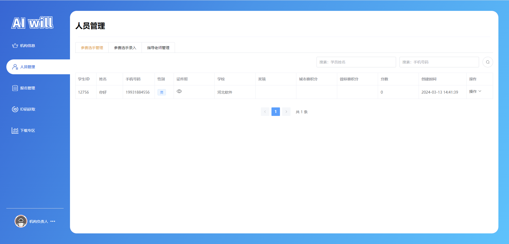

### 参赛选手录入

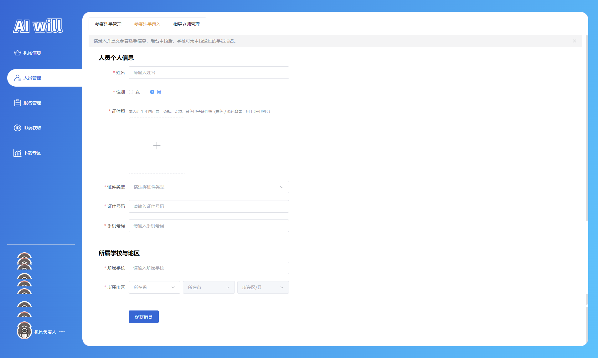

### 指导老师管理


## 学习目标

### 知识目标

- [ ] 理解Vue.js中父子组件、兄弟组件以及跨组件的通信方式
- [ ] 掌握Vue.js框架的生命周期钩子等
- [ ] 掌握使用Vuex进行状态管理
- [ ] 掌握使用Vue Router进行页面路由管理，实现单页应用中的页面导航和视图切换。


### 能力目标

- [ ] 能够设计并实现一个用户友好的界面，用于输入和展示人员信息

- [ ] 能够处理前端与后端的数据交互，确保数据的准确存储和检索
- [ ] 能够实现基本的CRUD（创建、读取、更新、删除）操作，以供用户管理人员信息
- [ ] 能够确保数据的安全性和完整性，包括输入验证和错误处理

## 知识储备

### vue3之生命周期

​	在Vue中，生命周期指的是Vue实例从创建到销毁的过程。在这个过程中，Vue实例会经历一系列的阶段，包括数据观测、模板编译、挂载DOM、更新DOM、卸载等等。在这些阶段，Vue提供了一些生命周期钩子函数，让我们可以在特定的时机执行某些代码。

#### 1 vue2和vue3生命周期的区别和更改

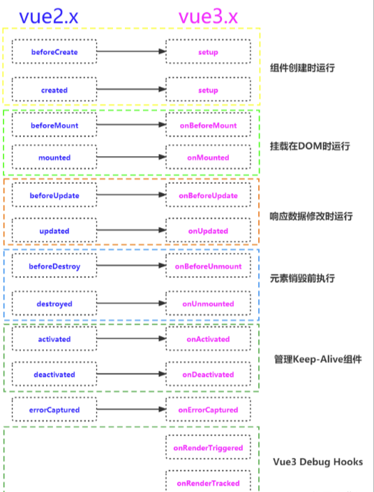

| Vue 2 生命周期钩子 | Vue 3 Composition API |
| ------------------ | --------------------- |
| `beforeCreate`     | `setup()`             |
| `created`          | `setup()`             |
| `beforeMount`      | `onBeforeMount()`     |
| `mounted`          | `onMounted()`         |
| `beforeUpdate`     | `onBeforeUpdate()`    |
| `updated`          | `onUpdated()`         |
| `beforeDestroy`    | `onBeforeUnmount()`   |
| `destroyed`        | `onUnmounted()`       |
| `activated`        | `onActivated()`       |
| `deactivated`      | `onDeactivated()`     |
| `errorCaptured`    | `onErrorCaptured()`   |

#### 2 Vue 3生命周期钩子，包括它们各自的调用时机

| 生命周期钩子    | 调用时机                                                     |
| --------------- | ------------------------------------------------------------ |
| `beforeCreate`  | 实例创建之前，此时实例的数据观测、事件等还未初始化。         |
| `created`       | 实例创建后，数据观测、事件等已经初始化完成，但尚未挂载到DOM。 |
| `beforeMount`   | 挂载实例之前，模板已经编译完成，但尚未挂载到DOM。            |
| `mounted`       | 实例挂载后，此时可以进行DOM操作，因为实例已经挂载到DOM。     |
| `beforeUpdate`  | 数据更新之前，此时可以进行状态的最后更改，DOM尚未更新。      |
| `updated`       | 数据更新后，DOM已经完成更新，可以进行DOM操作。               |
| `beforeUnmount` | 卸载实例之前，此时实例仍然完全可用。                         |
| `unmounted`     | 实例卸载后，此时实例已经完全销毁，无法再进行DOM操作。        |

## 任务实施

### 子任务5-1 实现页面布局分析

- **导航栏（Navigation Bar）**: 界面顶部的水平栏，通常包含应用程序的名称、导航链接或按钮，用于快速访问应用程序的不同部分。
- **侧边菜单（Sidebar）**: 界面的垂直部分，提供了一个选项卡式的导航列表，允许用户在不同的管理模块（如“人员管理”、“机构信息”等）之间切换。
- **内容区域（Content Area）**: 界面的中央部分，用于展示选定模块的具体内容。在这个例子中，内容区域进一步细分为表格，列出了参赛选手的详细信息，如学生ID、姓名、手机号码、性别等，并提供了操作按钮以便用户进行管理。

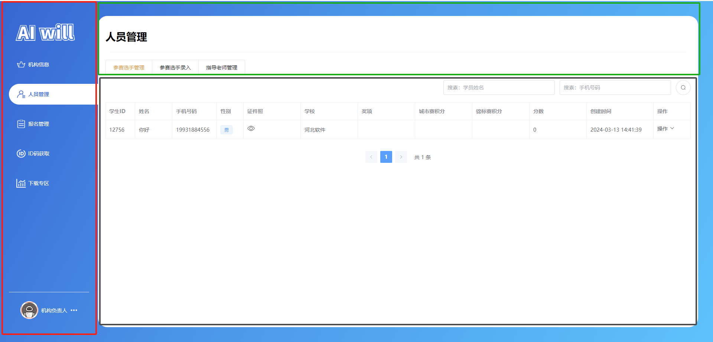

### 子任务5-2 实现组件编写

#### 步骤一 组件依赖安装

##### 1.Lodash工具库

​	Lodash 是一个现代化的 JavaScript 实用工具库，提供了大量的实用函数，旨在简化 JavaScript 编程的复杂性。它由 John-David Dalton 创建，并且广受 JavaScript 社区的欢迎和认可。

安装指令：`npm i  lodash -S`

> 文件路径：package.json

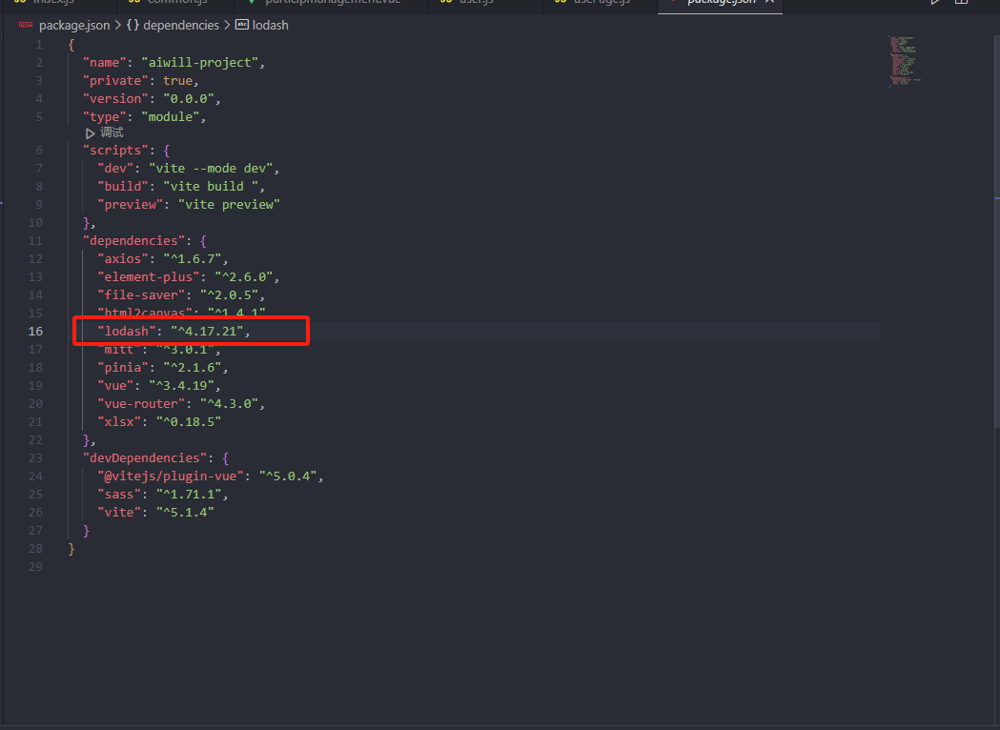

#### 步骤二 组件接口编写

##### 1.编写接口

> 文件路径：/src/api/manage/institution

`根据学生id获取学生基本信息: /institution/getStudentInfo `

`参赛选手录入 | 修改学生基本信息: /institution/playerEntry `

`添加/编辑 指导老师: /institution/addTeacher`

```js
import { request } from "@/utils/axios"

/**
 * 根据学生id获取学生基本信息
 */
export function GetStudentInfoApi(params) {
    return request(
        {
            url: "/institution/getStudentInfo",
            method: "GET",
            params: params,
        }
    );
}

/**
 * 参赛选手录入  |   修改学生基本信息
 */
export function PlayerEntryApi(data) {
    return request(
        {
            url: "/institution/playerEntry",
            method: "POST",
            data: data,
        }
    );
}

/**
 * 添加/编辑 指导老师
 */
export function AddTeacherApi(data) {
    return request(
        {
            url: "/institution/addTeacher",
            method: "POST",
            data: data,
        }
    );
}
```

#### 步骤三 编写组件

##### 1.编写上传图片组件

​	编写这个上传图片组件的目的是为了提供一个简单、高效的方式来展示和管理图片资源。通过使用Element Plus的`el-image`组件，该组件能够灵活地加载和展示图片，同时利用Vue的`computed`属性，它能够智能地处理图片路径，确保图片能够从正确的服务器地址加载。

> 文件路径：/src/components/image-component/index.vue

代码如下：

```js
<template>
  <!-- 使用Element Plus的el-image组件来展示图片 -->
  <el-image :src="imageUrl"></el-image>
</template>

<script setup>
import { computed } from "vue";
// 使用defineProps定义props函数，它接受一个对象，对象的键是props的名称，值是它们的类型
const props = defineProps({
  src: String, // 定义一个名为src的prop，类型为字符串
});

// 使用computed创建一个计算属性imageUrl
const imageUrl = computed(() => {
  // 如果props.src存在，则拼接环境变量和图片路径
  if (props.src) {
    return import.meta.env.VITE_API_HOST + props.src;
  }
  // 如果props.src不存在，则返回空字符串
  return "";
});
</script>

<style lang="scss" scoped></style>
```

##### 2.编写证件选择组件

​	编写证件选择组件的目的是为了提供一个用户友好的界面，让用户能够在表单中方便地选择和提交他们的证件类型。通过使用Element Plus库中的`el-select`和`el-option`组件，该组件提供了一个下拉菜单，列出了常见的证件类型供用户选择。这样的设计简化了用户输入过程，确保了数据的准确性和一致性。

> 文件路径：/src/components/idtype-select/index.vue

代码如下：

```js
<template>
  <el-select  placeholder="请选择证件类型">
    <el-option
      label="身份证"
      value="idcard"
    ></el-option>
    <el-option
      label="护照"
      value="passport"
    ></el-option>
    <el-option
      label="港澳通行证"
      value="hcpassport"
    ></el-option>
    <el-option
      label="台胞证"
      value="taiwanesesyndrome"
    ></el-option>
  </el-select>
</template>
```

##### 3.编写校验证件号校验工具

​	编写这个校验证件号的工具是为了提供一种机制来验证用户输入的证件号码是否符合特定的格式要求。通过定义一系列的正则表达式规则，该工具能够根据证件类型（如身份证、护照、港澳通行证和台胞证）来检查输入的证件号码是否有效。这样的编写目的是为了确保在注册或验证流程中收集到的证件信息的准确性和合法性，防止错误或欺诈性的输入。 

> 文件路径：/src/utils/index.js

代码如下：

```js
/**
 * 校验证件号
 */
export const handleCheckDocumentNumber = (type, value) => {
    const reg_data = {
        // 身份证号
        idcard: /^(([1][1-5])|([2][1-3])|([3][1-7])|([4][1-6])|([5][0-4])|([6][1-5])|([7][1])|([8][1-2]))\d{4}(([1][9]\d{2})|([2]\d{3}))(([0][1-9])|([1][0-2]))(([0][1-9])|([1-2][0-9])|([3][0-1]))\d{3}[0-9xX]$/,
        // 护照
        passport: /^([a-zA-z]|[0-9]){5,17}$/,
        // 港澳身份证
        hcpassport: /^([A-Z]\d{6,10}(\(\w{1}\))?)$/,
        // 台胞证
        taiwanesesyndrome: /^\d{8}|^[a-zA-Z0-9]{10}|^\d{18}$/
    }

    const reg = reg_data[type];
    if (!reg) {
        return false;
    }
    return reg.test(value)
}
```

##### 4.编写自定义钩子

​	编写这个自定义钩子`usePage`的目的是为了提供一个通用的解决方案，用于高效地管理列表页面的数据获取、状态管理和分页控制。通过封装API调用、数据存储和分页逻辑，该钩子简化了在Vue组件中实现数据展示和用户交互的复杂性。利用`ref`来创建响应式数据和`_.cloneDeep`来复制对象，这个钩子能够灵活地适应不同的数据结构和查询条件，同时支持条件查询和全量数据获取。它的设计旨在提高代码的可复用性，减少重复逻辑，并使得列表页面的开发更加快速和简洁。

> 文件路径：/src/hooks/usePage.js

代码如下：

```js
import { ref } from "vue";
import _ from "lodash"
/**
 * 最大导出数量
 */
const MAX_COUNT = 9999;
export function usePage({
    api_fn = () => { },
    q_data = {}
}) {
    const loading = ref(false)
    // 表格数据
    const data = ref([]);
    /**
     * 分页数据的总数量
     */
    const total = ref(0)
    /**
     * 分页数据
     */
    const page_data = ref({
        currentPage: 1,
        pageSize: 10
    })
    /**
     * 查询数据
     */
    const query_data = ref({
        ...q_data
    })
    /**
     * 加载状态
     */
    const loadding = ref(false)

    /**
     * 获取列表
     */
    const handleGetList = async () => {
        loading.value = true;
        let res = await api_fn({
            ...page_data.value,
            ...query_data.value
        });
        if (res.success) {
            data.value = res.pageInfo.list;
            total.value = res.pageInfo.total;
        }
        loading.value = false;
    }
    /**
     * 加载
     */
    const handleLoad = (bool = false) => {
        if (bool) {
            page_data.value.currentPage = 1;
            total.value = 0;
            data.value = [];
        }
        handleGetList();
    }
    /**
     * 分页切换
     */
    const handlePage = (page) => {
        page_data.value.currentPage = page;
        handleLoad();
    }
    /**
     * 自定义获取列表
     * condition null-无条件  current-当前条件
     * type page-当前页  all-全部页
     * @returns 
     */
    const handleGetCustomList = async (option = {
        condition: "null",
        type: "page",
    }

    ) => {
        let data = {};
        if (option.type == 'page') {
            data = _.merge(data, _.cloneDeep({
                ...page_data.value
            }))
        } else if (option.type == 'all') {
            data.currentPage = page_data.value.currentPage;
            data.pageSize = MAX_COUNT;
        }
        if (option.condition == 'current') {
            data = _.merge(data, _.cloneDeep(query_data.value))
        }
        let res = await api_fn(data);
        if (res.success) {
            return [true, res.pageInfo.list, res];
        } else {
            return [false, [], res];
        }
    }

    return {
        data,
        total,
        loading,
        query_data,
        handleLoad,
        handlePage,
        handleGetCustomList
    }
}
```

##### 5.用户状态管理

> 文件路径：/src/store/user

代码如下：

```js
/**
* 代码“任务三”已书写，此处省略...
*/
```

##### 6.省份选择组件

> 文件路径：/src/components/province-select/index.vue

代码如下：

```js
/**
* 代码“任务四”已书写，此处省略...
*/
```

##### 7.图片上传组件

> 文件路径：/src/components/upload-image/index.vue

代码如下：

```js
/**
* 代码“任务三”已书写，此处省略...
*/
```

##### 8.编写学生编辑弹框组件

> 文件路径：/src/view/manage/menusubassembly/tabs/components/stu-info-form.vue

代码如下：

```vue
<template>
  <!-- Element Plus表单组件 -->
  <el-form
    label-width="96px"
    ref="info_modal_data_ref"
    :model="info_modal.form_data"
    :rules="info_modal.rules"
    size="large"
    v-if="userStore.info_data.auditStatus == 1"
  >
    <!-- 个人信息区域 -->
    <div class="box">
      <h3>人员个人信息</h3>
      <el-form-item label="姓名" prop="studentName">
        <el-input
          v-model.trim="info_modal.form_data.studentName"
          placeholder="请输入姓名"
        />
      </el-form-item>
      <el-form-item label="性别" prop="gender">
        <el-radio-group v-model="info_modal.form_data.gender" class="ml-4">
          <el-radio label="0" size="large">女</el-radio>
          <el-radio label="1" size="large">男</el-radio>
        </el-radio-group>
      </el-form-item>
      <el-form-item label="证件照" prop="documentImg">
        <el-text type="info" size="small"
          >本人近 1 年内正面、免冠、无妆、彩色电子证件照（白色 /
          蓝色背景，用于证件照片）</el-text
        >
        <UploadImage v-model="info_modal.form_data.documentImg" />
      </el-form-item>
      <el-form-item label="证件类型" prop="documentType">
        <IdTypeSelect v-model="info_modal.form_data.documentType" />
      </el-form-item>
      <el-form-item label="证件号码" prop="documentNumber">
        <el-input
          v-model="info_modal.form_data.documentNumber"
          placeholder="请输入证件号码"
        />
      </el-form-item>
      <el-form-item label="手机号码" prop="phone">
        <el-input
          v-model="info_modal.form_data.phone"
          placeholder="请输入手机号码"
        />
      </el-form-item>
    </div>
    <div class="box">
      <h3>所属学校与地区</h3>
      <el-form-item label="所属学校" prop="schoolName">
        <el-input
          v-model="info_modal.form_data.schoolName"
          placeholder="请输入所属学校"
        />
      </el-form-item>
      <el-form-item label="所属市区" prop="county">
        <ProvinceSelect
          :isW="true"
          v-model:economize="info_modal.form_data.economize"
          v-model:market="info_modal.form_data.market"
          v-model:county="info_modal.form_data.county"
          :showCounty="true"
        />
      </el-form-item>
    </div>
    <!-- 保存按钮 -->
    <div class="box">
      <el-form-item>
        <el-button
          type="primary"
          size="large"
          @click="handleSubmit"
          :loading="loading"
          color="#1964d6"
          >保存信息</el-button
        >
      </el-form-item>
    </div>
  </el-form>
  <!-- 如果审核状态不是通过，则显示空状态提示 -->
  <el-empty v-else description="审核中或审核未通过，暂不支持使用此功能" />
</template>

<script  setup>
import ProvinceSelect from "@/components/province-select/index.vue"; // 导入省份选择组件
import UploadImage from "@/components/upload-image/index.vue"; // 导入图片上传组件
import { GetStudentInfoApi, PlayerEntryApi } from "@/api/manage/institution"; // 导入用于获取学生信息和提交信息的API函数
import { useUserStore } from "@/store/user"; // 导入Vuex的用户状态管理store
import { ref } from "vue"; // 导入Vue的ref函数，用于创建响应式引用
import { ElMessage } from "element-plus"; // 导入Element Plus的消息提示组件
import IdTypeSelect from "@/components/idtype-select/index.vue"; // 导入证件类型选择组件
import { handleCheckDocumentNumber } from "@/utils/index"; // 导入用于验证证件号码格式的工具函数

// 使用Vue的useUserStore来获取和更新用户状态
const userStore = useUserStore();
const loading = ref(false);
// 定义emit函数，用于触发组件外部的事件
const emit = defineEmits(["sub"]);
const info_modal_data_ref = ref();

// 定义表单验证函数
const checkPhone = (rule, value, callback) => {
  const phoneReg = /^1[3|4|5|6|7|8|9][0-9]{9}$/;
  if (!value) {
    callback(new Error("手机号码不能为空"));
  }
  if (phoneReg.test(value)) {
    callback();
  } else {
    callback(new Error("手机号码格式错误"));
  }
};
const checkName = (rule, value, callback) => {
  const chineseCharactersRegex = /^[\u4e00-\u9fa5]+$/;

  if (!chineseCharactersRegex.test(value)) {
    callback(new Error("请输入中文"));
  } else {
    // Validation passed
    callback();
  }
};
const checkDocumentNumber = (rule, value, callback) => {
  if (!value) {
    callback(new Error("证件号不能为空"));
    return;
  }
  if (!info_modal.value.form_data.documentType) {
    callback(new Error("请选择证件类型"));
    return;
  }
  if (
    !handleCheckDocumentNumber(info_modal.value.form_data.documentType, value)
  ) {
    callback(new Error("证件号格式错误"));
    return;
  }
  callback();
};
/**
 * 信息弹窗数据
 */
const info_modal = ref({
  form_data: {
    gender: "1",
  },
  rules: {
    studentName: [
      {
        required: true,
        validator: checkName,
        trigger: "blur",
      },
    ],
    gender: [
      {
        required: true,
        message: "请选择性别",
        trigger: "blur",
      },
    ],
    documentImg: [
      {
        required: true,
        message: "请上传证件照",
        trigger: "blur",
      },
    ],
    documentType: [
      {
        required: true,
        message: "请选择证件类型",
        trigger: "blur",
      },
    ],
    documentNumber: [
      {
        required: true,
        validator: checkDocumentNumber,
        trigger: "blur",
      },
    ],
    phone: [
      {
        required: true,
        validator: checkPhone,
        trigger: "blur",
      },
    ],
    schoolName: [
      {
        required: true,
        message: "请输入所属学校",
        trigger: "blur",
      },
    ],
    county: [
      {
        required: true,
        message: "请选择所属市区",
        trigger: "blur",
      },
    ],
  },
});
const handleRest = () => {
  info_modal.value.form_data = {
    gender: "1",
  };
};
/**
 * 获取学生信息
 */
const handleGetInfo = async (row) => {
  let res = await GetStudentInfoApi({
    studentId: row.studentId,
  });
  if (res.success) {
    info_modal.value.form_data = res.entity;
  }
};

/**
 * 保存信息
 */
const handleSubmit = () => {
  info_modal_data_ref.value.validate(async (r) => {
    if (!r) {
      return;
    }
    loading.value = true;
    let res;
    console.log(info_modal.value.form_data);
    const newinfo_modal = {
      ...info_modal.value.form_data,
      playerEntry: userStore.info_data.userId,
    };
    console.log(newinfo_modal);
    res = await PlayerEntryApi(newinfo_modal);
    if (res.success) {
      ElMessage.success(res.message);
      emit("sub", res);
    } else {
      ElMessage.error(res.message);
    }
    loading.value = false;
  });
};
// 将handleGetInfo和handleRest函数暴露给组件外部
defineExpose({
  handleGetInfo,
  handleRest,
});
</script>

<style lang="scss" scoped>
.box {
  padding-bottom: 32px;
  padding-left: 32px;
  width: 640px;
  h3 {
    margin-bottom: 16px;
  }
}
</style>
```

##### 9.编写教师管理弹窗组件

> 文件路径：/src/view/manage/menusubassembly/tabs/components/tec-info-form.vue

代码如下：

```vue
<template>
  <el-form
    label-width="96px"
    ref="info_modal_data_ref"
    :model="info_modal.form_data"
    :rules="info_modal.rules"
    v-if="userStore.info_data.auditStatus == 1"
  >
    <div class="box">
      <h3>人员个人信息</h3>
      <el-form-item label="姓名" prop="teacherName">
        <el-input v-model.trim="info_modal.form_data.teacherName" />
      </el-form-item>
      <el-form-item label="性别" prop="gender">
        <el-radio-group v-model="info_modal.form_data.gender" class="ml-4">
          <el-radio label="0" size="large">女</el-radio>
          <el-radio label="1" size="large">男</el-radio>
        </el-radio-group>
      </el-form-item>
      <el-form-item label="证件照" prop="documentImg">
        <el-text type="info" size="small"
          >本人近 1 年内正面、免冠、无妆、彩色电子证件照（白色 /
          蓝色背景，用于证件照片）</el-text
        >
        <UploadImage v-model="info_modal.form_data.documentImg" />
      </el-form-item>
      <el-form-item label="证件类型" prop="documentType">
        <IdTypeSelect v-model="info_modal.form_data.documentType" />
      </el-form-item>
      <el-form-item label="证件号码" prop="documentNumber">
        <el-input
          v-model="info_modal.form_data.documentNumber"
          placeholder="请输入证件号码"
        />
      </el-form-item>
      <el-form-item label="手机号码" prop="phone">
        <el-input
          v-model="info_modal.form_data.phone"
          placeholder="请输入手机号码"
        />
      </el-form-item>
    </div>
    <div class="box">
      <h3>所属学校与地区</h3>
      <el-form-item label="所属学校" prop="schoolName">
        <el-input
          v-model="info_modal.form_data.schoolName"
          placeholder="请输入所属学校"
        />
      </el-form-item>
      <el-form-item label="所属市区" prop="county">
        <ProvinceSelect
          :isW="true"
          v-model:economize="info_modal.form_data.economize"
          v-model:market="info_modal.form_data.market"
          v-model:county="info_modal.form_data.county"
          :showCounty="true"
        />
      </el-form-item>
    </div>
    <div class="box">
      <el-form-item>
        <el-button
          type="primary"
          size="large"
          @click="handleSubmit"
          color="#1964d6"
          :loading="loading"
          >保存信息</el-button
        >
      </el-form-item>
    </div>
  </el-form>
  <el-empty v-else description="审核中或审核未通过，暂不支持使用此功能" />
</template>

<script  setup>
import ProvinceSelect from "@/components/province-select/index.vue";
import UploadImage from "@/components/upload-image/index.vue";
import { AddTeacherApi } from "@/api/manage/institution";
import { ref } from "vue";
import { ElMessage } from "element-plus";
import { useUserStore } from "@/store/user";
import IdTypeSelect from "@/components/idtype-select/index.vue";
import { handleCheckDocumentNumber } from "@/utils/index";

const userStore = useUserStore();
const loading = ref(false);

const emit = defineEmits(["sub"]);
const info_modal_data_ref = ref();

const checkPhone = (rule, value, callback) => {
  const phoneReg = /^1[3|4|5|6|7|8|9][0-9]{9}$/;
  if (!value) {
    callback(new Error("手机号码不能为空"));
  }
  if (phoneReg.test(value)) {
    callback();
  } else {
    callback(new Error("手机号码格式错误"));
  }
};

const checkDocumentNumber = (rule, value, callback) => {
  if (!value) {
    callback(new Error("证件号不能为空"));
    return;
  }
  if (!info_modal.value.form_data.documentType) {
    callback(new Error("请选择证件类型"));
    return;
  }
  if (
    !handleCheckDocumentNumber(info_modal.value.form_data.documentType, value)
  ) {
    callback(new Error("证件号格式错误"));
    return;
  }
  callback();
};

/**
 * 信息弹窗数据
 */
const info_modal = ref({
  form_data: {
    gender: "1",
  },
  rules: {
    teacherName: [
      {
        required: true,
        message: "请请输入姓名",
        trigger: "blur",
      },
    ],
    gender: [
      {
        required: true,
        message: "请选择性别",
        trigger: "blur",
      },
    ],
    documentImg: [
      {
        required: true,
        message: "请上传证件照",
        trigger: "blur",
      },
    ],
    documentType: [
      {
        required: true,
        message: "请选择证件类型",
        trigger: "blur",
      },
    ],
    documentNumber: [
      {
        required: true,
        validator: checkDocumentNumber,
        trigger: "blur",
      },
    ],
    phone: [
      {
        required: true,
        validator: checkPhone,
        trigger: "blur",
      },
    ],
    schoolName: [
      {
        required: true,
        message: "请输入所属学校",
        trigger: "blur",
      },
    ],
    county: [
      {
        required: true,
        message: "请选择所属市区",
        trigger: "blur",
      },
    ],
  },
});

const handleRest = () => {
  info_modal.value.form_data = {
    teacherName: "",
    gender: "1",
    documentImg: "",
    documentType: "",
    documentNumber: "",
    phone: "",
    schoolName: "",
    economize: 0,
    market: 0,
    county: 0,
  };
};
/**
 * 获取学生信息
 */
const handleGetInfo = async (row) => {
  info_modal.value.form_data = row;
  return;
  let res = await GetStudentInfoApi({
    teacherId: row.teacherId,
  });
  if (res.success) {
    info_modal.value.form_data = res.entity;
  }
};

/**
 * 保存信息
 */
const handleSubmit = async () => {
  info_modal_data_ref.value.validate(async (r) => {
    if (!r) {
      return;
    }
    loading.value = true;

    let res;
    res = await AddTeacherApi(info_modal.value.form_data);
    if (res.success) {
      ElMessage.success(res.message);
      emit("sub", res);
    } else {
      ElMessage.error(res.message);
    }
    loading.value = false;
  });
};

defineExpose({
  handleGetInfo,
  handleRest,
});
</script>

<style lang="scss" scoped>
.box {
  padding-bottom: 32px;
  padding-left: 32px;
  width: 640px;
  h3 {
    margin-bottom: 16px;
  }
}
</style>
```

### 子任务5-3 实现参赛选手管理模块

#### 步骤一 路由搭建

> 文件路径：/src/router/index.js

代码如下：

```js
import { createRouter, createWebHashHistory, createWebHistory } from "vue-router";
// routes
const routes = [
    {
        redirect: "/home",
        path: "/"
    },
    // 首页
    {
        path: '/home',
        name: "home",
        component: () => import("@/view/home/index.vue")
    },
    // 管理页
    {
        path: '/manage',
        name: "manage",
        component: () => import("@/view/manage/index.vue"),
        children: [
            // ---------- 机构负责人 ----------
            // 机构菜单路由
            {
                path: 'organizationinfo',
                name: "manage-organizationinfo",
                component: () => import('@/view/manage/menusubassembly/organizationinfo.vue'),
                meta: {
                    index: "manage-organizationinfo",
                }
            },
            // 人员管理路由
            {
                path: 'personnel',
                name: "manage-personnel",
                component: () => import('@/view/manage/menusubassembly/personnel.vue'),
                meta: {
                    index: "manage-personnel",
                }
            },
        ]
    },
    // auth
    {
        path: '/auth',
        redirect: "/auth/login",
        component: () => import("@/view/auth/index.vue"),
        children: [
            // 登录
            {
                path: 'login',
                component: () => import("@/view/auth/login.vue")
            },
            // 教师登录
            {
                path: 'teclogin',
                component: () => import("@/view/auth/teclogin.vue")
            },
            // 注册
            {
                path: 'reg',
                component: () => import("@/view/auth/reg.vue")
            },
            // 忘记密码
            {
                path: 'forgetpassword',
                name: 'forgetpassword',
                component: () => import("@/view/auth/forgetpassword.vue")
            },
        ]
    },
]

// router
const router = createRouter({
    history: createWebHashHistory(),
    routes
});

export default router;
```

#### 步骤二 接口编写

##### 1.查看接口

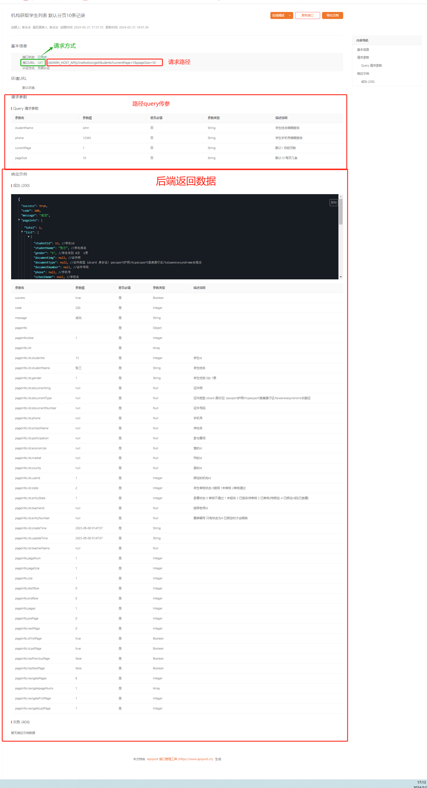

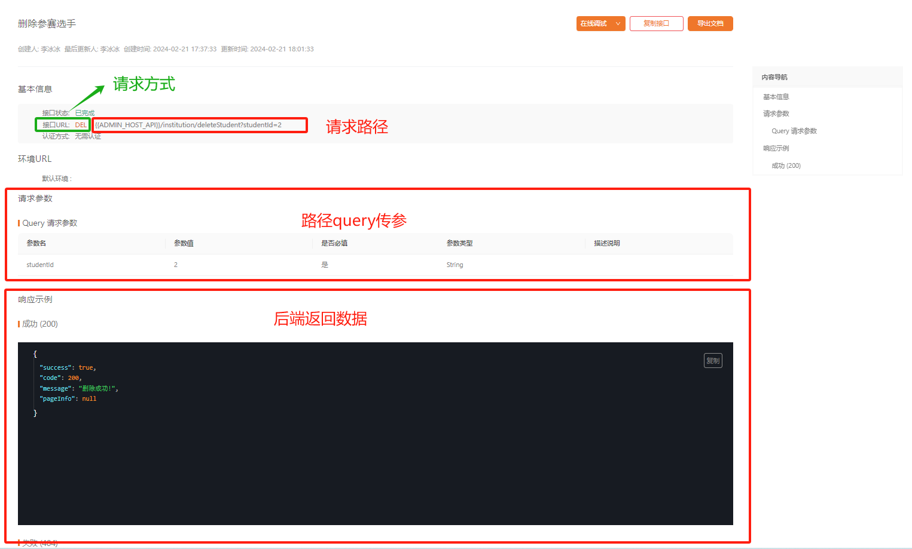

##### 2.编写接口

​	在之前的步骤中，我们已经详细了解了如何查阅和解析接口文档。现在，我们需要将这些接口信息整合到代码中，以便实现与后端服务的交互。

> 文件路径：/src/manage/institution.js

`机构获取学生列表:  /institution/getStudents`

`删除参赛选手:  /institution/deleteStudent`

```js
import { request } from "@/utils/axios"

 /**
 * 上任务省略...
 */


 /**
 * 机构获取学生列表  默认分页10条记录
 */
export function GetInformationApi(params) {
    return request(
        {
            url: "/institution/getStudents",
            method: "GET",
            params: params,
        }
    );
}
/**
 * 删除参赛选手
 */
export function DeleteStudentApi(params) {
    return request(
        {
            url: "/institution/deleteStudent",
            method: "DELETE",
            params: params,
        }
    );
}
```

#### 步骤二 实现参赛选手模块

​	通过上文中的路由配置和接口实现，本页面旨在打造一个全面的参赛选手管理界面。该界面支持通过搜索、查看、编辑和删除等操作来有效管理参赛选手信息。管理员可以利用此工具快速地对参赛选手数据进行更新和维护，确保信息的时效性和准确性。

> 文件路径：/src/view/manage/menusubassembly/tabs/participmanagement.vue

代码如下：

```vue
<template>
  <!-- 参赛选手管理 -->
  <!-- 按钮 -->
  <el-row class="el_row_btn">
    <el-col :span="24" class="content">
      <div class="content_top_btn">
        <div></div>
        <div>
          <el-space>
            <el-input
              class="top_search_inp"
              v-model="query_data.studentName"
              clearable
              placeholder="搜素：学员姓名"
            />
            <el-input
              class="top_search_inp"
              v-model="query_data.phone"
              clearable
              placeholder="搜素：手机号码"
            />
            <el-button
              size="large"
              :icon="Search"
              circle
              :loading="loading"
              @click="
                () => {
                  handleLoad(true);
                }
              "
            />
            <!-- <el-button
              size="large"
              :icon="Delete"
              circle
              @click="handleRest"
            /> -->
          </el-space>
        </div>
      </div>
    </el-col>
  </el-row>
  <!-- 内容 -->
  <el-table
    :data="data"
    border
    style="width: 100%"
    v-loading="loading"
    empty-text="暂无参赛选手"
  >
    <el-table-column label="学生ID" prop="studentId" width="80" />
    <el-table-column label="姓名" prop="studentName" width="100">
    </el-table-column>
    <el-table-column label="手机号码" prop="phone" width="120" />
    <el-table-column label="性别" prop="gender" width="72">
      <template #default="scope">
        <el-tag v-if="scope.row.gender == 0" type="danger">女</el-tag>
        <el-tag v-if="scope.row.gender == 1" type="primary">男</el-tag>
      </template>
    </el-table-column>
    <el-table-column label="证件照" prop="documentImg">
      <template #default="scope">
        <el-popover placement="right">
          <template #reference>
            <el-icon size="20" style="cursor: pointer">
              <View />
            </el-icon>
          </template>
          <ImageComponent :src="scope.row.documentImg" />
        </el-popover>
      </template>
    </el-table-column>
    <el-table-column label="学校" prop="schoolName" />
    <el-table-column label="奖项" prop="awards" />
    <el-table-column label="城市赛积分" prop="cityIntegral" />
    <el-table-column label="锦标赛积分" prop="championship" />
    <el-table-column label="分数" prop="score" />
    <el-table-column label="创建时间" prop="createTime" width="180" />
    <el-table-column label="操作" prop="Address" width="100">
      <template #default="scope">
        <el-dropdown
          trigger="click"
          @command="(value) => handleOperate(value, scope.row)"
        >
          <span class="el_dropdown_link">
            操作<el-icon class="el-icon--right"><arrow-down /></el-icon>
          </span>
          <template #dropdown>
            <el-dropdown-menu>
              <el-dropdown-item command="edit-info"
                ><el-icon> <EditPen /> </el-icon>编辑信息</el-dropdown-item
              >
              <el-dropdown-item command="remove-item">
                <el-icon> <CircleClose /> </el-icon>删除人员
              </el-dropdown-item>
            </el-dropdown-menu>
          </template>
        </el-dropdown>
      </template>
    </el-table-column>
  </el-table>
  <!-- 分页 -->
  <div class="pagination-container">
    <el-pagination
      background
      layout="prev, pager, next, total"
      :total="total"
      @current-change="handlePage"
    />
  </div>
  <!-- 编辑信息 -->
  <el-dialog
    v-model="info_modal"
    title="编辑信息"
    class="info-modal"
    width="960px"
  >
    <InfoForm
      ref="InfoModal"
      @sub="
        info_modal = false;
        handleLoad(true);
      "
    />
  </el-dialog>
</template>

<script  setup>
// 导入API函数、组件和其他依赖
import { GetInformationApi, DeleteStudentApi } from "@/api/manage/institution";
// 导入Vue的生命周期钩子和响应式API
import { onMounted, ref, nextTick } from "vue";
// 导入自定义钩子
import { usePage } from "@/hooks/usePage";
// 导入子组件
import InfoForm from "./components/stu-info-form.vue";
// 导入Element Plus的弹窗和消息提示组件
import { ElMessageBox, ElMessage } from "element-plus";
// 导入图片预览组件
import ImageComponent from "@/components/image-component/index.vue";
// 导入Element Plus的图标
import { Delete, Search, View } from "@element-plus/icons-vue";
// 导入Vuex的用户状态管理store
import { useUserStore } from "@/store/user";

// 使用Vuex的用户状态管理store
const userStore = useUserStore();

// 使用自定义数据钩子获取和管理参赛选手数据
const { total, data, loading, query_data, handleLoad, handlePage } = usePage({
  api_fn: GetInformationApi,
  q_data: {
    studentName: "",
    phone: "",
  },
});
/**
 * 信息弹窗数据
 */
const info_modal = ref(false);
const InfoModal = ref();
/**
 * 重置
 */
const handleRest = () => {
  query_data.value.phone = "";
  query_data.value.studentName = "";
  handleLoad(true);
};

/**
 * 处理操作按钮点击事件的函数，包括编辑信息和删除人员
 */
const handleOperate = (command, row) => {
  if (command == "edit-info") {
    if (userStore.info_data.auditStatus != 1) {
      ElMessage.error("审核中或审核未通过，暂不支持使用功能");
      return;
    }
    // 更新
    info_modal.value = true;
    nextTick(() => {
      InfoModal.value.handleGetInfo(row);
    });
  } else if (command == "remove-item") {
    if (userStore.info_data.auditStatus != 1) {
      ElMessage.error("审核中或审核未通过，暂不支持使用功能");
      return;
    }
    // 删除
    ElMessageBox.confirm("是否删除该选手", "提示", {
      "cancel-button-text": "取消",
      "confirm-button-text": "确定",
    }).then(async () => {
      let res = await DeleteStudentApi({
        studentId: row.studentId,
      });
      if (!res.success) {
        ElMessage.error(res.message);
      } else {
        ElMessage.success(res.message);
      }
      handleLoad(true);
    });
  }
};
// 将handleLoad函数暴露给组件外部
defineExpose({
  handleLoad,
});

onMounted(() => {
  handleLoad(true);
});
</script>

<style lang="scss" scoped>
.header_information {
  .header_name {
    margin-left: 10px;
    margin-right: 10px;
    .header_text {
      margin-left: -10px;
      margin-right: -10px;
    }
    h1 {
      font-size: 28px;
    }

    // 线
    .header_line {
      display: block;
      height: 1px;
      width: 100%;
      margin: 24px 0 20px 0;
      background-color: #8473f717;
    }
  }
  //   内容
  :deep(.table_btn_success) {
    padding: 0 5px !important;
    border: none;
  }
  :deep(.el-table) .cell {
    padding: 0 10px;
  }
  .el_row_btn {
    margin-bottom: 20px;

    .content {
      .content_top_btn {
        display: flex;
        justify-content: space-between;
        :deep(.tob_tabs) {
          span {
            font-size: 14px !important;
          }
        }
        .top_search_inp {
          width: 300px;
          height: 40px;
          margin-right: 5px;
        }
        .top_search_btn {
          width: 110px;
          margin-right: 5px;
        }
      }
    }
  }
  .el_dropdown_link {
    font-size: 14px;
  }
  :deep(.el-table)__cell {
    padding: 12px 0 !important;
  }
}
.pagination-container {
  display: flex;
  justify-content: center;
  padding: 32px 0;
}
</style>
```

成功示例：

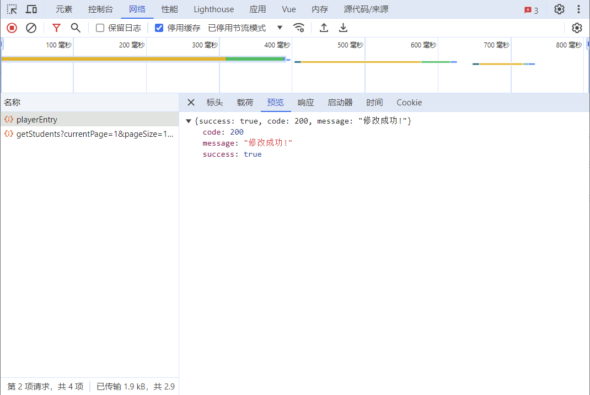


### 子任务5-4 实现参赛选手录入模块

​	此页面专门设计用于录入参赛选手的信息，它通过一个简洁的表单界面，引导用户输入必要的数据。这样的设计使得信息收集过程变得高效且用户友好，同时确保了数据的准确性和完整性。页面中包含的提示信息和清晰的指示有助于用户理解录入流程和审核要求。一旦信息提交，后台审核通过后，学校便可以为学员进行报名，从而确保了整个赛事管理流程的顺畅。这个页面对于提升赛事管理系统的整体运作效率和用户体验至关重要。

> 文件路径：/src/view/manage/menusubassembly/tabs/entrycontestants.vue

代码如下：

```vue
<template>
  <!-- 参赛选手录入 -->
  <div>
    <div class="el_alert">
      <el-alert
        title="请录入并提交参赛选手信息，后台审核后，学校可为审核通过的学员报名。"
        type="info"
      />
    </div>
    <!-- 参赛选手信息表单组件 -->
    <InfoForm @sub="handleSubmit" />
  </div>
</template>

<script  setup>
// 导入子组件InfoForm
import InfoForm from "./components/stu-info-form.vue";
// 定义emit函数，用于触发组件外部的事件
const emit = defineEmits("sub");
// 处理提交事件的函数
const handleSubmit = () => {
  emit("sub");
};
</script>

<style lang="scss" scoped>
.header_information {
  padding: 20px;
  .header_name {
    margin-left: 10px;
    margin-right: 10px;
    .header_text {
      margin-left: -10px;
      margin-right: -10px;
    }
    h1 {
      font-size: 28px;
    }
  }
  .el_alert {
    margin-bottom: 20px;
  }
  .header_line {
    display: block;
    height: 1px;
    width: 100%;
    margin: 24px 0;
    background-color: #8473f717;
  }
  .contnet_text {
    margin-bottom: 14px;
    font-size: 20px;
    font-weight: 700;
  }
  .from_checkbox {
    width: 550px !important;
    :deep(.el-checkbox__label) {
      display: inline-block;
      padding-left: 10px;
      line-height: 19px;
      font-size: 14px;
    }
  }
  .not_inp {
    color: #606266;
    font-size: 14px;
  }
  .content_input {
    width: 500px;
  }
  .input_border {
    display: none;
  }
  :deep(.el-input__wrapper) {
    padding: 0 15px;
  }
  :deep(.el-input.is-disabled) .el-input__inner {
    background-color: #f5f5f5;
  }
  .select_region {
    width: 500px;
    display: flex;
    justify-content: space-between;
    .el_form_content_text {
      width: 500px;
      height: 120px;
      display: flex;
      flex-direction: column;
      justify-content: space-between;
      p {
        font-size: 14px;
        color: #202020;
      }
      .content_text_relation {
        font-size: 14px;
        .content_text_contacts {
          color: #000;
          font-weight: bold;
        }
        span {
          color: #202020;
          font-size: 14px;
        }
      }
    }
  }
  :deep(.el-input) {
    height: 40px;
  }
  .content_select {
    width: 160px;
  }
}
// 上传
.avatar-uploader .el-upload {
  border: 1px dashed var(--el-border-color);
  border-radius: 6px;
  cursor: pointer;
  position: relative;
  overflow: hidden;
  transition: var(--el-transition-duration-fast);
}

.avatar-uploader .el-upload:hover {
  border-color: var(--el-color-primary);
}

.el-icon.avatar-uploader-icon {
  font-size: 28px;
  color: #8c939d;
  width: 150px;
  height: 205px;
  line-height: 205px;
  text-align: center;
}
.upload_text {
  color: rgb(96, 98, 102);
  font-style: 14px;
}
</style>
```

**参赛选手录入字段效果**

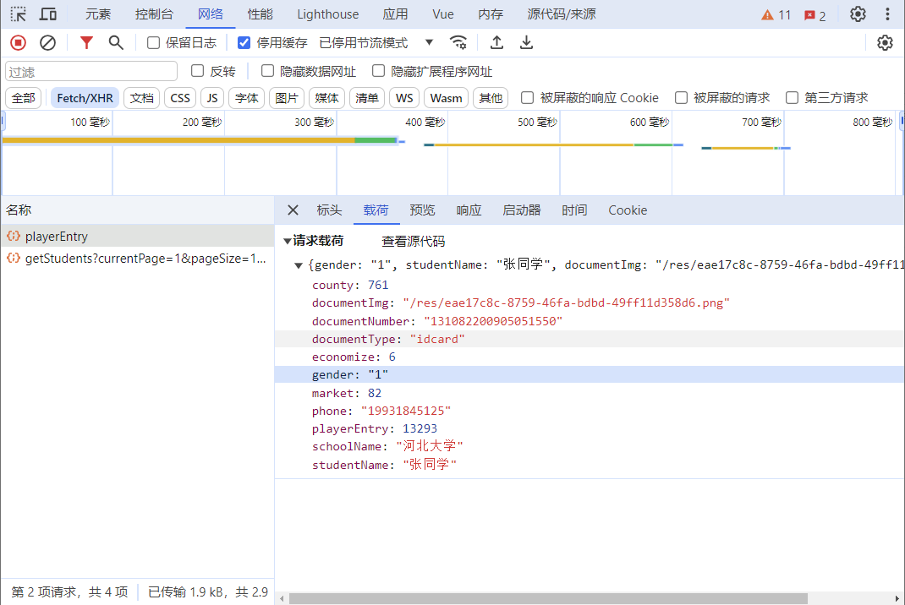

**参赛选手录入成功效果：**

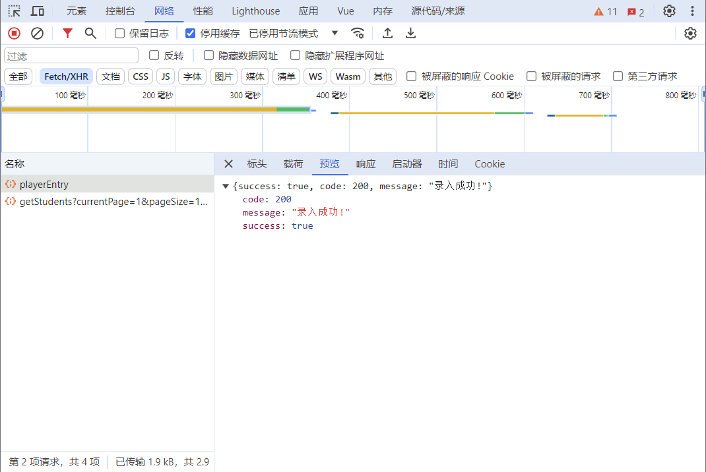

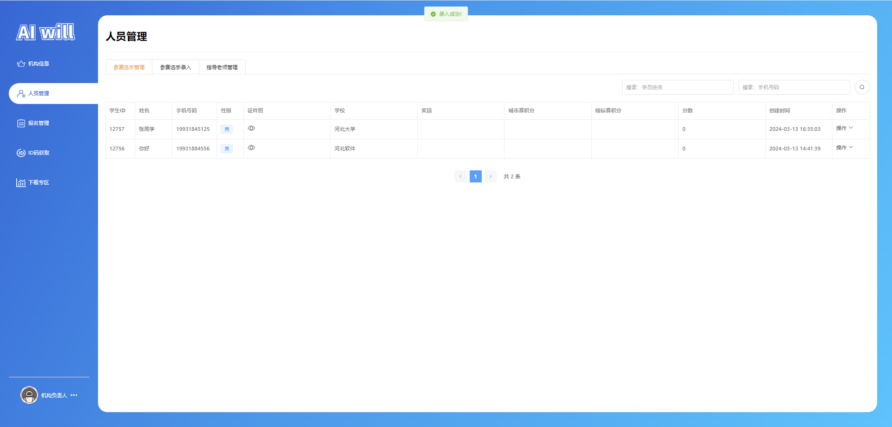

### 子任务5-5 实现指导老师管理模块

#### 步骤一 接口编写

##### 1.查看接口


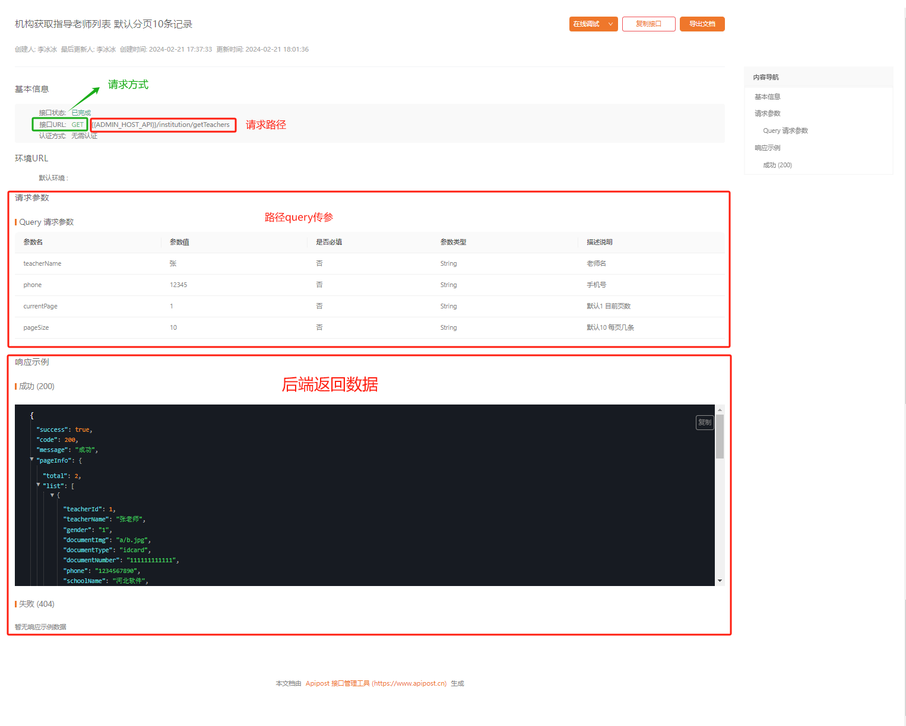

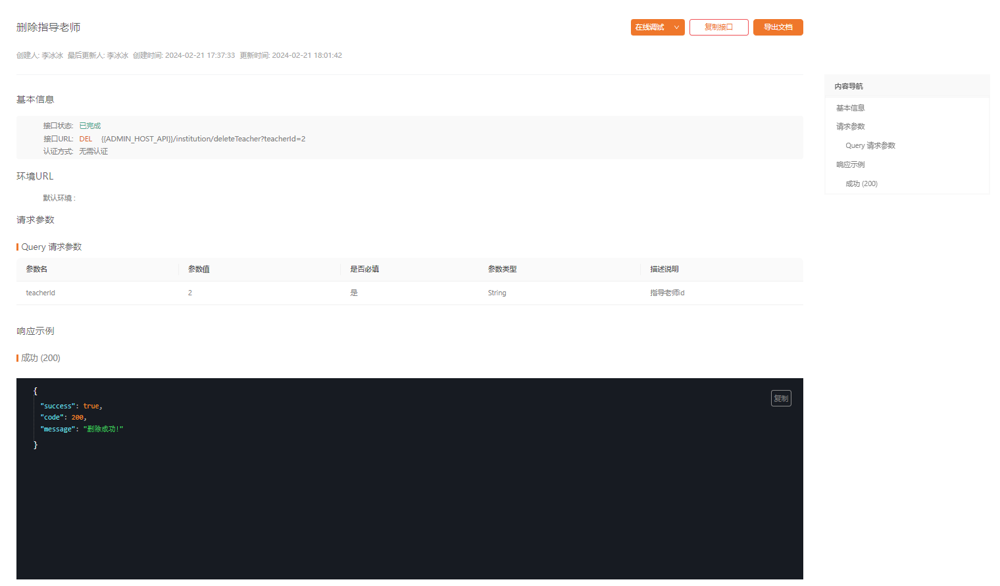

##### 2.编写接口

> 文件路径：/src/manage/institution.js

`获取指导老师:  /institution/getTeachers`

`删除指导老师:  /institution/deleteTeacher`

```js
import { request } from "@/utils/axios"

 /**
 * 上任务省略...
 */

/**
 * 获取指导老师
 */
export function GetTeachersApi(params) {
    return request(
        {
            url: "/institution/getTeachers",
            method: "GET",
            params: params,
        }
    );
}
/**
 * 删除指导老师
 */
export function DeleteTeacherApi(params) {
    return request(
        {
            url: "/institution/deleteTeacher",
            method: "DELETE",
            params: params,
        }
    );
}
```

#### 步骤二 实现指导老师模块

​	通过之前的路由配置和接口开发，本页面旨在提供一个全面的指导老师信息管理界面。该界面集成了添加、搜索、编辑和删除等关键功能，使得管理指导老师的信息变得简单高效。这样的设计不仅提高了信息维护的便捷性和准确性，而且通过优化用户操作流程，显著增强了系统的管理能力和用户体验。

> 文件路径：/src/view/manage/menusubassembly/tabs/instructorment.vue

代码如下：

```vue
<template>
  <!-- 指导老师管理页面的结构 -->
  <!-- 按钮区域，包含添加指导老师的按钮和搜索区域 -->
  <el-row class="el_row_btn">
    <!-- 添加指导老师的按钮 -->
    <el-col :span="24" class="content">
      <div class="content_top_btn">
        <div>
          <el-button size="large" class="tob_tabs" @click="handleCreateInfo"
            >添加指导老师</el-button
          >
        </div>
        <div>
          <!-- 搜索区域，包含教师姓名和手机号码的输入框以及搜索按钮 -->
          <el-space>
            <el-input
              class="top_search_inp"
              v-model="query_data.teacherName"
              placeholder="搜素：教师姓名"
              clearable
            />
            <el-input
              class="top_search_inp"
              v-model="query_data.phone"
              placeholder="搜素：手机号码"
              clearable
            />
            <el-button
              size="large"
              :icon="Search"
              circle
              :loading="loading"
              @click="
                () => {
                  handleLoad(true);
                }
              "
            />
          </el-space>
        </div>
      </div>
    </el-col>
  </el-row>
  <!-- 表格内容区域，展示指导老师的详细信息 -->
  <el-table
    :data="data"
    border
    style="width: 100%"
    v-loading="loading"
    empty-text="暂无人员"
  >
    <el-table-column label="学生ID" prop="teacherId" width="80" />
    <el-table-column label="姓名" prop="teacherName" width="100">
    </el-table-column>
    <el-table-column label="手机号码" prop="phone" width="120" />
    <el-table-column label="性别" prop="gender" width="72">
      <template #default="scope">
        <el-tag v-if="scope.row.gender == 0" type="danger">女</el-tag>
        <el-tag v-if="scope.row.gender == 1" type="primary">男</el-tag>
      </template>
    </el-table-column>
    <el-table-column label="证件照" prop="documentImg">
      <template #default="scope">
        <el-popover placement="right">
          <template #reference>
            <el-icon size="20" style="cursor: pointer">
              <View />
            </el-icon>
          </template>
          <ImageComponent :src="scope.row.documentImg" />
        </el-popover>
      </template>
    </el-table-column>
    <el-table-column label="学校" prop="schoolName" />

    <el-table-column label="创建时间" prop="createTime" width="180" />
    <el-table-column label="操作" prop="Address" width="100">
      <template #default="scope">
        <el-dropdown
          trigger="click"
          @command="(value) => handleOperate(value, scope.row)"
        >
          <span class="el_dropdown_link">
            操作<el-icon class="el-icon--right"><arrow-down /></el-icon>
          </span>
          <template #dropdown>
            <el-dropdown-menu>
              <el-dropdown-item command="edit-info"
                ><el-icon> <EditPen /> </el-icon>编辑信息</el-dropdown-item
              >
              <el-dropdown-item command="remove-item">
                <el-icon> <CircleClose /> </el-icon>删除人员
              </el-dropdown-item>
            </el-dropdown-menu>
          </template>
        </el-dropdown>
      </template>
    </el-table-column>
  </el-table>
  <!-- 分页组件，用于切换不同页码的数据 -->
  <div class="pagination-container">
    <el-pagination
      background
      layout="prev, pager, next, total"
      :total="total"
      @current-change="handlePage"
    />
  </div>
  <!-- 编辑信息的弹窗 -->
  <el-dialog
    v-model="info_modal"
    :title="info_modal_title"
    class="info-modal"
    width="960px"
  >
    <InfoForm
      ref="InfoModal"
      @sub="
        info_modal = false;
        handleLoad(true);
      "
    />
  </el-dialog>
</template>

<script  setup>
// 导入API函数、组件和其他依赖
import { GetTeachersApi, DeleteTeacherApi } from "@/api/manage/institution";
// 导入Vue的生命周期钩子和响应式API
import { onMounted, ref, nextTick } from "vue";
// 导入自定义钩子
import { usePage } from "@/hooks/usePage";
// 导入子组件
import InfoForm from "./components/tec-info-form.vue";
// 导入Element Plus的弹窗和消息提示组件
import { ElMessage, ElMessageBox } from "element-plus";
// 导入图片预览组件
import ImageComponent from "@/components/image-component/index.vue";
// 导入Vuex的用户状态管理store
import { useUserStore } from "@/store/user";
const userStore = useUserStore();
import { Delete, Search } from "@element-plus/icons-vue";

// 使用自定义数据钩子获取和管理指导老师数据
const { total, data, loading, query_data, handleLoad, handlePage } = usePage({
  api_fn: GetTeachersApi,
  q_data: {
    teacherName: "",
    phone: "",
  },
});
/**
 * 定义信息弹窗的显示状态和标题
 */
const info_modal = ref(false);
const info_modal_title = ref("添加指导老师");
// 定义子组件的引用
const InfoModal = ref();

const handleCreateInfo = () => {
  handleOperate("create-info", null);
  info_modal_title.value = "添加指导老师";
};
/**
 * 处理添加指导老师按钮点击事件的函数
 */
const handleOperate = (command, row) => {
  // 添加指导老师
  if (command == "create-info") {
    info_modal.value = true;
    nextTick(() => {
      InfoModal.value.handleRest();
    });
  } else if (command == "edit-info") {
    if (userStore.info_data.auditStatus != 1) {
      ElMessage.error("审核中或审核未通过，暂不支持使用功能");
      return;
    }
    // 更新
    info_modal.value = true;
    info_modal_title.value = "编辑指导老师";
    nextTick(() => {
      InfoModal.value.handleGetInfo(row);
    });
  } else if (command == "remove-item") {
    if (userStore.info_data.auditStatus != 1) {
      ElMessage.error("审核中或审核未通过，暂不支持使用功能");
      return;
    }
    // 删除
    ElMessageBox.confirm("是否删除该选手", "提示", {
      "cancel-button-text": "取消",
      "confirm-button-text": "确定",
    }).then(async () => {
      let res = await DeleteTeacherApi({
        teacherId: row.teacherId,
      });
      if (!res.success) {
        ElMessage.error(res.message);
      } else {
        ElMessage.success(res.message);
      }
      handleLoad(true);
    });
  }
};

// 组件挂载后立即加载数据
onMounted(() => {
  handleLoad(true);
});
</script>

<style lang="scss" scoped>
/* 组件的样式定义 */
.header_information {
  /* 头部样式 */
  .header_name {
    margin-left: 10px;
    margin-right: 10px;
    .header_text {
      margin-left: -10px;
      margin-right: -10px;
    }
    h1 {
      font-size: 28px;
    }

    // 线
    .header_line {
      display: block;
      height: 1px;
      width: 100%;
      margin: 24px 0 20px 0;
      background-color: #8473f717;
    }
  }
  /* 内容样式 */
  :deep(.table_btn_success) {
    padding: 0 5px !important;
    border: none;
  }
  :deep(.el-table) .cell {
    padding: 0 10px;
  }
  .el_row_btn {
    margin-bottom: 20px;
    /* 按钮区域样式 */
    .content {
      .content_top_btn {
        display: flex;
        justify-content: space-between;
        :deep(.tob_tabs) {
          span {
            font-size: 14px !important;
          }
        }
        .top_search_inp {
          width: 300px;
          height: 40px;
          margin-right: 5px;
        }
        .top_search_btn {
          width: 110px;
          margin-right: 5px;
        }
      }
    }
  }
  /* 下拉菜单链接样式 */
  .el_dropdown_link {
    font-size: 14px;
  }
  /* 表格单元格样式 */
  :deep(.el-table__cell) {
    padding: 12px 0 !important;
  }
}
/* 分页组件容器样式 */
.pagination-container {
  display: flex;
  justify-content: center;
  padding: 32px 0;
}
/* 弹窗样式 */
.info-modal {
}
</style>
```


