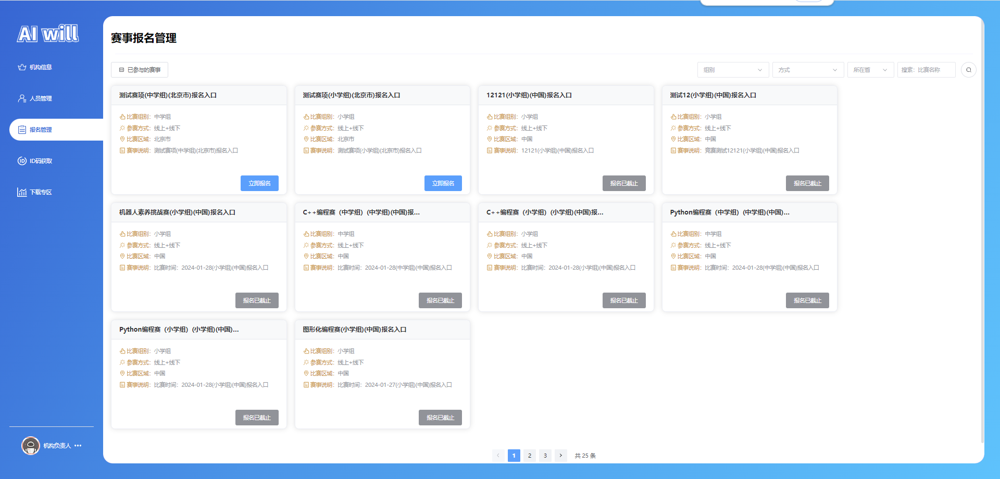
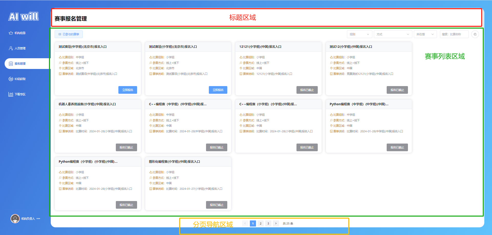
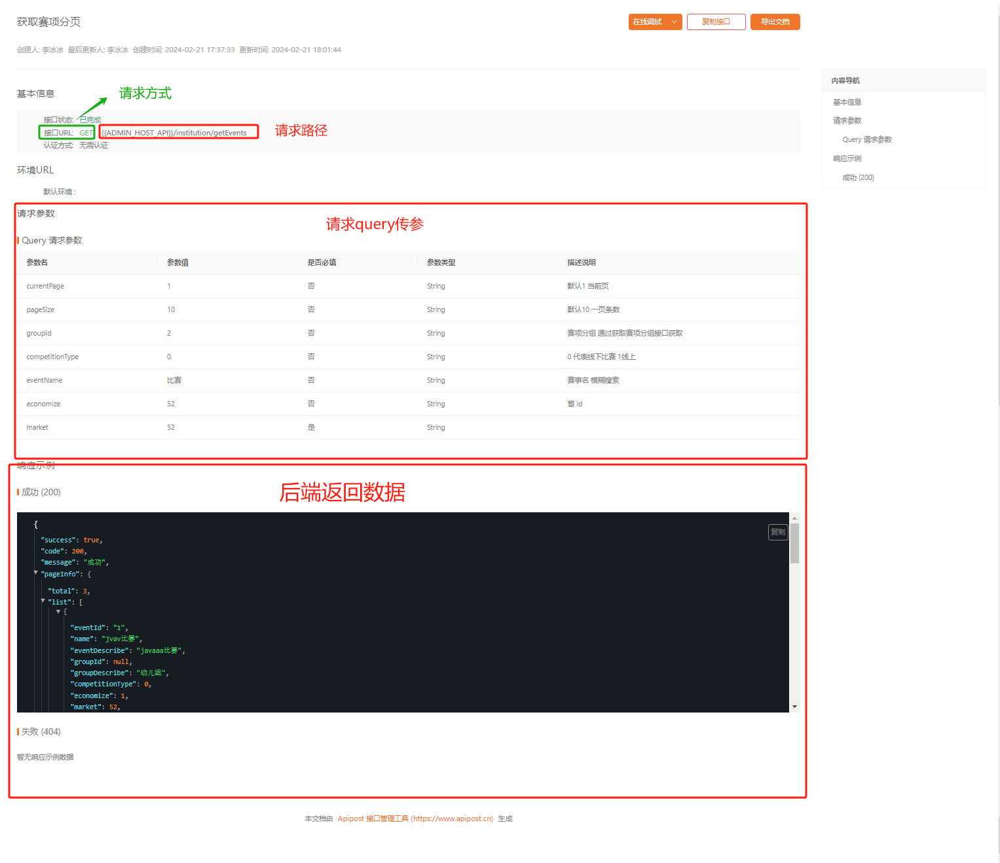
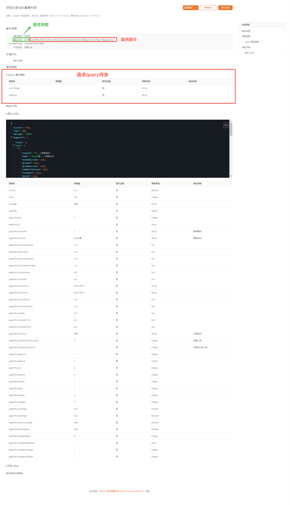
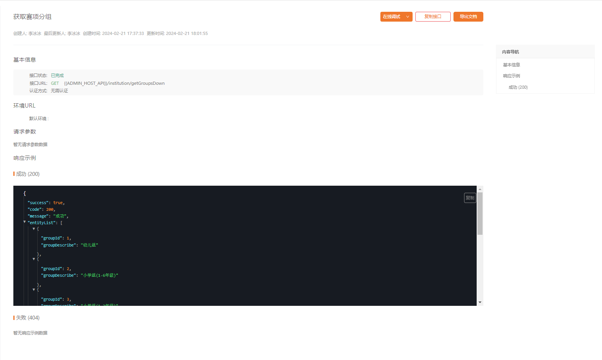
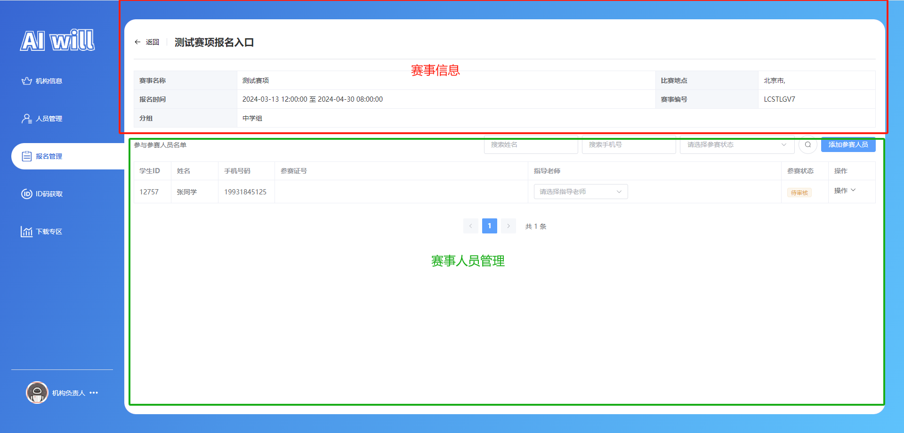
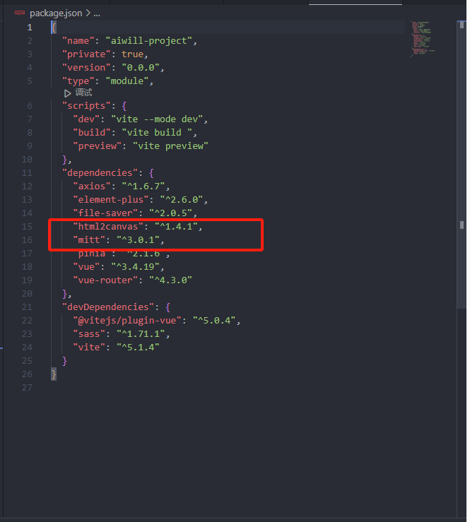
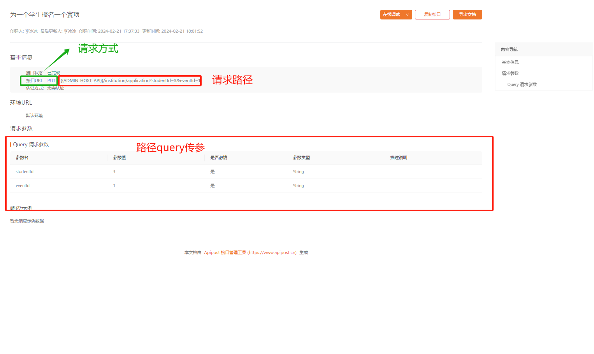
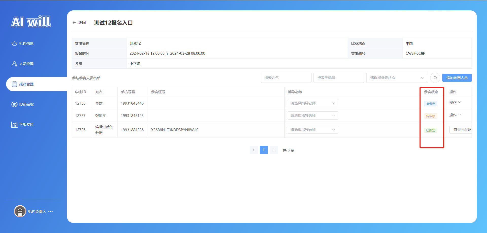
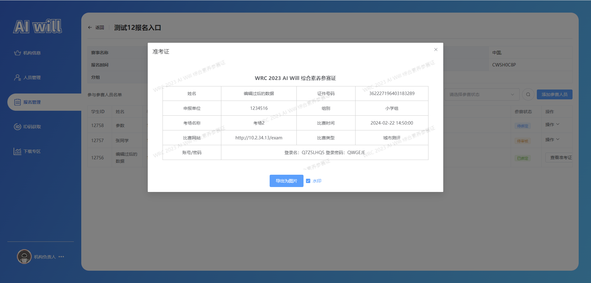

# 任务六、报名管理模块开发

## 任务描述

​	此页面是一个综合性的报名管理模块，该模块旨在提供一个用户友好的界面，用于管理人员的个人信息、所属学校与地区信息，并对赛事报名流程进行有效管理。模块将包括添加、编辑、删除参赛人员信息的功能，以及赛事信息的展示和报名状态的管理。此外，还需实现与后端API的对接，确保数据的准确同步和更新。

## 任务效果



## 学习目标

### 知识目标

- [ ] 熟悉Element Plus UI库的组件使用，如el-select、el-table等，以构建交互式用户界面
- [ ] 熟悉并实现html2canvas库的使用，以便将页面内容导出为图片
- [ ] 掌握Vue.js框架的核心概念，包括生命周期钩子、组件化、路由管理等
- [ ] 掌握并应用axios库进行前端与后端的API通信
- [ ] 掌握mitt事件总线库的使用方法，实现组件间的事件发布和订阅


### 能力目标

- [ ] 能够使用前端技术实现与后端服务的数据交互，包括数据的发送请求、接收响应和错误处理，确保数据流的顺畅和应用的稳定性。
- [ ] 能够通过组件化的方法开发前端应用，提高代码的模块化程度，增强代码的可维护性和可复用性。
- [ ] 能够利用事件总线机制处理不同组件之间的消息传递和通信，优化应用的性能并提升用户体验。
- [ ] 能够实现数据导出功能，为用户提供数据备份和分享的便捷解决方案，增强应用的实用性和用户满意度。

## 知识储备

### mitt的使用

#### 一、mitt是什么？

`Mitt`是一个体积极小的第三方消息发布/订阅式JavaScript库，React、Vue均可以使用。

#### 二、使用步骤

##### 1.引入库

代码如下（示例）：

```shell
npm install mitt
下载成功之后可以在package.json中查看到依赖
```

##### 2.在组件中使用

​	安装好mitt后，直接引入mitt实例化后即可使用mitt；

```js
import mitt from 'mitt'
    
const emitter = mitt()
 
emitter.on('foo', e => console.log(e) )  //emitter
   
emitter.emit('foo', 'emitter')
```

#### 三、封装mitt

在utils目录下，新建 mitt.js 文件，写入下面代码进行封装；

```js
import mitt from 'mitt'

const emitter =new mitt()
 
export default emitter
```

在使用中直接引入emitter使用即可；

```js
import emitter from '../api/mitt'

emitter.on('foo', e => console.log(e) )  //emitter
 
emitter.emit('foo', 'emitter')
```

#### 四、mitt核心原理

​	mitt的核心原理，就是通过 map 的方法保存函数。

```js
export default function mitt(all) {
    all = all || new Map();
    return {
        all,
        // 注册
        on(typstore/usere, handler) {
            const handlers = all.get(type);
            const added = handlers && handlers.push(handler);
            if (!added) {
                all.set(type, [handler]);
            }
        },
        //调用
        emit(type, evt) {
            ((all.get(type) || [])).slice().map((handler) => { handler(evt); });
            ((all.get('*') || [])).slice().map((handler) => { handler(type, evt); });
        },
        //移除
        off(type, handler) {
            const handlers = all.get(type);
            if (handlers) {
                handlers.splice(handlers.indexOf(handler) >>> 0, 1);
            }
        },
    };
}
```

### Lodash的介绍

​	Lodash 就是一套工具库，它内部封装了诸多对字符串、数组、对象等常见数据类型的处理函数，其中部分是目前 ECMAScript 尚未制定的规范，但同时被业界所认可的辅助函数。目前每天使用 npm 安装 Lodash 的数量在百万级以上，这在一定程度上证明了其代码的健壮性，值得我们在项目中一试。

官方地址：[Lodash](https://www.lodashjs.com/)

#### 一、安装和导入

安装 Lodash 可以使用 npm 命令进行快速安装：

```js
npm install lodash
```

安装完成后，可以通过以下两种方式导入 Lodash：

```js
import _ from 'lodash';
//或者
const _ = require('lodash');
```

#### 二、使用Lodash

##### lodash的链式调用

lodash还支持链式调用，这样可以使我们的代码更加简洁和易读。比如，在使用`map`函数时，我们可以这样写：

```js
const arr = [1, 2, 3];
const newArr = _(arr).map(n => n * 2).value();
console.log(newArr); // [2, 4, 6]
```

这里的`_()`函数会将数组包装成一个lodash对象，然后我们可以在该对象上调用`map`函数。最后，使用`value()`函数来获取结果值。

##### lodash的常用工具函数

map 函数可以对一个数组中的每个元素进行映射操作，返回一个新数组      

> _.map(array, iteratee);  

这里，`array`表示要进行映射操作的数组，`iteratee`是要对每个元素进行的操作函数。

例如：

```js
const arr = [1, 2, 3];
const newArr = _.map(arr, n => n * 2);
console.log(newArr); // [2, 4, 6]
```

##### reduce函数

`reduce`函数可以对一个数组中的元素进行累加操作，返回一个新值。其用法如下：

> _.reduce(collection, iteratee, [accumulator])

这里，`collection`表示要进行累加操作的数组或对象，`iteratee`是对每个元素进行操作的函数，`accumulator`表示累加器的初始值。

例如：

```js
const arr = [1, 2, 3];
const sum = _.reduce(arr, (acc, n) => acc + n, 0);
console.log(sum); // 6
```

##### filter函数

`filter`函数可以对一个数组中的元素进行筛选操作，返回一个新数组。其用法如下：

> _.filter(collection, predicate)

这里，`collection`表示要进行筛选操作的数组或对象，`predicate`为筛选的条件函数。

例如：

```js
const arr = [1, 2, 3, 4, 5];
const evenArr = _.filter(arr, n => n % 2 === 0);
console.log(evenArr); // [2, 4]
```

##### debounce函数

`debounce`函数可以将一个触发频率较高的事件，延迟一段时间执行，以减少事件的触发次数。其用法如下：

> _.debounce(func, [wait=0], [options={}])

这里，`func`为要延迟执行的函数，`wait`为延迟时间，单位为毫秒，`options`为其他可选参数。例如：

```js
const onClick = _.debounce(() => {
  console.log("click");
}, 1000);
```

#### 三、lodash常用方法

| 函数名称    | 描述                                       | 参数                                                         | 返回值                            |
| ----------- | ------------------------------------------ | ------------------------------------------------------------ | --------------------------------- |
| `cloneDeep` | 深度克隆一个对象，创建一个完全相同的副本。 | `object`: 要克隆的对象                                       | 克隆后的对象副本                  |
| `isEmpty`   | 检查传入的值是否为空。                     | `value`: 要检查的值                                          | 为空则返回`true`，否则返回`false` |
| `get`       | 从对象中获取指定路径的值。                 | `object`: 目标对象<br>`path`: 路径<br>`[defaultValue]`: 默认值 | 路径对应的值或默认值              |
| `groupBy`   | 对集合中的元素进行分组。                   | `collection`: 要分组的集合<br>`[iteratee=.identity]`: 分组依据的函数 | 分组后的结果对象                  |
| `orderBy`   | 对集合进行排序。                           | `collection`: 要排序的集合<br>`[iteratees=[.identity]]`: 排序依据<br>`[orders]`: 排序方式 | 排序后的集合                      |
| `filter`    | 过滤集合中满足条件的元素。                 | `collection`: 要过滤的集合<br>`[predicate=.identity]`: 过滤条件 | 符合条件的新数组                  |
| `map`       | 映射集合中的每个元素。                     | `collection`: 要映射的集合<br>`[iteratee=.identity]`: 映射函数 | 映射后的元素数组                  |
| `reduce`    | 对集合中的元素进行累加处理。               | `collection`: 要处理的集合<br>`[iteratee=.identity]`: 累加函数<br>`[accumulator]`: 累加器 | 累加后的结果                      |
| `find`      | 查找集合中第一个符合条件的元素。           | `collection`: 要查找的集合<br>`[predicate=.identity]`: 查找条件 | 符合条件的元素或`undefined`       |
| `debounce`  | 返回一个防抖函数，延迟执行并限制调用频率。 | `func`: 要防抖的函数<br>`[wait=0]`: 等待延迟时间<br>`[options={}]`: 选项 | 防抖函数                          |

## 任务实施

### 子任务6-1 实现布局分析

- **顶部导航和标题区域**：
  - 页面顶部中央位置是“赛事报名管理”的标题，表明这是一个关于赛事报名的管理系统。
  - 标题下方有导航选项，如“机构信息”和“已参与的赛事”，供用户快速切换到不同的管理模块。
- **赛事列表和详细信息区域**：
  - 页面中央部分列出了多个赛事的报名入口，如“测试赛项(中学组)(北京市)报名入口”和“测试赛项(小学组)(北京市)报名入口”等。
  - 每个赛事条目旁边提供了比赛组别、参赛方式和比赛区域的信息，例如“比赛组别：中学组”、“参赛方式：线上+线下”和“比赛区域：北京市”。
- **底部信息和分页导航区域**：
  - 页面底部可能包含了机构负责人的联系信息，以及分页导航“1 2>共25条”，表明有多页的赛事信息需要管理或浏览。



### 子任务6-2 实现组件编写

#### 步骤一 组件接口编写

`获取赛项分组:  /institution/getGroupsDown`

> 文件路径：/src/components/groups-select/index.vue

```js
import { request } from "@/utils/axios"
/**
 * 获取赛项分组 部分关联的
 */
export function GetGroupsDownApi() {
    return request(
        {
            url: "/institution/getGroupsDown",
            method: "GET",
        }
    );
}
```

> 文件路径：/src/api/common.js

代码如下：

```js
import { request } from "@/utils/axios"


/**
 * 获取基本信息
 */
export function GetInformationApi() {
   /**
	* 代码“任务三”已书写，此处省略...
	*/
}
```

#### 步骤二 编写组件

##### 1.编写赛项分组选择器组件

​	编写赛项分组选择器组件的目的是为了提供一个用户界面元素，允许用户从一个预定义的列表中选择赛事的组别。这个组件使用了Element UI库中的`el-select`和`el-option`来创建一个下拉选择菜单，动态地展示从后端API获取的赛事分组信息。通过这种方式，用户可以轻松地选择和提交他们感兴趣的赛事组别，从而参与到赛事活动中去。

> 文件路径：/src/components/groups-select/index.vue

代码如下：

```js
<template>
  <el-select
    class="input-default-width w-container"
    clearable
    size="large"
    placeholder="组别"
  >
    <el-option
      v-for="item in data"
      :key="item"
      :label="item.groupDescribe"
      :value="item.groupId"
    ></el-option>
  </el-select>
</template>

<script  setup>
import { ref, onMounted } from "vue";
import { GetGroupsDownApi } from "@/api/manage/competition";
const data = ref([]);
const handleInit = async () => {
  let res = await GetGroupsDownApi();
  if (res.success) {
    data.value = res.entityList;
  }
};
onMounted(() => {
  handleInit();
});
</script>

<style lang="scss" scoped>
.w-container {
  --el-input-width: 132px !important;
  :deep(.el-input) {
    --el-input-width: 132px !important;
  }
  :deep .el-select__selection {
    width: 132px !important;
  }
}
</style>
```

##### 2.编写方式选择器组件

> 文件路径：/src/components/mode-select/index.vue

代码如下：

```js
<template>
  <el-select
    class="input-default-width"
    size="large"
    placeholder="方式"
    clearable
  >
    <el-option
      v-for="item in data"
      :key="item"
      :label="item.label"
      :value="item.value"
    ></el-option>
  </el-select>
</template>

<script  setup>
import { ref, onMounted } from "vue";
const data = ref([
  {
    label: "线下赛",
    value: 0,
  },
  {
    label: "线上赛",
    value: 1,
  },
  {
    label: "线上+线下赛",
    value: 2,
  },
]);
</script>

<style lang="scss" scoped>
:deep .el-select__selection {
  width: 132px !important;
}
</style>
```

##### 3.编写省份选择组件

> 文件路径：/src/components/province-select/index.vue

代码如下：

```js
/**
* 代码“任务四”已书写，此处省略...
*/
```

##### 4.编写自定义钩子

> 文件路径：/src/hooks/usePage.js

代码如下：

```js
/**
* 代码“任务五”已书写，此处省略...
*/
```

### 子任务6-3 实现报名管理模块

#### 步骤一 路由搭建

> 文件路径：/src/router/index.js

代码如下：

```js
import { createRouter, createWebHashHistory, createWebHistory } from "vue-router";
// routes
const routes = [
    {
        redirect: "/home",
        path: "/"
    },
    // 首页
    {
        path: '/home',
        name: "home",
        component: () => import("@/view/home/index.vue")
    },
    // 管理页
    {
        path: '/manage',
        name: "manage",
        component: () => import("@/view/manage/index.vue"),
        children: [
            // ---------- 机构负责人 ----------
          	// 省略以上内容...
        
        
            // 报名管理路由
            {

                path: 'registration',
                name: "manage-registration",
                component: () => import('@/view/manage/menusubassembly/registration.vue'),
                meta: {
                    index: "manage-registration",
                }
            },
        ]
    },
    // auth
    {
        path: '/auth',
        redirect: "/auth/login",
        component: () => import("@/view/auth/index.vue"),
        children: [
            // 登录
            {
                path: 'login',
                component: () => import("@/view/auth/login.vue")
            },
            // 教师登录
            {
                path: 'teclogin',
                component: () => import("@/view/auth/teclogin.vue")
            },
            // 注册
            {
                path: 'reg',
                component: () => import("@/view/auth/reg.vue")
            },
            // 忘记密码
            {
                path: 'forgetpassword',
                name: 'forgetpassword',
                component: () => import("@/view/auth/forgetpassword.vue")
            },
        ]
    },
]

// router
const router = createRouter({
    history: createWebHashHistory(),
    routes
});

export default router;
```

#### 步骤二 接口编写

##### 1.产看接口

查看接口：







##### 2.编写接口

> 文件路径：/src/api/manage/competition/index.js

获取赛项分页:  `/institution/getEvents`

获取已参加的赛事列表:  `/institution/getAlreadyEventsListPage`

```js
import { request } from "@/utils/axios"

//  赛事 -- 报名管理
/**
 * 获取赛项分页
 */
export function GetEventsApi(params) {
    return request(
        {
            url: "/institution/getEvents",
            method: "GET",
            params: params,
        }
    );
}
/**
 * 获取已参加的赛事列表
 */
export function GetAlreadyEventsListPageApi(params) {
    return request(
        {
            url: "/institution/getAlreadyEventsListPage",
            method: "GET",
            params: params,
        }
    );
}
/**
 * 获取赛项分组 部分关联的
 */
export function GetGroupsDownApi() {
  /**
 * 上文子任务6-2中已书写，此处省略...
 */
}
```

#### 步骤三 实现报名管理模块

##### 1.修改App.vue

> 文件路径：/src/App.vue

代码如下：

```js
<script setup>
/**
* 代码“任务四”已书写，此处省略...
*/
</script>

<template>
/**
* 代码“任务四”已书写，此处省略...
*/
</template>

<style   lang="scss">
/* 为页面容器添加内边距，确保内容不会被顶部遮挡 */
.page-container {
  padding: 20px;
  box-sizing: border-box; /* 确保宽高包含padding和border */
  padding-top: 36px !important; /* 重要的顶部内边距，可能用于避开页面顶部的导航栏或其他元素 */
}

.input-default-width {
  width: 200px !important;

  .el-input {
    --el-input-width: 200px !important;
  }
}
</style>
```

##### 2.报名管理模块

​	该页面是一个赛事报名管理系统的用户界面，旨在提供赛事浏览、搜索、筛选和报名功能。用户可以通过筛选工具查找符合要求的赛事，并查看赛事详情，如组别、参赛方式和比赛区域。页面包含报名入口、已参与赛事的查看和用户状态检查，确保用户在审核通过后才能进行报名。此外，系统提供消息提示和导航到赛事详情页的功能，以便用户获取更多信息并进行报名操作。

> 文件路径：/src/view/manage/menusubassembly/registration.vue

代码如下：

```vue
<template>
  <!-- 页面容器 -->
  <div class="header_information page-container">
    <!-- 头部区域，包含标题和装饰线条 -->
    <el-row class="header_name">
      <el-col :span="24" class="header_text">
        <h1>赛事报名管理</h1>
      </el-col>
      <el-col :span="24">
        <div class="header_line"></div>
      </el-col>
    </el-row>

    <!-- 按钮区域，包含已参与赛事的按钮和其他筛选工具 -->
    <el-row class="el_row_btn">
      <el-col :span="24" class="content">
        <div class="content_top_btn">
          <div>
            <el-button
              size="large"
              :icon="ScaleToOriginal"
              @click="handleOpenEventedModal"
              >已参与的赛事</el-button
            >
          </div>
          <div>
            <el-space>
              <GroupsSelect v-model="query_data.groupId" />
              <ModeSelect v-model="query_data.competitionType" />
              <ProvinceSelect
                :isW="true"
                v-model:economize="query_data.economize"
                :showMarket="false"
                :addChina="true"
              />
              <el-input
                class="top_search_inp"
                placeholder="搜素：比赛名称"
                v-model="query_data.eventName"
              />
              <el-button
                size="large"
                :icon="Search"
                circle
                @click="() => handleLoad(true)"
                :loading="loading"
              />
            </el-space>
          </div>
        </div>
      </el-col>
    </el-row>
    <!-- 赛事内容展示区域 -->
    <el-row>
      <el-col :span="24" v-loading="loading">
        <div class="col_sp24">
          <el-card class="box_card" v-for="item in data" :key="item.eventId">
            <template #header>
              <div class="card_header">
                <span class="card_text"
                  >{{ item.name }}({{ item.groupDescribe }}){{
                    item.economizeName ? "(" + item.economizeName + ")" : ""
                  }}报名入口</span
                >
              </div>
            </template>
            <div class="text item">
              <div class="competition_content">
                <div class="content">
                  <el-icon>
                    <Pointer />
                  </el-icon>
                  <span> 比赛组别： </span>
                </div>
                <span class="con_group">{{ item.groupDescribe }}</span>
              </div>
              <div class="competition_content">
                <div class="content">
                  <el-icon>
                    <MagicStick />
                  </el-icon>
                  <span> 参赛方式： </span>
                </div>
                <span class="con_group" v-if="item.competitionType == 0"
                  >线下</span
                >
                <span class="con_group" v-else-if="item.competitionType == 1"
                  >线上</span
                >
                <span class="con_group" v-else-if="item.competitionType == 2"
                  >线上+线下</span
                >
              </div>
              <div class="competition_content">
                <div class="content">
                  <el-icon>
                    <Location />
                  </el-icon>
                  <span> 比赛区域：</span>
                </div>

                <span class="con_group">{{ item.economizeName }}</span>
              </div>
              <div class="competition_content">
                <div class="content">
                  <el-icon>
                    <Tickets />
                  </el-icon>
                  <span> 赛事说明：</span>
                </div>
                <span class="con_group"
                  >{{ item.eventDescribe }}({{ item.groupDescribe }}){{
                    item.economizeName ? "(" + item.economizeName + ")" : ""
                  }}报名入口</span
                >
              </div>
            </div>
            <div style="text-align: right">
              <el-button
                type="primary"
                size="large"
                @click="handleToDetails(item)"
                v-if="item.state == 1"
                >立即报名</el-button
              >
              <el-button type="info" size="large" v-if="item.state == 2"
                >报名已截止</el-button
              >
              <el-button type="info" size="large" v-if="item.state == 3"
                >人数已满</el-button
              >
            </div>
          </el-card>
        </div>
      </el-col>
      <div class="nodata" v-if="total == 0">
        <el-empty></el-empty>
      </div>
    </el-row>
    <!-- 分页组件 -->
    <div class="pagination-container">
      <el-pagination
        background
        layout="prev, pager, next, total"
        :total="total"
        @current-change="handlePage"
      />
    </div>
    <!-- 已参与赛事的弹窗 -->
    <el-dialog v-model="evented.show" title="已参与赛项">
      <el-table
        :data="data2"
        empty-text="未查询到已参与赛项"
        v-loading="loading2"
      >
        <el-table-column prop="eventId" label="赛事编号" />
        <el-table-column prop="name" label="赛事名称" />
        <el-table-column prop="playingTime" label="比赛时间" width="120" />
        <el-table-column prop="district" label="比赛地点" />
        <el-table-column prop="participantsNumber" label="参赛人数" />
        <el-table-column prop="waitingListCount" label="待填写ID码人数" />
        <el-table-column prop="date" label="操作">
          <template #default="scope">
            <el-button @click="handleToDetails(scope.row)">报名详情</el-button>
          </template>
        </el-table-column>
      </el-table>
      <div class="pagination-container">
        <el-pagination
          background
          layout="prev, pager, next, total"
          :total="total2"
          @current-change="handlePage2"
        />
      </div>
    </el-dialog>
  </div>
</template>

<script  setup>
// 导入Element Plus的图标，用于界面中的搜索和缩放操作
import { Search, ScaleToOriginal } from "@element-plus/icons-vue";
// 导入Vue的生命周期钩子onMounted和响应式数据引用ref
import { onMounted, ref } from "vue";
// 导入自定义的省份选择组件
import ProvinceSelect from "@/components/province-select/index.vue";
// 导入赛事管理相关的API接口
import {
  GetEventsApi,
  GetAlreadyEventsListPageApi,
} from "@/api/manage/competition";
// 导入自定义的分页钩子usePage
import { usePage } from "@/hooks/usePage";
// 导入自定义的分组选择组件
import GroupsSelect from "@/components/groups-select/index.vue";
// 导入自定义的模式选择组件
import ModeSelect from "@/components/mode-select/index.vue";
// 导入Vue Router的路由钩子
import { useRouter } from "vue-router";
// 导入用户状态管理
import { useUserStore } from "@/store/user";
// 导入Element Plus的消息提示组件
import { ElMessage } from "element-plus";

// 使用用户状态管理
const userStore = useUserStore();
// 使用路由钩子
const router = useRouter();

// 使用分页钩子，并定义分页相关的响应式数据和方法
const { total, data, loading, query_data, handleLoad, handlePage } = usePage({
  api_fn: GetEventsApi,
  q_data: {
    groupId: null,
    competitionType: 0,
    eventName: "",
    economize: "",
    market: "",
  },
});

/**
 * 已参与赛事的弹窗状态
 */
const evented = ref({
  show: false,
});
/**
 * 打开已参赛项目弹窗的方法
 */
const handleOpenEventedModal = () => {
  evented.value.show = true;
  handleLoad2(true);
};

// ----------- 已报名的赛事 -----------
// 定义已报名赛事的分页状态和方法
const {
  total: total2,
  data: data2,
  loading: loading2,
  handleLoad: handleLoad2,
  handlePage: handlePage2,
} = usePage({
  api_fn: GetAlreadyEventsListPageApi,
});
// 组件挂载时，加载赛事数据
onMounted(() => {
  handleLoad(true);
});
</script>

<style lang="scss" scoped>
.header_information {
  padding: 20px;
  .header_name {
    margin-left: 10px;
    margin-right: 10px;
    .header_text {
      margin-left: -10px;
      margin-right: -10px;
    }
    h1 {
      font-size: 28px;
    }
    // 线
    .header_line {
      display: block;
      height: 1px;
      width: 100%;
      margin: 24px 0 20px 0;
      background-color: #8473f717;
    }
  }
  //   内容
  :deep(.el-card__header) {
    background: #dcdfe633;
    height: 50px;
    font-size: 16px;
    font-weight: 700;
    line-height: 50px;
    padding-left: 20px;
    padding-right: 10px;
    display: flex;
    align-items: center;
    justify-content: space-between;
    border-radius: 10px 10px 0 0;
  }
  .col_sp24 {
    flex-wrap: wrap;
    display: flex;
    min-height: 120px;
    .box_card {
      width: 450px;
      height: 280px;
      margin-bottom: 20px;
      margin-right: 20px;
      border: 1px solid #ebeef5;
      border-radius: 10px;
      .card_header {
        white-space: nowrap;
        text-overflow: ellipsis;
        overflow: hidden;
        word-break: break-all;
        width: 310px;
        height: 50px;

        .card_text {
          font-size: 16px;
          font-weight: 700;
          line-height: 0 !important;
        }
      }
    }
  }
  .text {
    height: 160px;
    .competition_content {
      display: flex;
      margin-bottom: 10px;
      .content {
        display: flex;
        align-items: center;
        color: #cf9236;
        span {
          font-size: 14px !important;
          margin-left: 3px;
        }
      }
      .con_group {
        color: #909399;
        font-size: 14px !important;
      }
    }
  }

  .el_row_btn {
    margin-bottom: 20px;
    .content {
      .content_top_btn {
        display: flex;
        justify-content: space-between;
        .top_search_inp {
          width: 150px;
          height: 40px;
          margin-right: 5px;
        }
        .top_search_btn {
          width: 110px;
          margin-right: 5px;
        }
        .top_search_btn1 {
          width: 90px;
          margin-right: 5px;
        }
      }
    }
  }
}
.pagination-container {
  display: flex;
  justify-content: center;
  padding: 32px 0;
}
.nodata {
  display: flex;
  justify-content: center;
  width: 100%;
}
</style>
```

### 子任务6-3 实现实现立即报名赛项模块

#### 步骤一 实现布局分析

1. **赛事信息展示区域**：
   - 页面的上半部分集中展示了赛事的关键信息，包括赛事名称、比赛地点、报名时间和赛事编号。
   - 这些信息以标签和数据对的形式呈现，例如“比赛地点”后跟具体的地点信息“北京市”。
2. **赛事人员管理区域**：
   - 页面的下半部分专注于参赛人员的管理，包括搜索功能、添加参赛人员的按钮，以及参赛人员的详细名单。
   - 搜索功能允许用户通过姓名、手机号和参赛状态来查找特定的参赛人员。
   - 参赛人员名单以表格形式展示，包括学生ID、姓名、手机号码、参赛证号、指导老师和参赛状态等列。



#### 步骤二 项目依赖的安装/引入

##### 1.安装html2canvas

​	html2canvas是一款开源的JavaScript库，用于将HTML页面渲染成一个Canvas元素，可以将整个页面或者特定的DOM元素转换为图片。

  安装指令: `npm i html2canvas -S `

##### 2.安装mitt

​	Mitt是一个简洁、灵活的JavaScript事件订阅和发布库。它提供了一种简单的方式来管理应用程序中的事件，使得不同组件之间的通信更加方便和可维护。

安装指令：` npm i mitt -S `

##### 3.安装lodash

`“任务五”已书写，此处省略...`

##### 4.安装file-saver

`file-saver`是一个轻量级的JavaScript库，用于在客户端将数据保存为文件。它提供了一个简单的API，允许开发者以多种格式（如CSV、JSON、XML、HTML等）保存文件，而不需要任何服务器端的干预。这个库特别适用于前端应用中的数据导出功能。

安装指令：` npm install file-saver --save `

##### 5.查看安装依赖

> 文件路径：/package.json

图片如下：



#### 步骤三 路由搭建

> 文件路径：/src/router/index.js

代码如下：

```js
import { createRouter, createWebHashHistory, createWebHistory } from "vue-router";
// routes
const routes = [
    // 省略上面代码...
    
    
    // 管理页
    {
        path: '/manage',
        name: "manage",
        component: () => import("@/view/manage/index.vue"),
        children: [
            // ---------- 机构负责人 ----------
            // 省略上面代码... 
        
        
            // 报名管理
            {
                path: 'registration/details/:eventId',
                name: "manage-registration-details",
                component: () => import('@/view/manage/menusubassembly/registration/details.vue'),
                meta: {
                    index: "manage-registration",
                }
            },
        ]
    },
    // auth
        
  	// 省略此处代码...
]

// router
const router = createRouter({
    history: createWebHashHistory(),
    routes
});

export default router;
```

#### 步骤四 接口编写

##### 1.查看接口



> 文件路径：/src/api/competition/index.js

##### 2.编写接口

```js
import { request } from "@/utils/axios"


// 省略以上代码..


// ------------- 立即报名 -------------
/**
 * 报名
 */
export function ApplicationApi(params) {
    return request(
        {
            url: "/institution/application",
            method: "PUT",
            params: params,
        }
    );
}

/**
 * 获取未报名的学生分页列表    即报名状态为1的学生  说明学生未进行参赛报名
 */
export function GetNotRegisteredStudentsApi(params) {
    return request(
        {
            url: "/institution/getNotRegisteredStudents",
            method: "GET",
            params: params,
        }
    );
}

/***
 * 准考详情
 */
export function getAdmissionTicket(params) {
    return request(
        {
            url: `/institution/getAdmissionTicket`,
            method: "GET",
            params: params
        }
    );
}

/**
 * 为一个学生绑定指导老师
 */

export function BindingTeacherApi(params) {
    return request(
        {
            url: 'information/bindingTeacher',
            method: "PUT",
            params
        }
    );
}

/**
 * 获取已经报名的学生分页列表 即状态为 2 3 4的学生 说明处于 已报名待审核|已审核待绑定|已绑定
 */
export function GetRegisteredStudentsApi(params) {
    return request(
        {
            url: "/institution/getRegisteredStudents",
            method: "GET",
            params: params,
        }
    );
}

/**
 * 通过赛项id 获取详情
 */
export function GetEventInfoByEventIdApi(params) {
    return request(
        {
            url: "/institution/getEventInfoByEventId",
            method: "GET",
            params: params,
        }
    );
}

/**
 * 撤销报名
 */
export function WithdrawalRegistrationApi(params) {
    return request(
        {
            url: "/agent/withdrawalRegistration",
            method: "PUT",
            params: params,
        }
    );
}

/**
 * 删除指导老师
 */
export function DeleteTeacherApi(params) {
    return request(
        {
            url: "/institution/deleteTeacher",
            method: "DELETE",
            params: params,
        }
    );
}

/**
 * 获取赛项分组
 */
export function GetGroupsApi() {
    return request(
        {
            url: "/institution/getGroups",
            method: "GET",
        }
    );
}
```

> 文件路径：/src/api/index.js

代码如下：

```js
import { request } from "@/utils/axios"

// 以上代码省略...


/**
 * 查询秘钥
 */
export function ActivationKeyApi(data) {
    return request(
        {
            url: "/secretkey-activation/activationKey",
            method: "POST",
            data: data,
        }
    );
}
```

> 文件路径：/src/api/common.js

代码如下：

```js
import { request } from "@/utils/axios"

// 以上代码省略...


/**
 * 获取指导老师列表  只含有id 名字  用于为学生绑定指导老师  不分页
 */

export function GetBindingTeacherApi() {
    return request(
        {
            url: 'information/getBindingTeacher',
            method: "GET",
        }
    );
}
```

#### 步骤五 模块组件的引入

##### 1.编写指导老师选择器组件

​	编写指导老师选择器组件旨在提供一个简洁的用户界面，使用户能够方便地从下拉列表中选取指导老师，通过与后端API的交互动态加载数据，该组件不仅提高了用户操作的便捷性，还确保了信息的实时更新和准确性，适用于多种需要指导老师参与的场景，如赛事组织、项目指导等，从而增强了应用的交互性和功能性。

> 文件路径：/src/components/teacher-select/index.vue

代码如下：

```vue
<template>
  <!-- 使用Element Plus的el-select组件创建一个下拉选择框，用于选择指导老师 -->
  <el-select class="input-default-width" placeholder="请选择指导老师" clearable>
    <!-- 使用v-for指令遍历data数组，为每个指导老师创建一个选项 -->
    <el-option
      v-for="item in data"
      :key="item.teacherId"
      :label="item.teacherName"
      :value="item.teacherId"
    ></el-option>
  </el-select>
</template>

<script setup>
import { ref, onMounted } from "vue"; // 导入Vue的响应式引用和生命周期钩子
import { GetBindingTeacherApi } from "@/api/common"; //导入获取指导老师列表的API接口

// 定义一个响应式变量data，初始为空数组
const data = ref([]);

// 定义一个异步函数handleGetBindingTeacher，用于获取指导老师的数据
const handleGetBindingTeacher = async () => {
  let res = await GetBindingTeacherApi();
  if (res.success) {
    data.value = res.entityList;
  }
};

// 在组件挂载后立即调用handleGetBindingTeacher函数，获取数据
onMounted(() => {
  handleGetBindingTeacher();
});
</script>

<style lang="scss" scoped></style>
```

##### 2.编写modal.js工具

​	编写`modal.js`工具旨在提供一个基于事件总线的模态框管理机制，允许通过发布和订阅事件来控制模态框的显示与隐藏。这种设计实现了模态框逻辑与其他应用逻辑的解耦，提高了代码的模块化和可维护性。通过`mitt`事件库创建的事件总线，该工具使得模态框的开启和关闭可以响应来自应用任何部分的事件触发，从而为构建动态和响应式的用户界面提供了强大的支持。

> 文件路径：/src/utils/modal.js

代码如下：

```js
// 导入mitt库，一个轻量级的所有前端场景的事件总线（Event Bus）
import mitt from 'mitt'
// 创建一个事件总线实例
export const mitter = mitt();
// 定义一个常量MODELKEY，用作事件命名的前缀
const MODELKEY = 'modal:';

/**
 * 监听指定弹窗（ModalName）的打开和关闭事件
 * @param ModalName
 * @param modalOptions
 */
export const on = (ModalName, modalOptions) => {
    mitter.on(`${MODELKEY}${ModalName}:open`, (arg) => {
        modalOptions.open(arg)
    })
    mitter.on(`${MODELKEY}${ModalName}:close`, (arg) => {
        modalOptions.close(arg)
    })
}
/**
 * 取消监听指定弹窗（ModalName）的事件
 * @param ModalName
 */
export const off = (ModalName) => {
    mitter.off(`${MODELKEY}${ModalName}:open`)
    mitter.off(`${MODELKEY}${ModalName}:close`)
}

/**
 * 打开指定名称的弹窗（ModalName），并传递可选的数据（data）
 * @param ModalName 弹窗Name
 */
export const open = (ModalName, data = null) => {
    mitter.emit(`${MODELKEY}${ModalName}:open`, data)
}

/**
 * 关闭指定名称的弹窗（ModalName），并传递可选的数据（data）
 */
export const close = (ModalName, data = null) => {
    mitter.emit(`${MODELKEY}${ModalName}:close`, data)
}
```

##### 3.编写下载工具函数download

​	编写`download`工具函数的目的是为了提供一个便捷的方法来实现文件下载功能，支持多种数据类型的输入，包括Blob、Data URL和直接的文件URL。通过利用`file-saver`库，该函数简化了文件保存的过程，允许用户直接在前端应用中下载文件，无需额外的交互。这样的设计不仅提高了开发效率，还为用户提供了一致且直观的下载体验，适用于各种需要文件导出或分享的场景。

> 文件路径：/src/utils/downLoad.js

代码如下：

```js
// 引入FileSaver.js
import { saveAs } from 'file-saver';

/**
 * 下载文件
 */
export function download(name = 'temp.txt', data, type = 'blob') {
    if (type == 'blob') {
        let blob = new Blob([data]);
        saveAs(blob, name);
    } else if (type == 'data') {
        saveAs(data, name);
    } else if (type == 'url') {
        window.open(data)
    }

}
```

##### 4.编写自定义模态框组件

​	编写这个自定义模态框组件的目的是为了提供一个灵活、可配置的模态框解决方案，它能够根据外部传入的参数动态地控制模态框的显示与隐藏，并支持传递数据和事件触发。通过使用Vue的Composition API和自定义事件绑定工具`modal.js`，这个组件实现了对模态框生命周期的精确控制，允许开发者轻松地在应用中集成模态框功能，如对话框、提示框等。

> 文件路径：/src/components/modal/index.vue

代码如下：

```vue
<script setup>
// 导入Vue的Composition API中的ref、onMounted和onUnmounted函数
import { ref, onMounted, onUnmounted } from "vue";
// 导入自定义的事件绑定和解绑函数on和off，可能用于处理模态框的事件
import { on, off } from "@/utils/modal.js";
// 导入Lodash库，一个常用的JavaScript实用工具库
import _ from "lodash-es";

// 定义组件的props，用于接收外部传入的参数
const props = defineProps({
  modalName: {
    type: String,
    default: "",
  },
  width: {
    type: String,
    default: "",
  },
  submit: {
    default: () => {},
    type: Function,
  },
  type: {
    default: "dialog",
    type: String,
  },
});
// 定义组件可以发出的事件
const emit = defineEmits(["open", "opened", "close", "submit"]);
// 定义一个响应式变量modalShow，用于控制模态框的显示状态
const modalShow = ref(false);
// 定义一个响应式变量argData，用于存储传递给模态框的数据
const argData = ref();

// 在组件挂载时，绑定事件监听器
onMounted(() => {
  on(props.modalName, {
    open: (arg) => {
      console.log("open");
      modalShow.value = true;
      argData.value = arg;
    },
    close: (arg) => {
      console.log("close");
      modalShow.value = false;
    },
  });
});

// 定义一个方法，当模态框打开时触发
const handleModalOpen = () => {
  emit("open", _.cloneDeep(argData.value));
};

// 定义一个方法，当模态框完全打开时触发
const handleModalOpened = () => {
  emit("opened", _.cloneDeep(argData.value));
};

// 定义一个方法，当模态框关闭时触发
const handleModalClose = () => {
  emit("close", _.cloneDeep(argData.value));
};

// 在组件卸载时，移除事件监听器
onUnmounted(() => {
  off(props.modalName);
});
</script>

<template>
  <component
    :is="'el-' + props.type"
    v-if="props.modalName"
    v-model="modalShow"
    :width="props.width ?? '640px'"
    @open="handleModalOpen"
    @opened="handleModalOpened"
    @close="handleModalClose"
  >
    <slot></slot>
  </component>
</template>

<style scoped></style>

```

##### 5.编写未报名学生模态框组件

​	通过整合先前的路由和接口工作，未报名学生模态框组件的开发旨在为赛事管理提供一种高效的解决方案。该组件集成了搜索、数据表格和分页机制，允许管理员快速浏览、选择并处理未报名的学生资料。利用Vue的响应式设计和Element Plus的丰富组件，它确保了用户界面的流畅性和操作的直观性，提高了报名管理的效率。

> 文件路径：/src/view/menusubassembly/registration/modal/no-join-students.vue

代码如下：

```vue
<template>
  <el-dialog title="添加参赛人员" v-model="show" @opened="handleOpenModaled">
    <div class="content-heder-container">
      <el-space>
        <el-input
          v-model="query_data.studentName"
          placeholder="搜索姓名"
        ></el-input>
        <el-input
          v-model="query_data.phone"
          placeholder="搜索手机号"
        ></el-input>
        <el-button
          size="large"
          :icon="Search"
          circle
          @click="() => handleLoad(true)"
          :loading="loading"
        />
      </el-space>
    </div>

    <el-table
      :data="data"
      empty-text="未查询到未报名参赛人员"
      v-loading="loading"
    >
      <el-table-column prop="studentId" label="学生ID" />
      <el-table-column prop="studentName" label="姓名" />
      <el-table-column prop="phone" label="手机号码" />
      <el-table-column label="性别" prop="gender" width="72">
        <template #default="scope">
          <el-tag v-if="scope.row.gender == 0" type="danger">女</el-tag>
          <el-tag v-if="scope.row.gender == 1" type="primary">男</el-tag>
        </template>
      </el-table-column>
      <el-table-column prop="schoolName" label="学校" />
      <el-table-column prop="date" label="操作">
        <template #default="scope">
          <el-button
            @click="handleStuToJoin(scope.row)"
            :disabled="disabled"
            :loading="loading"
            >报名</el-button
          >
        </template>
      </el-table-column>
    </el-table>
    <div class="pagination-container">
      <el-pagination
        background
        layout="prev, pager, next, total"
        :total="total"
        @current-change="handlePage"
      />
    </div>
  </el-dialog>
</template>

<script  setup>
import { usePage } from "@/hooks/usePage";
import {
  ApplicationApi,
  GetNotRegisteredStudentsApi,
} from "@/api/manage/competition";
import { ref } from "vue";
import { Search, Delete } from "@element-plus/icons-vue";
import { ElMessage } from "element-plus";

const props = defineProps({
  eventId: Number | String,
});
const show = ref(false);
const { total, data, loading, query_data, handleLoad, handlePage } = usePage({
  api_fn: GetNotRegisteredStudentsApi,
  q_data: {
    studentName: "",
    phone: "",
    eventId: props.eventId,
  },
});
const handleOpenModaled = () => {
  handleLoad(true);
};
const handleOpenModal = () => {
  show.value = true;
};

/**
 * 加入报名
 */
const disabled = ref(false);
const handleStuToJoin = async (row) => {
  disabled.value = true;
  console.log(row);
  // 报名操作
  let res = await ApplicationApi({
    studentId: row.studentId,
    eventId: props.eventId,
  });
  if (!res.success) {
    ElMessage.error(res.message);
    disabled.value = false;
  } else {
    ElMessage.success(res.message);
    // 获取列表
    handleLoad(true);
    disabled.value = false;
  }
};
defineExpose({
  handleOpenModal,
});
</script>

<style lang="scss" scoped>
.content-heder-container {
  padding: 16px 0;
  display: flex;
  align-content: center;
  justify-content: flex-end;
}
.pagination-container {
  display: flex;
  justify-content: center;
  padding: 32px 0;
}
</style>
```

##### 6.编写准考证信息组件

​	通过之前的路由配置和接口开发，编写准考证信息组件的目的在于为赛事组织者和参赛者提供一个直观、易于操作的方式来查看和管理准考证详细信息。该组件利用动态数据绑定和响应式设计，结合Element Plus UI库和html2canvas库，实现了准考证信息的展示和图片导出功能。通过集成水印功能和下载工具，它不仅确保了准考证的安全性和专业性，还方便了参赛者获取和保存个人参赛证。

> 文件路径：/src/components/admission-ticket-info-modal/index.vue

代码如下：

```vue
<template>
  <!-- 组件的模板部分 -->
  <div>
    <!-- ModalComponent是一个模态框组件，用于显示准考证信息 -->
    <ModalComponent
      @open="handleOpen"
      modal-name="admission-ticket-info"
      title="准考证"
      :close-on-click-modal="false"
      size="960"
    >
      <!-- 准考证信息容器 -->
      <div class="admission-ticket-info-container" ref="admission_ticket">
        <el-watermark :content="watermark_content">
          <div class="content-container">
            <h3>WRC 2023 AI Will 综合素养参赛证</h3>
            <table cellspacing="0">
              <tr>
                <td>姓名</td>
                <td>{{ content.studentName }}</td>
                <td>证件号码</td>
                <td>{{ content.documentNumber }}</td>
              </tr>
              <tr>
                <td>申报单位</td>
                <td>{{ content.informationName }}</td>
                <td>组别</td>
                <td>{{ content.groupDescribe }}</td>
              </tr>
              <tr>
                <td>考场名称</td>
                <td>{{ content.examinationName }}</td>
                <td>比赛时间</td>
                <td>{{ content.playingTime }}</td>
              </tr>
              <tr>
                <td>比赛网站</td>
                <td>{{ Host }}/exam</td>
                <td>比赛类型</td>
                <td>
                  {{ content.eventType }}
                </td>
              </tr>
              <tr>
                <td>账号/密码</td>
                <td colspan="3">
                  登录名：{{ content.examNumber }} 登录密码：{{
                    content.password
                  }}
                </td>
              </tr>
            </table>
          </div>
        </el-watermark>
      </div>

      <div class="btns">
        <el-space>
          <el-button type="primary" @click="handleExportImage" size="large"
            >导出为图片</el-button
          >
          <!-- 水印开关 -->
          <el-checkbox v-model="watermark" label="水印" size="large" />
        </el-space>
      </div>
    </ModalComponent>
  </div>
</template>
<script setup >
// 响应式数据和生命周期
import { onMounted, reactive, ref, watch } from "vue";
// 自定义的模态框组件ModalComponent
import ModalComponent from "@/components/modal/index.vue";
// html2canvas库，一个可以将HTML元素转换为Canvas图像的JavaScript库
import html2canvas from "html2canvas";
// 导入自定义的下载工具函数download，用于将数据下载为文件
import { download } from "@/utils/downLoad";
// 导入用于获取准考证信息的API调用函数getAdmissionTicket
import { getAdmissionTicket } from "@/api/manage/competition/index";

// 水印是否显示的响应式引用
const watermark = ref(true);
// 水印内容的响应式引用
const watermark_content = ref("WRC 2023 AI Will 综合素养参赛证");
// 比赛网站的主机地址
const Host = import.meta.env.VITE_APP_HOST;

// 监听水印状态变化，并更新水印内容
watch(
  watermark,
  () => {
    watermark_content.value = watermark.value
      ? "WRC 2023 AI Will 综合素养参赛证"
      : "";
  },
  {
    immediate: true,
  }
);
// 准考证信息的响应式引用
const admission_ticket = ref();
const content = ref({});

// 处理模态框打开时的逻辑
const handleOpen = async (e) => {
  let res = await getAdmissionTicket({
    eventId: e.eventId,
    studentId: e.studentId,
  });
  if (res.success) {
    content.value = res.entity;
  }
};

// 导出准考证为图片
const handleExportImage = () => {
  html2canvas(admission_ticket.value)
    .then((canvas) => {
      const image = canvas.toDataURL("image/png");
      console.log(image);
      download(
        content.value.studentName +
          "-" +
          content.value.documentNumber +
          "-准考证.png",
        image,
        "data"
      );
    })
    .catch((err) => {
      console.log(err);
    });
};

// 组件挂载后执行的逻辑
onMounted(() => {
  console.log("mounted!");
});
</script>
<style lang="scss" scoped>
.admission-ticket-info-container {
  width: 100%;
  text-align: center;
  padding: 0px;
  box-sizing: border-box;

  .content-container {
    padding: 32px;
    box-sizing: border-box;
  }

  h3 {
    font-weight: bold;
    padding: 16px 0;
  }

  table {
    width: 100%;
    text-align: center;
    --border-color: #ccc;

    // border: 1px solid #ccc;
    tr {
      td:nth-child(1) {
        border-left: 1px solid var(--border-color);
      }
    }

    tr:nth-child(1) {
      td {
        border-top: 1px solid var(--border-color);
      }
    }

    td {
      border-right: 1px solid var(--border-color);
      border-bottom: 1px solid var(--border-color);
      min-width: 120px;
      height: 48px;
    }
  }

  .notes-container {
    text-align: left;
    padding-top: 8px;
  }
}

.btns {
  padding-top: 16px;
  display: flex;
  justify-content: center;
}
</style>
```

#### 步骤六 实现报名入口模块

##### 1.实现报名入口模块

​	通过之前的路由配置和接口开发，实现报名入口模块的目的是为了提供一个集中的界面，让赛事管理者能够有效地管理参赛人员的报名情况。这个模块包括赛事详情展示、参赛人员列表管理、搜索和筛选功能，以及添加和编辑参赛人员信息的模态框。通过整合Element Plus UI组件库和自定义组件，如指导老师选择器和准考证信息模态框，该模块实现了一个用户友好且功能全面的工具，用于处理报名流程中的各种任务，如分配指导老师、绑定ID码、查看准考证等。

> 文件路径：/src/view/manage/menusubassembly/registration/details.vue

代码如下：

```vue
<template>
  <!-- 报名详情页面的HTML结构 -->
  <div class="details-container page-container">
    <!-- 页面头部，包含返回按钮和赛事名称 -->
    <el-page-header title="返回" @back="handleBack">
      <!-- 页头内容插槽，显示赛事名称 -->
      <template #content>
        <h1 size="largez">{{ details_data.name }}报名入口</h1>
      </template>
    </el-page-header>
    <el-divider></el-divider>
    <!-- 赛事描述区域，使用Element Plus的描述列表组件 -->
    <div class="descriptions-container">
      <el-descriptions :column="2" border>
        <el-descriptions-item>
          <template #label>
            <div class="cell-item">赛事名称</div>
          </template>
          {{ details_data.name }}
        </el-descriptions-item>
        <el-descriptions-item>
          <template #label>
            <div class="cell-item">比赛地点</div>
          </template>
          {{ details_data.economizeName }},{{ details_data.marketName }}
        </el-descriptions-item>
        <el-descriptions-item>
          <template #label>
            <div class="cell-item">报名时间</div>
          </template>
          {{ details_data.startTime }} 至 {{ details_data.endTime }}
        </el-descriptions-item>
        <el-descriptions-item>
          <template #label>
            <div class="cell-item">赛事编号</div>
          </template>
          {{ details_data.eventNumber }}
        </el-descriptions-item>
        <el-descriptions-item>
          <template #label>
            <div class="cell-item">分组</div>
          </template>
          {{ group_name }}
        </el-descriptions-item>
      </el-descriptions>
    </div>
    <!-- 参赛人员管理区域 -->
    <div class="content-container">
      <div class="content-heder-container">
        <el-text>参与参赛人员名单</el-text>
        <el-space>
          <el-input
            clearable
            v-model="query_data.studentName"
            placeholder="搜索姓名"
            size="large"
          ></el-input>
          <el-input
            clearable
            v-model="query_data.phone"
            size="large"
            placeholder="搜索手机号"
          ></el-input>
          <el-select
            v-model="query_data.entryState"
            size="large"
            placeholder="请选择参赛状态"
            clearable
          >
            <el-option label="待审核" :value="2"></el-option>
            <el-option label="待绑定" :value="3"></el-option>
            <el-option label="已绑定" :value="4"></el-option>
          </el-select>
          <el-button
            size="large"
            :icon="Search"
            circle
            :loading="loading"
            @click="() => handleLoad(true)"
          />
          <el-button type="primary" @click="handleOpenModal"
            >添加参赛人员</el-button
          >
        </el-space>
      </div>
      <el-table
        :data="data"
        border
        style="width: 100%"
        v-loading="loading"
        empty-text="未查询到已报名参赛人员"
      >
        <el-table-column label="学生ID" prop="studentId" width="80" />
        <el-table-column label="姓名" prop="studentName" width="100">
        </el-table-column>
        <el-table-column label="手机号码" prop="phone" width="120" />
        <el-table-column label="参赛证号" prop="entryNumber"> </el-table-column>
        <el-table-column label="指导老师">
          <template #default="scope">
            <TeacherSelect
              :modelValue="
                scope.row.teacherId ? Number(scope.row.teacherId) : null
              "
              @change="
                (value) => {
                  handleTecChange(value, scope.row);
                }
              "
            >
            </TeacherSelect>
          </template>
        </el-table-column>
        <el-table-column label="参赛状态" prop="entryState" width="100">
          <template #default="scope">
            <el-tag v-if="scope.row.entryState == 0" type="info" size="small">
              禁用
            </el-tag>
            <el-tag
              v-else-if="scope.row.entryState == 1"
              type="danger"
              size="small"
            >
              未报名
            </el-tag>
            <el-tag
              v-else-if="scope.row.entryState == 2"
              type="warning"
              size="small"
            >
              待审核
            </el-tag>
            <el-tag
              v-else-if="scope.row.entryState == 3"
              type="primary"
              size="small"
            >
              待绑定
            </el-tag>
            <el-tag
              v-else-if="scope.row.entryState == 4"
              type="success"
              size="small"
            >
              已绑定
            </el-tag>
          </template>
        </el-table-column>
        <el-table-column label="操作" prop="Address" width="100">
          <template #default="scope">
            <el-dropdown
              trigger="click"
              @command="(value) => handleOperate(value, scope.row)"
              v-if="scope.row.entryState < 4"
            >
              <span class="el_dropdown_link">
                操作<el-icon class="el-icon--right"><arrow-down /></el-icon>
              </span>
              <template #dropdown>
                <el-dropdown-menu>
                  <el-dropdown-item
                    command="remove-join"
                    v-if="scope.row.entryState == 2"
                  >
                    <el-icon> <Delete /> </el-icon>撤销报名</el-dropdown-item
                  >
                  <el-dropdown-item
                    command="edit-id"
                    v-if="scope.row.entryState == 3"
                  >
                    <el-icon> <CircleClose /> </el-icon>填写ID码
                  </el-dropdown-item>
                </el-dropdown-menu>
              </template>
            </el-dropdown>
            <template v-else>
              <el-button @click="handleOpenInfoModal(scope.row)"
                >查看准考证</el-button
              >
            </template>
          </template>
        </el-table-column>
      </el-table>
      <div class="pagination-container">
        <el-pagination
          background
          layout="prev, pager, next, total"
          :total="total"
          @current-change="handlePage"
        />
      </div>
      <!-- 添加参赛人员的模态框 -->
      <NoJoinStudentsModal
        ref="NoJoinStudentsModalRef"
        :eventId="route.params.eventId"
        @closed="
          () => {
            handleLoad(true);
          }
        "
      />
    </div>
    <!-- 编辑ID码的模态框 -->
    <el-dialog title="激活" width="640px" v-model="edit_id_modal.show">
      <el-form label-width="96px">
        <el-form-item label="激活码">
          <el-input
            v-model="edit_id_modal.key"
            size="large"
            placeholder="请填写激活码"
          />
          <el-text>请输入激活码，激活码请向赛事组委会申请获得</el-text>
        </el-form-item>
        <el-form-item>
          <el-button type="primary" size="large" @click="handleBindIdFroStudent"
            >确认激活码</el-button
          >
        </el-form-item>
      </el-form>
    </el-dialog>
    <!-- 准考证信息模态框 -->
    <AdmissionTicketInfoModal />
  </div>
</template>

<script  setup>
// 导入自定义的分页钩子
import { usePage } from "@/hooks/usePage";
// 导入赛事管理相关的API接口
import {
  GetRegisteredStudentsApi,
  GetEventInfoByEventIdApi,
  WithdrawalRegistrationApi,
  BindingTeacherApi,
  GetGroupsApi,
} from "@/api/manage/competition/index.js";
// 导入自定义的指导老师选择组件
import TeacherSelect from "@/components/teacher-select/index.vue";
// 导入Vue的响应式引用和生命周期钩子
import { ref, onMounted } from "vue";
// 导入Element Plus的搜索和删除图标
import { Search, Delete } from "@element-plus/icons-vue";
// 导入未报名学生模态框组件
import NoJoinStudentsModal from "./modal/no-join-students.vue";
// 导入Vue Router的路由钩子
import { useRoute, useRouter } from "vue-router";
// 导入Element Plus的消息框和确认框组件
import { ElMessage, ElMessageBox } from "element-plus";
// 导入激活码激活的API函数
import { ActivationKeyApi } from "@/api/index.js";
// 导入准考证信息模态框组件
import AdmissionTicketInfoModal from "@/components/admission-ticket-info-modal/index.vue";
// 导入自定义的模态框打开工具函数
import { open } from "@/utils/modal";
const route = useRoute(); // 获取当前路由信息
const router = useRouter(); // 获取路由实例
const NoJoinStudentsModalRef = ref(); // 定义未报名学生模态框的引用

// 使用分页钩子获取已报名学生列表和分页功能
const { total, data, loading, query_data, handleLoad, handlePage } = usePage({
  api_fn: GetRegisteredStudentsApi,
  q_data: {
    studentName: "",
    phone: "",
    eventId: route.params.eventId,
    entryState: "",
  },
});
const no_join_modal_show = ref(false);

// 打开未报名学生模态框的方法
const handleOpenModal = () => {
  NoJoinStudentsModalRef.value.handleOpenModal();
};
// 处理操作按钮的点击事件
const handleOperate = (command, row) => {
  // 打开编辑ID码模态框
  if (command == "edit-id") {
    edit_id_modal.value.key = "";
    edit_id_modal.value.studentId = row.studentId;
    edit_id_modal.value.show = true;
  } else if (command == "remove-join") {
    // 撤销报名
    ElMessageBox.confirm("是否撤销报名？", "提示", {
      "cancel-button-text": "取消",
      "confirm-button-text": "确定",
      type: "warning",
    }).then(async () => {
      // 调用API撤销报名，并根据响应更新消息和数据
      let res = await WithdrawalRegistrationApi({
        studentId: row.studentId,
        eventId: route.params.eventId,
        rootId: details_data.value.rootId,
      });
      if (!res.success) {
        ElMessage.error(res.message);
      } else {
        ElMessage.success(res.message);
      }
      handleLoad(true); // 重新加载数据
    });
  }
};

/**
 * 返回上一步
 */
const handleBack = () => {
  router.back();
};

// ----------- 获取详情 -----------
// 获取赛事详情和分组信息
const details_data = ref({});
const handleGetDetails = async () => {
  let res = await GetEventInfoByEventIdApi({
    eventId: route.params.eventId,
  });
  if (res.success) {
    details_data.value = res.entity;
    handleGetGroups();
  }
};
const group_name = ref("-");

const handleGetGroups = async () => {
  let res = await GetGroupsApi();
  if (res.success) {
    let find = res.entityList.find((item) => {
      return item.groupId == details_data.value.groupId;
    });
    if (find) {
      group_name.value = find.groupDescribe;
    }
  }
};

// ----------- id码 -----------
// 处理ID码绑定和指导老师变更
const edit_id_modal = ref({
  show: false,
  studentId: "",
  key: "",
});
/**
 * 绑定激活码
 */
const handleBindIdFroStudent = async () => {
  let res = await ActivationKeyApi({
    studentId: edit_id_modal.value.studentId,
    key: edit_id_modal.value.key,
    eventId: route.params.eventId,
  });
  if (res.success) {
    ElMessage.success(res.message);
    edit_id_modal.value.show = false;
    handleLoad(true);
  } else {
    ElMessage.error(res.message);
  }
};
// --------------------------------------------
/**
 * 切换指导老师
 */
const handleTecChange = async (value, row) => {
  let res = await BindingTeacherApi({
    studentId: row.studentId,
    teacherId: value,
    eventId: route.params.eventId,
  });
  if (res.success) {
    ElMessage.success(res.message);
    row.teacherId = value;
  } else {
    ElMessage.error(res.message);
  }
};

// 打开查看准考证的模态框
const handleOpenInfoModal = (data) => {
  open("admission-ticket-info", {
    ...data,
    eventId: route.params.eventId,
  });
};
// 组件挂载后执行的逻辑
onMounted(() => {
  handleLoad(true);
  handleGetDetails();
});
</script>

<style lang="scss" scoped>
.details-container {
  padding: 20px;
  box-sizing: border-box;

  .content-container {
    .content-heder-container {
      padding: 16px 0;
      display: flex;
      align-content: center;
      justify-content: space-between;
    }

    .pagination-container {
      display: flex;
      justify-content: center;
      padding: 32px 0;
    }
  }
}
:deep .el-select__selection {
  width: 192px !important;
}
</style>
```

##### 2.审核状态

- 待审核（**默认**）
- 带绑定（需要去二级审核该成员）
- 已绑定（绑定成功后可以查看准考证）



##### 3.查看准考证

- **赛事信息展示**：显示赛事名称、报名时间等基本信息。
- **登录凭证显示**：展示参赛者的登录名和密码，以便登录相关比赛平台。
- **导出功能**：支持将参赛证等信息导出为带水印的图片，方便存档和分享。

