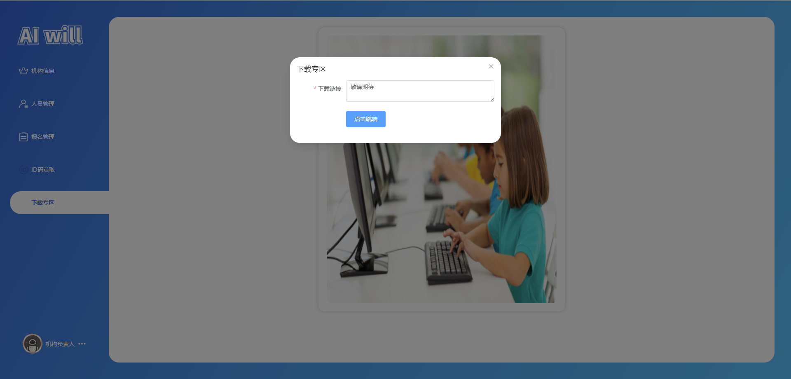
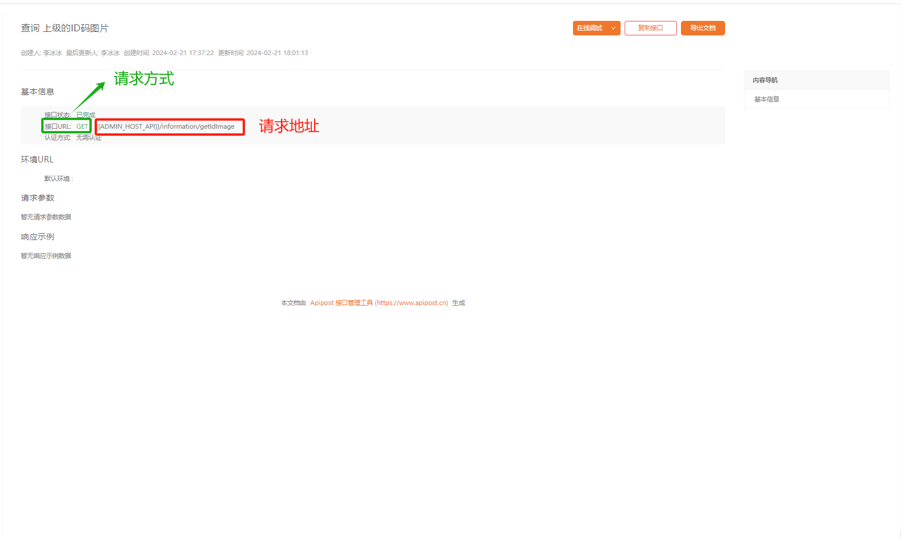

# 任务七、ID码获取模块及下载功能模块开发

## 任务描述

​	此模块的是开发一个ID码获取模块和一个下载链接功能模块。ID码获取模块需要能够由一级（总负责人）统一分配ID码给用户，用户通过支付后联系管理员以获取ID码，进而用于报名比赛。下载功能模块则需要允许用户通过提供的链接（如网盘分享地址）下载学习资料和比赛相关知识。

## 任务效果

### ID码获取

​	在本项目模块中，ID码获取流程由一级总负责人集中管理，通过微店平台的二维码支付实现。客户在完成支付后，将通过客服渠道接收到为其学生分配的唯一ID码，该码将用于赛事报名环节，确保报名的顺利进行和参赛者身份的准确匹配。


### 下载专区

​	在本项目模块中，下载专区作为一个教育资源平台，由一级总负责人负责维护和更新。总负责人将提供经过精心筛选的学习资料和比赛相关知识的网络链接，如网盘分享地址，供学生下载以辅助他们的学术和竞赛准备。



## 学习目标

### 知识目标

- [ ] 了解网络请求的代理设置，特别是在开发环境中如何处理跨域问题
- [ ] 理解并应用 Vue-Router 的高级特性，如嵌套路由、路由守卫、动态路由等，以实现复杂应用的导航结构和权限控制。
- [ ] 理解前端技术栈（如Vue.js、Element Plus等）和后端API交互

### 能力目标

- [ ] 能够使用Vue.js框架和Element Plus组件库完成ID码获取模块的前端界面设计和交互实现
- [ ] 能够使用Vue-Router，理解并应用 Vue-Router 的高级特性，以实现复杂应用的导航结构和权限控制
- [ ] 能够实现一个下载专区功能，通过创建一个可复用的Vue组件来集成文件下载链接，使用户能够方便地访问和下载所需的学习资料和比赛相关知识。
- [ ] 能够配置和 代理服务器解决开发环境中的跨域请求问题，确保API请求的正确性和安全性。

## 知识储备

### vue3的七种路由守卫

​	路由守卫（导航守卫）分为三种：全局守卫（3个）、路由独享守卫（1个）、组件的守卫（3个）

#### 一、全局路由守卫

##### 1.全局前置守卫（beforeEach）

​	使用方式：main.js中配置,在路由跳转前触发，这个钩子作用主要是用于登录验证，也就是路由还没跳转提前告知，以免跳转了再通知就为时已晚

```js
 router.beforeEach((to,from,next)=>{})
```

```js
 router.beforeEach((to,from,next)=>{
   if(to.path == '/login' || to.path == '/register'){
     next();
   }else{
     alert('您还没有登录，请先登录');
     next('/login');
   }
 })
```

除了以上判断to的页面是不是login或者register，还需要判断是不是有token：

在路由守卫这里，判断`token`是否存在，只有`token`存在的时候，才能跳转到内容页。

```js
 //导航守卫、路由守卫、路由拦截
 router.beforeEach((to,from,next) =>{
   //验证token,只有存在token的时候，才能跳转到内容页
   console.log(to);
   console.log(from);
   let token = localStorage.getItem("token");
   //console.log(token);
   if(token || to.path === '/login'){
     next();
     console.log(token);
   }else{
     next("/login");
   }
 })
```

##### 2.全局后置守卫（afterEach）

​	使用方式：main.js中配置,和beforeEach相反，它是在路由跳转完成后触发，它发生在beforeEach和beforeResolve之后，beforeRouteEnter（组件内守卫）之前。钩子不会接受next函数也不会改变导航本身

```js
 router.afterEach((to,from)=>{})
```

##### 3.全局解析守卫（beforeResolve）

​	使用方式：main.js中配置,这个钩子和beforeEach类似，也是路由跳转前触发，区别是在导航被确认之前，同时在所有组件内守卫和异步路由组件被解析之后，即在 beforeEach 和 组件内beforeRouteEnter 之后，afterEach之前调用

```js
 router.beforeResolve((to,from,next)=>{})
```

#### 二、组件内守卫

##### 1.路由进入之前（beforeRouteEnter）

​	使用方式：在组件模板中使用,跟methods: {}等同级别书写，组件路由守卫是写在每个单独的vue文件里面的路由守卫

```js
 beforeRouteEnter(to, from, next) {
     // 在组件生命周期beforeCreate阶段触发
     console.log('组件内路由前置守卫 beforeRouteEnter', this) // 访问不到this
     next((vm) => {
       console.log('组件内路由前置守卫 vm', vm) // vm 就是this
     })
   }
```

##### 2.页面更新时（beforeRouteUpdate）

```js
 beforeRouteUpdate (to, from, next) {
     // 同一页面，刷新不同数据时调用，
     // 可以访问组件实例 
 }
```

##### 3.路由离开时（beforeRouteLeave）

​	使用方式：在组件模板中使用,跟methods: {}等同级别书写，组件路由守卫是写在每个单独的vue文件里面的路由守卫

```js
beforeRouteLeave (to, from, next) {
    // 导航离开该组件的对应路由时调用
    // 可以访问组件实例
}
```

#### 三、路由独享守卫

##### 1.进入路由时触发（beforeEnter）

```js
const router = new VueRouter({
  routes: [
    {
      path: '/foo',
      component: Foo,
      beforeEnter: (to, from, next) => {
        // ...
      }
    }
  ]
})
```

## 任务实施

### 子任务7-1 编写配置文件

#### 1.配置vite.config.js

> 文件路径：/vite.config.js

代码如下：

```js
import { defineConfig, loadEnv } from 'vite'
import vue from '@vitejs/plugin-vue'
import { resolve } from 'path'

export default defineConfig(({ mode }) => {
  // 加载特定环境文件中的环境变量
  const env = loadEnv(mode, process.cwd());
  return {
    plugins: [vue()],
    resolve: {
      // 別名
      alias: {
        '@': resolve(__dirname, 'src')
      }
    },
    server: {
      host: "0.0.0.0", // 监听所有可用网络接口
      proxy: {
        // 省略此代码... 
          
         // 定义一个代理规则，用于处理对 '/res' 路径的请求
        '/res': {
          // 代理目标，即请求将被转发到的服务器地址，这里使用环境变量 VITE_APP_HOST 作为目标主机
          target: env.VITE_APP_HOST,
          changeOrigin: true,
          secure: false,
          // rewrite 函数用于重写请求的路径，这里将所有以 '/res' 开头的路径重写为 'res'，移除了前面的斜杠
          rewrite: (path) => path.replace(/^\/res/, 'res'),
        },
      }
    }
  }
})

```

### 子任务7-2 实现组件编写

#### 1.下载模态框组件

​	编写这个下载模态框组件的目的是为了提供一个用户交互界面，允许用户输入和管理下载专区的链接。通过使用Element UI的对话框组件和表单验证，结合Vue的响应式状态管理和API调用，这个组件使得用户能够方便地查看、修改或直接跳转到指定的下载链接。这样的设计不仅提高了用户操作的便捷性，还为系统管理员提供了一个简洁的管理界面，用于维护和更新下载资源。

> 文件路径：/src/components/download-modal/index.vue

代码如下：

```js
<template>
  <!-- 使用 Element UI 的对话框组件展示下载专区表单 -->
  <el-dialog v-model="dialog_visible" title="下载专区" width="512px">
    <!-- 一级 -->
    <el-form :model="form" label-width="120px" size="large">
      <!-- 下载链接输入项 -->
      <el-form-item label="下载链接" required>
        <el-input v-model="link" type="textarea" placeholder="请输入下载链接" />
      </el-form-item>
      <!-- 操作按钮项 -->
      <el-form-item label="">
        <el-button
          type="primary"
          @click="handleSubmit"
          v-if="userStore.info_data.role == 'organizing'"
          >确定修改</el-button
        >
        <el-button type="primary" @click="handleJumpLink" v-else
          >点击跳转</el-button
        >
      </el-form-item>
    </el-form>
  </el-dialog>
</template>
<script setup >
// 导入 Vue 的 Composition API
import { onMounted, ref } from "vue";
// 导入用户状态管理
import { useUserStore } from "@/store/user";
// 使用 Element Plus 的消息提示组件
import { ElMessage } from "element-plus";
// 导入 API 调用函数
import { getSysConfig, updateSysConfig } from "@/api/manage/index.js";

// 获取用户状态
const userStore = useUserStore();
// 控制对话框显示的响应式引用
const dialog_visible = ref(false);
// 存储下载链接的响应式引用
const link = ref("");
// 存储配置项ID的响应式引用
const id = ref("");

// 打开对话框的函数
const handleOpenModal = () => {
  dialog_visible.value = true;
};
// 获取配置
const handlegetSysConfig = async () => {
  let res = await getSysConfig();
  if (res.success) {
    link.value = res.entity.content;
    id.value = res.entity.id;
  }
};
// 提交接口
const handleSubmit = async () => {
  // TODO 判断连接是否正确
  let res = await updateSysConfig({
    id: id.value,
    content: link.value,
  });
  if (res.success) {
    ElMessage.success(res.message);
  }
  dialog_visible.value = false;
};
// 跳转到链接
const handleJumpLink = () => {
  window.open(link.value);
};

// 暴露方法给父组件调用
defineExpose({
  handleOpenModal,
});

// 组件挂载后获取系统配置
onMounted(() => {
  handlegetSysConfig();
});
</script>
<style lang="scss" scoped></style>
```

#### 2.用户状态管理

> 文件路径：/src/store/user

代码如下：

```js
/**
* 代码任务三已书写，此处省略...
*/
```

### 子任务7-2 编写ID码获取模块

#### 步骤一 ID码页面的搭建

> 文件路径：/src/view/manage/idcode.vue

代码如下：

```vue
<template>
  <div class="idassistant-container">
    <el-card class="main">
      <el-image :src="image" :preview-src-list="imageList" fit="fill">
        <template #error>
          <span class="image_col"> 请联系管理员! </span>
        </template>
      </el-image>
    </el-card>
  </div>
</template>
<script setup>
import { onMounted, ref } from "vue";
const image = ref("");

onMounted(() => {
});
</script>

<style lang="scss" scoped>
.idassistant-container {
  width: 100%;
  height: 100%;
  display: flex;
  justify-content: center;
  align-items: center;
  .main {
    width: 600px;
    margin-top: 24px;
    border-radius: 16px;
    .el-image {
      width: 100%;
      height: 650px;
      display: flex;
      justify-content: center;
      align-items: center;
      .image_col {
        color: red;
      }
    }
    .el-input {
      margin-top: 16px;
    }
  }
}
</style>
```

#### 步骤二 接口编写

##### 1.查看接口



##### 2.编写接口

```js
import { request } from "@/utils/axios"

省略上方代码...


/**
 * 获取上级ID码图片
 */
export function getIdImage() {
    return request(
        {
            url: "/information/getIdImage",
            method: "GET",
            data: {}
        }
    );
}
```

#### 步骤三 ID码页面接口对接

> 文件路径：/src/api/manage/agentmenu/index.js

代码如下：

```js
<template>
  <div class="idassistant-container">
    <el-card class="main">
      <el-image :src="image" :preview-src-list="imageList" fit="fill">
        <template #error>
          <span class="image_col"> 请联系管理员! </span>
        </template>
      </el-image>
    </el-card>
  </div>
</template>

<script setup>
import { onMounted, ref } from "vue";
import { getIdImage } from "@/api/manage/agentmenu/index";
const image = ref("");
const imageList = ref([]);
const handlegetldlmage = async () => {
  let res = await getIdImage();
  console.log(res);
  if (res.entity) {
    image.value = res.entity;
    imageList.value.push(image.value);
  }
};

onMounted(() => {
  handlegetldlmage();
});
</script>
<style lang="scss" scoped>
.idassistant-container {
  width: 100%;
  height: 100%;
  display: flex;
  justify-content: center;
  align-items: center;
  .main {
    width: 600px;
    margin-top: 24px;
    border-radius: 16px;
    .el-image {
      width: 100%;
      height: 650px;
      display: flex;
      justify-content: center;
      align-items: center;
      .image_col {
        color: red;
      }
    }
    .el-input {
      margin-top: 16px;
    }
  }
}
</style>
```

### 子任务7-3 编写下载专区组件

#### 步骤一 下载专区页面的搭建

​	此页面使用Vue框架和Element UI组件库构建，包含一个对话框组件，用于展示下载专区表单。表单中包含一个下载链接输入项和两个操作按钮：当用户角色为组织者时，显示“确定修改”按钮；否则，显示“点击跳转”按钮。我通过Vue的Composition API和状态管理实现了对话框的显示控制和用户角色的判断。此页面旨在提供一个直观、便捷的下载链接管理界面，方便用户根据不同的角色进行相应的操作。

> 文件路径：/src/components/download-modal

代码如下：

```vue
<template>
  <!-- 使用 Element UI 的对话框组件展示下载专区表单 -->
  <el-dialog v-model="dialog_visible" title="下载专区" width="512px">
    <!-- 一级 -->
    <el-form :model="form" label-width="120px" size="large">
      <!-- 下载链接输入项 -->
      <el-form-item label="下载链接" required>
        <el-input v-model="link" type="textarea" placeholder="请输入下载链接" />
      </el-form-item>
      <!-- 操作按钮项 -->
      <el-form-item label="">
        <el-button
          type="primary"
          @click="handleSubmit"
          v-if="userStore.info_data.role == 'organizing'"
          >确定修改</el-button
        >
        <el-button type="primary" @click="handleJumpLink" v-else
          >点击跳转</el-button
        >
      </el-form-item>
    </el-form>
  </el-dialog>
</template>

<script setup >
// 导入 Vue 的 Composition API
import { onMounted, ref } from "vue";
// 导入用户状态管理
import { useUserStore } from "@/store/user";
// 获取用户状态
const userStore = useUserStore();
// 控制对话框显示的响应式引用
const dialog_visible = ref(false);
    
// 打开对话框的函数
const handleOpenModal = () => {
  dialog_visible.value = true;
};
// 暴露方法给父组件调用
defineExpose({
  handleOpenModal,
});

    
<style lang="scss" scoped></style>
```

#### 步骤二 接口编写

> 文件路径：/src/api/manage/index.js

查询指定key的配置内容:  `information/getManager`

修改指定配置:  `organizing/updateSysConfig`

```js
import { request } from "@/utils/axios"

// 查询指定key的配置内容
export function getSysConfig() {
    /**
    * 代码任务4已书写，此处省略...
    */
}
// 修改指定配置
export function updateSysConfig(data) {
    /**
    * 代码上任务4已书写，此处省略...
    */
}
```

#### 步骤三 实现下载页面整体对接

​	通过之前的路由配置和接口开发，实现下载页面整体对接的目的是为了提供一个用户界面，让用户能够方便地管理和访问下载资源。这个对话框组件使用Element UI库构建，允许用户输入和管理下载链接，并通过API调用与后端系统进行交互。组件的功能包括获取当前的下载链接配置、允许具有相应权限的用户修改链接，以及其他用户直接跳转到提供的下载页面。通过这种方式，下载专区成为了一个集成了用户交互、状态管理和数据验证的多功能模块，适用于各种需要提供文件下载服务的应用程序。

> 文件路径：/src/components/download-modal

代码如下：

```vue
<template>
  <!-- 使用 Element UI 的对话框组件展示下载专区表单 -->
  <el-dialog v-model="dialog_visible" title="下载专区" width="512px">
    <!-- 一级 -->
    <el-form :model="form" label-width="120px" size="large">
      <!-- 下载链接输入项 -->
      <el-form-item label="下载链接" required>
        <el-input v-model="link" type="textarea" placeholder="请输入下载链接" />
      </el-form-item>
      <!-- 操作按钮项 -->
      <el-form-item label="">
        <el-button
          type="primary"
          @click="handleSubmit"
          v-if="userStore.info_data.role == 'organizing'"
          >确定修改</el-button
        >
        <el-button type="primary" @click="handleJumpLink" v-else
          >点击跳转</el-button
        >
      </el-form-item>
    </el-form>
  </el-dialog>
</template>
<script setup >
// 导入 Vue 的 Composition API
import { onMounted, ref } from "vue";
// 导入用户状态管理
import { useUserStore } from "@/store/user";
// 使用 Element Plus 的消息提示组件
import { ElMessage } from "element-plus";
// 导入 API 调用函数
import { getSysConfig, updateSysConfig } from "@/api/manage/index.js";

// 获取用户状态
const userStore = useUserStore();
// 控制对话框显示的响应式引用
const dialog_visible = ref(false);
// 存储下载链接的响应式引用
const link = ref("");
// 存储配置项ID的响应式引用
const id = ref("");

// 打开对话框的函数
const handleOpenModal = () => {
  dialog_visible.value = true;
};
// 获取配置
const handlegetSysConfig = async () => {
  let res = await getSysConfig();
  if (res.success) {
    link.value = res.entity.content;
    id.value = res.entity.id;
  }
};
// 提交接口
const handleSubmit = async () => {
  // TODO 判断连接是否正确
  let res = await updateSysConfig({
    id: id.value,
    content: link.value,
  });
  if (res.success) {
    ElMessage.success(res.message);
  }
  dialog_visible.value = false;
};
// 跳转到链接
const handleJumpLink = () => {
  window.open(link.value);
};

// 暴露方法给父组件调用
defineExpose({
  handleOpenModal,
});

// 组件挂载后获取系统配置
onMounted(() => {
  handlegetSysConfig();
});
</script>
<style lang="scss" scoped></style>
```

#### 步骤四 使用下载专区

​	在上文中，我们已经对下载专区页面进行了封装处理。我们可以非常方便地引入这个封装好的组件来搭建和使用下载专区页面。这样不仅能减少重复代码，提高代码的可维护性，还能确保各个使用到下载专区功能的页面都保持一致的界面和交互逻辑。

> 文件路径：/src/view/manage/components/menu.vue

代码如下：

```vue
<template>
  <!-- 课件任务四 已书写过，避免重复，此处部分代码省略 -->

  <!-- 下载模态框引用 -->
  <DownloadModal ref="DownloadModalRef" />
</template>

<script  setup>
// 引入下载模态框组件
import DownloadModal from "@/components/download-modal/index.vue";
// 图片资源导入
    
// 此处省略...

const DownloadModalRef = ref();
/**
 * 菜单选择
 */
const handleMenuSelect = (index) => {
  let find = menu_list.value.find((item) => item.index == index);
  if (find) {
    if (find.type == "modal" && find.index == "download") {
     // 调取子组件的handleOpenModal方法
      DownloadModalRef.value.handleOpenModal();
    } else {
      default_active.value = index;
      router.push({
        name: index,
      });
    }
  }
};
// 组件挂载后执行的逻辑
onMounted(() => {
 // 此处省略...
});
</script>

<style lang="scss" scoped>
// 省略此代码
</style>
```

### 子任务7-4 实现路由配置

​	配置路由守卫的目的是为了增强应用程序的安全性和功能性，确保用户在访问特定路由前满足一定的条件，如登录状态验证、权限控制等。通过在路由配置中使用守卫，我们可以对用户的访问请求进行预处理，根据用户的角色和状态决定是否允许访问目标路由或重定向到其他页面，例如登录页面或权限提示页面。

#### 步骤一 配置路由守卫

> 文件路径：/src/view/router/index.js

代码如下：

```js
import { createRouter, createWebHashHistory } from "vue-router";
// 无需登录的页面
const LOGIN_ROUTERS = "manage"
router.beforeEach((to, from, next) => {
    if (to.fullPath.indexOf(LOGIN_ROUTERS) != -1) {
        let token = localStorage.getItem("token")
        if (!token) {
            return next("/auth/login");
        }
    }
    return next(true)
})
```

#### 步骤二 编写404页面

​	配置此路由守卫的目的是为了确保用户在尝试访问需要认证的页面（如管理页面）时，必须已经通过身份验证。这是通过检查用户的token来实现的，如果用户未提供token或token无效，则重定向到登录页面。这样用户会被引导到正确的页面，而不是直接显示无权限访问的错误信息。

> 文件路径：/src/view/404.vue

代码如下：

```vue
<template>
  <!-- 使用 Element Plus 的 Result 组件来展示一个 404 页面不存在的结果提示 -->
  <el-result icon="warning" title="404" sub-title="页面不存在">
    <!-- 使用插槽 extra 来添加额外的内容，如按钮 -->
    <template #extra>
      <el-button type="primary" @click="handleBackHome">返回首页</el-button>
    </template>
  </el-result>
</template>

<script setup>
// 使用 Vue 的 Composition API 来定义一个返回首页的方法
const handleBackHome = () => {
  // 设置浏览器的当前地址为根目录（"/"），从而返回首页
  location.href = "/";
};
</script>

```

#### 步骤三 配置404页面

​	配置404页面的目的是为了提供一个统一的错误处理页面，当用户尝试访问不存在的路由时，能够引导他们到一个友好的错误提示页面，而不是显示一个空白或不友好的默认错误页面。这样的配置增强了用户体验，帮助用户理解他们访问的页面不存在。该规则使用通配符`:pathMatch(.*)*`来匹配所有未被其他路由规则处理的路径。当这样的路径被请求时，将加载并显示404页面组件。在Vue Router中，这个组件是通过动态导入的方式懒加载的，这样可以避免在初始加载时增加主包的大小。

> 文件路径：/src/view/router/index.js

代码如下：

```js
import { createRouter, createWebHashHistory, createWebHistory } from "vue-router";
// routes
const routes = [
  	// 此处代码省略
    
    // 对于所有未定义的路径,自动匹配404页面
    {
        path: '/:pathMatch(.*)*', component: () => import("@/view/404.vue")
    },
]
```

**404效果图：**

