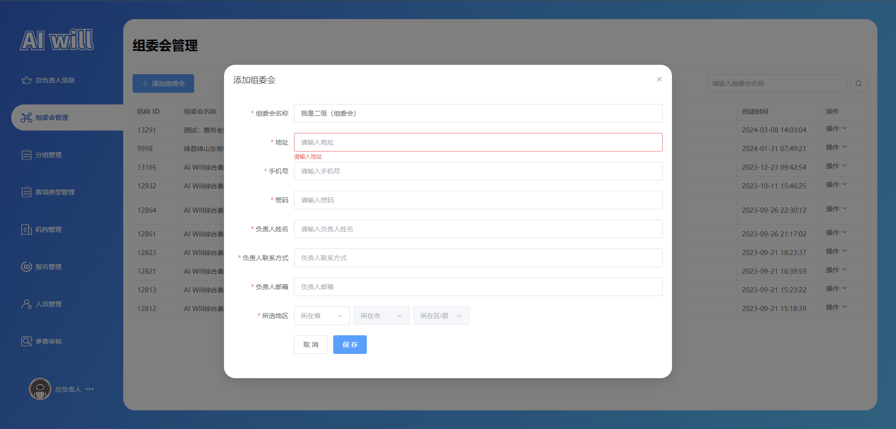
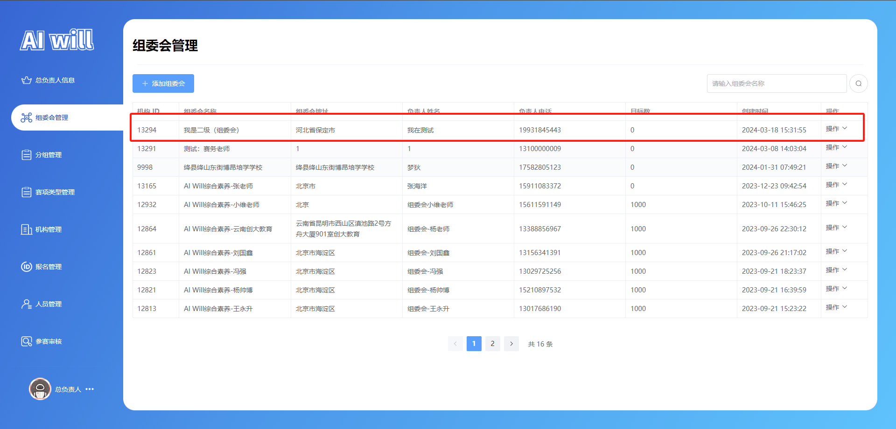
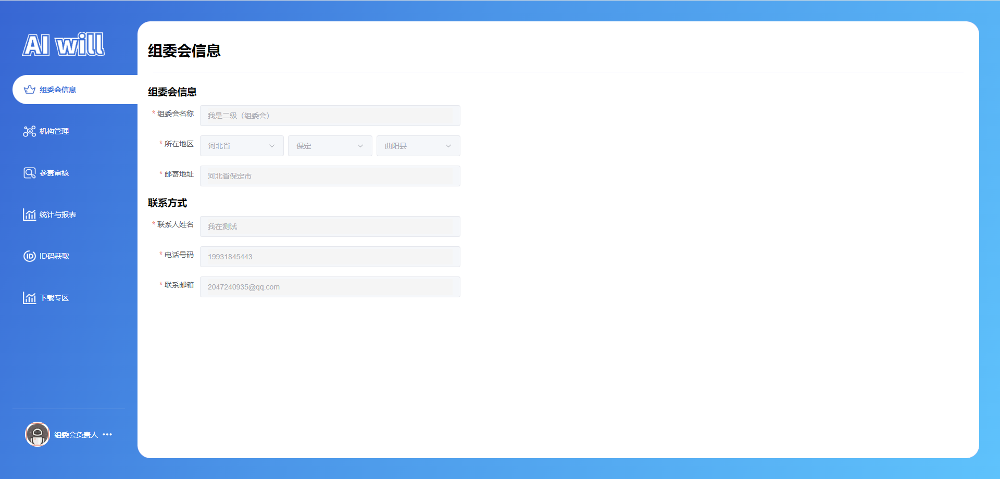
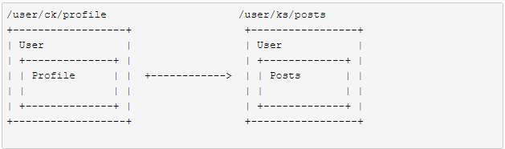
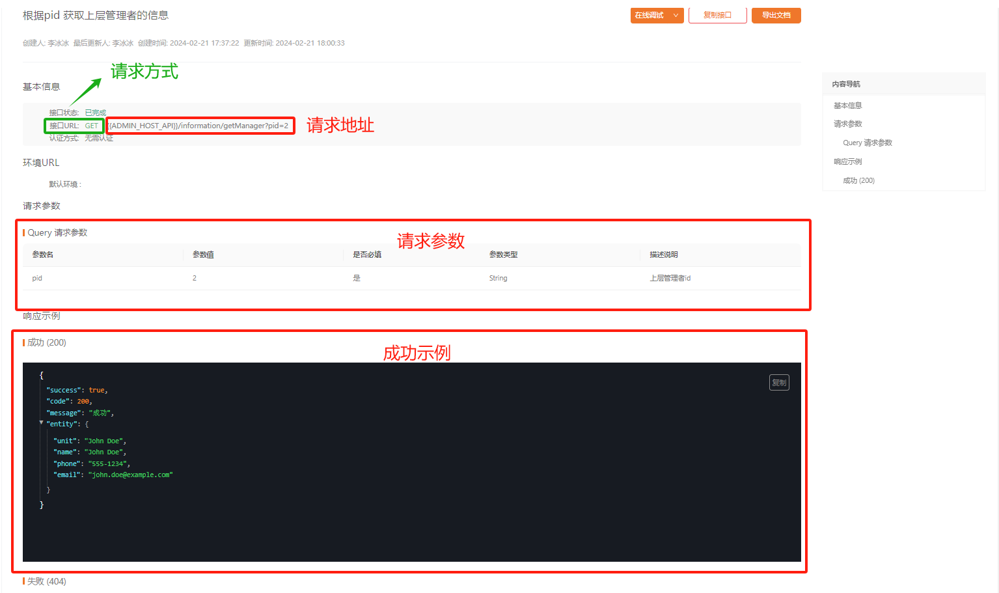
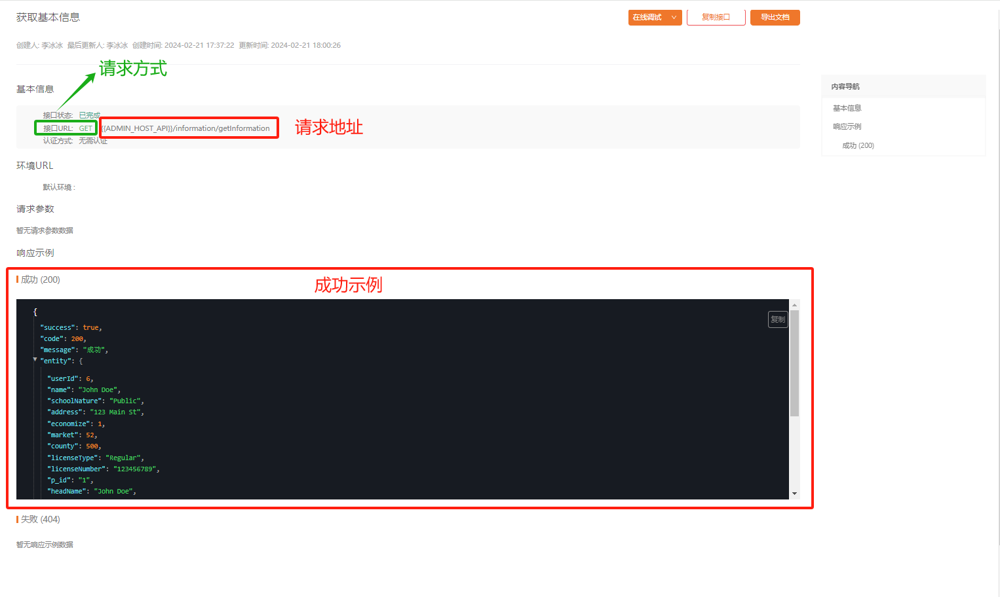

# 任务八、实现组委会信息模块

## 任务描述

​	本任务旨在开发一个组委会信息管理模块，该模块将集中展示和管理组委会的关键信息。这包括组委会的名称、地理位置（省、市、区/县）、邮寄地址以及联系信息（联系人姓名、电话号码、电子邮箱）。用户将能够通过此模块查看这些信息，但模块将默认以只读模式展示，以确保信息的准确性和一致性

## 任务效果

### 创建组委会负责人账号

#### 1.上级账号的操作

​	使用总负责人账号登录系统后，进入账号管理模块。在这里，总负责人可以创建新的二级账号，即组委会负责人账号。创建过程中，需要填写相关的信息，如用手机号、密码、负责人姓名等



#### 2.账号创建与验证

- **创建成功提示**：在完成必要的信息输入和权限设置后，系统会进行验证，确保所有信息准确无误。验证通过后，系统将创建新的组委会负责人账号，并提供一个成功提示或确认信息。
- **账号列表更新**：创建完成后，新的组委会负责人账号会立即出现在一级账号的组委会负责人列表中，表明账号已成功添加到系统中。



#### 3.二级账号的登录与使用

- **登录操作**：组委会负责人使用分配给他们的账号信息登录系统。登录成功后，他们将能够访问和管理系统分配给他们的特定功能和数据。
- **功能访问**：组委会负责人账号通常拥有比普通用户更高但低于总负责人的权限。他们可以执行特定的任务，如管理下属账号、审批申请等。


### 组委会管理模块



## 学习目标

### 知识目标

- [ ] 理解Vue Router的工作原理，包括路由的定义、路由参数和查询等。

- [ ] 理解并应用Element UI的布局组件，如`el-container`、`el-aside`和`el-main`，以构建响应式的后台管理界面。

- [ ] 理解axios库的工作原理，包括HTTP请求的发送、响应处理、错误处理等。

- [ ] 掌握如何导入和使用Element Plus图标库，以丰富界面的视觉效果。


### 能力目标

- [ ] 能够使用Vue Router完成单页面应用的路由管理
- [ ] 能够使用Element UI组件库实现响应式后台管理界面
- [ ] 能够使用axios库与后端API进行数据交互
- [ ] 能够使用Vue的响应式引用管理表单状态和用户输入

## 知识储备

### vue-router的基本使用

​	Vue-router 是 `Vue.js`官方的路由管理器。它和 `Vue.js`的核心深度集成，让构建单页面应用变得易如反掌

#### 1.单页面应用

​	单页面应用程序将所有的活动局限于一个Web页面中，仅在该Web页面初始化时加载相应的HTML、JavaScript 和 CSS。一旦页面加载完成，SPA不会因为用户的操作而进行页面的重新加载或跳转。取而代之的是利用 JavaScript 动态的变换HTML的内容，从而实现UI与用户的交互。

#### 2.路由管理器

> 这里的路由管理器并不是我们平时生活中的硬件路由器，这里的路由就是单页应用（SPA）的路径管理器，就是为了解决Vue.js开发单页面应用不能进行链接跳转，我们通过路径的的方式来管理不同的页面

了解Vue-router所解决的问题之后， 我们开始学习Vue-router在项目中常用的一些功能：

- 嵌套的路由/视图表
- 模块化的、基于组件的路由配置
- 路由参数、查询、通配符
- 细粒度的导航控制

#### 3.动态路由匹配

示例：

> router.js

```js
import Vue from 'vue' // 引入Vue
import Router from 'vue-router' // 引入vue-router
import Home from '@/pages/Home' //引入根目录下的Hello.vue组件
 
// Vue全局使用Router
Vue.use(Router)
​
/*使用 Vue.js + Vue-router构建单页面应用, 只要通过组合组件来组成我们的应用程序, 我们引入Vue-router,只要将组件映射到路由,告诉Vue-router在那里渲染它们
*/
​
let routes = [ // 配置路由，这里是个数组
  { // 每一个链接都是一个对象
    path: '/', // 链接路径
    name: 'Home', // 路由名称，
    component: Home // 对应的组件模板
  },
  // 动态路径参数 以冒号开头
  { path: '/user/:username', // 动态路由
    component: () => import('../pages/User1'), // 按需加载路由对应的组件, 需要下载polyfill兼容ES6语法
  },
  {   // 多段路径参数
    path: '/user/:id/post/:post_id', // 动态路由
    component: () => import('../pages/User2'), // 按需加载路由对应的组件, 需要下载polyfill兼容ES6语法
  },
]

export default new Router({
  routes
})
```

```js
User1
用户访问 /#/user/xxx的时候展示该组件
<template>
  <div class="User1">
    User1 - 单个路径参数
  </div>
</template>
User2

用户访问 /#/user/xxx/post/xxx的时候展示该组件

<template>
  <div class="User2">
    User2 - 多段路径参数路由
  </div>
</template>
```

两种方式：watch (监测变化) `$route` 对象, `beforeRouteUpdate`导航守卫

向`user1.vue`增加下面代码

```js
<template>
  <div class="User1">
    <!-- 通过router对象可以获取到路由属性， 这种方式耦合了，后面会讲路由组件传参的方式 -->
    User1 -{{$route.params.username}} 单个路径参数
  </div>
</template>

<script>
export default {
  name: 'User1',
  // 侦听route对象方式
  watch: {
    $route (to, from) {
      this.$message.success(`watch -> ${to.path}, ${from.path}`)
    },
    
  },
  // vue2.2引入的导航守卫，当路由参数发生变化调用
  beforeRouteUpdate (to, from, next) {
    this.$message.info(`导航守卫 -> ${to.path}, ${from.path}`)
    // 一定要调用next让其继续解析下一个管道中的路由组件
    next()
  }
}
</script>
```

#### 4.路由组件传参

​	上面在`<tempate>`模板中通过`$router.prarams.username`方式获取路由传递的参数已经于其对应路由形成高度耦合，限制了其灵活性， 我们可以通过`props`将组件和路由进行解耦

props传递路由组件参数有三种方式：

- 布尔模式
- 对象模式
- 函数模式

**代码**

> router.js

```js
import Vue from 'vue'
import Router from 'vue-router'
import home from '@/pages/Home'

Vue.use(Router)

let routes = [
  {
    path: '/',
    name: 'Home',
    component: home
  },
  {  // 动态路径参数 以冒号开头
    path: '/user1/:username', // 动态路由
    component: () => import('../pages/User1'),
    props: true  
    // 布尔模式: 如果 props 被设置为 true，route.params 将会被设置为组件属性。
  },
  { 
    path: '/user2', 
    component: () => import('../pages/User2'),
    props: {username: 'ck'} // 对象模式: 只有静态路由才能有效, 并且参数是写死的
  },
  {
    path: '/user3/:username', 
    component: () => import('../pages/User3'),
    // 返回了用户url中的参数 比如 /user3?username='ck' => {username: 'ck} 最终还是以对象模式的方式返回参数
    props: (route) => ({username: route.query.username}) // 函数模式
  }
]
​
export default new Router({
  routes
})
```

##### 4.1 布尔模式

```js
User1
布尔模式

<template>
  <div class="User1">
    User1 -{{username}} 
  </div>
</template>

<script>
export default {
  name: 'User1',
  props: ['username']  // 通过props获取路由传递给对应组件的参数
}
</script>
```

##### 4.2 对象模式

```js
User2

对象模式

<template>
  <div class="User2">
    User2 - {{username}} 
  </div>
</template>

<script>
export default {
  name: 'User2',
  props: ['username']  // 通过props获取路由传递给对应组件的参数
}
</script>
```

##### 4.3 函数模式

```js
User3

函数模式

<template>
  <div class="User3">
    User3 - {{username}}
  </div>
</template>

<script>
export default {
  name: 'User3',
  props: ['username']  // 通过props获取路由传递给对应组件的参数
}
</script>
```

#### 5.嵌套路由

​	实际生活中的应用界面，通常由多层嵌套的组件组合而成。同样地，URL 中各段动态路径也按某种结构对应嵌套的各层组件，例如：



> router.js

```js
import Vue from 'vue'
import Router from 'vue-router'
import home from '@/pages/Home'

Vue.use(Router)

let routes = [
  {
    path: '/',
    name: 'Home',
    component: home,
  },
  {
    path: '/user/:username', // 动态路由
    name: 'User',
    component: () => import('../components/User'),
    children: [
      {
       // 当 '/user/:username/profile' 匹配成功， UserProfile 会被渲染在 User 的 <router-view> 中
        path: 'profile', // 可以匹配 /user/ks/profile
        name: 'Profile',
        component: () => import('../components/Profile')
      },
      {
        path: '/user/:usrname/posts', // 这样也可以匹配 /user/ks/posts， 但其实是将其匹配为了根组件的/user:username动态组件下的 posts
        name: 'Posts',
        component: () => import('../components/Posts')
      },
      {
        path: '',
        name: 'UserHome',
        // 当 /user/:username 匹配成功，比如 /user/ks || /user/ck
        // UserHome 会被渲染在 User 的 <router-view> 中
        component: () => import('../components/UserHome')
      },
    ]
  },
  {
    path: '/footer',
    name: 'Foo',
    component: () => import('../components/Footer')
  }
]

export default new Router({
  routes
})

```

#### 6.声明式/编程式导航

| 声明式                            | 编程式                |
| --------------------------------- | --------------------- |
| `<router-link :to="..." replace>` | `router.replace(...)` |

```js
<template>
  <div class="home">
       <!-- 声明式 -->
    <router-link
      to="footer"
      tag="button"
    >
        to footer
    </router-link>  
      
    <!-- 编程式 -->
    <button @click="$router.push('footer')">字符串-写路由路径的方式</button>
    <button @click="$router.push({path: '/footer'})">对象-写路径的方式</button>
    <button @click="$router.push({name: 'Foo', params: {'userId': '123'}})">name和params - 写路由名称携带参数的方式</button>
    <button @click="$router.push({path: '/footer', query: {'userId': '456'}})">queyr和path - 写路由路径携带参数的方式</button>
    <router-view></router-view>
  </div>
</template>

<script>
export default {
  name: 'home',
  data () {
    return {
    }
  },
  methods: {
  }
}
</script>
<style>
button {
  display: block;
}
</style>
```

- `router.push(location, onComplete?, onAbort?)`
- `router.replace(location, onComplete?, onAbort?)`

这两种的方式一样, 唯一区别在于 `push`会产生路由的历史记录, 而`repalce`不会产生, 这对于window中的`history`是一致的

```js
<!-- router.go方法 -->
<template>
     <button @click="goForward">go(1)-前进一步</button>
    <button @click="goBack">go(-1)-后退一步</button>
    <button @click="gogogo">go(100)-前进一白步</button>   
 </template>

<script>
 export default {
    name: 'home'
    methods: {
        goForward () {
          // 从历史路由中前进一步相当于 window.history.forward
          this.$router.go(1);
        },
        goBack () {
              // 从历史路由中后退一步相当于 window.history.back
              this.$router.go(-1);
        },
        gogogo () {
              // 历史路由中没有100步, 就啥也不干
              this.$router.go(100);
        }
    }  
 }
</script>
```

#### 7.命名路由/命名视图/重定向和别名

> router.js

```js
import Vue from 'vue'
import Router from 'vue-router'
import UserSettings from '@/pages/UserSettings'

Vue.use(Router)

let routes = [
  {
    path: '/',
    redirect: '/settings' // 重定向
  },
  {
    path: '/settings',
    name: 'Settings', // 命名路由
    alias: '/a', // 取别名，当url中访问 /a -> 也是访问的 settings组件但是路由匹配的是/a, 就相当于用户访问 /a一样
    // 你也可以在顶级路由就配置命名视图
    component: UserSettings,
    children: [
      {
        path: 'emails',
        component: () => import('../pages/UserEmails')
      }, 
      {
        path: 'profile',
        components: {
          default: () => import('../pages/UserProfile'),
          helper: () => import('../pages/UserProfilePreview')
        }
      }
    ]
  }
]

export default new Router({
  routes
})
```

## 任务实施

### 子任务8-1 实现组件编写

#### 1.编写省份选择组件

> 文件路径：/src/components/province-select/index.vue

代码如下：

```js
/**
* 代码任务四已书写，此处省略...
*/
```

#### 2.用户状态管理

> 文件路径：/src/store/user

代码如下：

```js
/**
* 代码任务三已书写，此处省略...
*/
```

### 子任务8-2 实现编写接口

##### 步骤一 查看接口





##### 步骤二 编写接口

> 文件路径：/src/api/common.js

查询上级: ` information/getManager`

```js
import { request } from "@/utils/axios"

/**
 * 查询上级
 */

export function getManagerApi(pid = "") {
    return request(
        {
            url: 'information/getManager',
            method: "GET",
            data: {},
            params: {
                pid: pid
            },
        }
    );
}
```

> 文件路径：/src/api/manage/competition/index.js

获取基本信息：`/information/getInformation`

```js
import { request } from "@/utils/axios"

/**
 * 获取组委会负责人基本信息
 */
export function getInformation() {
    return request(
        {
            url: "/information/getInformation",
            method: "GET",
        }
    );
}

```

### 子任务8-3 编写组委会信息模块

#### 步骤一 路由搭建

> 文件路径：/src/router/index.js

代码如下：

```js
import { createRouter, createWebHashHistory, createWebHistory } from "vue-router";
// routes
const routes = [
    {
        redirect: "/home",
        path: "/"
    },
    // 首页
    {
        path: '/home',
        name: "home",
        component: () => import("@/view/home/index.vue")
    },
    // 管理页
    {
        path: '/manage',
        name: "manage",
        component: () => import("@/view/manage/index.vue"),
        children: [
            // ---------- 机构负责人 ----------
           	// 此处代码省略...

        
            // ---------- 组委会负责人 ----------
            // 组委会菜单路由
            {
                path: 'committee',
                name: "manage-committee",
                component: () => import('@/view/manage/agentmenu/committee.vue'),
                meta: {
                    index: "manage-committee",
                }
            },
        ]
    },
    // auth
    {
        path: '/auth',
        redirect: "/auth/login",
        component: () => import("@/view/auth/index.vue"),
        children: [
            // 登录
            // 此处代码省略...
        ]
    },
    // 对于所有未定义的路径,自动匹配404页面
    {
        path: '/:pathMatch(.*)*', component: () => import("@/view/404.vue")
    },
]

// router
const router = createRouter({
    history: import.meta.env.VITE_MODE == 'dev' ? createWebHashHistory() : createWebHistory(),
    routes
});
// 无需登录的页面
const LOGIN_ROUTERS = "manage"
router.beforeEach((to, from, next) => {
    if (to.fullPath.indexOf(LOGIN_ROUTERS) != -1) {
        let token = localStorage.getItem("token")
        if (!token) {
            return next("/auth/login");
        }
    }
    return next(true)
})
export default router;
```

#### 步骤二 页面搭建

​	这个页面的是为了展示和管理组委会的信息，包括组委会的名称、所在地区、邮寄地址以及联系方式等。这个页面允许用户查看这些信息，但在这个模板中，所有的输入字段都被禁用了，这意味着用户不能编辑这些信息。这样的设计可能是为了展示组委会的固定信息，而不是让用户进行修改。


- 使用Vue.js框架的组件化思想，将页面分为头部和表格内容两个主要部分。
- 使用Element UI库中的`<el-row>`和`<el-col>`组件来构建页面的布局。
- 使用`<el-form>`组件来组织表单数据，`<el-form-item>`组件来包裹每个输入字段。
- 使用Vue的`ref`来创建响应式引用`form`，用于存储组委会的信息。
- 使用`v-model`指令将表单输入字段与`form`对象的属性进行双向绑定。
- 引入`ProvinceSelect`组件，用于选择地区，这个组件可能是自定义的，用于处理省份、市和县的三级联动选择。

> 文件路径：/src/view/manage/agentmenu/committee.vue

代码如下：

```vue
<template>
  <!-- 页面容器 -->
  <div class="header_information page-container">
    <!-- 头部信息区域 -->
    <el-row class="header_name">
      <!-- 标题 -->
      <el-col :span="24" class="header_text">
        <h1>组委会信息</h1>
      </el-col>
      <el-col :span="24">
        <div class="header_line"></div>
      </el-col>
    </el-row>
    <!-- 表格内容区域 -->
    <el-row>
      <!-- 组委会信息表单 -->
      <el-col :span="24">
        <h3 class="contnet_text">组委会信息</h3>
        <el-form
          :model="form"
          ref="i_data_ref"
          :rules="i_data_rules"
          label-width="100px"
        >
          <el-form-item label="组委会名称" prop="name">
            <el-input
              placeholder="请填写单位名称"
              v-model="form.name"
              class="content_input"
              disabled
            />
          </el-form-item>

          <!-- 所在地区选择 -->
          <el-form-item label="所在地区" prop="county">
            <div class="select_region">
              <ProvinceSelect
                v-model:economize="form.economize"
                v-model:market="form.market"
                v-model:county="form.county"
                :showCounty="true"
                disabled
              />
            </div>
          </el-form-item>

          <!-- 邮寄地址输入 -->
          <div class="select_region">
            <el-form-item label="邮寄地址" prop="address">
              <el-input
                v-model="form.address"
                placeholder="请填写机构邮寄地址"
                class="content_input"
                v-model.trim="inputValueTrim"
                disabled
              />
            </el-form-item>
          </div>

          <!-- 联系方式区域标题 -->
          <el-col :span="24">
            <h3 class="contnet_text">联系方式</h3>

            <el-form-item label="联系人姓名" prop="headName">
              <el-input
                placeholder="请输入联系人姓名"
                v-model="form.headName"
                class="content_input"
                v-model.trim="inputValueTrim"
                disabled
              />
            </el-form-item>

            <el-form-item label="电话号码" prop="headPhone">
              <el-input
                placeholder="请输入联系人电话号码"
                v-model="form.headPhone"
                class="content_input"
                v-model.trim="inputValueTrim"
                disabled
              />
            </el-form-item>

            <el-form-item label="联系邮箱" prop="headEmail">
              <el-input
                placeholder="请输入联系人电子邮箱"
                v-model="form.headEmail"
                class="content_input"
                v-model.trim="inputValueTrim"
                disabled
              />
            </el-form-item>
          </el-col>
        </el-form>
      </el-col>
    </el-row>
  </div>
</template>

<script  setup>
// 导入组件和API
import ProvinceSelect from "@/components/province-select/index.vue";
import { onMounted, ref } from "vue";
// 基本信息
const form = ref({});
    
</script>

<style lang="scss" scoped>
:deep(.el-space__item) {
  width: 100%;
  &:nth-child(3) {
    margin: 0 !important;
  }
}
.header_information {
  padding: 20px;
  .header_name {
    margin-left: 10px;
    margin-right: 10px;
    .header_text {
      margin-left: -10px;
      margin-right: -10px;
    }
    h1 {
      font-size: 28px;
    }
  }
  .header_line {
    display: block;
    height: 1px;
    width: 100%;
    margin: 24px 0;
    background-color: #8473f717;
  }
  .contnet_text {
    margin-bottom: 14px;
  }
  .content_input {
    width: 500px;
  }
  :deep(.el-input__wrapper) {
    padding: 0 15px;
  }
  :deep(.el-input.is-disabled) .el-input__inner {
    background-color: #f5f5f5;
  }
  .select_region {
    width: 500px;
    display: flex;
    justify-content: space-between;
    .el_form_content_text {
      width: 500px;
      height: 120px;
      display: flex;
      flex-direction: column;
      justify-content: flex-start;
      .content_text_relation {
        font-size: 14px;
      }
      .content_text_contacts {
        color: #000;
        font-weight: bold;
      }
      span {
        color: #202020;
        font-size: 14px;
      }
    }
  }
  :deep(.el-input) {
    height: 40px;
  }
  .content_select {
    width: 160px;
  }
  // 保存信息按钮
  .save_btn {
    margin-left: 100px;
  }
}
</style>
```

#### 步骤三 组委会信息页面接口编写

​	通过之前的路由配置和接口开发以及页面搭建，配置组委会信息页面的目的是为了提供一个界面，让组委会成员能够查看和编辑组委会的基本信息。这个页面包含了组委会的名称、所在地区、邮寄地址以及联系方式等字段，通过使用Element Plus的表单组件和自定义的地区选择组件，页面为用户提供了一个直观且易于操作的编辑环境。

> 文件路径：/src/view/manage/agentmenu/committee.vue

代码如下：

```vue
<template>
  <!-- 页面容器 -->
  <div class="header_information page-container">
    <!-- 头部信息区域 -->
    <el-row class="header_name">
      <!-- 标题 -->
      <el-col :span="24" class="header_text">
        <h1>组委会信息</h1>
      </el-col>
      <el-col :span="24">
        <div class="header_line"></div>
      </el-col>
    </el-row>
    <!-- 表格内容区域 -->
    <el-row>
      <!-- 组委会信息表单 -->
      <el-col :span="24">
        <h3 class="contnet_text">组委会信息</h3>
        <el-form
          :model="form"
          ref="i_data_ref"
          :rules="i_data_rules"
          label-width="100px"
        >
          <el-form-item label="组委会名称" prop="name">
            <el-input
              placeholder="请填写单位名称"
              v-model="form.name"
              class="content_input"
              disabled
            />
          </el-form-item>

          <!-- 所在地区选择 -->
          <el-form-item label="所在地区" prop="county">
            <div class="select_region">
              <ProvinceSelect
                v-model:economize="form.economize"
                v-model:market="form.market"
                v-model:county="form.county"
                :showCounty="true"
                disabled
              />
            </div>
          </el-form-item>

          <!-- 邮寄地址输入 -->
          <div class="select_region">
            <el-form-item label="邮寄地址" prop="address">
              <el-input
                v-model="form.address"
                placeholder="请填写机构邮寄地址"
                class="content_input"
                v-model.trim="inputValueTrim"
                disabled
              />
            </el-form-item>
          </div>

          <!-- 联系方式区域标题 -->
          <el-col :span="24">
            <h3 class="contnet_text">联系方式</h3>

            <el-form-item label="联系人姓名" prop="headName">
              <el-input
                placeholder="请输入联系人姓名"
                v-model="form.headName"
                class="content_input"
                v-model.trim="inputValueTrim"
                disabled
              />
            </el-form-item>

            <el-form-item label="电话号码" prop="headPhone">
              <el-input
                placeholder="请输入联系人电话号码"
                v-model="form.headPhone"
                class="content_input"
                v-model.trim="inputValueTrim"
                disabled
              />
            </el-form-item>

            <el-form-item label="联系邮箱" prop="headEmail">
              <el-input
                placeholder="请输入联系人电子邮箱"
                v-model="form.headEmail"
                class="content_input"
                v-model.trim="inputValueTrim"
                disabled
              />
            </el-form-item>
          </el-col>
        </el-form>
      </el-col>
    </el-row>
  </div>
</template>

<script  setup>
// 导入组件和API
import ProvinceSelect from "@/components/province-select/index.vue";
import { useUserStore } from "@/store/user";
import { getManagerApi } from "@/api/common"; // 查询上级api
import { getInformation } from "@/api/manage/competition/index.js"; // 获取基本信息api
import { onMounted, ref } from "vue";
import { ElMessage } from "element-plus";

// 表单数据模型
const form = ref({});

// 获取组委会信息的函数
const handleGetInformation = async () => {
  let res = await getInformation();
  if (res.success) {
    form.value = res.entity;
  }
};

//  表单验证规则
const i_data_ref = ref();
// 手机号
const checkPhone = (rule, value, callback) => {
  const phoneReg = /^1[3|4|5|6|7|8|9][0-9]{9}$/;
  if (!value) {
    callback(new Error("手机号码不能为空"));
  }
  if (phoneReg.test(value)) {
    callback();
  } else {
    callback(new Error("手机号码格式错误"));
  }
};

const checkName = (rule, value, callback) => {
  const chineseCharactersRegex = /^[\u4e00-\u9fa5]+$/;

  if (!chineseCharactersRegex.test(value)) {
    callback(new Error("请输入中文"));
  } else {
    callback();
  }
};
const i_data_rules = ref({
  name: [
    {
      required: true,
      validator: checkName,
      trigger: "blur",
    },
  ],
  county: [
    {
      required: true,
      message: "请选择所在地区",
      trigger: "blur",
    },
  ],
  address: [
    {
      type: "string",
      required: true,
      message: "邮寄地址",
      trigger: "blur",
    },
    {
      min: 2,
      max: 120,
      message: "地址请输入 2-120 个字符",
      trigger: "blur",
    },
  ],
  headName: [
    {
      type: "string",
      required: true,
      validator: checkName,
      trigger: "blur",
    },
    {
      min: 2,
      max: 8,
      message: "联系人姓名请输入 2-8 个字符",
      trigger: "blur",
    },
  ],
  headPhone: [
    {
      required: true,
      validator: checkPhone,
      trigger: "blur",
    },
  ],
  headEmail: [
    {
      type: "string",
      required: true,
      message: "请输入联系邮箱",
      trigger: "blur",
    },
    {
      validator: (rule, value, callback) => {
        // 使用正则表达式验证邮箱格式
        const emailPattern = /^[a-zA-Z0-9._-]+@[a-zA-Z0-9.-]+\.[a-zA-Z]{2,4}$/;
        if (emailPattern.test(value)) {
          // 邮箱格式合法，通过校验
          callback();
        } else {
          // 邮箱格式不合法，校验失败，显示提示信息
          callback(new Error("联系邮箱格式不正确"));
        }
      },
      trigger: "blur",
    },
  ],
});

// 获取上级管理单位
const userStore = useUserStore();
const p_data = ref({});
const i_data = ref({});

// 获取上级管理单位信息的逻辑
const handleGetManager = async () => {
  if (!userStore.info_data) {
    return;
  }
  let res = await getManagerApi(userStore.info_data.p_id);
  if (res.success) {
    p_data.value = res.entity;
  }
  i_data.value = JSON.parse(JSON.stringify(userStore.info_data));
};

// 组件挂载后执行的函数
onMounted(() => {
  handleGetInformation();
  handleGetManager();
});
</script>

<style lang="scss" scoped>
:deep(.el-space__item) {
  width: 100%;
  &:nth-child(3) {
    margin: 0 !important;
  }
}
.header_information {
  padding: 20px;
  .header_name {
    margin-left: 10px;
    margin-right: 10px;
    .header_text {
      margin-left: -10px;
      margin-right: -10px;
    }
    h1 {
      font-size: 28px;
    }
  }
  .header_line {
    display: block;
    height: 1px;
    width: 100%;
    margin: 24px 0;
    background-color: #8473f717;
  }
  .contnet_text {
    margin-bottom: 14px;
  }
  .content_input {
    width: 500px;
  }
  :deep(.el-input__wrapper) {
    padding: 0 15px;
  }
  :deep(.el-input.is-disabled) .el-input__inner {
    background-color: #f5f5f5;
  }
  .select_region {
    width: 500px;
    display: flex;
    justify-content: space-between;
    .el_form_content_text {
      width: 500px;
      height: 120px;
      display: flex;
      flex-direction: column;
      justify-content: flex-start;
      .content_text_relation {
        font-size: 14px;
      }
      .content_text_contacts {
        color: #000;
        font-weight: bold;
      }
      span {
        color: #202020;
        font-size: 14px;
      }
    }
  }
  :deep(.el-input) {
    height: 40px;
  }
  .content_select {
    width: 160px;
  }
  // 保存信息按钮
  .save_btn {
    margin-left: 100px;
  }
}
</style>
```
