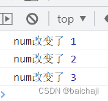
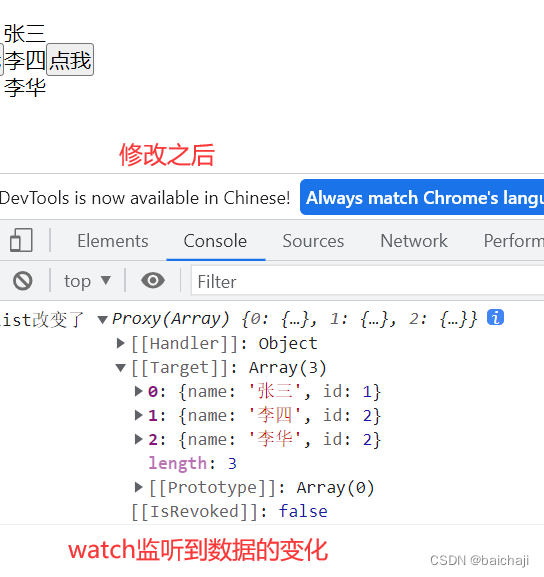
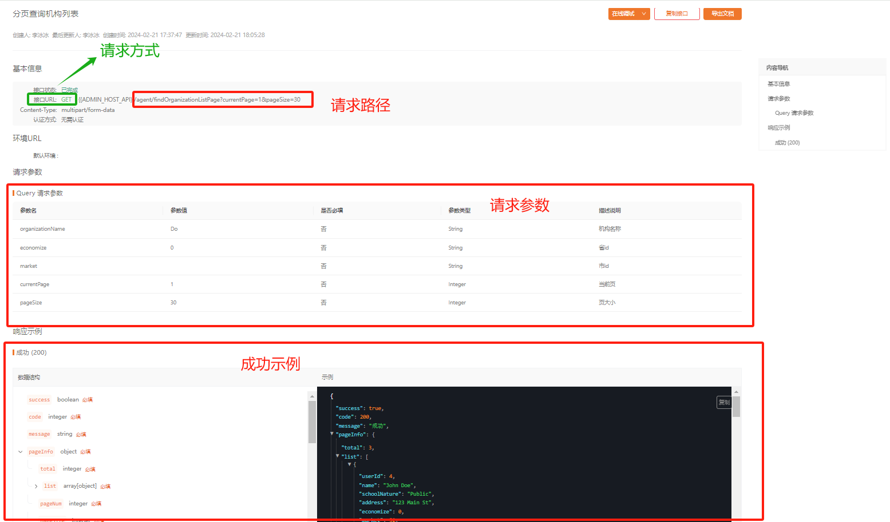
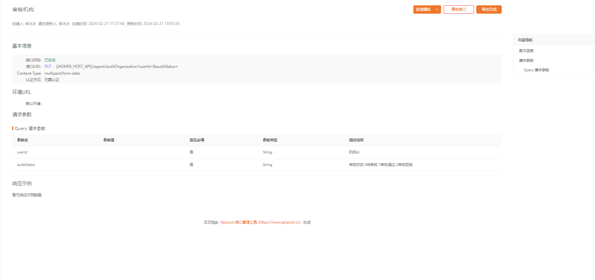
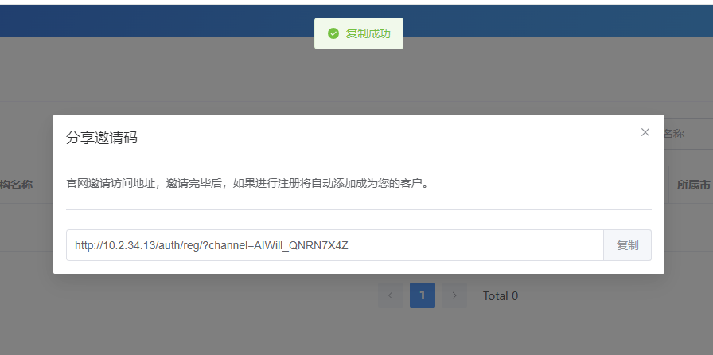
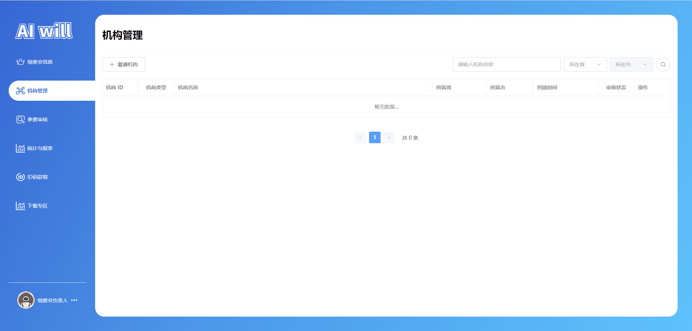

# 任务九、实现机构管理模块

## 任务描述

​	本任务的目标是实现一个机构管理模块，这是一个综合性的模块，旨在提供对组委会信息的展示和管理功能。模块将包括机构的基本信息，如名称、地区、地址和联系方式等，允许组委会查看和审核这些操作。

## 任务效果

### 机构管理模块


## 学习目标

### 知识目标

- [ ] 掌握Element Plus组件库的使用
- [ ] 掌握Vue Router的基本概念，包括路由的定义、导航守卫、路由参数和查询等，以便能够在项目中有效地使用路由功能
- [ ] 掌握axios库的使用，了解如何与后端API进行数据交互，包括发送HTTP请求、处理响应和错误，以实现数据的动态加载和更新
- [ ] 掌握Vue 3中引入的Composition API，包括`ref`、`reactive`、`computed`等函数，以及如何使用它们来构建和管理组件的状态

### 能力目标

- [ ] 能够使用Element Plus组件库完成高效的UI设计
- [ ] 能够使用自定义Vue钩子简化数据获取与交互
- [ ] 能够使用Vue Router实现精确的路由管理
- [ ] 能够使用axios库实现与后端的数据交互
- [ ] 能够使用Vue 3的Composition API实现复杂的状态管理

## 知识储备

### VUE3常用 Composition API

#### 1. setup

setup 是 Vue3.0 中一个新的配置项，值为一个函数，是所有 Composition API 的入口

##### **两个注意点：**

- 1.setup 执行的时机：在 beforeCreate 之前执行一次，this 是 undefined
- 2.setup 的参数：
  - props：值为对象，包含组件外部传递过来，且组件内部声明接收了的属性
  - content：上下文对象
    - attrs：值为对象，包含组件外部传递过来，但没有在 props 配置中声明的属性，相当于 `this.$attrs`
    - slots：收到的插槽内容，相当于 `this.$slots`
    - emit：分发自定义事件的函数，相当于 `this.$emit`

#### 2. ref 和 reactive

##### 2.1 ref 和 reactive 使用

- ref 用于定义一个响应式的数据
  - 定义基本数据类型：响应式是靠 Object.defineProperty() 的 get 和 set 完成的
  - 定义对象数据类型：内部实际使用 reactive 函数
- reactive 用于定义一个**对象类型**的响应式数据

```js
<template>
    <div>num: {{ num }}</div>
    <div>obj.name: {{ obj.name }}</div>
    <div>obj.age: {{ obj.age }}</div>
</template>
```

```js
import { ref, reactive } from 'vue'
export default {
  setup() {
    const num = ref(1)
    const obj = reactive({
      name: '张三',
      age: 18
    })
    setTimeout(() => {
      num.value ++;
      obj.age ++;
    }, 3000);
    return {
      num,
      obj
    }
  }
}
```

##### 2.2 ref 与 reactive 对比

- 从定义数据角度对比：
  - ref用来定义：基本类型数据。
  - reactive用来定义：对象（或数组）类型数据。
  - 备注：ref也可以用来定义对象（或数组）类型数据, 它内部会自动通过reactive转为代理对象。
- 从原理角度对比：
  - ref通过Object.defineProperty()的get与set来实现响应式（数据劫持）。
  - reactive通过使用Proxy来实现响应式（数据劫持）, 并通过Reflect操作源对象内部的数据。
- 从使用角度对比：
  - ref定义的数据：操作数据需要.value，读取数据时模板中直接读取不需要.value。
  - reactive定义的数据：操作数据与读取数据：均不需要.value。

##### 2.3 vue2 和 vue3 响应式对比

- vue2实现原理：
  - 对象类型：通过 Object.defineProperty() 对属性的读取、修改进行拦截（数据劫持）
  - 数组类型：通过重写更新数组的一系列方法来实现拦截（对数组的变更方法进行了包裹）
  - 为什么数组类型不通过 Object.defineProperty() 对数组属性进行监听？（Object.defineProperty 可以对数组元素监听，但是性能代价和获得的用户体验收益不成正比）

```js
Object.defineProperty(data, 'count', {
    get () {}, 
    set () {}
})
```

- vue3实现原理：
  - 通过 Proxy（代理）：拦截对象中任意属性的变化，包括属性值的读写、属性的添加、属性的删除等
  - 通过 Reflect（反射）：对源对象的属性进行操作

```js
const proxy = new Proxy(data, {
	// 拦截读取属性值
    get (target, prop) {
    	return Reflect.get(target, prop)
    },
    // 拦截设置属性值或添加新属性
    set (target, prop, value) {
    	return Reflect.set(target, prop, value)
    },
    // 拦截删除属性
    deleteProperty (target, prop) {
    	return Reflect.deleteProperty(target, prop)
    }
})
proxy.name = 'tom'
```

#### 3. 计算属性与监视

##### 3.1 computed

与 vue2 中 computed 配置功能一致

```js
import { computed, reactive } from 'vue'
export default {
  setup() {
    const person = reactive{
      firstName: '张',
      lastName: '三'
    }
    // const fullName = computed(() => {
    //   return `${person.firstName}-${person.lastName}`
    // })
    const fullName = computed({
      get() {
        return `${person.firstName}-${person.lastName}`
      },
      set(value) {
        const nameArr = value.split('-')
        person.firstName = nameArr[0]
        person.lastName = nameArr[1]
      }
    })
    return {
      person,
      fullName
    }
  }
}
```

##### 3.2 watch

​	`watch()` 函数是Vue框架中用于创建侦听器的关键工具，它能够监视一个或多个响应式数据源，并在这些数据源发生变化时触发指定的回调函数。`watch()` 是懒加载的，意味着只有在侦听的源数据发生变化时，回调函数才会被执行。

**`3.2.1 watch()` 的应用场景**

- **监听`ref`定义的响应式数据**：用于监视单个响应式数据的变化。
- **监听多个响应式数据**：可以同时监视多个数据源的变化。
- **监听`reactive`定义的响应式数据**：用于监视由`reactive`函数创建的整个响应式对象或其特定属性的变化。
- **深度监听属性**：通过配置选项，`watch()` 可以深度监视对象内部属性的变化。

**3.2.2 默认行为**

- **默认执行**：`watch()` 会在创建时立即执行一次回调函数，以确保回调函数内部的逻辑能够基于初始状态执行。
- **深层模式**：当直接侦听一个响应式对象时，`watch()` 会自动启用深层模式，这意味着对象内部的所有属性都将被监视。

**3.2.3 监听ref定义的响应式数据**

```js
import {ref,reactive,watch} from 'vue';
const num =ref(0)
const changeNum = ()=>{
    num.value +=1
}
watch(num,()=>{
    console.log('num改变了',num.value)
 
})
```



**3.2.4 监听reactive定义的响应式数组**

```js
const list =reactive([{name:'张三',id:1},{name:'李四',id:2}])
 
const changeList = ()=>{
    list.push({name:'李华',id:2})
}
 
watch(list,()=>{
    console.log('list改变了',list)
})
```



##### 3.3 watchEffect

- watchEffect 与 watch 区别：watch 既要指明监视的属性，也要指明监视的回调。而 watchEffect 不用指明监视哪个属性，监视的回调中用到哪个属性，那就监视哪个属性。

```js
// watchEffect所指定的回调中用到的数据只要发生变化，则直接重新执行回调。
watchEffect(()=>{
    const x1 = sum.value
    const x2 = person.age
    console.log('watchEffect配置的回调执行了')
})
```

#### 5. toRef 和 toRefs

- toRef 作用：为 reactive 对象上的属性创建 ref。创建的 ref 与源属性同步，修改源属性将更新 ref，修改 ref 也将更新源属性

```js
const state = reactive({
  foo: 1,
  bar: 2
})
const fooRef = toRef(state, 'foo')

// 改变 ref 值，源属性值发生变化
fooRef.value++
console.log(state.foo) // 2

// 修改源属性值，ref 值发生变化
state.foo++
console.log(fooRef.value) // 3

// 错误示范，fooRef 不会与 state.foo 同步，因为 ref() 接收的是一个纯字符串值
// const fooRef = ref(state.foo)
```

- toRefs 作用：将 reactive 对象转换为普通对象，普通对象的每个属性都是指向原始对象相应属性的 ref。每个单独的 ref 都是使用 toRef 创建的

```js
function useFeatureX() {
  const state = reactive({
    foo: 1,
    bar: 2
  })
 
  // 返回时转化为 refs
  return toRefs(state)
}
// 对象解构不会丢失响应式
const { foo, bar } = useFeatureX()
```

## 任务实施

### 子任务9-1 实现接口编写

#### 步骤一 查看接口





#### 步骤二 编写接口


> 文件路径：/src/api/manage/agentmenu/index.js

获取机构管理列表：` /agent/findOrganizationListPage`

审核机构:`/agent/auditOrganization`

```js
import { request } from "@/utils/axios"

/**
 * 获取机构管理列表
 */
export function findOrganizationListPage(params) {
    return request(
        {
            url: `/agent/findOrganizationListPage`,
            method: "GET",
            data: {},
            params
        }
    );
}

/**
 * 审核机构
 */
export function auditOrganization(params) {
    return request(
        {
            url: `/agent/auditOrganization`,
            method: "PUT",
            data: {},
            params
        }
    );
}
```

### 子任务9-2 实现路由配置

#### 步骤一 编写路由

​	在此步骤中，我们编写了机构管理的路由，确保页面导航与功能能够正确映射到对应的页面中，同时，我们利用了懒加载（异步组件）来优化页面加载性能，即组件将在需要时才被加载，而不是在应用启动时一次性加载所有组件。

> 文件路径：/src/router/index.js

代码如下：

```js
import { createRouter, createWebHashHistory, createWebHistory } from "vue-router";
// routes
const routes = [
    // 此处代码省略...
    
    // 管理页
    {
        path: '/manage',
        name: "manage",
        component: () => import("@/view/manage/index.vue"),
        children: [

            // ---------- 机构负责人 ----------
        
           	// 此处代码省略...

        
            // ---------- 组委会负责人 ----------
            // 组委会菜单路由
            {
                path: 'committee',
                name: "manage-committee",
                component: () => import('@/view/manage/agentmenu/committee.vue'),
                meta: {
                    index: "manage-committee",
                }
            },
            // 机构管理
            {
                path: 'agents',
                name: "manage-agents",
                component: () => import('@/view/manage/agentmenu/agents.vue'),
                meta: {
                    index: "manage-agents",
                }
            },
        ]
    },
    // auth
    {
        path: '/auth',
        redirect: "/auth/login",
        component: () => import("@/view/auth/index.vue"),
        children: [
            // 登录
            {
                path: 'login',
                component: () => import("@/view/auth/login.vue")
            },
            // 注册
            {
                path: 'reg',
                component: () => import("@/view/auth/reg.vue")
            },
            // 忘记密码
            {
                path: 'forgetpassword',
                name: 'forgetpassword',
                component: () => import("@/view/auth/forgetpassword.vue")
            },
        ]
    },
    // 对于所有未定义的路径,自动匹配404页面
    {
        path: '/:pathMatch(.*)*', component: () => import("@/view/404.vue")
    },
]

// router
const router = createRouter({
    history: import.meta.env.VITE_MODE == 'dev' ? createWebHashHistory() : createWebHistory(),
    routes
});
// 无需登录的页面
const LOGIN_ROUTERS = "manage"
router.beforeEach((to, from, next) => {
    if (to.fullPath.indexOf(LOGIN_ROUTERS) != -1) {
        let token = localStorage.getItem("token")
        if (!token) {
            return next("/auth/login");
        }
    }
    return next(true)
})
export default router;
```

### 子任务9-2 实现组件编写

##### 1.编写省份选择组件

> 文件路径：/src/components/province-select/index.vue

代码如下：

```js
/**
* 代码任务四已书写，此处省略...
*/
```

##### 2.编写自定义钩子

> 文件路径：/src/hooks/usePage.js

代码如下：

```js
/**
* 代码“任务五”已书写，此处省略...
*/
```

##### 3.封装copy.js

​	封装`handleCopyFunc`函数的目的是为了提供一个简单、可靠的方法来实现文本内容的复制功能。这个函数创建了一个临时的、隐藏的`input`元素，将需要复制的文本设置到该元素的`value`中，然后通过`document.execCommand('copy')`执行复制操作。这样的设计允许开发者在不依赖于特定浏览器API的情况下，实现跨浏览器的文本复制功能。

> 文件路径：/src/utils/copy.js

代码如下：

```js
export function handleCopyFunc(text = '') {
    // 创建一个隐藏的 input 元素
	let input = document.createElement('input')
	input.style.position = 'fixed'
	input.style.top = '-10000px'
	input.style.zIndex = '-999'
	document.body.appendChild(input)
    
     // 设置要复制的文本内容
	input.value = text
    
     // 让 input 获取焦点并选择文本
	input.focus()
	input.select()
	try {
         // 执行复制命令
		let result = document.execCommand('copy')
        // 移除 input 元素
		document.body.removeChild(input)
         // 根据复制结果显示消息
		if (!result || result === 'unsuccessful') {
			console.log('复制失败')
		} else {
			console.log('复制成功')
		}
	} catch (e) {
        // 捕获异常，移除 input 元素，可以在此处提示用户浏览器不支持复制功能
		document.body.removeChild(input)
		//   alert('当前浏览器不支持复制功能，请检查更新或更换其他浏览器操作')
	}
}
```

使用效果：



### 子任务9-2 实现机构管理模块

#### 步骤一 页面功能的分析

- **邀请机构按钮**：点击后会打开分享邀请码的弹窗，弹窗中显示邀请访问地址，该地址用于邀请机构注册，注册后自动成为用户的客户。
- **搜索区域**：包含一个输入框用于搜索机构名称，以及一个省份选择组件和一个搜索按钮。搜索按钮点击后会触发搜索操作，更新机构列表。
- **机构列表**：使用表格形式展示，包括机构ID、类型、名称、所属省、市、创建时间以及审核状态。审核状态有三种：等待审核、审核通过、审核未通过。
- **操作列**：每一行机构信息末尾有一个操作下拉菜单，包含“查看机构信息”和“审核操作”两个选项。
- **分享邀请码弹窗**：显示一个输入框，其中包含官网邀请访问地址，用户可以复制这个地址用于邀请。
- **审核操作弹窗**：允许用户修改机构的审核状态，选择“审核通过”、“等待审核”或“审核拒绝”。
- **分页组件**：底部的分页组件允许用户切换查看不同页码的机构列表。

#### 步骤二 页面搭建

​	上文中，我们已经成功分析了如何搭建机构管理模块界面。该模块包含核心功能组件，如邀请机构按钮、搜索区域、机构列表展示、操作列、分享邀请码弹窗、审核操作弹窗以及分页组件。点击邀请机构按钮将弹出分享邀请码窗口，便于管理员邀请新机构加入平台。搜索区域允许管理员根据机构名称和地理位置迅速定位信息。机构列表以表格形式展示各机构的关键信息，并按审核状态分类。操作列提供查看和审核机构信息的入口。分享邀请码弹窗支持复制邀请链接，而审核操作弹窗则赋予管理员审核机构注册申请的权利。

> 文件路径：/src/view/manage/agentmenu/agents.vue

代码如下：

```vue
<template>
  <div class="header_information page-container">
    <!-- 头部 -->
    <el-row class="header_name">
      <el-col :span="24" class="header_text">
        <h1>机构管理</h1>
      </el-col>
      <el-col :span="24">
        <div class="header_line"></div>
      </el-col>
    </el-row>
    <!-- 按钮 -->
    <el-row class="el_row_btn">
      <el-col :span="24" class="content">
        <div class="content_top_btn">
          <div>
            <el-button
              @click="handleOpenDialogVisible"
              size="large"
              :icon="Plus"
              >邀请机构</el-button
            >
          </div>
          <el-space>
            <el-input
              clearable
              class="top_search_inp"
              size="large"
              v-model="query_data.organizationName"
              placeholder="请输入机构名称"
            />
            <ProvinceSelect
              :isW="true"
              v-model:economize="query_data.economize"
              v-model:market="query_data.market"
            />
            <el-button
              size="large"
              :icon="Search"
              circle
              :loading="loading"
              @click="handleSearch"
            />
          </el-space>
        </div>
      </el-col>
    </el-row>
    <!-- 内容 -->
    <el-row>
      <el-col :span="24">
        <el-table
          empty-text="暂无数据..."
          :data="data"
          ref="multipleTableRef"
          border
          style="width: 100%"
          v-loading="loading"
        >
          <el-table-column label="机构 ID" prop="userId" width="100" />
          <el-table-column
            label="机构类型"
            prop="schoolNature"
            width="100"
            align="center"
          >
            <template v-slot="{ row }">
              <el-tag
                class="table_btn_success"
                size="small"
                type="warning"
                plain
                v-if="row.schoolNature == 'school'"
                >学校</el-tag
              >
              <el-tag
                class="table_btn_success"
                size="small"
                type="warning"
                plain
                v-else-if="row.schoolNature == 'institution'"
                >机构</el-tag
              >
              <el-tag
                class="table_btn_success"
                size="small"
                type="warning"
                plain
                v-else-if="row.schoolNature == 'team'"
                >团队</el-tag
              >
              <el-tag
                class="table_btn_success"
                size="small"
                type="warning"
                plain
                v-else
                >其他</el-tag
              >
            </template>
          </el-table-column>
          <el-table-column label="机构名称" prop="name" />
          <el-table-column label="所属省" prop="economizeName" width="150" />
          <el-table-column label="所属市" prop="marketName" width="130" />
          <el-table-column label="创建时间" prop="createTime" width="180" />
          <el-table-column
            label="审核状态"
            prop="auditStatus"
            width="100"
            align="center"
          >
            <template v-slot="{ row }">
              <el-tag
                class="table_btn_success"
                size="small"
                type="warning"
                plain
                v-if="row.auditStatus == 0"
                >等待审核</el-tag
              >
              <el-tag
                class="table_btn_success"
                size="small"
                type="success"
                plain
                v-else-if="row.auditStatus == 1"
                >审核通过</el-tag
              >
              <el-tag
                class="table_btn_success"
                size="small"
                type="danger"
                plain
                v-else-if="row.auditStatus == 2"
                >审核未通过</el-tag
              >
            </template>
          </el-table-column>
          <el-table-column label="操作" prop="Address" width="100">
            <template v-slot="{ row }">
              <el-dropdown trigger="click">
                <span class="el_dropdown_link">
                  操作<el-icon class="el-icon--right"><arrow-down /></el-icon>
                </span>
                <template #dropdown>
                  <el-dropdown-menu>
                    <el-dropdown-item @click="handleToDetails(row)"
                      >查看机构信息</el-dropdown-item
                    >
                    <el-dropdown-item @click="handleAuditOperation(row)">
                      审核操作
                    </el-dropdown-item>
                  </el-dropdown-menu>
                </template>
              </el-dropdown>
            </template>
          </el-table-column>
        </el-table>
      </el-col>
    </el-row>
    <!-- 弹窗------分享邀请码 -->
    <el-dialog v-model="centerDialogVisible" title="分享邀请码" width="40%">
      <span class="dialog_text"
        >官网邀请访问地址，邀请完毕后，如果进行注册将自动添加成为您的客户。</span
      >
      <el-divider />
      <el-input class="dialog_inp" v-model="dialog.channel_url">
        <template #append>
          <el-button type="success" @click="handleCopy">复制</el-button>
        </template>
      </el-input>
    </el-dialog>
    <!-- 弹窗------审核操作 -->
    <el-dialog
      v-model="centerAuditDialogVisible"
      title="修改审核状态"
      width="512px"
    >
      <el-form :model="form">
        <el-form-item label="机构名称" :label-width="100">
          <el-input
            v-model="form.name"
            autocomplete="off"
            class="dialog_inp"
            disabled
          />
        </el-form-item>
        <el-form-item label="审核状态" :label-width="100">
          <el-select
            v-model="form.auditStatus"
            placeholder="请选择审核状态"
            class="dialog_inp"
          >
            <el-option label="审核通过" value="1" />
            <el-option label="等待审核" value="0" />
            <el-option label="审核拒绝" value="2" />
          </el-select>
        </el-form-item>
        <el-button
          class="save_btn"
          size="large"
          type="primary"
          @click="handleSaveInformation"
          >修改审核状态</el-button
        >
      </el-form>
    </el-dialog>
    <div class="pagination">
      <el-pagination
        background
        layout="prev, pager, next, total"
        :total="total"
        @current-change="handlePage"
      />
    </div>
  </div>
</template>

<script  setup>
import { Search, Plus } from "@element-plus/icons-vue";
import {
  findOrganizationListPage,
} from "@/api/manage/agentmenu/index.js";
import { usePage } from "@/hooks/usePage";
    
const { total, data, loading, query_data, handleLoad, handlePage } = usePage({
  api_fn: findOrganizationListPage,
  q_data: {
    organizationName: "",
    // 省
    economize: "",
    // 市
    market: "",
  },
});
</script>

<style lang="scss" scoped>
.header_information {
  padding: 20px;
  .header_name {
    margin-left: 10px;
    margin-right: 10px;
    .header_text {
      margin-left: -10px;
      margin-right: -10px;
    }
    h1 {
      font-size: 28px;
    }
    // 线
    .header_line {
      display: block;
      height: 1px;
      width: 100%;
      margin: 24px 0 20px 0;
      background-color: #8473f717;
    }
  }
  //   内容
  :deep(.table_btn_success) {
    padding: 0 5px !important;
    border: none;
  }
  :deep(.el-table) .cell {
    padding: 0 10px;
  }
  .el_row_btn {
    margin-bottom: 20px;
    .content {
      .content_top_btn {
        display: flex;
        justify-content: space-between;
        .top_search_inp {
          width: 300px;
        }
        .top_search_btn {
          width: 110px;
          margin-right: 5px;
        }
      }
    }
  }

  .el_dropdown_link {
    font-size: 14px;
  }
  :deep(.el-table__cell) {
    padding: 12px 0 !important;
  }
  // dialog
  .dialog_text {
    display: block;
    margin-top: 20px;
  }
  .dialog_inp {
    height: 40px;
    :deep(.el-input--suffix) {
      height: 40px;
    }
  }

  // 分页
  .pagination {
    margin-top: 30px;
    margin-bottom: 20px;
    display: flex;
    justify-content: center;
    align-items: center;
    width: 100%;
    height: 50px;
  }
  // 修改审核状态按钮
  .save_btn {
    margin-left: 100px;
  }
}
</style>
```

页面效果：


#### 步骤三 页面接口的对接

​	上文中，已经完成了页面的分析和搭建，接下来的关键步骤是进行页面接口的对接。这一步骤涉及到将前端组件与后端API的连接，确保数据的正确流转和功能的正常运行。具体来说，我们需要为邀请机构按钮、搜索区域、机构列表的加载、审核状态修改等功能编写相应的接口调用逻辑。

> 文件路径：/src/view/manage/agentmenu/agents.vue

代码如下：


```vue
<template>
<!-- 机构管理页面的容器 -->
  <div class="header_information page-container">
   <!-- 头部区域，包含标题和分隔线 -->
    <el-row class="header_name">
      <el-col :span="24" class="header_text">
        <h1>机构管理</h1>
      </el-col>
      <el-col :span="24">
        <div class="header_line"></div>
      </el-col>
    </el-row>
   <!-- 按钮区域，包含邀请机构按钮和搜索区域 -->
    <el-row class="el_row_btn">
      <el-col :span="24" class="content">
        <div class="content_top_btn">
          <div>
              <!-- 邀请机构按钮 -->
            <el-button
              @click="handleOpenDialogVisible"
              size="large"
              :icon="Plus"
              >邀请机构</el-button
            >
          </div>
            <!-- 搜索区域 -->
          <el-space>
            <el-input
              clearable
              class="top_search_inp"
              size="large"
              v-model="query_data.organizationName"
              placeholder="请输入机构名称"
            />
               <!-- 省份选择组件 -->
            <ProvinceSelect
              :isW="true"
              v-model:economize="query_data.economize"
              v-model:market="query_data.market"
            />
            <el-button
              size="large"
              :icon="Search"
              circle
              :loading="loading"
              @click="handleSearch"
            />
          </el-space>
        </div>
      </el-col>
    </el-row>
  <!-- 内容区域，包含机构列表 -->
    <el-row>
      <el-col :span="24">
        <el-table
          empty-text="暂无数据..."
          :data="data"
          ref="multipleTableRef"
          border
          style="width: 100%"
          v-loading="loading"
        >
          <el-table-column label="机构 ID" prop="userId" width="100" />
          <el-table-column
            label="机构类型"
            prop="schoolNature"
            width="100"
            align="center"
          >
            <template v-slot="{ row }">
              <el-tag
                class="table_btn_success"
                size="small"
                type="warning"
                plain
                v-if="row.schoolNature == 'school'"
                >学校</el-tag
              >
              <el-tag
                class="table_btn_success"
                size="small"
                type="warning"
                plain
                v-else-if="row.schoolNature == 'institution'"
                >机构</el-tag
              >
              <el-tag
                class="table_btn_success"
                size="small"
                type="warning"
                plain
                v-else-if="row.schoolNature == 'team'"
                >团队</el-tag
              >
              <el-tag
                class="table_btn_success"
                size="small"
                type="warning"
                plain
                v-else
                >其他</el-tag
              >
            </template>
          </el-table-column>
          <el-table-column label="机构名称" prop="name" />
          <el-table-column label="所属省" prop="economizeName" width="150" />
          <el-table-column label="所属市" prop="marketName" width="130" />
          <el-table-column label="创建时间" prop="createTime" width="180" />
          <el-table-column
            label="审核状态"
            prop="auditStatus"
            width="100"
            align="center"
          >
            <template v-slot="{ row }">
              <el-tag
                class="table_btn_success"
                size="small"
                type="warning"
                plain
                v-if="row.auditStatus == 0"
                >等待审核</el-tag
              >
              <el-tag
                class="table_btn_success"
                size="small"
                type="success"
                plain
                v-else-if="row.auditStatus == 1"
                >审核通过</el-tag
              >
              <el-tag
                class="table_btn_success"
                size="small"
                type="danger"
                plain
                v-else-if="row.auditStatus == 2"
                >审核未通过</el-tag
              >
            </template>
          </el-table-column>
          <el-table-column label="操作" prop="Address" width="100">
            <template v-slot="{ row }">
              <el-dropdown trigger="click">
                <span class="el_dropdown_link">
                  操作<el-icon class="el-icon--right"><arrow-down /></el-icon>
                </span>
                <template #dropdown>
                  <el-dropdown-menu>
                    <el-dropdown-item @click="handleToDetails(row)"
                      >查看机构信息</el-dropdown-item
                    >
                    <el-dropdown-item @click="handleAuditOperation(row)">
                      审核操作
                    </el-dropdown-item>
                  </el-dropdown-menu>
                </template>
              </el-dropdown>
            </template>
          </el-table-column>
        </el-table>
      </el-col>
    </el-row>
    <!-- 弹窗------分享邀请码 -->
    <el-dialog v-model="centerDialogVisible" title="分享邀请码" width="40%">
      <span class="dialog_text"
        >官网邀请访问地址，邀请完毕后，如果进行注册将自动添加成为您的客户。</span
      >
      <el-divider />
      <el-input class="dialog_inp" v-model="dialog.channel_url">
        <template #append>
          <el-button type="success" @click="handleCopy">复制</el-button>
        </template>
      </el-input>
      <!-- <span class="dialog_text">组委会可以通过邀请链接邀请机构进行注册。邀请完毕后，将自动添加成为您的客户。</span>
      <el-divider />
      <el-input
        class="dialog_inp"
        v-model="dialog.input2"
      ></el-input> -->
    </el-dialog>
    <!-- 弹窗------审核操作 -->
    <el-dialog
      v-model="centerAuditDialogVisible"
      title="修改审核状态"
      width="512px"
    >
      <el-form :model="form">
        <el-form-item label="机构名称" :label-width="100">
          <el-input
            v-model="form.name"
            autocomplete="off"
            class="dialog_inp"
            disabled
          />
        </el-form-item>
        <el-form-item label="审核状态" :label-width="100">
          <el-select
            v-model="form.auditStatus"
            placeholder="请选择审核状态"
            class="dialog_inp"
          >
            <el-option label="审核通过" value="1" />
            <el-option label="等待审核" value="0" />
            <el-option label="审核拒绝" value="2" />
          </el-select>
        </el-form-item>
        <el-button
          class="save_btn"
          size="large"
          type="primary"
          @click="handleSaveInformation"
          >修改审核状态</el-button
        >
      </el-form>
    </el-dialog>
    <div class="pagination">
      <el-pagination
        background
        layout="prev, pager, next, total"
        :total="total"
        @current-change="handlePage"
      />
    </div>
  </div>
</template>

<script  setup>
import { Search, Plus } from "@element-plus/icons-vue";
import ProvinceSelect from "@/components/province-select/index.vue";
import { ElMessage } from "element-plus";
import { useRouter } from "vue-router";
const router = useRouter();
import { onMounted, ref } from "vue";
import {
  findOrganizationListPage,
  auditOrganization,
} from "@/api/manage/agentmenu/index.js"; // 接口的引入
import { usePage } from "@/hooks/usePage";
import { handleCopyFunc } from "@/utils/copy";

// 使用usePage钩子获取分页数据
const { total, data, loading, query_data, handleLoad, handlePage } = usePage({
  api_fn: findOrganizationListPage,
  q_data: {
    organizationName: "",
    // 省
    economize: "",
    // 市
    market: "",
  },
});
//  获取机构管理列表

// 弹窗------分享邀请码
const centerDialogVisible = ref(false);
// 弹窗------审核操作
const centerAuditDialogVisible = ref(false);
// 打开弹窗
const handleOpenDialogVisible = () => {
  centerDialogVisible.value = true;
};
// 审核操作
const form = ref({
  name: "",
  auditStatus: "",
  userId: "",
});
/**
 * 审核操作
 */
const handleAuditOperation = (row) => {
  centerAuditDialogVisible.value = true;
  form.value.name = row.name;
  form.value.auditStatus = row.auditStatus + "";
  form.value.userId = row.userId;
};

const handleSaveInformation = async () => {
  let res = await auditOrganization(form.value);
  if (res.success) {
    ElMessage({
      message: res.message,
      type: "success",
    });
  } else {
    ElMessage.error(res.message);
  }
  handleLoad(true);
  centerAuditDialogVisible.value = false;
};

const handleSearch = () => {
  handleLoad(true);
};
// 邀请机构
// 分享邀请码
let channel = "";
try {
  const info_data = localStorage.getItem("info_data");
  channel = JSON.parse(info_data).channel;
} catch (error) {}
const Host = import.meta.env.VITE_APP_HOST;
const dialog = ref({
  channel_url: `${Host}/auth/reg/?channel=${channel}`,
  input2: "",
});

/**
 * 复制
 */
const handleCopy = () => {
  handleCopyFunc(dialog.value.channel_url);
  ElMessage.success("复制成功");
};
/**
 * 前往查看机构信息
 */
const handleToDetails = (row) => {
  router.push({
    name: "manage-agents-details",
    params: {
      eventId: row.userId,
    },
  });
};

onMounted(() => {
  handleLoad(true);
});
</script>

<style lang="scss" scoped>
.header_information {
  padding: 20px;
  .header_name {
    margin-left: 10px;
    margin-right: 10px;
    .header_text {
      margin-left: -10px;
      margin-right: -10px;
    }
    h1 {
      font-size: 28px;
    }
    // 线
    .header_line {
      display: block;
      height: 1px;
      width: 100%;
      margin: 24px 0 20px 0;
      background-color: #8473f717;
    }
  }
  //   内容
  :deep(.table_btn_success) {
    padding: 0 5px !important;
    border: none;
  }
  :deep(.el-table) .cell {
    padding: 0 10px;
  }
  .el_row_btn {
    margin-bottom: 20px;
    .content {
      .content_top_btn {
        display: flex;
        justify-content: space-between;
        .top_search_inp {
          width: 300px;
        }
        .top_search_btn {
          width: 110px;
          margin-right: 5px;
        }
      }
    }
  }

  .el_dropdown_link {
    font-size: 14px;
  }
  :deep(.el-table__cell) {
    padding: 12px 0 !important;
  }
  // dialog
  .dialog_text {
    display: block;
    margin-top: 20px;
  }
  .dialog_inp {
    height: 40px;
    :deep(.el-input--suffix) {
      height: 40px;
    }
  }

  // 分页
  .pagination {
    margin-top: 30px;
    margin-bottom: 20px;
    display: flex;
    justify-content: center;
    align-items: center;
    width: 100%;
    height: 50px;
  }
  // 修改审核状态按钮
  .save_btn {
    margin-left: 100px;
  }
}
</style>
```

整体效果：



